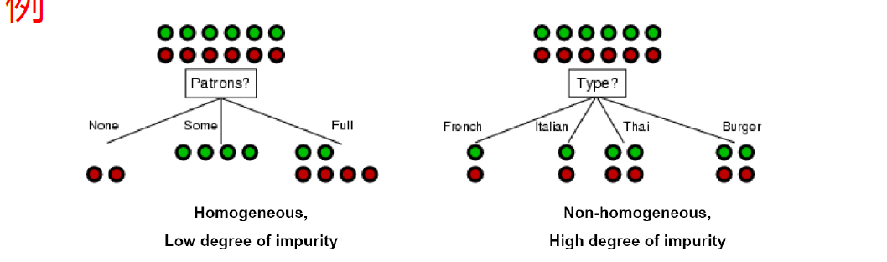
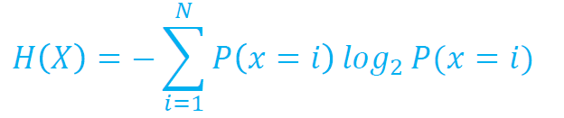
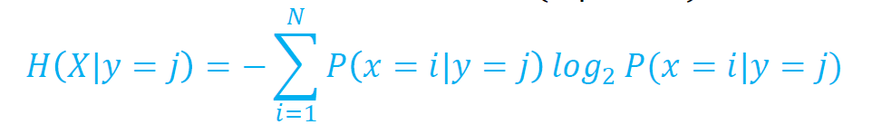
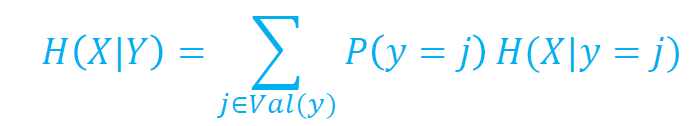
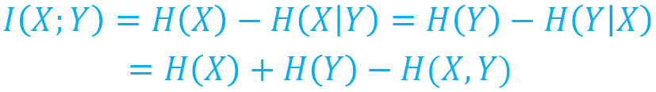

这是在学校上机器学习课的个人笔记。
~~本来在Typora上可以直接用“[TOC}”添加内容目录的，用jekyll就不行，使用jekyll-toc插件也有问题，淦矣~~

结果只好自己手动写链接锚点了。

注：涉及到图片的位置可能会发现一个不能正确加载的img标签，这是因为jekyll生成的目录 

### 目录

1. **<a href = "#数学基础">数学基础</a>**
2. **<a href="#2020/09/10">2020/09/10</a>**
   <a href="#什么是机器学习">什么是机器学习</a>
   <a href="#机器学习的一般泛型">机器学习的一般泛型</a>
   <a href="#机器学习理论">机器学习理论</a>
   <a href="#决策树">决策树</a>
3. <a href="#2020/09/15">**2020/09/15**</a>
   <a href="#信息熵">信息熵</a>
   <a href="#条件熵">条件熵</a>
   <a href="#样本熵">样本熵</a>
4. **<a href="#2020/09/17">2020/09/17</a>**
     <a href="#样本属性缺失">样本属性缺失</a>

   

## <a id="数学基础">数学基础</a>

数学真的很重要啊...可惜，大一大二的数学基础课程全都拿去考试用了。没办法，需要记一记的就记一记吧。

### 线性代数

他妈的！每次想到学校的线性代数教材安排的如此狗屁，都必须骂出一句话才行！不然在肚子里要憋坏了。这种奇妙的安排，不是祸害国内的大学生吗！！！

             
他妈的，你这样做...
 

不过后来了解到许多其他大学也是这样的🙂那没事了

## <a id="2020/09/10">2020/09/10</a>

### <a id="什么是机器学习">什么是机器学习</a>

研究计算机如何模拟/实现人的学习行为。

机器学习是人工智能的核心。其应用遍及NLP，对象识别，文本挖掘，生物信息学等。

给定样本集D={Xi，Yi}，输出空间（标记空间）Y

模型（也即函数）F(;θ)（也可作F(\|θ)，在机器学习理论中不区分），有时也称学习器（learner）

### <a id="机器学习的一般泛型">机器学习的一般泛型</a>

 

一般的机器学习类型：

- 监督学习
  数据集的样本都带有标记

- 无监督学习
  数据集的样本无标记，一般用来做聚类学习

- 强化学习
  根据回报影响学习的策略
  

 

根据输出空间的形式不同，可分成：

- 离散型集合Y如Y={+1，-1}，称为归类
- 连续型集合Y如Y = R，称为回归

 

### <a id="机器学习理论">机器学习理论：</a>

对于学习产生的模型（也可以说，函数F(;θ）），研究其

1. 一致性
2. 偏执与方差
3. 采样复杂性
4. 学习率（学习速度）
5. 收敛性
6. 误差界
7. 稳定性

……等等

 

### 机器学习研究的目的

开发一种具有如下能力的系统：

- 表示
- 分类，聚类，识别
- 不确定条件下的推理（如电商app的商品推荐）
- 预测
- 对外界环境的反应

经过学习获得的模型，对应关于数据的某种潜在规律，称为假设（hypothesis），而样本空间的潜在规律本身称为真相/真实（ground-truth）。假设与真相的关系，就好比社会主义和共产主义，永远无法到达，但可以不断接近。

可以把学习的过程看作在所有假设空间中搜索`function()`的过程。

### <a id="决策树">决策树</a>

一颗决策树可以表示输入属性的任何函数。

可以为每个样例建立一个从根到叶节点的路径，但是泛化能力不强，就像备考时将题目的答案背下来，而不会做其他题一样。因此应当找一个规模小一点的决策树，掌握样本的规律而非记录样本值。

对同一个训练数据集合，可能有多个决策树与之一致。

决策树能对数据进行**切分**。贪心的选择策略，应当是倾向于使结点上的数据同质化。为此需要测定信息的混杂度（熵）。
$$
x^{23} y_{WhatTheFuck} \vec b \lim {(a+b)}
$$
比如下面的例子：

 

             
图1.2 决策树的切分
 

假设决策树进行二路切分（正例/反例），左侧的决策树将实例集合切分成比较同质化的集合，而右侧的则似乎没起到分离的作用。

 

## <a id="2020/09/15">2020/09/15</a>

### <a id="信息熵">信息熵</a>

随机变量的熵(Entropy)：H(X)是对从X随机采样值在最短编码情况下的平均编码长度。

             
图2.1 信息熵
 

这是因为根据信息论，在最短编码情况下，对X=i分配-logP(X=i)位(以2为底)。

### <a id = "条件熵">条件熵</a>

随机变量X在给定条件Y = v下的**特定条件熵**H(X\|Y = v)，其定义类似于信息熵，只是要替换一下概率。

             
图2.2 特定条件熵
 

X在给定条件Y下的**条件熵**，相当于把所有y的可能取值对应的特定条件熵求期望。

             
图2.3 条件熵
 

容易理解，信息熵是大于某个条件下的条件熵的。毕竟如果已经获得了一个条件，那么原随机变量的变化可能性就减少了。可以极端假设一点：若Y = Ｘ，在已知Y的情况下，X可以说已经毫无信息可言了（已经知道了）。

称信息熵与某条件下的条件熵之差为**互信息**。之所以称为**互**信息，是因为X对于Y的互信息，也是Y对于X的互信息。

             
图2.4 互信息
 

### <a id="样本熵">样本熵</a>

设S为样本集，P+为S中的正例比例，P-为S中反例的比例，可以根据P+，P-来描述样本的混杂度。

### <a id="信息增益">信息增益</a>

## <a id="2020/09/17">2020/09/17</a>

### <a id="样本属性缺失">样本属性缺失</a>

