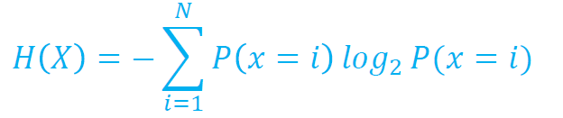

这是在学校上机器学习课的个人笔记。
~~本来在Typora上可以直接用“[TOC}”添加内容目录的，用jekyll就不行，使用jekyll-toc插件也有问题，淦矣~~

结果只好自己手动写链接锚点了。

注：涉及到图片的位置可能会发现一个不能正确加载的img标签，这是因为jekyll生成的目录与本地目录不一致所致，那个不能正确加载的图片，通过github 预览以及本地查看markdown文件时可以替代博客网站上的图片显示。

### 目录

1. **<a href = "#数学基础">数学基础</a>**
   <a href="#线性代数">线性代数</a>
   <a href="概率论与数理统计">概率论与数理统计</a>
   <a href="#计算方法">计算方法</a>
   <a href="#矩阵、向量求导">矩阵、向量求导</a>

2. **<a href="#机器学习基础">机器学习基础</a>**
   <a href="#什么是机器学习">什么是机器学习</a>
   <a href="#机器学习的一般泛型">机器学习的一般泛型</a>
   <a href="#机器学习理论">机器学习理论</a>
   <a href="#决策树">决策树</a>
   <a href="#信息熵">信息熵</a>
   <a href="#条件熵">条件熵</a>
   <a href="#样本熵">样本熵</a>
   <a href="#样本属性缺失">样本属性缺失</a>

3. **<a href="#概率">概率</a>**

  

   

## <a id="数学基础">数学基础</a>

数学真的很重要啊...可惜，大一大二的数学基础课程全都拿去考试用了。没办法，需要记一记的就记一记吧。

### <a id="线性代数">线性代数</a>

他妈的！每次想到学校的线性代数教材安排的如此狗屁，都必须骂出一句话才行！不然在肚子里要憋坏了。这种奇妙的安排，不是祸害国内的大学生吗！！！

             
他妈的，你这样做...
 

不过后来了解到许多其他大学也是这样的🙂那没事了。

#### 矩阵转置法则

$$
\begin{align}
&(A^T)^T = A\\
&(A+B)^T = A^T+B^T\\
&(kA)^T = kA^T\\
&(AB)^T = A^TB^T
\end{align}
\tag{1.1.1}
$$

### <a id="概率论与数理统计">概率论与数理统计</a>

只记有用的以及容易混淆还有容易忘记清晰定义的。

#### 连续型随机变量

对于取值连续，无法列举出来的随机变量，称其为连续型随机变量。不用概率，而是用概率密度和概率分布刻画其性质。若对于随机变量X，存在一个**非负**的**可积**函数$f(x)$，使得对任意实数x，均有$F(x)=\int_{-\infty}^x f(t)dt$，则称X为连续性随机变量，F(x)为其分布函数，f(x)为X的概率分布密度，记作$X\sim f(x)$。若$f(x)$在x处连续，则$F'(x)=f(x)$。

事件$P(a<x<b)$的发生概率为(假设a < b，区间的开闭无影响，均可)

$$
P(a<x<b) = \int_a^bf(x)dx \tag{1.2.1}
$$
因此有$P(X = a) = \int_a^af(x)dx = 0$。

> 虽然$P(X = a)=0$，但不代表X = a是不可能事件，只是连续性随机变量的特性罢了。类似地，一个事件的概率为1，也不代表其就是必然事件。

#### 独立

两个随机事件的独立性，表现为其中一个发生/不发生，对另一事件的发生/不发生没有任何影响。此外，两个独立的随机事件，其都发生的概率为两个事件分别发生的概率的乘积。

#### 随机变量期望的运算法则

对于**相互独立**的两个随机变量X，Y，有

$$
E(X+Y) = E(X)+E(Y)\tag{1.2.2}
$$

$$
E(cX) = cE(X)\tag{1.2.3}
$$

1.2.1, 1.2.2也叫期望的线性性质。

对于**相互独立**的两个随机变量X，Y，有

$$
E(XY)=E(X)E(Y)\tag{1.2.4}
$$

#### 方差

方差用来衡量数据偏移期望的程度。

$$
Var(x)=\sigma^2=\sum(x-\mu)^2f(x)\tag{1.2.5}
$$
如果X，Y是独立的随机变量，那么

$$
Var(X+Y)=Var(X)+Var(Y)\tag{1.2.6}
$$

#### 协方差

Covariance协方差的定义：

$$
Cov(X,Y)=E[((X-E(X))(Y-E(Y))]\\
=E[XY]-E[X]E[Y]\tag{1.2.7}
$$

#### beta分布

#### 多维高斯分布

<a href="#多维高斯分布">见这里。</a>

### <a id="计算方法">计算方法</a>

#### 最小二乘法

给定一组样本数据，其中包含自变量和因变量（当然，在监督学习中，一般就对应着属性和label)，最小二乘法通过最小化误差的平方和来拟合最合乎样本数据的函数。根据拟合函数的形式不同，又分成多项式拟合、非线性拟合、多元线性回归等。

多项式拟合就是假设给定一系列样本点${(x_i,y_i)}$，尝试拟合出一条形如

$$
f(x) = w_0 + w_1x + w_2x^2+...+w_mx^m\tag{1.3.1}
$$
的曲线，其中m称为阶数。

### <a id="矩阵、向量求导">矩阵求导</a>

对于非纯数学系的同学来说，有些数学知识真得自己去学习。向量求导可以看作特殊的矩阵求导，就不再特殊记录了。

#### 标量对矩阵求导

从定义上考虑，标量对矩阵求导$\frac{\partial y}{\partial X}$可以视为标量y对矩阵中每个元素单独求导，再放回原来的位置。也就是
$$
\frac{\partial y}{\partial X} = \left [ \begin{array}{ccc}
\frac{\partial y}{\partial x_{ij}}
\end{array}\right]
\tag {1.4.1}
$$
但是这个定义其实实际用处不大。矩阵是便于计算的工具，使用矩阵就是为了利用规律简化庞大数量元素的计算，若是又回到单独的计算上，岂不没了意义。

多元函数的全微分公式:
$$
\mathrm df=\sum_{i=1}^n\frac{\partial f}{\partial x_i}\mathrm dX_i
\tag{1.4.2}
$$
根据其形式，相应的，就有
$$
\mathrm df=\frac{\partial f}{\partial \boldsymbol x}^T \mathrm d\boldsymbol x
\tag{1.4.3}
$$
其中，$\frac{\partial f}{\partial \boldsymbol x}^T$是梯度向量（转置为1×n），$d\boldsymbol x$是该点的微分（n×1），也就是说，多元函数全微分等于在该点处梯度与微分的内积。类似地，把全微分与导数的关系推广到矩阵上，就有
$$
\mathrm df =\sum_{i=1}^m\sum_{j=1}^n\frac{\partial f}{\partial X_{ij}}\mathrm dX_{ij} = \mathrm{tr}(\frac{\partial f}{\partial X}^T\mathrm dX)
\tag{1.4.4}
$$
上式利用了小技巧：对于均为m行n列的矩阵A、B，其各位置元素之和（内积）等于$\mathrm {tr}(A^TB)$。

## <a id="机器学习基础">机器学习基础</a>

### <a id="什么是机器学习">什么是机器学习</a>

研究计算机如何模拟/实现人的学习行为。

机器学习是人工智能的核心。其应用遍及NLP，对象识别，文本挖掘，生物信息学等。

给定训练样本集D={Xi，Yi}，输出空间（标记空间）Y（监督学习特有）。每个样本有多个属性，以每个属性为维度张成的空间称为样本空间（属性空间）。寻找一个能够建立起属性空间上一点到输出空间的映射的过程就是机器学习。样本对应的输出空间上的值一般称为标记(label)。

模型（也即函数）F(;θ)（也可作F(\|θ)，在机器学习理论中不区分），有时也称学习器（learner），就是机器学习的成果。学得模型后，使用其进行预测的过程称为测试，被预测的样本称为测试样本。

### <a id="机器学习的一般泛型">机器学习的一般泛型</a>

一般的机器学习类型：

- 监督学习
  数据集的样本都带有标记

- 无监督学习
  数据集的样本无标记

- 强化学习
  根据回报影响学习的策略

根据输出空间的形式不同，可分成：

- 离散型集合Y如Y={+1，-1}，称为**归类**。对于只涉及两个类别的二分类，通常称其中一个为正类，另一个为负类。
- 连续型集合Y如Y = R，称为**回归**。

除了得到一个可以预测label的模型，

### <a id="机器学习理论">机器学习理论：</a>

对于学习产生的模型（也可以说，函数F(;θ）），研究其

1. 一致性
2. 偏执与方差
3. 采样复杂性
4. 学习率（学习速度）
5. 收敛性
6. 误差界
7. 稳定性

……等等。通常假设样本空间全体样本服从一个“未知分布”D，我们获得的每个样本都是独立地从这个分布上采样获得的，称为独立同分布（iid）。

### 机器学习研究的目的

开发一种具有如下能力的系统：

- 表示
- 分类，聚类，识别
- 不确定条件下的推理（如电商app的商品推荐）
- 预测
- 对外界环境的反应

经过学习获得的模型，对应关于数据的**某种潜在规律**，称为**假设**（hypothesis），而样本空间的潜在规律本身称为**真相/真实**（ground-truth）。假设与真相的关系，就好比社会主义和共产主义，永远无法到达，但可以不断接近。

机器学习获得的模型，我们要使用它来根据样本空间中一般的输入预测目标变量的结果，这就是泛化。使用已有模型和属性参数去“预测”label，就是机器学习研究的意义所在！

可以把学习的过程看作在所有假设空间中搜索`function()`的过程。

### <a id="决策树">决策树</a>

决策树是一个简单的监督学习分类的非参数机器学习算法。

一颗决策树可以表示输入属性的任何函数。可以把它看作一个多元函数，多个属性就是自变量，标签就是因变量。决策树的每个内节点是属性，根据各样本的属性不同，把样本全集从根节点开始层层分成不同部分，到达一定阶段后就输出分类结果（叶节点）。

可以为每个样例建立一个从根到叶节点的路径，但是这样做泛化能力不强，就像备考时将题目的答案背下来，而不会做其他题一样（其实就是过拟合！）。因此应当找一个规模小一点的决策树，掌握样本的规律而非记录样本值。

对同一个训练数据集合，可能有多个决策树与之一致。

决策树能对数据进行**切分**。决策树的关键，毫无疑问就是选择节点，也就是**特征选择**了。将不同的属性安在不同的位置，对决策树的效果有很大影响。有的特征与分类的结果相关性较高，就更容易根据特征的不同筛选出具有不同label的样本。

比如下面的例子：

             
图2.1 决策树的切分
 

假设决策树进行二路切分（正例/反例），左侧的决策树将实例集合切分成比较同质化的集合，而右侧的则似乎没起到分离的作用。

贪心的选择策略，应当是倾向于使结点上的数据同质化。为此需要测定信息的混杂度（熵）。构造树的过程，就是自顶向下递归地一边找当前情况下最好的属性，一边分类，直到样本分类的效果还不错，或者没有特征可选为止。

根据属性取值的不同，树节点的构造也有说法。

属性的取值可以是离散的(nominal)、有序的(Ordinal)、连续的(Continuous)。切分的分支可以是2路切分（简单）或是多路切分。

举例来说，大部分名词属性都是离散取值的，那就可以一个离散属性对应一路切分（多路，离散），比如颜色，可能是红黄蓝...或是把离散属性值分成两个子集，一边一个，按照样本属性的从属分到对应分支（2路，离散），比如{红黄}一组、{蓝绿}一组；有序属性也可以是一个属性值对应一个一路，比如衣服尺寸（小中大），或是属性值分成两个子集{小中}+{大}；连续的属性值可以通过离散化构造有序类属性或是用一个比较大小的不等式简单的二值切分。

> 把多个属性值划归两个子集再分类的过程可以根据经验调整。比如，对于有序属性，如果把属性值分成{小大}+{中}的组合，一般来说，恐怕效果不会很理想。

### <a id="信息熵">信息熵</a>

根据信息论，

> 信息是用来消除随机不确定性的东西。

因此，某件事情（信息？）发生所带来的信息量大小，就看其消除不确定性的程度。对于大概率的事件，比如”人被杀就会死“，其包含的信息很少，因为”人被杀就会死“的概率非常大，除了让听者觉得你智力有问题之外，从中得到不了太多信息。如果反过来说“人被杀也不会死”，这句话就很有信息量了。因为这一般是不会发生的，听者不禁会想，到底是这厮掌握了不朽的方法，还是这厮智力有问题？<del>（至少这也带来了信息）</del>

好吧，换个正常点的例子：你去宿舍楼下的地铁站的电子彩票售卖机里买福利彩票。花了10￥买一张，划开之后大喊：“噫，好了！我中了！”这句话就带来很多信息，因为一般来说买彩票是不会中的，在排除你撒谎的前提下，你中奖这一事件，否定了大概率的“你不会中奖”这一事件，消除了大量不确定性，带来了很多信息。

某事件的**信息量**为
$$
h(x) = -{log}_2{p(x)}\tag{2.1.1}
$$
信息量度量一个事件发生所带来的信息。事件越容易发生，其信息量越小。

随机变量的熵(Entropy)：

             
图2.2 信息熵
 

信息量度量一个具体事件发生带来的信息大小，而熵则是对所有可能产生信息量的期望值，也就是所有可能发生事件带来的信息量的期望。

打个比方，在最短编码情况下，对X=i分配$-{log}_2{P(x=i)}$位，则熵代表最短编码情况下的平均编码长度。随机变量可能性越多，概率越接近，其信息熵也就越大。

### <a id = "条件熵">条件熵</a>

随机变量X在给定条件Y = j下的**特定条件熵**H(X\|Y = j)，其定义类似于信息熵，只是要替换一下概率。

             
图2.3 特定条件熵
 

X在给定条件Y下的**条件熵**，相当于把所有y的可能取值对应的特定条件熵求期望。

             
图2.4 条件熵
 

容易理解，信息熵是大于某个条件下的条件熵的。毕竟如果已经获得了一个条件，那么原随机变量的变化可能性就减少了。可以极端假设一点：若Y = Ｘ，在已知Y的情况下，X可以说已经毫无信息可言了（已经知道了）。

称信息熵与某条件下的条件熵之差为**互信息**。之所以称为**互**信息，是因为X对于Y的互信息，也是Y对于X的互信息。

             
图2.5 互信息
 

### 联合熵

联合熵用来度量一个联合分布的随机系统的不确定度。联合分布概率密度为$p(x,y)$的随机变量$(X,Y)$，其联合熵定义为
$$
H(X,Y) = -\sum_{x \in X}\sum_{y \in Y}p(x,y){log}{p(x,y)}\tag{2.1.?}
$$
熵的链式法则：
$$
设随机变量X_1,X_2,...,X_n服从p(x_1,x_2,...x_n),有
\\
H(X_1,X_2,...,X_n)=\sum^n_{i=1}H(X_i|X_{i-1},X_{i-2},...,X_1)\tag{2.1.?}
$$
根据链式法则有
$$
H(X,Y) = H(X) + H(Y|X)
$$
可以理解为：多个随机变量的随机系统，可以通过先观察一个随机变量获取信息量，在加上已知该随机变量基础上的条件信息量...当然，系统的信息量并不会因为观测的顺序而变化，因此也就有了互信息的等式。

### <a id="样本熵">样本熵</a>

设S为样本集，$P_+$为S中的正例比例，$P_-$为S中反例的比例（假设为2分类），可以根据$P_+$，$P_-$来描述样本的混杂度。
$$
H(S) = -P_+log_2P_+ - P_-log_2P_-\tag{2.1.?}
$$

两个样本比例越相近，样本熵越大。如果$P_+$，$P_-$中有为1或0的，则H(S) = 0。

### <a id="信息增益">信息增益</a>

$$
GAIN_{split} = Entropy(P) - \sum_{i=1}^k \frac{n_i}{n}Entropy(i)\tag{2.1.?}
$$

其中P是父节点，被切分成k个子节点。$n_i$是第i个子节点的样本数目。信息增益代表的是原信息熵与已知某条件后的信息熵之差，所以信息增益代表着决策树的目标类变量与点P对应的属性的互信息。信息增益也就是由于P节点对应切分带来的熵减，所以信息增益越大越好。

决策树学习中的信息增益概念，等价于训练数据集中label与特征的互信息。

### ID3

最早提出的决策树算法。ID3的思想，一言以蔽之，就是可着信息增益大的选。

### 过拟合和欠拟合

欠拟合(underfitting)就是模型的复杂度不够，没有提取出样本的特点，过拟合就是模型太精密了，甚至超出了样本属性原本的复杂特性。打个比方来说，就像炒菜干放盐和放了油盐酱醋味精花椒大料...的感觉。

### <a id="样本属性缺失">样本属性缺失</a>

#### 惩罚项（正则项）

参数较多时，往往容易使拟合出的曲线参数绝对值很大。为此，不妨在优化目标函数中增加一个惩罚项：
$$
\frac{λ}{2}||w||^2
$$
其中向量范数为2-范数。

调整λ的取值可以调整惩罚项的“惩罚力度”，

注意：模型参数多≠模型复杂，只能说明模型的能力更强。一般用模型参数向量的2-范数的大小来衡量模型复杂度。

## <a id="概率">概率</a>

## <a id="分类理论">分类理论</a>

### 分类器

决策可以看作在高维空间上对样本点的划分。

             
图4.1 分类示图
 

设随机变量Y={-1，+1}为label（也就是类别），随机变量X为特征。

在分析之前知道的P(Y)称为类别先验(class prior)，也叫weight。

求已知X情况下分类的不同概率，则

$$
P(Y=i|X) = \frac{P(X,Y=i)}{P(X)} = \frac{P(X|Y=i)P(Y=i)}{\sum_Y P(X|Y)P(Y)}\tag{3.1.1}
$$
记作$q_i(X)$。$P(Y=i) = \pi_i$。$P(X|Y =i) = P_i(X)$。故上式可以记成

$$
q_i(X) = \frac{\pi_ip_i(X)}{\sum_i\pi_ip_i(X)}\tag{3.1.2}
$$
称给定类别下特征的分布$P_i(X)$为**类条件分布**。

#### <a id="多维高斯分布">多维高斯分布</a>

$$
N(\overline x | \overline u, \Sigma)=\frac{1}{(2\pi)^{D/2}}\frac{1}{|\Sigma|^{1/2}}exp[-\frac{1}{2}(\overline x-\overline u)^T\Sigma^{-1}(\overline x-\overline u)]\tag{3.2.1}
$$

其中D是维数，$\sum$是协方差矩阵，$\mu$是均值向量。

对于分类问题（以2分类为例），算定的$q_1(X)$较大的那个，就倾向于分类为Y = i。但是相对的也就有$q_2(X)$的可能分类错误。有必要评定分类的错误概率。称给定X下的
$$
R(X) = min\{q_1(X),q_2(X)\}
$$
为X的错误风险。显然，R(X)作为随机变量的函数，也是一个随机变量。
$$
E(R(X)) = \int
$$

#### 学习策略

- 生成式学习

  找出所有$P_i,\pi_i$，然后得到分割平面的函数。

  - 参数
  - 非参数

- 判别式学习

  直接去寻找分类器，比如决策树。

  - 带参数的
  - 非参数的：不受参数影响的判别式学习（一样有参数，但是不是控制分类器的）

### kNN

k Nearest Neighbors。

#### 朴素贝叶斯

朴素假设：所有的特征（随机变量）之间在给定label条件下条件独立。

$$
P(X_1,X_2\cdots X_n|Y) = \prod P(X_i|Y)
$$

使用

$$
\theta_{ijk} = P(X_{i}=x_{ij}|Y_k)
$$
表示类条件$y_k$的条件下，$X_i$取第j个值$x_{ij}$的概率。

## 逻辑回归

逻辑回归是一个**分类**模型，得到的是分类器，但**不是回归**！

**假定**给定Y条件下，X的各维条件独立，且$P(X_i|Y = y_k)$是一个高斯分布，服从于$N(\mu_{ik},\sigma_i)$（均值取决于维度和类别，但方差无论类别，这是淡化了方差的作用），而Y则假定为服从伯努利分布（2分类）。

## SVM

