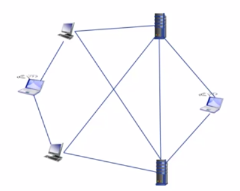
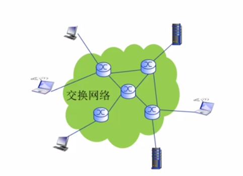
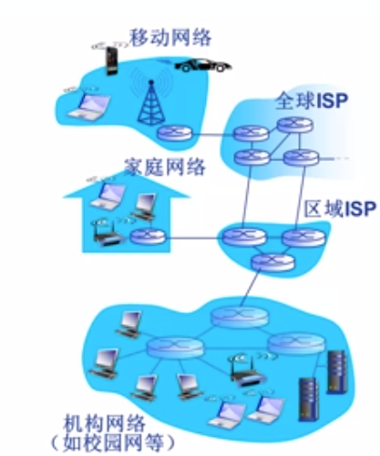
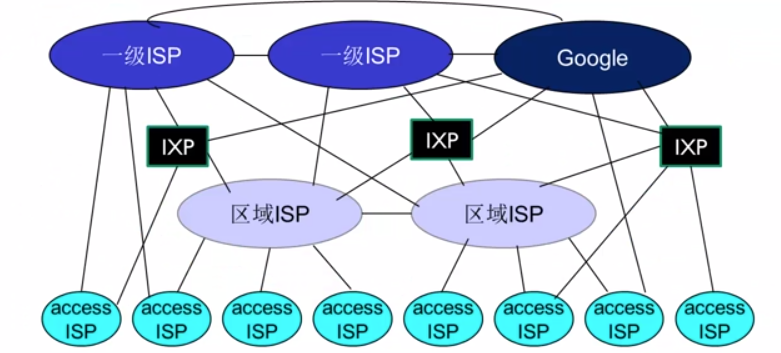
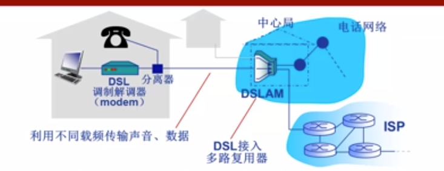
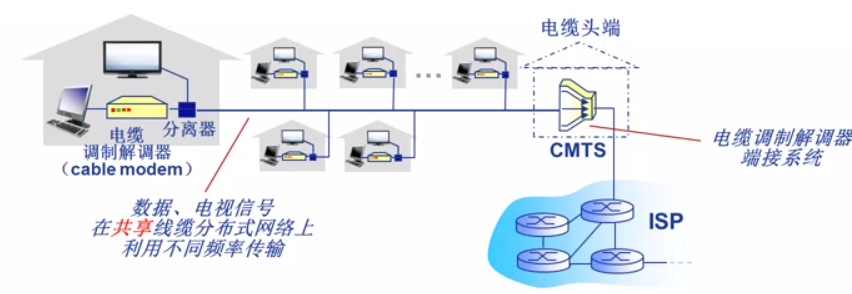
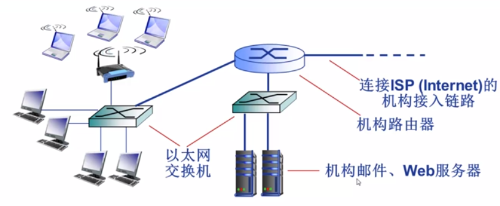
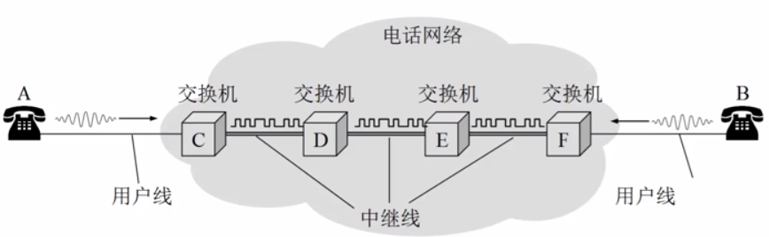
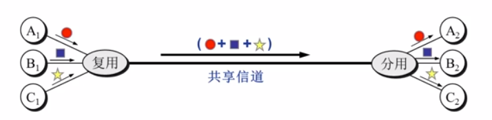

这是在学校上计算机网络课的个人笔记。

 

### 目录

1. **<a href="#2020/09/14">2020/09/14</a>**

   <a href="#计算机网络的定义">计算机网络的定义</a>

   <a href="#交换网络">交换网络</a>

   <a href="#网络协议">网络协议</a>

   <a href="#计算机网络结构">计算机网络结构</a>

2. **<a href="#2020/09/16">2020/09/16</a>**

   <a href="#网络核心">网络核心</a>
   
   <a href="#多路复用">多路复用</a>
   
   

 

## <a id="2020/09/14">2020/09/14</a>

### <a id="计算机网络的定义">计算机网络的定义</a>

计算机网络是一个**自治**的，**互联**的计算机集合。

自治是说，计算机网络中的计算机之间没有主从关系。

互联是指，网络中的计算机通过通信链路互联互通。

             
图1.1 计算机网络概念图
 

在计算机网络中，这些网络中的计算机统称为**主机**/**端系统**，连接主机的称为**通信链路**。

然而，随着网络变的越来越庞大复杂，像图中这样直接使用通信链路将主机相互连接的方法显得越来越不科学。一方面随着接入主机的数目增加，通信链路增长的速度越来越快，距离也越来越长，一方面，主机上留给通信链路的接口也是有限的。不得不使用一种新的方法来起到信息交换的作用。

### <a id="交换网络">交换网络</a>

             
图1.2 交换网络
 

使用一个由特殊设备构成的称为**交换网络**的网络负责当信息传输的中间站，每个主机又与就近的交换网络中的枢纽连接。这样节省了距离成本，也在保证信息传输效率的同时，不至于增加过多的链路。

其中交换网络的枢纽，称为交换节点，一般是路由器或交换机。

### Internet

什么是Internet？Internet是我们如今天天离不开的东西。每时每刻海量的端系统连接在这个庞大的网络中，相互之间产生信息的交换。

             
图1.3 Internet
 

一般家庭，机构（公司，大学等）的Internet服务，都是由当地的区域级ISP（Internet Service Provider）提供。这些区域级ISP不禁相互连接，还通过全球ISP与其他地理区域的ISP互联。从这个角度看，Internet是网络的网络——无数的区域性ISP相互连接，也是一个网络。

             
图1.4 Internet结构
 

Internet就由这些大量的端系统、通信链路（光纤，卫星，铜线...)和分组交换网络构成。

从网络应用的角度看，Internet是为许多运行于端系统的网络应用提供通信服务的基础设施，为网络应用提供API。诸如Web，即时通讯，网络游戏等典型的网络应用，都在使用Internet的服务。

### <a id="网络协议">网络协议</a>

**协议**(protocol)规定了计算机网络中数据交换的规则。协议之于计算机网络，就好比交通规则之于交通系统，如果不规定清楚，汽车🚗，卡车🚚随便上路，路边随便停车，红绿灯视若无物，交通秩序必将混乱。没有协议，只有网络硬件，远远无法实现Internet的庞大信息交流职能。大家都用各自的规矩，其他人怎么知道如何解读你传输来的信息呢？

一般来说，协议的内容规定通信实体之间交换信息的格式，意义和顺序，以及实体针对收到的信息或发生的事件的处理动作。用比较标准的名词来形容，就是**语法**，**语义**和**时序**，称为协议的基本三要素。语法规定数据和信息的传输格式，语义规定各种控制信息的意义以及对控制信息应当作出的响应，时序规定了交换信息双方的行动顺序。

了解各种具体的协议是学习计算机网络的关键。各种协议的设计也是网络创新的重要表现形式。

要获取关于某个网络协议的最权威的描述，请去RFC（Request For Comments）中寻找。

### <a id="计算机网络结构">计算机网络结构</a>

计算机网络的构成有：

- 网络边缘
	顾名思义，位于网络最边缘位置的结点，也就是主机/端系统。网络边缘一般也包括那些运行在端系统上的网络应用。
- 接入网络/物理介质
	接入网络是将端系统连接到网络中的有线或无线的通信链路。常用的比如家庭的接入网络，学校/企业的接入网络，以及移动网络。
- 网络核心
	由路由器，交换机构成的中继网络。

端系统应用常用的模型：

① 客户/服务器（client/server）应用模型：客户发送请求，接收服务器响应。典型的CS模型比如Web应用。

② 对等（Peer-Peer, P2P）应用模型：不依赖或不仅仅依赖于服务器实现数据交换。通信在对等的实体之间发生，典型的P2P模型比如skype。

#### 接入网络的具体划分

##### DSL：数字用户线路

             
图1.5 DSL
 

DSL利用已有的线路（一般是电话线路）连接中心局的多路复用器（DSLAM），利用多路复用的技术从电话线上的空闲频段分出上行通道和下行通道。一般来说，

0~4kHz留给传统电话，  
4k~50kHz分配给上行通道，  
50kHz~1MHz分配给下行通道。  

由于上行下行的速度不同，称为非对称接入。DSL为每个接入设备分配独享的通道，虽然速度不太高，但至少不会被打扰。

##### 电缆网络

             
图1.6 电缆网络
 

电缆网络实际上就是有线电视网络。以前光纤不普及，数字电视受众广泛的时候，大家应该都对电缆网络有印象。与数字机顶盒公用同一条线路，与DSL类似地，采用分频多路复用技术，把不用的频段拿来做网络通道。至于其使用体验之糟糕，想必无须多言了（虽然比拨号上网肯定是强了不少）。共享线路是这样的啊，一到家家户户的用网高峰，保证每个人卡的屁都放不利索。

这种接入方式也称为混合光纤同轴线缆（HFC）。

##### 企业/机构接入网络：Ethernet

             
图1.7 以太网
 

企业或机构一般采用以太网的形式组织内部局域网，再通过交换机接入互联网。以太网是目前应用最广泛的局域网技术。

##### 无线接入网络

通过**共享**的无线接入网络连接端系统和路由器。  

无线接入常见的有同一建筑物内的WLAN（范围小）和运营商的信号基站（范围广，蜂窝数据）。  

## <a id="2020/09/16">2020/09/16</a>

### <a id="网络核心">网络核心</a>

网络的核心部分，承担着两个职能：**路由**和**转发**。

路由是指确定分组传播过程中的网络范围的过程，转发则是接受分组并向下一个目的端发送分组的过程。

毫无疑问，网络的核心就是**交换网络**！

### 数据交换

数据交换主要分为三种形式：电路交换、报文交换交换以及分组交换。

#### 电路交换

最典型的电路交换莫过于电话网络了。

             
图2.1 电路交换
 

电路交换又分为三阶段：

1. 建立连接（呼叫）
2. 通信
3. 断开连接（挂断）

电路交换的一大特点是**独占**。一旦电路建立，就算没有使用，这部分资源也不会被其他用户使用，直到断开连接。

然而，独占却不意味着电路使用时就一直占着线不让其他电路用了。多路复用技术的存在使电路交换不至于看起来像个傻子。

### <a id= "多路复用">多路复用</a>

多路复用是通信技术中的重要概念，简而言之，就是用各种法子，让本来只有的一条线路可以供多个电路同时使用。其思想类似于CPU的流水线处理进程，就是将资源分成多片，分给不同电路使用。这个小资源片是被独占的。

             
图2.2 多路复用
 

#### 频分多路复用：FDM

将链路分成多个频段，每个频段是一个资源片。FDM最广为熟知的应用莫过于有线电视信号了，不同的频道就是位于不同频率的。用户分配到某个频段之后，在通信过程中始终独占这一部分频段。

#### 时分多路复用：TDM

跟CPU流水线最相似的一个多路复用。TDM将时间划分成一段段等长的时间复用帧（TDM帧），用户在每个TDM帧中占用固定的一部分时隙。这样用户的时隙将周期性出现，就好像能同时使用一样。时分复用的用户在频率上使用相同的频段。

#### 波分多路复用：WDM

没什么好说的。就是光的“频分复用”。因为光可以用波长来描述频率。只要两个用户的光在波长上隔离开，就能实现波分复用。

#### 码分多路复用：CDM

CDM广泛地应用于无线链路共享。既不分割频率，也不分割时间，CDM为每个用户分配一个m bit的码片序列，其中用+1来表示1，用-1来表示0。大家发送数据时，都用被分配到的码片序列来编码要传输的数据。

编码格式：原始数据 x 码片序列

如果要发送二进制编码1，那就发送原m bit码片序列，如果要发送二进制编码0则发送该序列的反码。

所有用户发送的数据会叠加。

为了让叠加后的数据可以被解读，要求所有的码片序列相互正交。
$$
\frac {1}{m} S_i \cdot S_j = \begin {cases}1, i = j\\0, i \neq j \end {cases}
\ \ \ \ \ \ \ \ \  
\frac {1}{m} S_i \cdot\overline S_j = \begin {cases}-1, i = j\\0, i \neq j \end {cases}
$$
各用户的叠加向量P为
$$
P = \sum_{i=1}^n d_i \cdot S_i = \sum_{i=1}^n
$$
