这是在学校上计算机网络课的个人笔记。

 

### 目录

1. **<a href="#2020/09/14">2020/09/14</a>**
   
   <a href="#计算机网络的定义">计算机网络的定义</a>
   
   <a href="#交换网络">交换网络</a>
   
   <a href="#网络协议">网络协议</a>
   
   <a href="#计算机网络结构">计算机网络结构</a>
   
2. **<a href="#2020/09/16">2020/09/16</a>**
   
   <a href="#网络核心">网络核心</a>
   
   <a href="#多路复用">多路复用</a>
   
3. **<a href="#2020/09/17">2020/09/17</a>**
   
   <a href="#计算机网络性能">计算机网络性能</a>
   
   <a href="#计算机网络体系结构">计算机网络体系结构</a>
   
4. **<a href="#2020/09/21">2020/09/21</a>**

   <a href="#网络应用的体系结构">网络应用的体系结构</a>
   
   <a href="#应用层协议">应用层协议</a>
   
   <a href="#Web应用">Web应用</a>
   
   <a href="#Email应用">Email应用</a>
   
   <a href="#DNS应用">DNS应用</a>
   
5. <a href="#2020/09/23">2020/09/23</a>

 

## <a id="2020/09/14">2020/09/14</a>

### <a id="计算机网络的定义">计算机网络的定义</a>

计算机网络是一个**自治**的，**互联**的计算机集合。

自治是说，计算机网络中的计算机之间没有主从关系。

互联是指，网络中的计算机通过通信链路互联互通。

             
图1.1 计算机网络概念图
 

在计算机网络中，这些网络中的计算机统称为**主机**/**端系统**，连接主机的称为**通信链路**。

然而，随着网络变的越来越庞大复杂，像图中这样直接使用通信链路将主机相互连接的方法显得越来越不科学。一方面随着接入主机的数目增加，通信链路增长的速度越来越快，距离也越来越长，一方面，主机上留给通信链路的接口也是有限的。不得不使用一种新的方法来起到信息交换的作用。

### <a id="交换网络">交换网络</a>

             
图1.2 交换网络
 

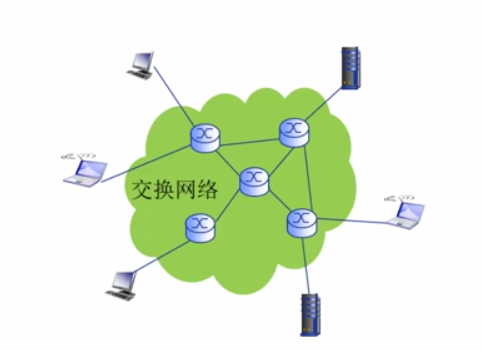

使用一个由特殊设备构成的称为**交换网络**的网络负责当信息传输的中间站，每个主机又与就近的交换网络中的枢纽连接。这样节省了距离成本，也在保证信息传输效率的同时，不至于增加过多的链路。

其中交换网络的枢纽，称为交换节点，一般是路由器或交换机。

### Internet

什么是Internet？Internet是我们如今天天离不开的东西。每时每刻海量的端系统连接在这个庞大的网络中，相互之间产生信息的交换。

             
图1.3 Internet
 

一般家庭，机构（公司，大学等）的Internet服务，都是由当地的区域级ISP（Internet Service Provider）提供。这些区域级ISP不禁相互连接，还通过全球ISP与其他地理区域的ISP互联。从这个角度看，Internet是网络的网络——无数的区域性ISP相互连接，也是一个网络。

             
图1.4 Internet结构
 

Internet就由这些大量的端系统、通信链路（光纤，卫星，铜线...)和分组交换网络构成。

从网络应用的角度看，Internet是为许多运行于端系统的网络应用提供通信服务的基础设施，为网络应用提供API。诸如Web，即时通讯，网络游戏等典型的网络应用，都在使用Internet的服务。

### <a id="网络协议">网络协议</a>

**协议**(protocol)规定了计算机网络中数据交换的规则。协议之于计算机网络，就好比交通规则之于交通系统，如果不规定清楚，汽车🚗，卡车🚚随便上路，路边随便停车，红绿灯视若无物，交通秩序必将混乱。没有协议，只有网络硬件，远远无法实现Internet的庞大信息交流职能。大家都用各自的规矩，其他人怎么知道如何解读你传输来的信息呢？

一般来说，协议的内容规定通信实体之间交换信息的格式，意义和顺序，以及实体针对收到的信息或发生的事件的处理动作。用比较标准的名词来形容，就是**语法**，**语义**和**时序**，称为协议的基本三要素。语法规定数据和信息的传输格式，语义规定各种控制信息的意义以及对控制信息应当作出的响应，时序规定了交换信息双方的行动顺序。

了解各种具体的协议是学习计算机网络的关键。各种协议的设计也是网络创新的重要表现形式。

要获取关于某个网络协议的最权威的描述，请去RFC（Request For Comments）中寻找。

### <a id="计算机网络结构">计算机网络结构</a>

计算机网络的构成有：

- 网络边缘
	顾名思义，位于网络最边缘位置的结点，也就是主机/端系统。网络边缘一般也包括那些运行在端系统上的网络应用。
- 接入网络/物理介质
	接入网络是将端系统连接到网络中的有线或无线的通信链路。常用的比如家庭的接入网络，学校/企业的接入网络，以及移动网络。
- 网络核心
	由路由器，交换机构成的中继网络。

端系统应用常用的模型：

① 客户/服务器（client/server）应用模型：客户发送请求，接收服务器响应。典型的CS模型比如Web应用。

② 对等（Peer-Peer, P2P）应用模型：不依赖或不仅仅依赖于服务器实现数据交换。通信在对等的实体之间发生，典型的P2P模型比如skype。

#### 接入网络的具体划分

##### DSL：数字用户线路

             
图1.5 DSL
 

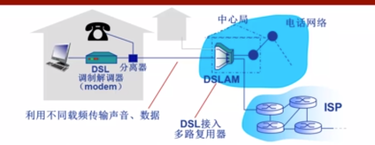

DSL利用已有的线路（一般是电话线路）连接中心局的多路复用器（DSLAM），利用多路复用的技术从电话线上的空闲频段分出上行通道和下行通道。一般来说，

0~4kHz留给传统电话，  
4k~50kHz分配给上行通道，  
50kHz~1MHz分配给下行通道。  

由于上行下行的速度不同，称为非对称接入。DSL为每个接入设备分配独享的通道，虽然速度不太高，但至少不会被打扰。

##### 电缆网络

             
图1.6 电缆网络
 

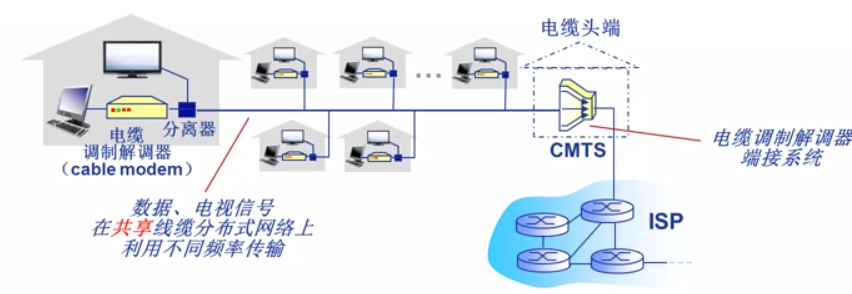

电缆网络实际上就是有线电视网络。以前光纤不普及，数字电视受众广泛的时候，大家应该都对电缆网络有印象。与数字机顶盒公用同一条线路，与DSL类似地，采用分频多路复用技术，把不用的频段拿来做网络通道。至于其使用体验之糟糕，想必无须多言了（虽然比拨号上网肯定是强了不少）。共享线路是这样的啊，一到家家户户的用网高峰，保证每个人卡的屁都放不利索。

这种接入方式也称为混合光纤同轴线缆（HFC）。

##### 企业/机构接入网络：Ethernet

             
图1.7 以太网
 

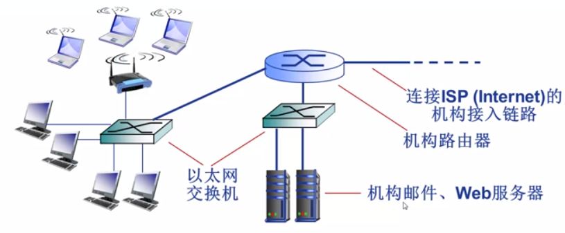

企业或机构一般采用以太网的形式组织内部局域网，再通过交换机接入互联网。以太网是目前应用最广泛的局域网技术。

##### 无线接入网络

通过**共享**的无线接入网络连接端系统和路由器。  

无线接入常见的有同一建筑物内的WLAN（范围小）和运营商的信号基站（范围广，蜂窝数据）。  

## <a id="2020/09/16">2020/09/16</a>

### <a id="网络核心">网络核心</a>

网络的核心部分，承担着两个职能：**路由**和**转发**。

路由是指确定分组传播过程中的网络范围的过程，转发则是接受分组并向下一个目的端发送分组的过程。

毫无疑问，网络的核心就是**交换网络**！

### 数据交换

数据交换主要分为三种形式：电路交换、报文交换交换以及分组交换。

#### 电路交换

最典型的电路交换莫过于电话网络了。

             
图2.1 电路交换
 

电路交换又分为三阶段：

1. 建立连接（呼叫）
2. 通信
3. 断开连接（挂断）

电路交换的一大特点是**独占**。一旦电路建立，就算没有使用，这部分资源也不会被其他用户使用，直到断开连接。

然而，独占却不意味着电路使用时就一直占着线不让其他电路用了。多路复用技术的存在使电路交换不至于看起来像个傻子。

### <a id= "多路复用">多路复用</a>

多路复用是通信技术中的重要概念，简而言之，就是用各种法子，让本来只有的一条线路可以供多个电路同时使用。其思想类似于CPU的流水线处理进程，就是将资源分成多片，分给不同电路使用。这个小资源片是被独占的。

             
图2.2 多路复用
 

#### 频分多路复用：FDM

将链路分成多个频段，每个频段是一个资源片。FDM最广为熟知的应用莫过于有线电视信号了，不同的频道就是位于不同频率的。用户分配到某个频段之后，在通信过程中始终独占这一部分频段。

#### 时分多路复用：TDM

跟CPU流水线最相似的一个多路复用。TDM将时间划分成一段段等长的时间复用帧（TDM帧），用户在每个TDM帧中占用固定的一部分时隙。这样用户的时隙将周期性出现，就好像能同时使用一样。时分复用的用户在频率上使用相同的频段。

#### 波分多路复用：WDM

没什么好说的，就是光的“频分复用”，因为光可以用波长来描述频率。只要两个用户的光在波长上隔离开，就能实现波分复用。

#### 码分多路复用：CDM

CDM广泛地应用于无线链路共享。既不分割频率，也不分割时间，CDM为每个用户分配一个m bit的码片序列，其中用+1来表示1，用-1来表示0。大家发送数据时，都用被分配到的码片序列来编码要传输的数据。

编码格式：原始数据 x 码片序列

如果要发送二进制编码1，那就发送原m bit码片序列，如果要发送二进制编码0则发送该序列的反码。

所有用户发送的数据会叠加。

为了让叠加后的数据可以被解读，要求所有的码片序列相互正交。
$$
\frac {1}{m} S_i \cdot S_j = \begin {cases}1, i = j\\0, i \neq j \end {cases}
\ \ \ \ \ \ \ \ \  
\frac {1}{m} S_i \cdot\overline S_j = \begin {cases}-1, i = j\\0, i \neq j \end {cases}
$$
设用户的码片序列为$S_i$，要发送的原始数据为$d_i$叠加向量P为
$$
P = \sum_{i=1}^n d_i \cdot S_i
$$

要解码，只需要用用户序列与编码信号内积（再乘上$\frac{1}{m}$)。
$$
\frac{1}{m} S_i \cdot P = \begin{cases} 1,S_i \in P\\-1,\overline S_i \in P \\ 0,S_i,\overline S_i \notin P \end{cases}
$$
如果内积的结果是1，说明发送的是原码片序列，也即原始数据是1；

如果内积的结果是-1，说明发送的是码片序列的反码，也即原始数据是-1（当然，实际上代表的是二进制0）；

如果内积的结果是0，说明其与P中的所有部分都正交，也就是P中并没有用户的码片序列信息。

             
图2.3 码分复用
 

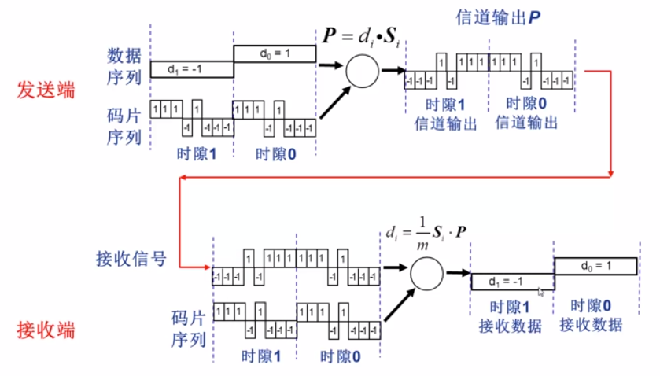

借助码分复用格式，可以允许多个用户同时进行数据交换。

             
图2.4 多用户码分复用
 

如图所示，用户1，2的码片序列相互正交，要发送的信息叠加而成P。以图中为例，假设要接收用户1的数据，只需用$S_1$来解码即可。读者不妨试试用$S_2$解码，看看得到的是不是用户2要发送的原始数据？

### 报文交换

什么是报文？报文就是要发送的信息**整体**。报文交换的关键在于，必须将要发送的信息，也就是报文，一次性发出去。然后交换机存储收到的报文，再向下继续发送。报文可以是一整个文件。最早的报文交换应用应该是电报了。报文交换看起来有些笨重：如果一份文件很大，直到彻底发送完为止，交换机都不能向下一个目标发起传输。一步一个脚印，虽然很稳重，但是太慢了！

### 分组交换

将报文拆分成一系列较小的数据包，就是**分组**。当然，不仅要切分，还要将小的数据包再打包格式，以便于发送。目的地接收到分组后，还要将分组重组，才能获得要传输的信息。拆分、重组以及分组数据头都会略微增加额外的开销，但以如今的网络状况看已经可以忽略不计了。

             
图2.5 分组交换
 

一个显著优于报文交换的性质是，分组都是较小的，往往很短时间内就能传输完成。对于大文件的传输，报文交换只能笨重地传完一整个，再由交换机向下传一整个大文件，而分组交换可以在很快地发送文件的一个小部分分组后，继续向其发送分组，同时交换机已经可以将它拿到的分组向下继续传输了。这样，时间被大大地利用起来，可以有许多链路同时传输分组，并行起来了。

分组交换和报文交换都采用**存储-转发**的数据交换方式。将报文/分组存储起来，再转发出去。

#### 统计多路复用：statistical multiplexing

分组交换网络也存在多路复用。不过，分组交换的复用不是事先安排好的，而是一种按需的复用。

             
图2.6 统计多路复用
 

无论是哪个用户，都是共用一条固定传输速率的链路。不过，大家的分组都要在发送前排好队。如果A用户发送了较多的分组，理所应当地，A用户占用链路的时间更久。也就是说，统计上发送了越多的分组，就具有越高的复用率。这就是为什么这叫做统计多路复用。

### 分组交换VS报文交换

*网络术语中的数据大小和带宽速率等中出现的K，M，G分别指$10^3$，$10^6$，$10^9$，而非计算机系统术语中对物理存储占用理解的$2^{10}$，$2^{20}$，$2^{30}$等。*

为了直观地指出分组交换与报文交换在速度上的优劣，不妨研究一下两种方式在速度上的快慢。

设报文的长度为M = 7.5M bits，分组的长度为L=1500 bits，链路传输速率均为R = 1.5Mbps。

那么每次传输报文的时间是M/R = 5s，每次传输分组的时间为L/R = 0.001s（忽略了分组的数据头），但一个报文会被拆分成多个（在示例中，就是M = 5000 L）分组。

             
图2.7 报文交换的传输
 

报文交换的形式如图2.7所示。庞大的报文只能臃肿地移动，它先花了5s时间从发送端来到第一个交换机，再花了5s时间转移到下一个交换机，最后又花了5s时间到达目的地。整个报文花了15秒才完成交付。时间不短是一方面，更要命的是，庞大的报文还要求交换机也必须具有足够庞大的存储空间。

             
图2.8 分组交换的传输
 

分组交换的形式如图2.8所示。多个分组快速、频繁地通过，避免了庞大的传输发生在某条线路的同时，其他线路在那里摸🐟划水不干事。而且交换路由不用太大的存储。最后一个分组（No.5000）发送到交换机1号时时，才刚刚经过5s，然后又经过了两次链路传输，花了2ms，最后一个bit也传输完成。5000个分组一共才花了5.002s交付。

无论是从对路由存储大小的要求，还是交付时间的角度来看，分组交换都优于报文交换。

对于分组交换，计算其交付时间T的公式如下：
$$
T = \frac{M}{R} + (h-1)\frac{L}{R} \\
 = \frac{M}{R} + n\frac{L}{R}
$$
其中M，R，L的定义已给出。h是跳步数，表示分组在传输过程中经历的链路数，n是路由数。

那么分组交换与电路交换比较一下，又何如呢？

### 分组交换VS电路交换

稍有常识的人都会看出，~~如果我们的铁骑继续前进~~现在的网络数据交换形式绝大部分都是分组交换。那么分组交换到底是好在什么地方呢？分组交换是否就完爆电路交换了呢？

         完爆？
 

实际上，采用分组交换而非电路交换的原因，在于网络活动的特性。

采用电路交换的网络，假设其用户在独享线路的使用时间中，只有10%的时间处于网络活动状态。而其独享线路占用了整条线路的10%带宽。假设线路固有1Mbps的带宽，那这100kb/s的线路就被该用户一直占着了。当他网络不活动的时候（也是绝大部分时候），这部分线路就在浪费时间。不仅如此，由于各管各的，不能越界，如果用户猛的很有网络需求，那也只能瞅着其他用户的空闲线路干瞪眼，因为每个人只被分到了100kb/s的速度，不能多。

> *注：网络活动并不是指上网啊，浏览网页等活动，而是指发生数据交换的活动。以浏览网页举例，只有加载的过程中存在网络活动。一旦加载完成，除非有新的资源请求，否则不会再进行网络通信，即使你在网页上一直浏览也是一样。*

如果采用分组交换的网络，即使用户有35个至多，同时出现10名以上用户使用网络的概率却＜0.0004！（当然，现实生活中可能没有这么美好，毕竟大家使用网络的时段也不是均匀的分布，还有网络高峰期）因此分组交换可以容纳更多的用户，让网络资源得到充分共享。

**但是！**

与电路交换相比，分组交换也有缺点。分组交换只适用于突发数据传输网络（也就是现在的互联网的通信主要形式），如果网络对稳定性的要求极高极强，比如像网络电视这样的源源不断地发送数据的，那采用分组交换一旦遇到网络高峰期，就会非常难受了。一旦大量的分组传输超出了网络的承载范围，就会发生<a href="#拥塞">拥塞</a>，不仅会造成网络延迟，严重的会导致数据丢失。因此分组交换网络需要借助协议验证数据的完整性，以及控制拥塞。

## <a id="2020/09/17">2020/09/17</a>

### <a id="计算机网络性能">计算机网络性能</a>

### 速率

计算机网络中的**速率**就是数据传输的速率，也叫数据率、比特率，表示单位时间传输bit的数目。速率是衡量网络性能的重要指标。

常用单位有bps，kbps，Mbps，Gbps等。重申一下，计算机网络中速率概念提到的k，M，G都是10的3，6，9次方量级，不是2的10，20，30次方量级！

不过，实际生活中提到的速率实际上指的应该是**额定速率**，或者说标称速率。那是一个理论上可以达到的最高值，实际应用中由于各种干扰，物理因素等一般无法达到额定速率。

### 带宽

在信号处理等领域本来表示的是信号的频带宽度，单位是Hz，在网络术语中表示数字信道所能传输的最大速率，单位自然是与速率相同。

### 延迟和丢包

分组交换会有延迟和丢包的概念。因为分组交换存在排队的现象，某个路由可能短时间接收到大量的分组，但它的转发速度有限，只好在自己的存储中按照顺序为分组们排好队，排队的过程就产生了延迟。如果分组来的过于频繁，超出了队伍的容量，这样的分组就会被舍弃，这就是丢包。被舍弃的分组可能会被源节点重新发送。丢包率是丢包数/已发分组总数。

延迟又可以分为4类：

#### 结点处理延迟

路由接收到分组后处理操作的耗时。比如差错检测，确定输出链路等。这个延迟通常小于毫秒级。

#### 排队延迟

确定了输出链路之后，有可能需要在发送之前排队。这部分耗时就是排队延迟。排队延迟取决于拥塞的程度，因此也是最难衡量的。

假设带宽为R bps，分组长度为L bits，对于某台路由，分组的平均到达速率为a 个/s，定义流量强度为$\frac{La}{R}$。

仔细动脑想想，$\frac{R}{L}$不就是每秒能处理的分组个数？流量强度相当于用a除以这个每秒能处理的分组个数，因此如果流量强度>1，路由处理分组的速度就赶不上分组到达的速度，就会越积越多，然后丢包。

$$
\frac{La}{R}=
\begin {cases}
\to0,平均排队延迟小\\ 
\to 1,平均排队延迟很大 \\
>1,平均排队延迟无限大（超出服务能力）
\end {cases}
$$

#### 传输延迟

传输延迟是**指从第一个发送的bit开始到最后一个bit发送的时间**。对于一个长度为L bits的分组，在传输速率为R bps的线路上，其传输延迟为$\frac{L}{R}$。

#### 传播延迟

信号在物理介质中传播的耗时。传播延迟取决于物理链路的长度d以及信号传播的速度s（一般是光速！）。
$$
d_{prop} = \frac{d}{s}
$$
总延迟就由这四类延迟相加而成。
$$
d_{nodal} = d_{proc}+d_{queue}+d_{trans}+d_{prop}
$$
为了便于理解，不妨看看下面的例子——🚗过收费站：

假设🚗的时速为100km/h，这就好比是**信号传播速度**；

🚗要过公路收费站，收费站放行每台车的时间是12s，放行速度就是5台/min，这就好比是**带宽**；

🚗就好比一个个**bit**，车队就好比**分组**；

假设一个车队有10辆车，那么一个车队通过收费站的时间是$\frac{10}{5}$=2min，这就好比是**传输延迟**；

🚗过了收费站之后，在公路上疾驰，一直跑到下一个收费站，用了2h，这就好比是**传播延迟**。

### 时延带宽积

时延带宽积 = 传播延迟 × 带宽。

             
图3.1 时延带宽积
 

看图就懂了吧？就好像物理中的流量 = 流速 × 截面积还有电流 = nevs似的，就是一个用来刻画传播过程中容纳数据大小的量。还有一种理解方式，是说bit传播过程中，从发出该比特到该比特抵达目的地为止，已经发出的比特量，所以时延带宽积也叫以比特为单位的链路长度。

### 吞吐量/率

吞吐量是在发送端和接收端之间传输数据的速率。单位自然是b/s。吞吐量又分即时吞吐量和平均吞吐量，分别代表某一瞬间的吞吐量和一段时间内的吞吐量，就好像瞬时速度和平均速度的感觉吧。

一条通信链路的吞吐量，取决于其上各部分带宽最小值。那个具有最小带宽的链路就称为瓶颈链路。真是不由得让人联想起网络流FF算法求最大流的过程啊！

             
图3.2 Internet中的吞吐量示例
 

互联网的核心中自然也存在某条共享的瓶颈链路R，不过一般来说，某条$R_s$或$R_c$更有可能称为其连接上的瓶颈链路。

### <a id="计算机网络体系结构">计算机网络体系结构</a>

毫无疑问，计算机网络的结构很复杂。不过这个复杂的系统却很适合使用经典的分层结构，从功能的角度来表示。

分层的模型更易于更新和维护，而且每一层的修改都是独立透明的，不会影响到另一层的操作。

分层的结构也有助于标准化。

             
图3.3 分层网络体系结构的基本概念
 

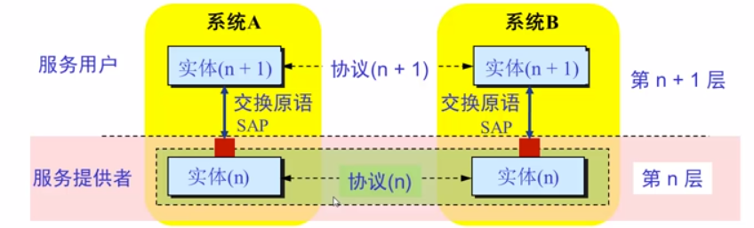

分层网络体系的基本概念如图所示。

实体表示具有发送和接收信息功能的硬件或软件进程。协议负责控制同一层次的实体之间通信的规则，是“水平的”。

任何一层的实体，使用来自下层的服务，遵循本层的协议，实现本层的功能，向上层提供服务。服务是”垂直的“。

下层协议的实现对上层是透明的。

同一系统的相邻层次之间使用接口进行通信，通过服务访问点（SAP）交互，传递**原语**（一系列基础的且不能被中断的操作，比如请求，确定，拒绝...）

### OSI参考模型

开放系统互连（OSI）是由国际标准化组织ISO于1984年提供的分层网络体系参考模型。提出该模型的目的是实现**异构**网络系统的互联互通。彼时许多企业开发了各自不同的网络结构，如何使不同的结构共通，成为了问题。

OSI使异构网络互连的标准。然而，OSI如今只具有理论意义，而在实际的市场应用中鲜有发挥。

OSI的结构足足有他妈的7层：

             
图3.4 OSI参考模型
 

OSI的通信过程只对主机有7层架构要求，对于中间的系统，只需要底部的三层。各层有自己的协议。

             
图3.4 OSI的通信过程
 

数据从源主机的应用层通过接口开始逐层向下，直到物理层，通过物理介质传到中间系统。在中间系统经过一系列处理向上到网络层，中间系统在这一层次明确将数据传输到的下一个目的地，然后再向下到物理层，通过物理介质传输向目的地。到达目的主机后，又逐层向上到目的主机应用层。图中实线的内容也叫实通信过程，表示数据的实际通信。图中的高四层没有中间系统的参与，称为端到端层(end-end)。

             
图3.5 OSI的数据封装
 

每一对等层之间通过协议规范传输的内容称为协议数据单元（PDU）。从最顶层应用层开始，每层根据协议以及上一层传来的数据，加上本层的头部信息，构成新的PDU，再通过接口传递给下层。注意，到物理层的时候，就不再加额外的头部信息了，直接传递二进制的信号。封装数据的解读顺序与图中类似，只是从底向上。

进行数据封装的操作是为了增加控制信息，其往往包括地址、差错检测编码（用于检错/纠正）、协议控制等。

下面对OSI参考模型的各层进行简要的介绍。

### 物理层

通过物理介质传输二进制编码信号。物理层可能涉及到接口的机械特性、传输的功能特性、具体的规程特性等。物理层一般还涉及编码的表示形式（比如高电平表示1，低电平表示0这种？）、数据率、比特同步（保证发送端与接收端的传输内容同步）和传输模式（一般决定了传输方向）等。

这层意思意思就行了，反正也不会怎么接触。

### 数据链路层

数据链路层主要负责由物理链路直接相连的结点之间的数据传输。链路层将网络层传来的PDU加头加尾，构成数据帧。一般来说，头部包含地址等信息，尾部包含差错检测等信息。

             
图3.6 数据链路层-寻址
 

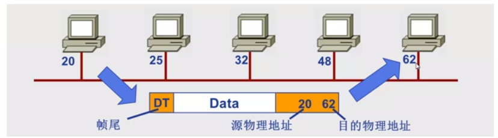

数据链路层要解决的一个关键问题就是**物理寻址**。毕竟很多物理链路并非单单从一个指向另一个，而是一对多，乃至多对多。如果不在帧头部标识数据的发送端和接收端的物理地址，谁来接收数据，数据的来源如何，就都无从而知了。

除了物理寻址之外数据链路层还负责流量控制，差错控制和访问控制的功能。

- 流量控制是防止接收端被大量数据淹没的机制
- 差错控制检测损坏和丢失帧，并避免重复帧
- 访问控制决定某一时刻哪个设备拥有链路的控制使用权

### 网络层

网络层负责从源主机到目的主机数据分组的交付，可能穿越多个网络。

网络层还负责提供逻辑地址。逻辑地址是全局唯一的，可以确保只有目的主机可以接收，比如IP地址。

网络层也负责路由，根据分组的内容决定路由的方向，**分组**转发的路径。

### 传输层

传输层的PDU称为段（segment）。传输层负责源主机到目的主机、进程到进程的报文传输。

             
图3.7 传输层
 

如图所示，传输层实现的是报文的分段与重组功能。将报文分成分组并加上头部信息，交给网络层传输，再接收端又将他们聚成报文。除此之外，传输层还要负责添加SAP寻址的信息，确保进程找到对应的端口号。有的传输层协议还会解决连接控制、流量控制和差错控制的问题。

### 会话层

             
图3.8 会话层
 

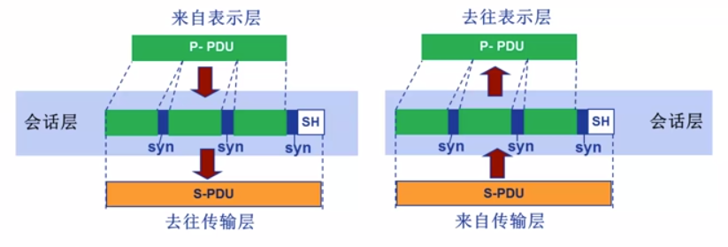

会话层负责会话控制，并将表示层的PDU插入一些同步控制信息，如果传输过程中某个控制点附近出现意外，只需要恢复该点附近的数据。

### 表示层

             
图3.9 表示层
 

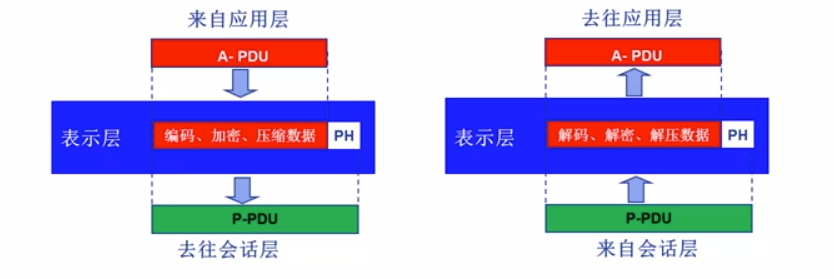

表示层负责处理两个系统间信息交换的语法和语义，将数据转换为主机独立的编码，以及对数据的加密解密、压缩解压缩等。

### 应用层

             
图3.10 应用层
 

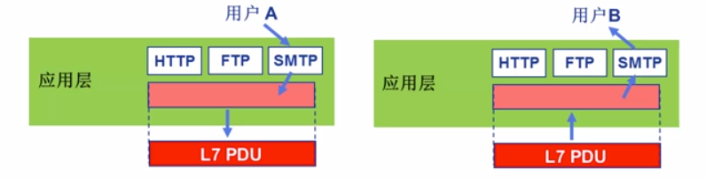

支持用户通过代理或者网络接口使用网络服务。典型的网络服务有文件传输、电子邮件、Web服务等。

### TCP/IP参考模型

             
图3.11 TCP/IP参考模型
 

TCP/IP的参考模型如图所示。可以看到其只有四层，而且除了网际层，每一层都有多种选择。

对于网际接口层，并没有要求特定的协议，只要能封装IP分组就可以。

TCP/IP模型的一大特点就是一切网络应用程序都构建于IP之上，IP又可应用到各式各样的网络上。

### 5层参考模型

5层参考模型综合了OSI 7层模型和TCP/IP 模型的优点，可以说其不仅在理论上具有意义，现在在网络中也具有相当的实践意义。

- 应用层

  支持各种网络应用，如FTP、HTTP等协议的应用

- 传输层

  实现进程间的信息传输，如TCP、UDP

- 网络层

  实现源主机到目的主机的数据分组的路由、转发，如IP协议，路由协议等

- 链路层

  相邻网络元素（主机，路由器、交换机等）的数据传输，如以太网，WiFi，PPP

- 物理层

  比特级传输

## <a id="2020/09/21">2020/09/21</a>

### <a id="网络应用的体系机构">网络应用的体系结构</a>

### C/S结构

             
图4.1 C/S结构示例：Web应用
 

客户机/服务器结构将主机划分成客户端和服务器两类。从功能上划分，客户机是请求服务的主机，服务器是提供服务的主机。

服务器作为提供服务方，一般要保持全天24小时工作，并提供永久性访问的地址/域名。可以通过增加服务器数量来实现可扩展性（并发处理请求）

客户机与服务器通信，使用服务器提供的服务，间歇性接入网络，并且可能具有动态的IP地址，也不可以和其他客户机直接通信。

如图是一个C/S结构示例。不同主机上的客户机通过浏览器向服务器发送请求，服务器又响应请求提供服务。

### P2P结构

             
图4.2 P2P结构
 

P2P结构的一大特点是**没有永远在线的服务器**，而且**任意端系统之间可以直接相互通讯**。同样地，节点可以任意时刻接入网络，也可能改变IP地址。P2P是高度可伸缩的，但是难于管理。

### 混合结构

混合结构结合了C/S结构和P2P结构。一个典型的混合结构应用是Napster。

             
图4.3 Napster的混合结构
 

文件的传输是P2P式的，但文件的搜索是C/S式的。每个文件都在中央服务器上存有记录，方便每个用户查询。查询到了需要的文件后，可以从文件的提供者那里之间获取。

### 进程间通信

同一台主机上的进程间可以通过操作系统提供的机制相互通信，而不同主机的进程间通信都是利用消息交换。发起通信的进程称为客户机进程，等待通信请求的进程称为服务机进程。

### 套接字

             
图4.4 socket
 

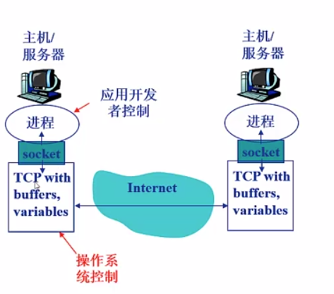

进程间的通信借助于套接字（socket）。使用socket通信可以类比使用信箱送信的过程。发送方将消息放到信箱里，依赖于外部的传输基础设施将消息送到接收方的门外（主机）。接受方从门外获取信息。“信箱”——socket也就是由“传输基础设施”——传输层提供的API。可以用socket选择传输层的协议并进行一些参数的控制。

### 进程寻址

要为主机寻址，通过某个标识符确定唯一的主机，可以通过IP地址，那么对于一台主机上的进程呢？

实际上，由于一台主机上同时会有多个进程需要通信，要确定具体寻址哪一台主机，还需要**端口号**。主机上某一个需要通信的进程都会被分配一个端口号。有一些端口号是固定的，不允许随便使用，比如HTTP的专用80端口和Mail的25端口。

### <a id="应用层协议">应用层协议</a>

应用层协议是网络应用需要遵循的协议，有许多种。有公开的协议（一般由RFC定义）比如HTTP，FTP，SMTP等。也有私有的协议，比如一些P2P应用的协议。公开的协议的存在方便了大家的应用之间进行互操作。

应用层协议的一般内容：

- 规定消息的类型（请求，响应...)
- 消息的语法（消息中都有哪些字段，字段的格式）
- 消息的语义（字段的含义是什么）
- 规则（进程如何，何时发送请求/响应？）

### 网络应用对传输服务的需求

- 数据丢失/可靠性

  有些应用对数据的完整性有一定容忍，比如网络电话、在线视频等，缺少一部分数据不会对整个应用的运行造成过大影响

  但有些应用又要求数据必须完整100%传输，比如文件传输

- 时间延迟

  有的应用只有时延低时才能正常工作，比如网络电话，网络游戏

- 带宽

  有些应用在带宽达到一定要求时才能有较好体验，比如在线视频

  而像文件传输这样的应用并没有对带宽有固定要求，只要有速度就可以

- 安全性

  像网上银行类应用必须对数据的安全有极高保障

### Internet提供的传输服务

#### TCP

- 面向连接：客户机和服务机进程间需要建立连接
- 可靠的传输：把底层的不可靠数据转化成可靠的
- 流量控制：控制发送方不要过快发送，超过服务机进程的处理请求
- 拥塞控制：当网络负担过重时，限制发送方的发送速度
- 不提供延迟保障
- 不提供最小带宽保障

#### UDP

较TCP更简单。

- 无连接
- 数据传输不可靠
- 无流量控制、拥塞控制、延迟保障、最小带宽保障

UDP为什么什么都不做？因为它提供的服务非常基本非常低级，几乎是传输层协议的必备。虽然什么都没有，但是给予了应用极大的权力自由。

             
图4.5 一些应用的应用层和传输层协议
 

### <a id= "Web应用">Web应用</a>

Web 即 World Wide Web，全球广域网，也称万维网。由伟大的Tim Berners-Lee发明。虽然Web的历史实际上也并没有很久，但其巨大的影响力，甚至使得Internet从当时的众多网络中脱颖而出，称为如今网络的代名词。

Web的最基本构成要素是**网页**（Web Pages）。另外，网页与网页之间相互链接，形成庞大的网络。网页包含多个**对象**（objects），对象可以是HTML文件、图像、视频、脚本等。

每个网页还必须有一个基本的HTML文件，包含对其他对象的链接。

要对网页对象进行寻址，使用的是**统一资源定位器（URL）**，关于URL的介绍，详见<a href="https://tools.ietf.org/html/rfc1738">RFC 1738</a>。

URL有一个基本的格式

Scheme://host:port/path

*（有时候省略了Scheme，那就说明默认为HTTP）*

### HTTP协议

HTTP是HyperText Transfer Protocol的简称。HTTP采用了C/S架构，客户机就是浏览器，负责请求、接收、展示对象。服务器负责响应请求。

HTTP采用的传输层协议是TCP协议。

- 服务器在80端口等待客户机请求。
- 浏览器发起对服务器的TCP连接，创建套接字Socket。
- 服务器接收来自浏览器的TCP连接。
- 浏览器（客户端）与服务器交换HTTP信息。
- 关闭TCP连接。

HTTP是**无状态**的。所谓无状态，也就是服务器不维护任何有关浏览器过去所发送的请求的信息。这是因为有状态的协议比较复杂。现代网络的应用往往通过其他方式实现维护状态的功能。

#### HTTP连接

HTTP1.0（早期版本）使用非持久性连接，且每个TCP连接仅允许传输一个对象。

HTTP1.1默认使用持久性连接，且每个TCP连接允许传输多个对象。

**RTT**（Round Trip Time）表示从客户端发送一个**很小**的数据包到服务器并返回所需的时间。

             
图4.6 响应时间
 

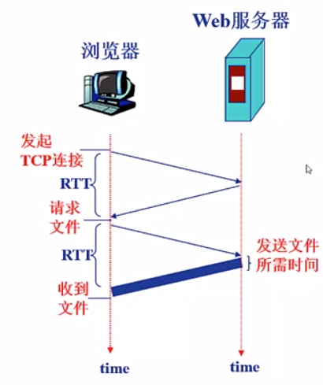

一次请求Web资源的响应时间为

1. 发起、建立TCP连接：1RTT
2. 发送HTTP请求信息到HTTP相应信息的前几个字节到达客户端：1RTT
3. 响应消息中所含的文件/对象传输时间

因此Total = 2RTT + 文件传输时间。

如果采用非持久性连接，每个对象都需要两个RTT且会建立很多的TCP连接，这会占用其操作系统的资源。因此，后来改用持久性连接，完成一次连接后服务器保持连接的打开，后续的HTTP消息可以通过这个持久的连接发送。

持久性连接又可细分为2种：其一是无流水的持久连接，客户端只有收到前一个响应后才能发送请求，每个对象占用1RTT，对象的请求之间是同步的（synchronized）。其二是采用流水机制的持久连接，也是HTTP1.1的默认方式，当遇到一个对象资源的引用就尽可能快地发出请求，也就是不等上一个响应来，就发送下一个请求，最理想条件下多个对象资源只需要一个RTT。

#### HTTP方法

下面给出一些基本的HTTP方法。

- GET

  （HTTP1.0）请求指定的对象资源。

- POST

  （HTTP1.0）提交表单或上传文件。

- HEAD

  （HTTP1.0）与GET请求类似，不过特地要求服务器**不要**返回请求的内容，也就是只返回头部的信息。

- PUT

  （HTTP1.1）把消息体中的文件上传到URL指定的路径。

- DELETE

  （HTTP1.1）请求服务器删除指定URL的内容。

- CONNECT

  （HTTP1.1）建立一个到目标服务器的连接，将连接方式改成管道方式。

- OPTIONS

  （HTTP1.1）允许客户端查看性能。

- TRACE

  （HTTP1.1）回显服务器收到的请求。

#### HTTP消息类型

HTTP消息分为请求消息和响应消息。消息是ASCII码描述的，人直接可读。

#### 请求消息

             
图4.7 请求消息示例
 

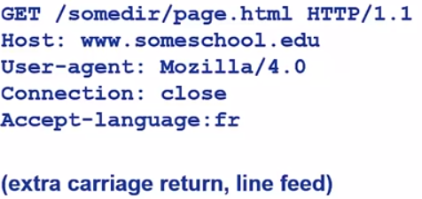

第一行称为请求行（request line），有方法名、URL、协议版本。

下面的几行称为头部行（可扩展，不限于示例中的几种），由字段:值组成，可以有主机域名、浏览器及版本、连接类型和语言等信息。服务器可能根据语言类型的不同，浏览器的不同，返回不同的对象资源。

然后是一个空行表示消息结束。

             
图4.8 请求消息通用格式
 

#### 上传输入的方法

- POST方法

  对于那些需要上传表单（form）的网页，在请求消息的消息体里上传客户端的输入即可。

- URL方法

  如果输入信息非常少，可以使用get方法，把输入信息放到请求行的URL的位置。使用这种方法可以为简单的方法传入参数，具体应用中体现在URL中的“?”之后的内容。

#### 响应消息

             
图4.9 响应消息通用格式
 

第一行称为状态行，包含协议版本，返回状态代码以及他的解释。

下面几行为头部行，具体类似于请求消息的头部行，比如Date:生成响应消息的时间、Server:服务器的应用和版本等。

然后是一个空行，再然后是请求的内容。

常见的HTTP响应状态代码：

- 101：切换协议。

- 200：请求成功。
- 301：资源已被永久移动到其他URL。
- 302：资源被暂时移动（Found）。
- 400：因请求的语法错误而无法正常读取（Bad Request）。
- 404：请求的资源不存在。
- 500：服务器内部错误。

### Cookie

HTTP是无状态的，可是很多时候，使用网络服务需要记录客户端的状态。Cookie就解决了这一问题。

Cookie是某些网站为了辨别用户身份、进行session追踪而储存在本地上的数据（一般经过加密），详见<a  href="https://tools.ietf.org/html/rfc6265">RFC 6265</a>。

要在HTTP中应用Cookie，可以在请求/响应消息中使用Cookie的头部行。浏览器保存自己的Cookie，服务器存储一个Cookie的数据库。

Cookie被大量应用于身份认证中。

### Web缓存/代理服务器

Web缓存是一种允许在不访问服务器的前提下满足客户端的HTTP需求的技术。

Web缓存可以用来缩短请求响应时间，减少机构的访问流量，实现高效率的内容分发<del>当然还有科学上网</del>。

             
图4.10 Web缓存-借助代理服务器
 

在客户和服务器之间架设一个代理/缓存服务器。用户对原始目标服务器的HTTP请求信息不是直接发给了原始服务器，而是发送给了代理服务器。如果客户请求的对象在代理服务器中已经存有，则可以直接由代理服务器发送响应信息，发送对象；如果没有，则代理服务器代替客户向原始服务器发送那个请求。可以说，代理服务器既充当服务器，又充当客户端。可见其的确为原始目标服务器起到了缓解流量的作用。

代理服务器都是由ISP架设的。

代理服务器应用的一个关键在于，如何确认缓存服务器中已经缓存的某个资源与目标服务器上的对应同名资源完全一致？如果目标服务器上发生了更改，缓存服务器上存有的是旧版本，该如何更新？条件性GET方法可以解决这个问题。

代理服务器在HTTP的GET请求消息中声明所持有资源的版本日期。如果缓存服务器检查后发现没有新的修改版本，则响应消息中不含对象，并且返回HTTP 304：Not Modified，如果有新的修改，则返回HTTP 200：OK并在消息中附带新的对象。

### <a id="Email">Email应用</a>

Email应用的历史相对悠久，但经久不衰。

Email应用由以下部分构成：

- 邮件客户端

  读、写Email消息，与服务器交互，收、发Email消息。经典的邮件客户端像Outlook、Foxmail等，通过Web实现的邮件客户端也具有邮件客户端功能。

- 邮件服务器

  

### <a id="DNS应用">DNS应用</a>

