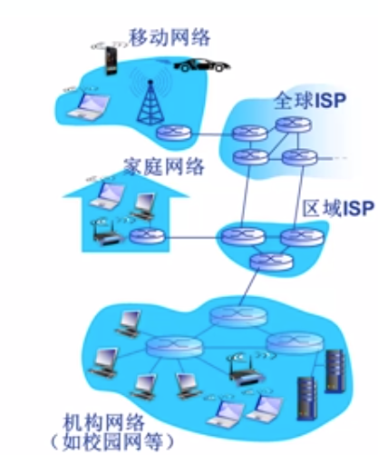
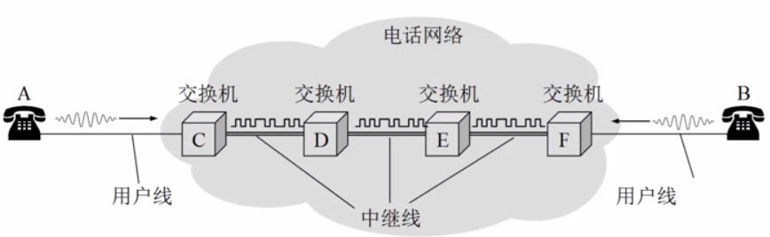
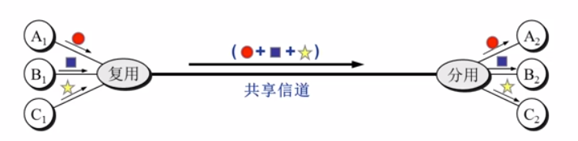

这是在学校上计算机网络课的个人笔记。博客中的图片部分正常的话都会在正确加载的图片下方多出来一个加载失败的图片，那是给我在本地编辑时看着方便的，跟上方的是同一张图片，所以忽略就行。

*MOOC图片来自于我校在中国大学MOOC的<a href="https://www.icourse163.org/course/HIT-154005">计算机网络</a>*课程。

*图片资源较多，建议耐心浏览。*

### 目录

1. **<a href="#2020/09/14">2020/09/14</a>**

   <a href="#计算机网络的定义">计算机网络的定义</a>
   
	<a href="#交换网络">交换网络</a>
	
	<a href="#网络协议">网络协议</a>

	<a href="#计算机网络结构">计算机网络结构</a>

2. **<a href="#2020/09/16">2020/09/16</a>**

	<a href="#网络核心">网络核心</a>
	
	<a href="#多路复用">多路复用</a>

3. **<a href="#2020/09/17">2020/09/17</a>**
   
	<a href="#计算机网络性能">计算机网络性能</a>
	
	<a href="#计算机网络体系结构">计算机网络体系结构</a>
   
4. **<a href="#2020/09/21">2020/09/21</a>**

	<a href="#网络应用的体系结构">网络应用的体系结构</a>
	
	<a href="#应用层协议">应用层协议</a>
	
	<a href="#Web应用">Web应用</a>
	
	<a href="#Email应用">Email应用</a>
	
	<a href="#DNS应用">DNS应用</a>
	
	<a href="#P2P应用">P2P应用</a>

5. **<a href="#2020/09/236">2020/09/26</a>**

	<a href="#SOCKET编程">SOCKET编程</a>
	
	<a href="#客户端软件设计">客户端软件设计</a>

6. **<a href="#2020/10/03">2020/10/03</a>**

	<a href="#传输层2">传输层</a>
	
	<a href = "#可靠数据传输原理">可靠数据传输原理</a>

7. **<a href="#2020/10/08">2020/10/08</a>**

	<a href="#TCP">TCP</a>

8. **<a href="#2020/10/12">2020/10/12</a>**

	<a href="#网络层服务">网络层服务</a>

	<a href="#IPv4">IPv4</a>

9. **<a href="#2020/10/20">2020/10/20</a>**

   <a href="#NAT">NAT</a>

   <a href="#IPv6">IPv6</a>

   <a href="#路由算法">路由算法</a>
   
10. **<a href="#2020/10/29">2020/10/29</a>**

    <a href="#数据链路层2">数据链路层</a>
    
11. **<a href="#2020/11/8">2020/11/8</a>**

    <a href="#2物理层">物理层</a>

 

## <a id="2020/09/14">2020/09/14</a>

### <a id="计算机网络的定义">计算机网络的定义</a>

计算机网络是一个**自治**的，**互联**的计算机集合。自治是说，计算机网络中的计算机之间没有主从关系。互联是指，网络中的计算机通过通信链路互联互通。

             
图1.1 计算机网络概念图
 

在计算机网络中，这些网络中的计算机统称为**主机**/**端系统**，连接主机的称为**通信链路**。

然而，随着网络变的越来越庞大复杂，像图中这样直接使用通信链路将主机相互连接的方法显得越来越不科学。一方面随着接入主机的数目增加，通信链路增长的速度越来越快，距离也越来越长，一方面，主机上留给通信链路的接口也是有限的。不得不使用一种新的方法来起到信息交换的作用。

### <a id="交换网络">交换网络</a>

             
图1.2 交换网络
 

使用一个由特殊设备构成的称为**交换网络**的网络负责当信息传输的中间站，每个主机又与就近的交换网络中的枢纽连接。这样节省了距离成本，也在保证信息传输效率的同时，不至于增加过多的链路。

其中交换网络的枢纽，称为交换节点，一般是路由器或交换机。

### Internet

什么是Internet？Internet是我们如今天天离不开的东西。每时每刻海量的端系统连接在这个庞大的网络中，相互之间产生信息的交换。

             
图1.3 Internet
 

一般家庭，机构（公司，大学等）的Internet服务，都是由当地的区域级ISP（Internet Service Provider）提供。这些区域级ISP不禁相互连接，还通过全球ISP与其他地理区域的ISP互联。从这个角度看，Internet是网络的网络——无数的区域性ISP相互连接，也是一个网络。

             
图1.4 Internet结构
 

Internet就由这些大量的端系统、通信链路（光纤，卫星，铜线...)和分组交换网络构成。

从网络应用的角度看，Internet是为许多运行于端系统的网络应用提供通信服务的基础设施，为网络应用提供API。诸如Web，即时通讯，网络游戏等典型的网络应用，都在使用Internet的服务。

### <a id="网络协议">网络协议</a>

**协议**(protocol)规定了计算机网络中数据交换的规则。协议之于计算机网络，就好比交通规则之于交通系统，如果不规定清楚，汽车🚗，卡车🚚随便上路，路边随便停车，红绿灯视若无物，交通秩序必将混乱。没有协议，只有网络硬件，远远无法实现Internet的庞大信息交流职能。大家都用各自的规矩，其他人怎么知道如何解读你传输来的信息呢？

一般来说，协议的内容规定通信实体之间交换信息的格式，意义和顺序，以及实体针对收到的信息或发生的事件的处理动作。用比较标准的名词来形容，就是**语法**，**语义**和**时序**，称为协议的基本三要素。语法规定数据和信息的传输格式，语义规定各种控制信息的意义以及对控制信息应当作出的响应，时序规定了交换信息双方的行动顺序。

了解各种具体的协议是学习计算机网络的关键。各种协议的设计也是网络创新的重要表现形式。

要获取关于某个网络协议的最权威的描述，请去RFC（Request For Comments）中寻找。

### <a id="计算机网络结构">计算机网络结构</a>

计算机网络的构成有：

- 网络边缘
	顾名思义，位于网络最边缘位置的结点，也就是主机/端系统。网络边缘一般也包括那些运行在端系统上的网络应用。
- 接入网络/物理介质
	接入网络是将端系统连接到网络中的有线或无线的通信链路。常用的比如家庭的接入网络，学校/企业的接入网络，以及移动网络。
- 网络核心
	由路由器，交换机构成的中继网络。

端系统应用常用的模型：

① 客户/服务器（client/server）应用模型：客户发送请求，接收服务器响应。典型的CS模型比如Web应用。

② 对等（Peer-Peer, P2P）应用模型：不依赖或不仅仅依赖于服务器实现数据交换。通信在对等的实体之间发生，典型的P2P模型比如skype。

#### 接入网络的具体划分

##### DSL：数字用户线路

             
图1.5 DSL
 

DSL利用已有的线路（一般是电话线路）连接中心局的多路复用器（DSLAM），利用多路复用的技术从电话线上的空闲频段分出上行通道和下行通道。一般来说，

0~4kHz留给传统电话，  
4k~50kHz分配给上行通道，  
50kHz~1MHz分配给下行通道。  

由于上行下行的速度不同，称为非对称接入。DSL为每个接入设备分配独享的通道，虽然速度不太高，但至少不会被打扰。

##### 电缆网络

             
图1.6 电缆网络
 

电缆网络实际上就是有线电视网络。以前光纤不普及，数字电视受众广泛的时候，大家应该都对电缆网络有印象。与数字机顶盒公用同一条线路，与DSL类似地，采用分频多路复用技术，把不用的频段拿来做网络通道。至于其使用体验之糟糕，想必无须多言了（虽然比拨号上网肯定是强了不少）。共享线路是这样的啊，一到家家户户的用网高峰，保证每个人卡的屁都放不利索。

这种接入方式也称为混合光纤同轴线缆（HFC），也是非对称接入的。

##### 企业/机构接入网络：Ethernet

             
图1.7 以太网
 

企业或机构一般采用以太网的形式组织内部局域网，再通过交换机接入互联网。以太网是目前应用最广泛的局域网技术。

##### 无线接入网络

通过**共享**的无线接入网络连接端系统和路由器。  

无线接入常见的有同一建筑物内的WLAN（范围小）和运营商的信号基站（范围广，蜂窝数据）。  

## <a id="2020/09/16">2020/09/16</a>

### <a id="网络核心">网络核心</a>

网络的核心部分，承担着两个职能：**路由**和**转发**。

路由是指确定分组传播过程中的网络范围的过程，转发则是接受分组并向下一个目的端发送分组的过程。

毫无疑问，网络的核心就是**交换网络**！

### 数据交换

数据交换主要分为三种形式：电路交换、报文交换交换以及分组交换。

#### 电路交换

最典型的电路交换莫过于电话网络了。

             
图2.1 电路交换
 

电路交换又分为三阶段：

1. 建立连接（呼叫）
2. 通信
3. 断开连接（挂断）

电路交换的一大特点是**独占**。一旦电路建立，就算没有使用，这部分资源也不会被其他用户使用，直到断开连接。

然而，独占却不意味着电路使用时就一直占着线不让其他电路用了。多路复用技术的存在使电路交换不至于看起来像个傻子。

### <a id= "多路复用">多路复用</a>

多路复用是通信技术中的重要概念，简而言之，就是用各种法子，让本来只有的一条线路可以供多个电路同时使用。其思想类似于CPU的流水线处理进程，就是将资源分成多片，分给不同电路使用。这个小资源片是被独占的。

             
图2.2 多路复用
 

#### 频分多路复用：FDM

将链路分成多个频段，每个频段是一个资源片。FDM最广为熟知的应用莫过于有线电视信号了，不同的频道就是位于不同频率的。用户分配到某个频段之后，在通信过程中始终独占这一部分频段。

#### 时分多路复用：TDM

跟CPU流水线最相似的一个多路复用。TDM将时间划分成一段段等长的时间复用帧（TDM帧），用户在每个TDM帧中占用固定的一部分时隙。这样用户的时隙将周期性出现，就好像能同时使用一样。时分复用的用户在频率上使用相同的频段。

#### 波分多路复用：WDM

没什么好说的，就是光的“频分复用”，因为光可以用波长来描述频率。只要两个用户的光在波长上隔离开，就能实现波分复用。

#### 码分多路复用：CDM

CDM广泛地应用于无线链路共享。既不分割频率，也不分割时间，CDM为每个用户分配一个m bit的码片序列，其中用+1来表示1，用-1来表示0。大家发送数据时，都用被分配到的码片序列来编码要传输的数据。

编码格式：原始数据 x 码片序列

如果要发送二进制编码1，那就发送原m bit码片序列，如果要发送二进制编码0则发送该序列的反码。

所有用户发送的数据会叠加。

为了让叠加后的数据可以被解读，要求所有的码片序列相互正交。

$$
\frac {1}{m} S_i \cdot S_j = \begin {cases}1, i = j\\0, i \neq j \end {cases}
\ \ \ \ \ \ \ \ \  
\frac {1}{m} S_i \cdot\overline S_j = \begin {cases}-1, i = j\\0, i \neq j \end {cases}
$$

设用户的码片序列为$S_i$，要发送的原始数据为$d_i$叠加向量P为

$$
P = \sum_{i=1}^n d_i \cdot S_i
$$

要解码，只需要用用户序列与编码信号内积（再乘上$\frac{1}{m}$)。

$$
\frac{1}{m} S_i \cdot P = \begin{cases} 1,S_i \in P\\-1,\overline S_i \in P \\ 0,S_i,\overline S_i \notin P \end{cases}
$$

如果内积的结果是1，说明发送的是原码片序列，也即原始数据是1；

如果内积的结果是-1，说明发送的是码片序列的反码，也即原始数据是-1（当然，实际上代表的是二进制0）；

如果内积的结果是0，说明其与P中的所有部分都正交，也就是P中并没有用户的码片序列信息。

             
图2.3 码分复用
 

借助码分复用格式，可以允许多个用户同时进行数据交换。

             
图2.4 多用户码分复用
 

如图所示，用户1，2的码片序列相互正交，要发送的信息叠加而成P。以图中为例，假设要接收用户1的数据，只需用$S_1$来解码即可。读者不妨试试用$S_2$解码，看看得到的是不是用户2要发送的原始数据？

### 报文交换

什么是报文？报文就是要发送的信息**整体**。报文交换的关键在于，必须将要发送的信息，也就是报文，一次性发出去。然后交换机存储收到的报文，再向下继续发送。报文可以是一整个文件。最早的报文交换应用应该是电报了。报文交换看起来有些笨重：如果一份文件很大，直到彻底发送完为止，交换机都不能向下一个目标发起传输。一步一个脚印，虽然很稳重，但是太慢了！

### 分组交换

将报文拆分成一系列较小的数据包，就是**分组**。当然，不仅要切分，还要将小的数据包再打包格式，以便于发送。目的地接收到分组后，还要将分组重组，才能获得要传输的信息。拆分、重组以及分组数据头都会略微增加额外的开销，但以如今的网络状况看已经可以忽略不计了。

             
图2.5 分组交换
 

一个显著优于报文交换的性质是，分组都是较小的，往往很短时间内就能传输完成。对于大文件的传输，报文交换只能笨重地传完一整个，再由交换机向下传一整个大文件，而分组交换可以在很快地发送文件的一个小部分分组后，继续向其发送分组，同时交换机已经可以将它拿到的分组向下继续传输了。这样，时间被大大地利用起来，可以有许多链路同时传输分组，并行起来了。

分组交换和报文交换都采用**存储-转发**的数据交换方式。将报文/分组存储起来，再转发出去。

#### 统计多路复用：statistical multiplexing

分组交换网络也存在多路复用。不过，分组交换的复用不是事先安排好的，而是一种按需的复用。

             
图2.6 统计多路复用
 

无论是哪个用户，都是共用一条固定传输速率的链路。不过，大家的分组都要在发送前排好队。如果A用户发送了较多的分组，理所应当地，A用户占用链路的时间更久。也就是说，统计上发送了越多的分组，就具有越高的复用率。这就是为什么这叫做统计多路复用。

### 分组交换VS报文交换

*网络术语中的数据大小和带宽速率等中出现的K，M，G分别指$10^3$，$10^6$，$10^9$，而非计算机系统术语中对物理存储占用理解的$2^{10}$，$2^{20}$，$2^{30}$等。*

为了直观地指出分组交换与报文交换在速度上的优劣，不妨研究一下两种方式在速度上的快慢。

设报文的长度为M = 7.5M bits，分组的长度为L=1500 bits，链路传输速率均为R = 1.5Mbps。

那么每次传输报文的时间是M/R = 5s，每次传输分组的时间为L/R = 0.001s（忽略了分组的数据头），但一个报文会被拆分成多个（在示例中，就是M = 5000 L）分组。

             
图2.7 报文交换的传输
 

报文交换的形式如图2.7所示。庞大的报文只能臃肿地移动，它先花了5s时间从发送端来到第一个交换机，再花了5s时间转移到下一个交换机，最后又花了5s时间到达目的地。整个报文花了15秒才完成交付。时间不短是一方面，更要命的是，庞大的报文还要求交换机也必须具有足够庞大的存储空间。

             
图2.8 分组交换的传输
 

分组交换的形式如图2.8所示。多个分组快速、频繁地通过，避免了庞大的传输发生在某条线路的同时，其他线路在那里摸🐟划水不干事。而且交换路由不用太大的存储。最后一个分组（No.5000）发送到交换机1号时时，才刚刚经过5s，然后又经过了两次链路传输，花了2ms，最后一个bit也传输完成。5000个分组一共才花了5.002s交付。

无论是从对路由存储大小的要求，还是交付时间的角度来看，分组交换都优于报文交换。

对于分组交换，计算其交付时间T的公式如下：
$$
T = \frac{M}{R} + (h-1)\frac{L}{R} \\
 = \frac{M}{R} + n\frac{L}{R}
$$
其中M，R，L的定义已给出。h是跳步数，表示分组在传输过程中经历的链路数，n是路由数。

那么分组交换与电路交换比较一下，又何如呢？

### 分组交换VS电路交换

稍有常识的人都会看出，~~如果我们的铁骑继续前进~~现在的网络数据交换形式绝大部分都是分组交换。那么分组交换到底是好在什么地方呢？分组交换是否就完爆电路交换了呢？

         完爆？
 

实际上，采用分组交换而非电路交换的原因，在于网络活动的特性。

采用电路交换的网络，假设其用户在独享线路的使用时间中，只有10%的时间处于网络活动状态。而其独享线路占用了整条线路的10%带宽。假设线路固有1Mbps的带宽，那这100kb/s的线路就被该用户一直占着了。当他网络不活动的时候（也是绝大部分时候），这部分线路就在浪费时间。不仅如此，由于各管各的，不能越界，如果用户猛的很有网络需求，那也只能瞅着其他用户的空闲线路干瞪眼，因为每个人只被分到了100kb/s的速度，不能多。

> *注：网络活动并不是指上网啊，浏览网页等活动，而是指发生数据交换的活动。以浏览网页举例，只有加载的过程中存在网络活动。一旦加载完成，除非有新的资源请求，否则不会再进行网络通信，即使你在网页上一直浏览也是一样。*

如果采用分组交换的网络，即使用户有35个至多，同时出现10名以上用户使用网络的概率却＜0.0004！（当然，现实生活中可能没有这么美好，毕竟大家使用网络的时段也不是均匀的分布，还有网络高峰期）因此分组交换可以容纳更多的用户，让网络资源得到充分共享。

**但是！**

与电路交换相比，分组交换也有缺点。分组交换只适用于突发数据传输网络（也就是现在的互联网的通信主要形式），如果网络对稳定性的要求极高极强，比如像网络电视这样的源源不断地发送数据的，那采用分组交换一旦遇到网络高峰期，就会非常难受了。一旦大量的分组传输超出了网络的承载范围，就会发生<a href="#拥塞">拥塞</a>，不仅会造成网络延迟，严重的会导致数据丢失。因此分组交换网络需要借助协议验证数据的完整性，以及控制拥塞。

## <a id="2020/09/17">2020/09/17</a>

### <a id="计算机网络性能">计算机网络性能</a>

### 速率

计算机网络中的**速率**就是数据传输的速率，也叫数据率、比特率，表示单位时间传输bit的数目。速率是衡量网络性能的重要指标。

常用单位有bps，kbps，Mbps，Gbps等。重申一下，计算机网络中速率概念提到的k，M，G都是10的3，6，9次方量级，不是2的10，20，30次方量级！

不过，实际生活中提到的速率实际上指的应该是**额定速率**，或者说标称速率。那是一个理论上可以达到的最高值，实际应用中由于各种干扰，物理因素等一般无法达到额定速率。

### 带宽

在信号处理等领域本来表示的是信号的频带宽度，单位是Hz，在网络术语中表示数字信道所能传输的最大速率，单位自然是与速率相同。

### 延迟和丢包

分组交换会有延迟和丢包的概念。因为分组交换存在排队的现象，某个路由可能短时间接收到大量的分组，但它的转发速度有限，只好在自己的存储中按照顺序为分组们排好队，排队的过程就产生了延迟。如果分组来的过于频繁，超出了队伍的容量，这样的分组就会被舍弃，这就是丢包。被舍弃的分组可能会被源节点重新发送。丢包率是丢包数/已发分组总数。

延迟又可以分为4类：

#### 结点处理延迟

路由接收到分组后处理操作的耗时。比如差错检测，确定输出链路等。这个延迟通常小于毫秒级。

#### 排队延迟

确定了输出链路之后，有可能需要在发送之前排队。这部分耗时就是排队延迟。排队延迟取决于拥塞的程度，因此也是最难衡量的。

假设带宽为R bps，分组长度为L bits，对于某台路由，分组的平均到达速率为a 个/s，定义流量强度为$\frac{La}{R}$。

仔细动脑想想，$\frac{R}{L}$不就是每秒能处理的分组个数？流量强度相当于用a除以这个每秒能处理的分组个数，因此如果流量强度>1，路由处理分组的速度就赶不上分组到达的速度，就会越积越多，然后丢包。

$$
\frac{La}{R}=
\begin {cases}
\to0,平均排队延迟小\\ 
\to 1,平均排队延迟很大 \\
>1,平均排队延迟无限大（超出服务能力）
\end {cases}
$$

#### 传输延迟

传输延迟是**指从第一个发送的bit开始到最后一个bit发送的时间**。对于一个长度为L bits的分组，在传输速率为R bps的线路上，其传输延迟为$\frac{L}{R}$。

#### 传播延迟

信号在物理介质中传播的耗时。传播延迟取决于物理链路的长度d以及信号传播的速度s（一般是光速！）。
$$
d_{prop} = \frac{d}{s}
$$
总延迟就由这四类延迟相加而成。
$$
d_{nodal} = d_{proc}+d_{queue}+d_{trans}+d_{prop}
$$
为了便于理解，不妨看看下面的例子——🚗过收费站：

假设🚗的时速为100km/h，这就好比是**信号传播速度**；

🚗要过公路收费站，收费站放行每台车的时间是12s，放行速度就是5台/min，这就好比是**带宽**；

🚗就好比一个个**bit**，车队就好比**分组**；

假设一个车队有10辆车，那么一个车队通过收费站的时间是$\frac{10}{5}$=2min，这就好比是**传输延迟**；

🚗过了收费站之后，在公路上疾驰，一直跑到下一个收费站，用了2h，这就好比是**传播延迟**。

### 时延带宽积

时延带宽积 = 传播延迟 × 带宽。

             
图3.1 时延带宽积
 

看图就懂了吧？就好像物理中的流量 = 流速 × 截面积还有电流 = nevs似的，就是一个用来刻画传播过程中容纳数据大小的量。还有一种理解方式，是说bit传播过程中，从发出该比特到该比特抵达目的地为止，已经发出的比特量，所以时延带宽积也叫以比特为单位的链路长度。

### 吞吐量/率

吞吐量是在发送端和接收端之间传输数据的速率。单位自然是b/s。吞吐量又分即时吞吐量和平均吞吐量，分别代表某一瞬间的吞吐量和一段时间内的吞吐量，就好像瞬时速度和平均速度的感觉吧。

一条通信链路的吞吐量，取决于其上各部分带宽最小值。那个具有最小带宽的链路就称为瓶颈链路。真是不由得让人联想起网络流FF算法求最大流的过程啊！

             
图3.2 Internet中的吞吐量示例
 

互联网的核心中自然也存在某条共享的瓶颈链路R，不过一般来说，某条$R_s$或$R_c$更有可能称为其连接上的瓶颈链路。

### <a id="计算机网络体系结构">计算机网络体系结构</a>

毫无疑问，计算机网络的结构很复杂。不过这个复杂的系统却很适合使用经典的分层结构，从功能的角度来表示。

分层的模型更易于更新和维护，而且每一层的修改都是独立透明的，不会影响到另一层的操作。

分层的结构也有助于标准化。

             
图3.3 分层网络体系结构的基本概念
 

分层网络体系的基本概念如图所示。

实体表示具有发送和接收信息功能的硬件或软件进程。协议负责控制同一层次的实体之间通信的规则，是“水平的”。

任何一层的实体，使用来自下层的服务，遵循本层的协议，实现本层的功能，向上层提供服务。服务是”垂直的“。

下层协议的实现对上层是透明的。

同一系统的相邻层次之间使用接口进行通信，通过服务访问点（SAP）交互，传递**原语**（一系列基础的且不能被中断的操作，比如请求，确定，拒绝...）

### OSI参考模型

开放系统互连（OSI）是由国际标准化组织ISO于1984年提供的分层网络体系参考模型。提出该模型的目的是实现**异构**网络系统的互联互通。彼时许多企业开发了各自不同的网络结构，如何使不同的结构共通，成为了问题。

OSI是异构网络互连的标准。然而，OSI如今只具有理论意义，而在实际的市场应用中鲜有发挥。

OSI的结构足足有他妈的7层：

             
图3.4 OSI参考模型
 

OSI的通信过程只对主机有7层架构要求，对于中间的系统，只需要底部的三层。各层有自己的协议。

             
图3.4 OSI的通信过程
 

数据从源主机的应用层通过接口开始逐层向下，直到物理层，通过物理介质传到中间系统。在中间系统经过一系列处理向上到网络层，中间系统在这一层次明确将数据传输到的下一个目的地，然后再向下到物理层，通过物理介质传输向目的地。到达目的主机后，又逐层向上到目的主机应用层。图中实线的内容也叫实通信过程，表示数据的实际通信。图中的高四层没有中间系统的参与，称为端到端层(end-end)。

             
图3.5 OSI的数据封装
 

每一对等层之间通过协议规范传输的内容称为协议数据单元（PDU）。从最顶层应用层开始，每层根据协议以及上一层传来的数据，加上本层的头部信息，构成新的PDU，再通过接口传递给下层。注意，到物理层的时候，就不再加额外的头部信息了，直接传递二进制的信号。封装数据的解读顺序与图中类似，只是从底向上。

进行数据封装的操作是为了增加控制信息，其往往包括地址、差错检测编码（用于检错/纠正）、协议控制等。

下面对OSI参考模型的各层进行简要的介绍。

### 物理层

通过物理介质传输二进制编码信号。物理层可能涉及到接口的机械特性、传输的功能特性、具体的规程特性等。物理层一般还涉及编码的表示形式（比如高电平表示1，低电平表示0这种？）、数据率、比特同步（保证发送端与接收端的传输内容同步）和传输模式（一般决定了传输方向）等。

这层意思意思就行了，反正也不会怎么接触。

### 数据链路层

数据链路层主要负责由物理链路直接相连的结点之间的数据传输。链路层将网络层传来的PDU加头加尾，构成数据帧。一般来说，头部包含地址等信息，尾部包含差错检测等信息。

             
图3.6 数据链路层-寻址
 

数据链路层要解决的一个关键问题就是**物理寻址**。毕竟很多物理链路并非单单从一个指向另一个，而是一对多，乃至多对多。如果不在帧头部标识数据的发送端和接收端的物理地址，谁来接收数据，数据的来源如何，就都无从而知了。

除了物理寻址之外数据链路层还负责流量控制，差错控制和访问控制的功能。

- 流量控制是防止接收端被大量数据淹没的机制
- 差错控制检测损坏和丢失帧，并避免重复帧
- 访问控制决定某一时刻哪个设备拥有链路的控制使用权

### 网络层

网络层负责从源主机到目的主机数据分组的交付，可能穿越多个网络。

网络层还负责提供逻辑地址。逻辑地址是全局唯一的，可以确保只有目的主机可以接收，比如IP地址。

网络层也负责路由，根据分组的内容决定路由的方向，**分组**转发的路径。

### 传输层

传输层的PDU称为段（segment）。传输层负责源主机到目的主机、进程到进程的报文传输。

             
图3.7 传输层
 

如图所示，传输层实现的是报文的分段与重组功能。将报文分成分组并加上头部信息，交给网络层传输，再接收端又将他们聚成报文。除此之外，传输层还要负责添加SAP（服务访问点）寻址的信息，确保进程找到对应的端口号。有的传输层协议还会解决连接控制、流量控制和差错控制的问题。

### 会话层

             
图3.8 会话层
 

会话层负责会话控制，并将表示层的PDU插入一些同步控制信息，如果传输过程中某个控制点附近出现意外，只需要恢复该点附近的数据。

### 表示层

             
图3.9 表示层
 

表示层负责处理两个系统间信息交换的语法和语义，将数据转换为主机独立的编码，以及对数据的加密解密、压缩解压缩等。

### 应用层

             
图3.10 应用层
 

支持用户通过代理或者网络接口使用网络服务。典型的网络服务有文件传输、电子邮件、Web服务等。

### TCP/IP参考模型

             
图3.11 TCP/IP参考模型
 

TCP/IP的参考模型如图所示。可以看到其只有四层，而且除了网际层，每一层都有多种选择。

对于网际接口层，并没有要求特定的协议，只要能封装IP分组就可以。

TCP/IP模型的一大特点就是一切网络应用程序都构建于IP之上，IP又可应用到各式各样的网络上。

### 5层参考模型

5层参考模型综合了OSI 7层模型和TCP/IP 模型的优点，可以说其不仅在理论上具有意义，现在在网络中也具有相当的实践意义。

- 应用层

  支持各种网络应用，如FTP、HTTP等协议的应用

- 传输层

  实现进程间的信息传输，如TCP、UDP

- 网络层

  实现源主机到目的主机的数据分组的路由、转发，如IP协议，路由协议等

- 链路层

  相邻网络元素（主机，路由器、交换机等）的数据传输，如以太网，WiFi，PPP

- 物理层

  比特级传输

## <a id="2020/09/21">2020/09/21</a>

### <a id="网络应用的体系机构">网络应用的体系结构</a>

### C/S结构

             
图4.1 C/S结构示例：Web应用
 

客户机/服务器结构将主机划分成客户端和服务器两类。从功能上划分，客户机是请求服务的主机，服务器是提供服务的主机。

服务器作为提供服务方，一般要保持全天24小时工作，并提供永久性访问的地址/域名。可以通过增加服务器数量来实现可扩展性（并发处理请求）

客户机与服务器通信，使用服务器提供的服务，间歇性接入网络，并且可能具有动态的IP地址，也不可以和其他客户机直接通信。

如图是一个C/S结构示例。不同主机上的客户机通过浏览器向服务器发送请求，服务器又响应请求提供服务。

### P2P结构

             
图4.2 P2P结构
 

P2P结构的一大特点是**没有永远在线的服务器**，而且**任意端系统之间可以直接相互通讯**。同样地，节点可以任意时刻接入网络，也可能改变IP地址。P2P是高度可伸缩的，但是难于管理。

### 混合结构

混合结构结合了C/S结构和P2P结构。一个典型的混合结构应用是Napster。

             
图4.3 Napster的混合结构
 

文件的传输是P2P式的，但文件的搜索是C/S式的。每个文件都在中央服务器上存有记录，方便每个用户查询。查询到了需要的文件后，可以从文件的提供者那里之间获取。

### 进程间通信

同一台主机上的进程间可以通过操作系统提供的机制相互通信，而不同主机的进程间通信都是利用消息交换。发起通信的进程称为客户机进程，等待通信请求的进程称为服务机进程。

### 套接字

             
图4.4 socket
 

进程间的通信借助于套接字（socket）。使用socket通信可以类比使用信箱送信的过程。发送方将消息放到信箱里，依赖于外部的传输基础设施将消息送到接收方的门外（主机）。接受方从门外获取信息。“信箱”——socket也就是由“传输基础设施”——传输层提供的API。可以用socket选择传输层的协议并进行一些参数的控制。

### 进程寻址

要为主机寻址，通过某个标识符确定唯一的主机，可以通过IP地址，那么对于一台主机上的进程呢？

实际上，由于一台主机上同时会有多个进程需要通信，要确定具体寻址哪一台主机，还需要**端口号**。主机上某一个需要通信的进程都会被分配一个端口号。有一些端口号是固定的，不允许随便使用，比如HTTP的专用80端口和Mail的25端口。

### <a id="应用层协议">应用层协议</a>

应用层协议是网络应用需要遵循的协议，有许多种。有公开的协议（一般由RFC定义）比如HTTP，FTP，SMTP等。也有私有的协议，比如一些P2P应用的协议。公开的协议的存在方便了大家的应用之间进行互操作。

应用层协议的一般内容：

- 规定消息的类型（请求，响应...)
- 消息的语法（消息中都有哪些字段，字段的格式）
- 消息的语义（字段的含义是什么）
- 规则（进程如何，何时发送请求/响应？）

### 网络应用对传输服务的需求

- 数据丢失/可靠性

  有些应用对数据的完整性有一定容忍，比如网络电话、在线视频等，缺少一部分数据不会对整个应用的运行造成过大影响

  但有些应用又要求数据必须完整100%传输，比如文件传输

- 时间延迟

  有的应用只有时延低时才能正常工作，比如网络电话，网络游戏

- 带宽

  有些应用在带宽达到一定要求时才能有较好体验，比如在线视频

  而像文件传输这样的应用并没有对带宽有固定要求，只要有速度就可以

- 安全性

  像网上银行类应用必须对数据的安全有极高保障

### Internet提供的传输服务

#### TCP

- 面向连接：客户机和服务机进程间需要建立连接
- 可靠的传输：把底层的不可靠数据转化成可靠的
- 流量控制：控制发送方不要过快发送，超过服务机进程的处理请求
- 拥塞控制：当网络负担过重时，限制发送方的发送速度
- 不提供延迟保障
- 不提供最小带宽保障

#### UDP

较TCP更简单。

- 无连接
- 数据传输不可靠
- 无流量控制、拥塞控制、延迟保障、最小带宽保障

UDP为什么什么都不做？因为它提供的服务非常基本非常低级，几乎是传输层协议的必备。虽然什么都没有，但是给予了应用极大的权力自由。

             
图4.5 一些应用的应用层和传输层协议
 

### <a id= "Web应用">Web应用</a>

Web 即 World Wide Web，全球广域网，也称万维网。由伟大的Tim Berners-Lee发明。虽然Web的历史实际上也并没有很久，但其巨大的影响力，甚至使得Internet从当时的众多网络中脱颖而出，称为如今网络的代名词。

Web的最基本构成要素是**网页**（Web Pages）。另外，网页与网页之间相互链接，形成庞大的网络。网页包含多个**对象**（objects），对象可以是HTML文件、图像、视频、脚本等。

每个网页还必须有一个基本的HTML文件，包含对其他对象的链接。

要对网页对象进行寻址，使用的是**统一资源定位器（URL）**，关于URL的介绍，详见<a href="https://tools.ietf.org/html/rfc1738">RFC 1738</a>。

URL有一个基本的格式

Scheme://host:port/path

*（有时候省略了Scheme，那就说明默认为HTTP）*

### HTTP协议

HTTP是HyperText Transfer Protocol的简称。HTTP采用了C/S架构，客户机就是浏览器，负责请求、接收、展示对象。服务器负责响应请求。

HTTP采用的传输层协议是TCP协议。

- 服务器在80端口等待客户机请求。
- 浏览器发起对服务器的TCP连接，创建套接字Socket。
- 服务器接收来自浏览器的TCP连接。
- 浏览器（客户端）与服务器交换HTTP信息。
- 关闭TCP连接。

HTTP是**无状态**的。所谓无状态，也就是服务器不维护任何有关浏览器过去所发送的请求的信息。这是因为有状态的协议比较复杂。现代网络的应用往往通过其他方式实现维护状态的功能。

#### HTTP连接

HTTP1.0（早期版本）使用非持久性连接，且每个TCP连接仅允许传输一个对象。

HTTP1.1默认使用持久性连接，且每个TCP连接允许传输多个对象。

**RTT**（Round Trip Time）表示从客户端发送一个**很小**的数据包到服务器并返回所需的时间。

             
图4.6 响应时间
 

一次请求Web资源的响应时间为

1. 发起、建立TCP连接：1RTT
2. 发送HTTP请求信息到HTTP相应信息的前几个字节到达客户端：1RTT
3. 响应消息中所含的文件/对象传输时间

因此Total = 2RTT + 文件传输时间。

如果采用非持久性连接，每个对象都需要两个RTT且会建立很多的TCP连接，这会占用其操作系统的资源。因此，后来改用持久性连接，完成一次连接后服务器保持连接的打开，后续的HTTP消息可以通过这个持久的连接发送。

持久性连接又可细分为2种：其一是无流水的持久连接，客户端只有收到前一个响应后才能发送请求，每个对象占用1RTT，对象的请求之间是同步的（synchronized）。其二是采用流水机制的持久连接，也是HTTP1.1的默认方式，当遇到一个对象资源的引用就尽可能快地发出请求，也就是不等上一个响应来，就发送下一个请求，最理想条件下多个对象资源只需要一个RTT。

#### HTTP方法

下面给出一些基本的HTTP方法。

- GET

  （HTTP1.0）请求指定的对象资源。

- POST

  （HTTP1.0）提交表单或上传文件。

- HEAD

  （HTTP1.0）与GET请求类似，不过特地要求服务器**不要**返回请求的内容，也就是只返回头部的信息。

- PUT

  （HTTP1.1）把消息体中的文件上传到URL指定的路径。

- DELETE

  （HTTP1.1）请求服务器删除指定URL的内容。

- CONNECT

  （HTTP1.1）建立一个到目标服务器的连接，将连接方式改成管道方式。

- OPTIONS

  （HTTP1.1）允许客户端查看性能。

- TRACE

  （HTTP1.1）回显服务器收到的请求。

#### HTTP消息类型

HTTP消息分为请求消息和响应消息。消息是ASCII码描述的，人直接可读。

#### 请求消息

             
图4.7 请求消息示例
 

第一行称为请求行（request line），有方法名、URL、协议版本。

下面的几行称为头部行（可扩展，不限于示例中的几种），由字段:值组成，可以有主机域名、浏览器及版本、连接类型和语言等信息。服务器可能根据语言类型的不同，浏览器的不同，返回不同的对象资源。

然后是一个空行表示消息结束。

             
图4.8 请求消息通用格式
 

#### 上传输入的方法

- POST方法

  对于那些需要上传表单（form）的网页，在请求消息的消息体里上传客户端的输入即可。

- URL方法

  如果输入信息非常少，可以使用get方法，把输入信息放到请求行的URL的位置。使用这种方法可以为简单的方法传入参数，具体应用中体现在URL中的“?”之后的内容。

#### 响应消息

             
图4.9 响应消息通用格式
 

第一行称为状态行，包含协议版本，返回状态代码以及他的解释。

下面几行为头部行，具体类似于请求消息的头部行，比如Date:生成响应消息的时间、Server:服务器的应用和版本等。

然后是一个空行，再然后是请求的内容。

常见的HTTP响应状态代码：

- 101：切换协议。
- 200：请求成功。
- 301：资源已被永久移动到其他URL。
- 302：资源被暂时移动（Found）。
- 400：因请求的语法错误而无法正常读取（Bad Request）。
- 404：请求的资源不存在。
- 500：服务器内部错误。

### Cookie

HTTP是无状态的，可是很多时候，使用网络服务需要记录客户端的状态。Cookie就解决了这一问题。

Cookie是某些网站为了辨别用户身份、进行session追踪而储存在本地上的数据（一般经过加密），详见<a  href="https://tools.ietf.org/html/rfc6265">RFC 6265</a>。

要在HTTP中应用Cookie，可以在请求/响应消息中使用Cookie的头部行。浏览器保存自己的Cookie，服务器存储一个Cookie的数据库。

Cookie被大量应用于身份认证中。

### Web缓存/代理服务器

Web缓存是一种允许在不访问服务器的前提下满足客户端的HTTP需求的技术。

Web缓存可以用来缩短请求响应时间，减少机构的访问流量，实现高效率的内容分发<del>当然还有科学上网</del>。

             
图4.10 Web缓存-借助代理服务器
 

在客户和服务器之间架设一个代理/缓存服务器。用户对原始目标服务器的HTTP请求信息不是直接发给了原始服务器，而是发送给了代理服务器。如果客户请求的对象在代理服务器中已经存有，则可以直接由代理服务器发送响应信息，发送对象；如果没有，则代理服务器代替客户向原始服务器发送那个请求。可以说，代理服务器既充当服务器，又充当客户端。可见其的确为原始目标服务器起到了缓解流量的作用。

代理服务器都是由ISP架设的。

代理服务器应用的一个关键在于，如何确认缓存服务器中已经缓存的某个资源与目标服务器上的对应同名资源完全一致？如果目标服务器上发生了更改，缓存服务器上存有的是旧版本，该如何更新？条件性GET方法可以解决这个问题。

代理服务器在HTTP的GET请求消息中声明所持有资源的版本日期。如果缓存服务器检查后发现没有新的修改版本，则响应消息中不含对象，并且返回HTTP 304：Not Modified，如果有新的修改，则返回HTTP 200：OK并在消息中附带新的对象。

### <a id="Email应用">Email应用</a>

Email应用的历史相对悠久，但经久不衰。

Email应用由以下部分构成：

- 邮件客户端

  读、写Email消息，与服务器交互，收、发Email消息。经典的邮件客户端像Outlook、Foxmail等，通过Web实现的邮件客户端也具有邮件客户端功能。

- 邮件服务器

  存储每个用户的邮件（每个用户的邮箱），消息队列（等待发送的邮件）
  
- SMTP协议

  也即简单邮件传输协议 详见<a href="https://tools.ietf.org/html/rfc2821">RFC 2821</a>，是邮件服务器之间传递消息使用的协议。在邮件的发送过程中，客户端和服务器都是邮件服务器，只不过一个负责发送一个负责接收。

#### SMTP协议

SMTP选择的传输层协议是TCP，运行在port 25，使用持久性连接，使用“CRLF.CRLF"表示消息结束。传输过程一般分为三个阶段：

1. 握手
2. 消息传输
3. 关闭

SMTP采用ACII码的命令/响应交互模式。命令为ASCII文本，响应为状态信息和语句。

注意：Email消息中只能包含7位ASCII码。

             
图4.11 Email应用示例
 

发送者通过客户端（1）将邮件消息发给自己的邮件服务器（2），通过邮件服务器的消息队列（3）发送到接收者的邮件服务器（4）并送入他的邮箱（5），接收者通过邮件客户端（6）获取消息。Email应用是**异步**的，发送者和接收者不需要同时在线。

一般来说，（2）和（4）采用的应用层协议都是SMTP，而（6）可以采用多种协议，比如POP（Post Office Protocol）协议和IMAP（Internet Mail Access Protocol）协议等。POP协议较简单，是**无状态**的协议，具体可见<a href="https://tools.ietf.org/html/rfc1939">RFC 1939</a>，基本上可分为认证和下载两个阶段。IMAP协议<a href="https://tools.ietf.org/html/rfc1730">RFC 1730</a>较之POP协议更新，更复杂，功能也更多，比如允许用户使用文件夹组织消息，也因此IMAP是有状态协议，文件夹的名字、状态等都是跨会话保存的。除了POP，IMAP，还可以使用HTTP协议获取邮件，比如网页邮件客户端（163，QQ等）。

             
图4.12 SMTP交互示例
 

注：S表示SMTP中接收消息的服务器，C表示发送消息的服务器。其是发送消息的客户端，不是邮件客户端！

首先S表示自己的身份，C用HELO（HELLO简化）表清自己的身份。接着S表示确认正常（250），C表示有一封来自自己服务器上用户alice的邮件，S表示确认正常；C表示发送到S上用户Bob，S查询后表示确认正常。C给出命令DATA，表示要传输数据了，S提示他输入邮件，并用单独的带有“.”的一行来表示邮件内容结束，然后C开始输入邮件内容。输入完成后，S表示邮件接收完成，C要求退出，S确认关闭。

与HTTP相比，HTTP像是一种pull式的，尝试拉取内容的协议，而SMTP像是一种push式的，尝试主动上传的协议。它们都使用命令/响应的交互格式，命令、状态代码都是ASCII码表示，不过HTTP的每个对象都封装在独立的响应消息中，而SMTP的多个对象分成多个部分消息发送。

注意，图中的SMTP命令**不是**SMTP报文！这些命令实际上是SMTP握手协议的一部分。邮件报文的格式如下所述：

### Email消息格式

Email消息由两部分构成：头部行和消息体。头部行≠SMTP命令，一般有很多行，会包括消息来源、目的地、标题等内容；消息体仅包含消息本身且只能是ASCII字符。详细的见<a href="https://tools.ietf.org/html/rfc822">RFC 822</a>。

在首部行之后紧接着一个空白行，然后是报文消息体，格式有点像HTTP报文，不过一个重要的区别是只支持ASCII编码格式。

为了支持多媒体应用格式，对Email消息格式进行扩展——MIME：多媒体邮件扩展，详见<a href="https://tools.ietf.org/html/rfc2045">RFC 2045</a>、<a href="https://tools.ietf.org/html/rfc2056">RFC 2056</a>。通过在邮件头增加额外的行以声明MIME内容类型。

### <a id="DNS应用">DNS应用</a>

#### DNS概述

DNS全称Domain Name System，即域名解析系统。DNS的存在，解决了庞杂的互联网中的主机/路由器识别问题。互联网上的主机可以由IP地址唯一区分，但是一串数字总是难以辨明意义以及记忆的。像我们平时使用的www.google.com、www.sci-hub.tw都是域名，域名一般都是有意义的，方便人记忆。人使用域名，而网络主机使用的是IP，因此需要一个系统将域名与IP对应起来。

DNS就是这样的系统，能将域名解析成具体的IP地址。DNS是一个多层的命名服务器构成的**分布式**数据库，虽然是网络核心的功能，但却是由应用层协议实现的，依赖的传输层协议是UDP协议（port 53）。

DNS除了能将域名翻译成IP地址外，还提供主机别名服务（为一个主机添加其他的域名），邮件服务器别名服务，还能帮助Web服务器调整负载均衡。

             
图4.13 分布式层次数据库
 

以一次访问www.amazon.com为例：首先到root DNS服务器查询找到com DNS服务器，在com DNS服务器上找到amazon.com DNS服务器，在amazon.com DNS服务器上查找到www.amazon.com的IP地址。

像com、org、cn、uk等域名的解析由顶级域名服务器（TLD）进行，而组织如大学、企业的域名则由对应的权威域名服务器负责解析服务。本地域名服务器是每个ISP都默认有一个的域名解析服务器，并不属于DNS的严格分布式体系，但主机查询DNS时查询先被发送到本地域名服务器，其作为代理再将查询转发给层级式的域名解析服务器系统。

             
图4.14 递归查询（左）和迭代查询（右）
 

对于每一次的域名解析，首先访问本地域名服务器，如果不能解析，就访问根服务器查找。如果根服务器查找不到（也是大部分情况），则返回对应的顶级域名服务器的地址，本地域名服务器再向该顶级域名服务器查询，找到对应的权威域名服务器地址并返回，最后向权威域名服务器查找，获得IP映射后，再返回提交给本地域名服务器。这种方法称为迭代查询。

另一种方法是递归查询。递归查询的任务是将查询的任务交给所联系的服务器，层层委派下去，直到查询到之后再层层返回。为了提高效率，本地域名服务器在获得IP地址后会缓存一段时间再删除。而且本地域名服务器通常会缓存着顶级域名服务器，所以实际上root DNS服务器不经常被访问。

### DNS记录

DNS记录简称为RR（Resource records）。RR的格式如下

(name, value, type, ttl)

RR有不同的类型。

- type=A

  name=主机域名，value=IP地址

- type=NS

  name=域（不是域名！！），value=该域的权威域名服务器的主机域名

- type=CNAME

  name=某真实域名的**别名**，value=真实域名

- type=MX

  value是与name对应的邮件服务器，name是其别名，value是其规范主机名

### DNS协议

DNS协议是查询（query）/回复（reply）式的协议，他们的消息格式相同。

             
图4.15 DNS消息格式
 

消息头部有16位的查询编号、回复消息中也使用相同的编号。除此之外头部还有flags字段，是一些标志位，用来辨别是查询or回复、是否期望递归等等。头部还有查询数目、回答的RR数目、权威RR数目、额外的RR数目等信息。

在下方的消息体中包含了查询问题，其中包含Name，Type等表示一次query的信息。再接着是回复query用的一些RR信息。在下面是一些权威回答和额外信息。

### <a id="P2P应用">P2P应用</a>

以文件传输应用为例。假设服务器的上传带宽为$u_s$，节点i的下载带宽和上传带宽分别为$d_i和$$u_i$，共有N个节点需要某个文件，其大小为F bit，网络核心的带宽充足，也就是说只有上述的几种带宽可能限制吞吐量。

在传统的C/S结构中，服务器要串行地发送NF bit，时间为$\frac{NF}{u_s}$，而每个节点的下载带宽有大有小，每个节点下载文件的时间是$\frac{F}{d_i}$，因此分发文件F到N个节点需要的理论最小分发时间是$d_{cs} = max\{\frac{NF}{u_s},\mathop{min}\limits_{i}\{\frac{F}{d_i} \}\}$。当N比较大时，节点端的带宽限制没变，但是对服务器的压力增加了，显然此时$\frac{NF}{u_s}$成为显著影响其结果的因素。

在P2P结构的文件传输应用中，服务器最少只需要发送一个副本，时间为$\frac{F}{u_s}$，每个节点下载文件的时间是$\frac{F}{d_i}$，N个节点总共要下载NF比特，而整个服务器+节点的最快可能上传速率为$u_s + \sum_{i=1}^N{u_i}$，因此理想条件下N个节点都获得F的理论最小分发时间为$d_{P2P} = max\{\frac{F}{u_s},\frac{F}{\mathop{min}\limits_{i}{\{d_i\}}},\frac{NF}{u_s + \sum_{i=1}^N{u_i}} \}$。

随着N的增加，C/S架构的文件传输应用，其时间开销几乎与N成线性增长关系，而P2P架构的时间开销增量很小。

             
图4.16 C/S架构和P2P架构的时间开销与节点个数N的关系
 

### BitTorrent

广受欢迎的P2P文件分发应用。将节点分成大小为256KB的chunk，对于同一个文件，交换其文件chunk的节点组称为torrent，tracker负责跟踪记录参与torrent的节点，用户可以从tracker处获取节点列表。

             
图4.17 BitTorrent
 

用户要下载一个文件，就加入其torrent。此时用户还没有chunk，但可以逐渐积累。用户向tracker注册，并获得torrent节点清单，与torrent网络中的“邻居”节点建立连接。下载的同时，节点也要向其他节点上传chunk。节点获得了完整的文件后，可能就会离开，但也可能留下，继续造福其他节点。

文件传输的每个时刻，不同节点都持有chunk的集合。节点会定期检查其邻接节点的chunk列表，并请求缺失的chunk，并优先请求稀缺的chunk。而发送chunk时会优先向对自己节点贡献最大的4个节点发送，可简称为top4（或者unchoked），top4每10sec重新评估一次。不仅如此，每30秒还会选择一个其他节点，向它发送chunk。在BitTorrent协议中，上传速率越高，越容易找到可靠的chunk交换对象，就有越好的体验。

### P2P应用：索引技术

P2P系统的索引是信息到IP地址+端口的映射。

对于文件共享应用（如电驴），节点将自己拥有的文件信息告诉索引，并从索引中搜索从而知道从哪里获取文件。

对于即时消息应用（如QQ），索引将用户ID映射到对应IP地址，用户启动应用时，会向索引告知自己的IP地址，用户向其他用户发送消息时，会通过索引获取其他用户的地址。

索引机制也分为多种实现。

- 集中式索引

  
             
图4.18 集中式索引
 

  

  Napster最早采用该种设计。用中央服务器记录索引，每个节点加入时，都向中央服务器通知自己的IP地址和文件内容，要查找文件时，也是向中央服务器查找来源，然后与来源P2P交换文件chunk。虽然集中式索引的内容传输是分布式的，但是内容定位是高度集中的，因此存在单点失效问题和性能瓶颈，而且集中服务器一旦发现了盗版资源，很容易成为版权方针对的目标，这对盗版资源的传播有极大的限制（如今大版权时代，虽然盗版传播听起来不是什么好事，但不得不承认，互联网的盗版资源有存在的价值，并且客观上促进了对版权的保护的发展）。

- 洪泛式查询

  
             
图4.19 洪泛式查询
 

  

  完全分布式的架构。每个节点都提供索引服务，但只索引自己的文件。每个相互间有TCP连接的活动节点之间构成一条边（虚拟链路），所有的边、活动节点构成一个overlay network（逻辑的）。节点的查询消息通过已有的TCP连接发送，每个收到查询的节点又转发该查询消息给所有与自己有TCP连接的节点，如果查询命中，则将消息发回给查询节点，然后就可以实现文件传输。正如其名，洪泛式查询的查询信息如洪水般泛滥，消耗网络带宽资源。

- 层次式覆盖网络

  
             
图4.20 层次式覆盖网络
 

  

  是一种介于集中式和洪泛式之间的方法。每个节点要么自己是一个超级节点，要么会被分配一个超级节点，节点和超级节点之间维持TCP连接，超级节点之间维持TCP连接，超级节点跟踪记录子节点的内容。查询时，每个节点把自己的超级节点当作中央服务器，超级节点之间用洪泛式查询。有点像主机和ISP之间的关系，对吧？层次式覆盖网络的一个最为成功的例子当属于skype了。skype让用户与超级节点连接，超级节点上维护用户名与IP地址之间的映射。

## <a id="2020/09/26">2020/09/26</a>

### 网络程序设计接口

以下的几类设计接口都针对的是端系统上的网络应用，而非路由器上的。

在现有的网络体系要开发网络应用有很多可使用的途径。根据在五层结构中的层次由低到高，主要有诸如以下几类：

             
图5.1 网络程序设计接口
 

- 直接网卡编程（硬件相关），有较大的开发难度，位于数据链路层。
- 基于Packet Driver的编程，屏蔽网卡的实现细节，适用于所有的网卡，面向数据链路层。
- Windows操作系统下基于NDIS（网络驱动接口规范）的网络编程。NDIS是针对windows操作系统网络驱动程序和协议驱动程序的设计框架。
- 一些函数库。诸如LibPcap/WinPcap（用于抓包）、Libnet（网络分组构造和发送）、Libndis（图上标注有误。网络入侵检测）、Libicmp（面向icmp协议的报文构造传输）等，可以在开发应用时调用。编写网络入侵检测、防火墙等应用时可以使用这些库。
- NetBIOS编程，相当于OSI参考模型的会话层，是Windows平台使用的。
- Socket，在应用层和传输层之间提供接口。
- Web、RPC、中间件编程。可以视作在应用层之上开发。

### API

不同主机上的应用进程之间通过应用层协议进行通信，但并非直接交换信息，而是通过与传输层交互来达到信息交换的效果。应用层与传输层之间通过接口进行数据交换，称为应用编程接口（API）。API是应用层和传输层间的数据桥梁。

### <a id="SOCKET编程">SOCKET编程</a>

SOCKET套接字是应用与传输层的接口**之一**。Berkley UNIX操作系统定义了一种称为SOCKET 的 API，可以在应用进程与传输层之间进行数据交换。

### WINSOCK

WINSOCK是Berkley Unix SOCKET的拓展。

在WINSOCK应用程序中，先要调用WSAStartup，最后调用WSACleanup。

### socket 地址结构

sockaddr_in是一个用来存储地址等信息的结构体。他的前身sockaddr由于未将IP地址和端口号分离开来导致了缺陷，而sockaddr_in则将他们分离开了。

在`#include<netinet/in.h>`或`#include<arpa/inet.h>`中定义。其中有sin_family（协议族）、sin_port(16位端口号)、sin_addr(结构体 in_addr类型，其中只有一个s_addr，表示32位的IPv4地址)和sin_zero[8]（不使用）

### SOCKET API 函数

- WSAStartup(WORD wVersionRequested, LPWASDATA IpWSAData)

  使用Socket的应用程序在使用Socket之前必须首先调用该函数。第一个参数表示使用的WinSock版本，高位字节表示副版本号，低位字节表示主版本号，例如0x102表示版本2.1。
  
- WSACleanup()

  应用程序完成了对socket的使用之后，最后调用WSACleanup，解除与Socket库的绑定，并释放资源。此函数与上一个函数都是Winsock特化的，而剩下要介绍的方法在各种socket API中大同小异。

- socket(protofamily, type, proto)

  创建一个socket，返回对应的socket描述符。第一个参数表明创建的socket的协议族，第二个表示创建socket的类型，第三个参数表示在该协议族下使用的协议的代号，默认协议为0。

  
             
图5.2 socket类型（以TCP/IP协议族为例）
 

  
  以TCP/IP协议族为例，该协议族下socket可有三种类型。如果选择的传输层协议为TCP，则对应的socket种类应为SOCK_STREAM；如果选择的传输层协议为UDP，则对应的socket种类应为SOCK_DGRAM；而SOCK_RAW类socket能让应用进程跨过传输层直接与网络层通信，也因此SOCK_RAW的使用权限较高，在Windows系统下需要管理员权限，在Linux系统下需要root权限。
  
- close(SOCKET sd)/closesocket(SOCKET sd)

  在Winsock体系中，该函数名为closesocket，在Unix Berkley socket里名为close，其作用为关闭一个描述符为sd的套接字。然而，socket是一种资源，它可能被多个进程共享地使用。套接字数据结构里会存储一个*套接字引用计数*，每当调用该函数，对应sd的socket其引用计数-1，直到0才会彻底关闭。多个线程使用socket并不会使socket的引用计数增加。该方法返回0表示成功，返回SOCKET_ERROR表示失败。

- int bind(sd, localaddr, addrlen)

  绑定对应套接字的本地端点地址（对于TCP/IP协议族，也就是IP地址+端口号）。第一个参数是要绑定的socket的描述符，第二个是要绑定的端点地址，是一个sockaddr_in的数据结构，第三个是地址长度。bind函数一般**并不由**客户端显示地调用，因为操作系统会在创建socket时默认提供本地端点地址。

  
             
图5.3 同一主机不同IP
 

  

  服务器端则很有必要使用该函数绑定特定端口号，以及绑定需要的IP地址（因为服务器很有可能连接多个网络，在多个网络中服务器主机的IP地址不同）。服务器端一般将IP地址赋值为**INADDR_ANY**，其是一个地址通配符，表示主机的任何一个有效地址都可以。

- int listen(sd,  queuesize)

  使**服务器端**的流式套接字处于监听状态。只能用于服务器端，面向连接的流套接字（比如SOCK_STREAM）。第一个参数表示要操作的socket的描述符，第二个表示设定的连接请求队列大小，请求队列是一个先进先出的数据结构，用于将数据排队送入socket。返回0表示成功，返回SOCKET_ERROR表示失败。

- connect(sd, saddr, saddrlen)

  **客户端**调用该方法使对应sd的socket与特定计算机的特定端口（saddr）的套接字进行连接。可用于TCP客户端，也可用于UDP客户端。在TCP客户端中，效果是建立TCP连接（向服务器端发送连接请求），在UDP客户端中，效果是指定要通信的服务器的端点地址（毕竟UDP是无连接的嘛）。

- accept(sd, caddr, caddrlen)

  **服务器端**调用accpet函数，从指定的处于监听状态的流套接字sd的请求队列中取出一个队列首的请求，并创建一个新的套接字来与客户请求构建连接通道。当然，只用于TCP套接字。该函数返回新socket的描述符。

- send(sd, \*buf, len, flags)/sendto(sd, \*buf, len, flags, destaddr, addrlen)

  顾名思义，是发送数据的函数。send并没有指定要发送的端点地址，说明send针对的是客户与服务器端的TCP连接的套接字（以及使用connect函数绑定了目的端点地址的UDP**客户端**套接字）。sendto用于无连接的UDP**服务器端**套接字以及未使用connect函数绑定目的端点地址的UDP**客户端**套接字。

- recv(sd, *buffer, len, flags)/recvfrom(sd, *buf, len, flags, senderaddr, saddrlen)

  与send/sendto类似。recv用于从TCP连接的另一端接收数据，或是从调用了connect函数的UDP**客户端**套接字接收**服务器端**发来的数据。recvfrom用于从UDP**服务器端**套接字与未调用connect函数绑定目的端点地址的UDP**客户端**socket接收对端的数据。

- setsockopt(int sd, int level, int optname, *optval, intoptlen), getsockopt(int sd, int level, int optname, *optval, socklen_t *optlen)

  setsockopt设定对应socket的选项参数，getsockopt用来获取任意类型、任意状态socket选项值，并把结果存入optval。

### 网络字节顺序

在OSI参考模型中，表示层负责将具有不同数据表示的系统之间的数据表示进行转换。在五层参考模型里没有了表示层，但数据表示转换的事还是得做。

TCP/IP协议头中存储了一个二进制整数来表示网络字节顺序。如果有的参数的本地存储顺序和网络字节顺序不同，就会导致问题。有一些函数可以转换字节顺序：

- htons：本地字节顺序→网络字节顺序（16bits）
- ntohs：网络字节顺序→本地字节顺序（16bits）
- htonl：本地字节顺序→网络字节顺序（32bits）
- ntohl：网络字节顺序→本地字节顺序（32bits）

### socket API调用基本流程（TCP，Winsock）

             
图5.4 socket调用基本流程
 

服务器端：

1. WSAStartup
2. s = socket()
3. bind(s)
4. listen(s)
5. ns = accept(s) (有阻塞)
6. recv(ns) (有阻塞) (接受请求)
7. send(ns) (发送应答)
8. closesocket(ns)
9. (继续第五步accept，或者)WSACleanup()

客户端：

1. WSAStartup()
2. s = socket()
3. connect(s) (有阻塞)
4. send(s) (发送请求)
5. recv(s) (有阻塞) (接收应答)
6. closesocket(s)
7. WSACleanup()

### <a id="客户端软件设计">客户端软件设计</a>

#### 解析服务器IP地址

客户端可能使用域名/10进制点分IP地址，但IP协议需要使用的是32位的二进制IP地址，因此需要转换。函数inet_addr()能实现点分十进制IP地址到32位IP地址的转换，而gethostbyname()可以实现域名到32位IP地址的转换，返回一个指向结构体hostent的指针。

#### 解析服务器（熟知）端口号

客户端可能使用服务名标识服务器端口，比如HTTP。使用函数getservbyname()返回一个只想结构servent的指针，servent中有服务名、端口号等信息。

#### 解析协议号

客户常用协议名，可以通过getprotobyname()实现协议名到协议号的转变，同样返回一个指向protoent结构体的指针。

### TCP客户端软件流程

1. 确定服务器的IP地址和端口号
2. 创建套接字
3. *分配本地端点地址(IP地址 + 端口号)*（一般由操作系统自动完成）
4. 连接服务器
5. 按照应用层协议通信
6. 关闭/释放连接

### UDP客户端软件流程

1. 确定服务器的IP地址和端口号（这个过程可以在之后的UDP数据报发送过程中多次进行以发送到不同端点地址）
2. 创建套接字
3. *分配本地端点地址(IP地址 + 端口号)*（一般由操作系统自动完成）
4. 指定服务器端点地址，构造UDP数据报
5. 按照应用层协议通信
6. 关闭/释放套接字

### 4种类型基本服务器

#### 循环无连接服务器

基本流程:

1. 创建UDP套接字。
2. 绑定本地端点地址（作为服务器，使用INADDR_ANY + 端口号）。
3. （反复地）接收客户端的请求。
4. 遵循应用层协议，构造响应报文并发送给客户端。

*注意：服务器端不能使用connect()函数！！无连接服务器使用sendto()发送数据报。*

在调用recvfrom()函数接收客户的数据时，还会记录客户的端点地址，以备回复给客户端时使用。

#### 循环面向连接服务器

基本流程:

1. 创建TCP主套接字，绑定熟知端口号。
2. 将主套接字设为被动监听模式（listen)。
3. （反复地）通过主套接字调用accept()接收下一个连接请求。创建新套接字用于与新客户连接。
4. 按照应用层协议，通过新套接字与客户进行服务。
5. 完成对客户的服务后关闭连接。

#### 并发无连接服务器

基本流程：

1. 主线程①：创建UDP套接字并绑定端口号。
2. 主线程②：反复调用recvfrom()函数，接收下一个客户请求，并创建新线程响应该客户。
3. 子线程①：接受一个特定的用户请求。
4. 子线程②：按照应用层协议响应报文，使用sendto()发送。
5. 子线程③：退出。（一个子线程处理一个请求之后即退出）

主线程和子线程的动作是可以同时进行的。这边很多子线程忙着处理请求，那边主线程还在创建新线程，这种事是完全可能的。

#### 并发面向连接服务器

基本流程：

1. 主线程①：创建TCP主套接字并绑定熟知端口号。
2. 主线程②：设置主套接字为被动监听模式（listen）。
3. 主线程③：反复通过主套接字调用accept()函数接收连接请求，并创建新线程使用新创建的套接字响应该客户。
4. 子线程①：通过新套接字接收客户的请求。
5. 子线程②：遵循应用层协议与客户交互。
6. 子线程③：关闭、释放连接并退出。

## <a id="2020/10/03">2020/10/03</a>

### <a id="传输层2">传输层</a>

传输层协议为不同主机上的**进程**提供了一种逻辑通信机制。要知道，路由器是不具备网络层以上的结构的，传输层协议保证**运行在不同主机上的进程**看起来就好像直接连接一样，而不用顾及实际的物理距离和介质。而网络层协议则提供主机之间的逻辑通信机制，传输层依赖于网络层的服务，也能对网络层的服务进行必要的增强——比如流量控制、拥塞控制等。

Internet提供的传输层协议有两种：可靠、按序的交付服务TCP和不可靠的交付服务UDP。TCP能提供拥塞控制、流量控制等功能，而UDP只是”尽力而为“，不做过多可靠性的扩展。

TCP和UDP都不保证延迟和带宽。

### 多路复用/分用

多路复用、分用技术是传输层协议的基本技术。

             
图6.1 多路复用/分用
 

以图中情况为例。host2作为接收方主机，其上运行多个进程，持有不同套接字。传输层协议要根据其PDU中的头部信息将其交给正确的socket，这称为多路分用。同样的道理，发送端主机也会运行着多个进程，持有多个socket，传输层为每块数据封装上头部信息生成Segment交给网络层，这样才能正确发送，这称为多路复用。

#### 分用

主机接收到IP数据报datagram，每个数据报携带源IP和目的IP地址，以及一个传输层的Segment，每个Segment携带源端口号和目的端口号。主机收到Segment后，传输层协议提取IP地址和端口号信息，将Segment导向相应的Socket（TCP还会做更多的处理）。

分用也分为无连接、有连接两种。

             
图6.2 无连接分用
 

对于无连接（UDP）socket，利用端口号创建一个socket，用目的IP地址和目的端口号这二元组唯一地标识socket。主机收到UDP段后，检查其中的目的端口号，将UDP段导向目的端口的socket。如图所示，若server C创建了一个端口号为6428的socket，则Client A、B的Segment的目的端口号都是6428。而提供的源端口号（SP），则让server C得以知道如何确定应答的Segment的目的端口。

             
图6.2 面向连接的分用
 

对于面向连接的分用（TCP），其socket用源IP地址、源端口号、目的IP地址、目的端口号这四元组唯一地标识，接收 端利用这四元组将Segment导向对应的socket。服务器可能创建多个进程，并同时支持多个TCP socket。

### UDP

USer Datagram Protocol，详见<a href="https://tools.ietf.org/html/rfc768">RFC 768</a>。UDP基于IP协议，支持多路复用/分用，还增加了一个简单的错误校验机制。UDP是“尽力而为”的，做不到的就不强求。IP协议也是“尽力而为”的，UDP没有在其之上做太多事情，故也是“Best effort”的，因此UDP的Segment可能会丢失或是非按顺序抵达。UDP是无连接的，UDP发送方和接收方之间不需要”握手“，每个UDPSegment的处理独立于其他Segment。

UDP虽然不可靠，无连接，但不需要连接的特性会显著减少延迟，这也是DNS服务采用UDP传输层协议的原因；而且UDP实现起来非常简单；头部信息开销少，每个Segment只要8个字节；而且什么都不做也是给应用层提供了自由，给了应用拥塞控制的权力。

UDP常用于流媒体，因为其能容忍一部分丢失，而且对速率敏感。UDP还用于DNS服务和SNMP等。要通过UDP进行可靠的数据传输，可以在应用层增加可靠性机制。

             
图6.3 UDP Segment格式
 

UDP Segment的头部有源端口号、目的端口号，都是16bits的（2字节），还有一个记录UDP Segment的长度的字段以及一个错误校验的字段checksum，称为UDP校验和。

checksum的存在意义是检测UDP段在传输中是否发生错误（比如位翻转）。发送方将Segment的内容视为16位的整数，并逐个相加求和，如果有进位，进位的那个1要加在末位，然后每个值按位求反，得到校验和，并放入校验和字段。接收方计算收到Segment的校验和并于校验和字段对比，如果不相等，那么一定出现了错误；但即便相等，也不一定就没有错误，只是没检测到错误。有可能某些位传输错误之后，其校验和和原来还一样呢！（当然这个概率不会很大）

             
图6.4 校验和计算示例
 

如图所示，将两个16bit整数相加。其进位送回末位进1，得到sum，然后按位取反得到checksum。

### <a id="可靠数据传输原理" > 可靠数据传输原理</a>

可靠可靠，总说可靠数据传输，到底什么是可靠？

可靠可以大致归为三点：

- 不错：不能出现传输错误，比如分组中的某一位由0变成了1。
- 不丢：不能让分组丢了！
- 不乱：分组的顺序不能乱，而且重复的分组要能识别出来。

可靠的数据传输对应用层、传输层、链路层都很重要，是计算机网络的Top10问题之一。可靠数据传输协议称为rdt。

             
图6.5 可靠数据传输协议结构：接口
 

一个可靠的传输层协议的接口结构如图所示。

- 发送方应用层调用rdt_send()，将数据交给rdt以发送给对方。由于rdt是可靠的，应用层只要调用一次即可放心将数据交给rdt。
- 发送方的rdt调用udt-send()，在不可靠的信道上向接收方传输数据。为了传输可靠数据，rdt有可能要与下层协议多次打交道。
- 当数据包到达接收方信道时，rdt_rcv()被调用，rdt接收数据包。rdt必须设法保证数据可靠。
- 接收方的rdt调用deliver_data()，向上层应用交付数据。rdt保证数据传输的可靠性，能交付的数据一定是可靠的，上层应用因此不关心数据的正确性、完整性等属性。

下面利用有穷状态自动机FSM刻画传输协议，只考虑单向的数据传输，但控制信息双向流动。

#### rdt 1.0：可靠信道上的可靠数据传输

先从简单的设计开始。假设底层信道完全可靠，不会发生错误，不会丢弃分组，也不会乱序（当然这么强大的信道是不存在的）。发送方和接收方的FSM可以是独立的，因为他们的底层信道是完全可靠的，只要一个送一个收就可以了，不用多废话。

             
图6.6 rdt 1.0
 

发送方rdt只要被调用了rdt_send()，就make一个packet然后调用可靠的底层信道传输之，然后接着等待下一个调用。*（尽管udt代表的是不可靠数据传输协议，但是在接口中我们就是如此定义调用底层信道的，尽管在rdt 1.0设计中将底层信道视为可靠的）*

接收方也差不多。被调用了rdt_rcv()之后，将packet的数据提取成data，然后发送给上层，接着等待下一个调用。

#### rdt 2.0：可能产生位错误的信道

在rdt 2.0中，假设信道只可能产生位错误，即某一位可能取反了。

 要检测位错误，可以使用校验和——就是UDP那个校验和。那么如何从错误当中恢复？为此，引入**确认机制（ACK）**：接收方显示地告诉发送方分组已正确接收。相应地，如果告知的是分组错误，则返回**错误信息（NAK）**。发送方收到NAK后，就重传分组。基于这种重传机制的rdt协议称为ARQ（Automatic Repeat reQuest）协议。

> 真的怪，为什么大写的是Q不是R？我谔谔

小结一下：rdt 2.0引入了如下三种新机制：

- 差错检测
- 接收方反馈控制信息：ACK/NAK
- 重传

             
图6.7 rdt 2.0
 

这下用FSM描述的话，发送方需要多一个状态了：make packet的时候要加上一个校验和，发送数据之后，状态转移到等待控制信息。如果收到的是NAK，则重传且继续等待控制信息；如果收到的是ACK，则状态转移回等待调用。因此rdt 2.0也称为**停-等协议**。接收方倒是不用加状态，但是在收到数据时，需要增加校验检测，根据校验结果向发送方发送控制信息，如果数据有错误，则发送NAK并继续等待；如果数据正确才从中抽取出data并发送给上层，然后发送ACK并继续等待。

####  rdt 2.1：增加分组序列号

rdt 2.0有明显的缺陷。如果ACK/NAK消息本身又发生了错误，怎么办？发送方接收到错误的控制信息，不知道如何处理，就会死机了。如果让发送方再去问接收方：“你刚才收到的正确不正确啊？”，搞不好这条消息也会传输错误，没完没了了！

如果发送方收到损坏的控制消息，直接重传，似乎是可行的解决办法，起码保证最坏情况下如果真的需要重传，发送方还是做了点事情的。但是如果重传又可能产生分组重复问题（如果正确接收而ACK消息错误）。为了解决重复的分组问题，发送方给每个分组增加序列号，这样如果接收方收到了重复分组，则丢弃多余重复的分组。在实际的应用中，2个序列号（0和1）已经足够分辨重复分组。

             
图6.8 rdt 2.1 发送方
 

这下发送方的状态又增加了。发送方make packet的时候，还要把序列号加进去，然后等待控制信息。如果是NAK，或者是控制信息损坏，那么都要重传同一个序列号的packet；只有收到正确的ACK消息，才会等待发送下一个序列号的packet。

             
图6.9 rdt 2.1 接收方
 

接收方的状态也变多了。接收到的数据包如果损坏，则制作一个带有校验和的控制消息NAK，发给发送方。**但是！**即使数据包完整，还要检测序列号。如果发送的数据包其序列号与当前状态等待接收的序列号不同，说明这是一个重复发送的上一个序列号的数据包。这种情况下，说明之前发送的ACK控制消息损坏了，没办法，只好再发送一次ACK了。只有数据包完整且序列号正确，才会提取数据送给上层，然后发送ACK信息给发送方再状态转移接收下一序列号的数据包。

小结一下，rdt 2.1引入了：

- 分组增加序列号
- 发送方、接收方的FSM状态翻倍

#### rdt 2.2：无NAK消息协议

协议越简单越好，少一点幺蛾子。实际上，在rdt2.1的基础上，控制消息已经不在不需要NAK消息了。接收方通过ACK告知最后一个正确接收的分组，显示地加入被确认分组的序列号。发送方收到的ACK如果跟自己正在等待消息的分组序列不同，说明出了岔子，重传即可。

             
图6.10 rdt 2.2 FSM片段
 

如图所示，在消息中加入最后一个正确接收分组的序列号。

#### rdt 3.0：重传计时器

在rdt 3.0的设计中，信道既可能发生位错误，又可能丢失分组。如果丢失了分组/控制信息，在原本的停-等模型中，会导致死机。怎么检查出分组的丢失呢？容易想到，发送方可以给你一个等待的限时，如果时间内没收到ACK，重传即可。然而，分组/ACK可能只是延迟了，这种条件下会导致重复——好在rdt 2.2中，已经保证数据包和ACK中都带有相关的分组信息，可以防止重复。那么，关键就在于制订一个合理的时间了。

             
图6.11 rdt 3.0 发送方
 

注意到，除了rdt2.2的内容，在每次发送数据包的时候，还调用了start_timer这一定时器，然后才转到等待状态。如果正确地在时间内接收到了（无论损坏与否）的ACK，那么都可以正确的处理；倘若到了timeout还没有收到，那就再发一次数据包，并且再次启动定时器；如果在时间结束前收到了正确的ACK，那就转移到准备下一个序列的数据包发送状态。注意，在等待控制信息过程中收到了错误的ACK，以及等待调用过程中收到了ACK，都是无视。

rdt 3.0能正确工作，但性能很差！因为rdt 3.0也是停-等模型，大大浪费了物理资源。

             
图6.12 rdt 3.0 停等操作
 

时间的浪费主要就在于这个停-等操作。分组一个一个同步地传，每个分组最好条件下也要一个RTT（取决于传播延迟）。分组很小，L/R几乎可以忽略，时间的大头都被RTT占了。

### 流水线机制

那要怎么提高带宽利用率呢？计算机系统告诉我们，CPU使用流水线实现高度的并发操作，那网络协议为什么不能流水线化呢？

             
图6.13 rdt流水线机制
 

如果允许一口气发3个分组、收三个分组，那么发送方时间利用率可以说直接提升了约3倍。

流水线协议允许发送方在收到ACK之前，连续发送多个分组。这就要求更大的序列号范围——否则一口气发的数据包都管不过来了。当然，发送方和接收方的存储空间也有了更大的要求，用来缓存分组。

### 滑动窗口协议

要实现流水线机制，就要用到滑动窗口协议(Sliding-window protocol)。窗口用来管理那些发送了的但尚未确认的数据包。窗口的尺寸N表示最多有N个等待确认的消息。随着协议的运行，窗口可以在序列号空间内滑动。

             
图6.14 滑动窗口协议
 

如图所示。窗口尺寸为N，其左侧为已经确认的数据包序列号，黄色代表发送但尚未确认的数据包序列号，蓝色代表可以投入使用的序列号。窗口的最小序列号称为send_base，可以投入使用的最小序列号为nextseqnum。

常用的滑动窗口协议有GBN和SR。

#### GBN

Go-Back-N假设分组头部包含一个k-bit的序列号。窗口尺寸为N。GBN协议采用一种累计确认的机制，当收到一个包含序列号n的ACK时，那是代表着前n个序列的分组都正确地接收了。当然，GBN也有timer。如果触发了timeout，那么要重传那些序列号大于等于n但还未收到ACK的所有分组。

             
图6.15 GBN 发送方FSM
 

起始时，设定base=1，nextseqnum=1。rdt被调用发送一组数据时，先确认是否满足 nextseqnum < base + N，若是，表示窗口还有空闲，使用nextseqnum的序列号、数据和校验位制作packet，然后发送之，并使nextseqnum++，如果base == nextseqnum，那么启动计时器；若不是，那么拒绝这次数据发送。

如果发生了timeout，则重启timer，并将尚未确认的分组都重新发送一遍。

如果收到了一个未损坏的ACK信息，则从之提取出序列号，并修改base使之+1。如果base == nextseqnum，说明这一波信息都在timeout之前确认了，那么stop_timer，否则重启计时器。

             
图6.16 GBN 接收方FSM
 

接收方只是需要发送被正确接收的最高的分组序列号ACK。GBN只需要维持一个expectedseqnum表示期望收到的序列号，如果收到了一个未损坏的且是期望的序列号，则接收并使之+1。对于那些乱序到达的分组（比如在期待1号分组时，1000号分组居然后来居上抵达了接收方），接收方不会缓存，直接丢弃。然后将按序到达的最大序列号分组ACK发送回去。

GBN显然有缺陷。首先是不必要的重传。如果分组丢失，会将所有还未确认的分组都重发。而且乱序抵达的分组也未被缓存，直接扔了，也太浪费了吧！

#### SR

Selective Repeat协议。接收方对每个分组进行单独的确认，缓存乱序到达的分组，发送方只需要重传那些没ACK的分组，为此，每个分组设置独立的timer。另外，SR不仅有发送方窗口，还有接收方窗口。

             
图6.17 SR
 

接收方同样有窗口尺寸N，窗口左侧是已经收到的数据，窗口内灰色部分是希望收到但还没收到的数据，红色部分是乱序到达，缓存着的分组，蓝色部分为可以接收的序列号范围。rcv_base表示窗口最小的分组序列号。

*发送方和接收方的窗口是不同步的。*

对于发送方，如果上层传来了数据，而且nextseqnum不大于base+N，那么发送数据包并使nextseqnum++。当某个分组n发生timeout时，将之重传，并重新设定其定时器。收到了ACK(n)时，如果n在base和base+N范围内，则将那个分组标为已接收，如果n == base，那么将base设定为下一个未确认的序列号。

对于接收方，如果分组n在窗口范围内，则发送ACK(n)。如果n是乱序的，则加入缓存；如果n正是最小的那个期待的分组，则将分组n以及所有缓存的按序分组一并发送到上层，然后把base设定为下一个还未接收的分组序列号。如果分组n不在窗口范围内，而是在base-N到base-1的范围内，说明这个分组有可能是重复发送的，也就是说，之前ACK(n)消息没有发送给发送方，因此需要再发送ACK(n)。其他的情况下只要忽略就好了。

             
图6.18 SR示例
 

如图所示为SR协议的一个应用示例。可以看到，pkt2发送过程中丢失了，但pkt3，pkt4和pkt5仍然可以发送并缓存。pkt2 timeout了，于是又发送一遍；这次收到了，于是按序将缓存的pkt2~pkt5全部deliver。

实际应用中，序列号是循环使用的。如果序列号有两位（00，01，10，11）则只能表示0~3的序列号，0-1-2-3用完之后，又要从0开始，0-1-2-3-0-1-2-3-0-1…如果N与序列号差不多大，有可能就会遇到下面这种情况：

假设窗口尺寸N=3，序列号0~3。发送方发送分组0-1-2-3-0-1，按顺序发送了0、1、2三个分组。但是接收方虽然正确地接受了0、1、2，其发送的ACK(0)、ACK(1)、ACK(2)却原本丢失了，而接收方的窗口已经滑到了[3,0,1]。发送方没收到ACK，timeout之后又发送了第一个分组（序列号为0），接收方接收到之后会将其视作第五个分组缓存上去！这就产生了错误。

显然，这是由于窗口尺寸过大引起的。要求发送方和接收方的尺寸之和不大于序列号总数，就可以避免此类问题。

>补充：
>
>老师课上讲到，对于SR协议，必须满足$W_S + W_R \le 2^k $（其中k为序列号位数），否则会出现上述的问题。而对于GBN协议，其实也可以看作是一种接收方窗口尺寸固定为1的协议，也就是说发送方的窗口尺寸不能超过$2^k - 1$。

## <a id="2020/10/08">2020/10/08</a>

### <a id="TCP">TCP</a>

TCP提供一种点对点的通信机制，接收方、发送方都只能有一个，不能一对多、多对一。TCP的数据传输机制是可靠、按序的。TCP协议具有**流水线**机制，根据拥塞控制和流量控制机制动态调整窗口尺寸，发送方、接收方都具有缓存。

同一连接中可以双向传输数据，连接的双方在通信之前必须建立连接，并且连接的状态只由这连接双方维护，连接的中间节点并不维护。TCP的段头最少也要有20bytes。

             
图7.1 TCP头部
 

TCP的段结构如图。第一行包含了源端口、目的端口，然后是序列号和ack number。序列号是Segment第一个数据字节在数据中的编号，而不是Segment在数据中的编号。不仅如此，TCP建立连接的时候会随机选择一个开始序列号，并且连接过程中连接双方可能交换此信息。

> 举例来说，如果要发送1000bytes 的数据，将其分成500 bytes 一个Segment，则第一个Segment的序列号是0（或者1？反正意会就好），而第二个Segment的序列号不是1，而是500。

ACK number里标识的是希望接收的下一个字节的序列号，并且是使用累计确认机制（序列号之前的全部确认接收）。而对于乱序到达的Segment，TCP协议并不规范具体行为，留给实现者操作。

明确一点：**TCP段中的序列号和ack number是根据数据字节数计算出的，并不是段的编号。**

接下来有头部大小以及一块包含了一些未使用部分的表示选项的位：

- U：urgent data，紧急数据，现在一般不太用
- A：ACK valid，一个标志位，指示ACK是否有效。
- P：Push data now，立刻将数据推送到上层，现在一般不太用
- R、S、F：RST、SYN、FIN，用来建立、拆除连接的标志位。

然后还有Receive window，表示接收窗口的大小，也就是接收方希望接收的字节数目，可以用来进行流量控制。check sum是校验和。

#### TCP可靠数据传输

TCP的下层IP协议是数据不可靠的。为此TCP必须将数据变得可靠起来。TCP使用单一的重传计时器，超时、重复都会导致其重传。

作为一个实用的传输层协议，TCP的重传时间限制需要经过精细地设计。太短，可能导致很多不必要的重复发送；太长对重传的响应又会太慢。而且，重传时间限制必须大于RTT，但RTT又受很多条件影响。所以，TCP要测定（估计）RTT，也就是Segment从发送出去到接收经过的时间，称作Sample RTT；Sample RTT对每个段至多测量一次，这意味着如果某个段重传了多次，不会重复计算SampleRTT。而且实际应用中Sample RTT也不是一直计算的，一般是隔某一特定时间测量一次Sample RTT。由于某些突发的RTT可能无法反映出真正的RTT平均水平，因此要一直测量，取平均值作为RTT的估计（Estimated RTT）。

采取**指数加权移动平均**的方法：

$$
Estimated RTT = (1 - \alpha)*Estimated RTT + \alpha * SampleRTT
$$

也就是用旧的估计RTT与新的Sample RTT加权平均得到新的估计RTT。α的推荐值为0.125。

由于重传时间限制应比Estimated RTT略大，因此需要在Estimated RTT基础上增加一个“安全边界值”。如果RTT的变化很大，那么“安全边界值”理当响应调整的更大。为此，测量Sample RTT与 Estimated RTT的差值作为安全边界值Dev RTT。类似地，计算Dev RTT也要采用指数加权移动平均：

$$
DevRTT = (1 -\beta)*DevRTT + \beta * |SampleRTT - EstimatedRTT|
$$

其中β的推荐值为0.25。

最终计时器的重传时间限制为

$$
TimeoutInterval  = EstimatedRTT + 4*DevRTT
$$

#### TCP发送方

发送方要处理3个事件：

1. 数据的发送。创建Segment，然后开启计时器，设置超时时间。
2. 一旦超时，重传**引起重传**的Segment，也就是**序列号最小的且未确认过的Segment**，重置定时器。
3. 收到ACK，如果是确认了之前未确认的Segment，则发送窗口向前滑动；窗口中只要还有未接受的Segment，则重启计时器。

             
图7.2 TCP重传示例
 

图7.2左是ACK丢失的情况下，TCP发送方重传Segment的示例。由于ACK丢失，所以在等到timeout之后，重新发送引起重传的Segment。图7.2右是timeout设置过小的情况下TCP发送方重传Segment的示例，由于timeout过小，在ACK=100收到之前再次发送了Seq=92的Segment。收到ACK之后再更新Sendbase。注意，接收方收到重复的Segment时，由于使用累计确认机制，发送的ACK信息为120。

> 私以为图7.2右（来自于MOOC PPT）有点问题，在重传之后收到ACK=100时，窗口里还有未接收的Seq=100的Segment，应当重置计时器才对吧？

#### TCP ACK生成

接收方生成ACK也有许多机制。

1. 接收方收到了按序抵达的一个期望收到的Segment：推迟发送ACK，为下一个Segment等待至多500ms；如果没有下一个Segment，则发送ACK。
2. 接收方收到了按序抵达的一个期望收到的Segment，并且已经有一个之前的Segment的ACK在等待（如1中所述）：立即发送一个累计确认的ACK，确认这两个Segment。
3. 接收方收到了一个乱序抵达的Segment：立即发送重复ACK来指明接收方期望收到的Segment，并为到之前期望收到的Seq的Segment的之间构建一个Gap，其中是等待填充的数据字节。
4. 接收方收到了一个部分填充/完全填充Gap的Segment：立即发送一个ACK，指明期待接受的Seq为Gap的的最小起点。

#### TCP快速重传

TCP的实现中，每次超时，超时的时间间隔TimeoutInterval会被重新设定，也就是加倍，变得很大。这时如果分组丢失，重发会等待很长的时间。实际上，考虑到TCP的流水线机制，如果发送的某一个Segment丢失，之后发送成功了一些Segment，则接收方会发送重复的ACK，指明自己需要的ACK没有发过来。如果收到了很多这样的ACK，基本可以认定，那个Segment应该是丢失了。

如果发送方连续收到了三个同一期望Seq的ACK，则视为那个Segment已经丢失，并立刻重传之。这种在计时器超时之前就重传的机制称为快速重传。

#### TCP流量控制

             
图7.3 TCP接收方缓存
 

TCP接收方维护了一个缓冲区buffer。从IP那里收到的数据，先放入RcvBuffer里，然后慢慢地传到上层应用。如果上层应用处理数据较慢，IP传来的数据过快，将缓冲区填满，就会淹没接收方，导致buffer溢出。流量控制的思想，就是控制发送方不要发的过快过多以至于淹没buffer。流量控制本质上做的是**速度匹配**的工作。

buffer的剩余空间space room，也称为RcvWindow，是流量控制的关键。假设接收方舍弃乱序抵达的Segment（当然实际上并非如此），则RcvWindow的大小可以表示为

$$
RcvWindow = RcvBuffer - (LastByteRcvd - LastByteRead)
$$
接收方把RcvWindow含在Segment的头部字段中发送给sender，sender就知道了RcvWindow的大小，就可以限制自己的数据不要发送超过接收方的空闲尺寸。

> 即使RcvWindow = 0，作为发送方，仍然可以发送一个很小的Segment，从而在接收方的信息中可以实时得到空闲的RcvWindow信息。如果因为RcvWindow = 0就让发送方一动不动，那就算接收方有了缓冲空闲，也没有办法通知到sender了。

#### TCP连接管理

TCP是面向连接的协议，数据传输之前需要建立连接。发起连接的一方称为Client，接收的一方一般称为Server，等待连接请求（调用socket API的accept函数）。TCP的连接机制是鼎鼎大名的“**三次握手**”。

所谓三次握手，指TCP连接的三个阶段：

1. Client向Server发送一个SYN的Segment。将SYN位置为1。Segment中并不包含数据，但是要指明自己选定的初始序列号。
2. Server答复一个SYN ACK的Segment，同样置SYN为1。Server分配缓存，并在Segment中指明自己选定的初始序列号。
3. 客户端收到SYNACK之后再发送一个ACK Segment，这时**SYN标志位不再置为1**，并且Segment可以包含数据。

那么为什么不是2次握手呢？三次握手的设计究竟有何考量？我的看法是，3次握手给了Client和Server双方确认Seq已经被对方正确获取的机会。如果只用2次，Server无法确定Client是否获取到了自己的Seq。而且两次握手之后，S不等到C的确认信息就认为连接已经建立，一旦S对C的SYN ACK丢失了，C没有建立连接，Server却一厢情愿地维护着连接资源，这对Server的资源是一种浪费。

             
图7.4 TCP建立连接
 

TCP三次握手建立连接的情况如图所示：客户机发送一个SYN=1，指明Seq的Segment。Server收到并同意建立连接，再返回的Segment中，设定SYN=1，指明自己的Seq，并将期望接受的Seq+1。Client收到 SYN ACK Segment，再发送一个SYN = 0的ACK Segment，此时Seq已经更新。

> SYN/FIN的Segment虽然没有data，但仍然会让计数序列号+1。

             
图7.5 TCP断开连接
 

TCP连接可以由任何一方主动关闭。Client向Server发送一个FIN = 1的Segment表示想要关闭连接。Server收到这个Segment后，关闭连接，并回复一个FIN=1的ACK Segment。然后Client收到FIN，并再发送一个ACK，进入等待状态，如果Server又发来了FIN Segment，则再发送ACK（这样做的目的是确保服务器关闭连接）。最后Server发送ACK，连接彻底关闭，这个过程又称为四次握手。

### 网络拥塞控制

拥塞控制与可靠数据传输一样，也是计算机网络TOP10问题之一。

拥塞指的是发送了过多的数据，或者发送的太快，超出了网络的处理能力。拥塞的表现形式有分组丢失（路由器缓存溢出）和分组延迟过高（排队很久）。拥塞控制与可靠数据传输不同，后者考虑的更多是个体间的数据传输，而前者考虑的是网络的性能。如果网络中的大家想要正常的工作，就必须一同牺牲一定量的性能来保证不至于网络瘫痪，就好像堵车时的交通管控一样。

拥塞会造成分组延迟和丢包，这本身是一种代价，但更关键的是，分组的发送者为了恢复错误的状态，会重发延迟过高/被丢弃的分组，而这会进一步增强拥塞的效果。而且，实际的网络链路一般是有多个路由器参与的，一旦在路径上的某个路由器由于拥塞而丢包，那么路径上之前的路由器对该分组的处理就前功尽弃，又要从发送方开始发送分组，这又浪费了网络的性能。

既然拥塞的成因是网络负担太大，那就设法减少负担就好了。拥塞控制方法主要可分为两类：一类是端到端的拥塞控制，也就是不依赖于网络层的支持，而是由端系统根据loss，delay判断是否达到了拥塞的标准，再相应的做出调整。典型的端到端的拥塞控制就是TCP；另一类是网络辅助的拥塞控制，由路由器向发送方显示地发送网络拥塞状态信息，并提供给发送方一些简单的指令（拥塞指示）。

#### ABR拥塞控制

ABR（available bit rate)是ATM网络采用的拥塞控制机制，是一种网络辅助的拥塞控制。简而言之就是提供弹性服务，当空闲带宽充足时，允许发送方使用更高的传输速度，当网络拥塞时则使用一个最低的保障速率。

> cell可以理解为网络分组，在ATM网络中起到网络核心作用的不是路由器，而是交换机。

之所以称为网络辅助的拥塞控制，是因为ATM网络的发送方发送一种称为RM cell的信息来允许交换机在传输过程中修改，设置RM cell位。如果设置了NI bit，表示不许rate继续增长；设置了 CI bit，表示显示的告诉发送方网络已经拥塞了。由于这是发送方发送的信息，需要由接收方返回给发送方才能知晓。

             
图7.6 ATM ABR拥塞控制
 

除此之外，RM cell还有速率字段 ER（2字节）显示地指明网络支持的最小速率，拥塞的情况下，可以将其改小。而且Data cell里存在EFCI位，如果交换机拥塞，会将Data cell的EFCI位设为1。如果RM cell前面的Data cell的EFCI位为1，则返回的RM cell将置CI位。

#### TCP拥塞控制

要限制发送方的发送速率，设置一个变量：拥塞窗口CongWin，并保证LastByteSent - LastByteAck <= CongWin。通过调整CongWin的大小，就能对发送方的发送速率进行控制。发送速率

$$
rate \approx \frac{CongWin}{RTT} Bytes/sec
$$
这样CongWin就能反映网络的拥塞程度，并动态调整速率。

注意，限制发送方未被确认的已发送数据量的不只有拥塞窗口，还有接收窗口！实际上，LastByteSent - LastByteAck <= min{ CongWin，RecvWin}

TCP调整速率的方法有AIMD和SS。

AIMD也即“加性增-乘性减”，讲究逐渐地、小心谨慎地扩大带宽，直到发生loss，一旦发生loss说明网络已经拥塞了，要赶快降低速率，因此一旦loss会大幅减少速率。

AI：Additive Increase，每个RTT，CongWin增大MSS（最大Segment长度），这种慢慢增加带宽的机制称为拥塞避免。

MD：Multiplicative Decrease，一旦发生loss，则将CongWin减半。

             
图7.7 TCP AIMD
 

SS也即慢启动（SlowStart）。TCP连接时CongWin设为1，随着运行线性增加。但是一开始，MSS/RTT的速度可能非常小，远远小于网络的限制可用带宽，如果一直用线性增长，将有一段不短的时间，带宽得不到充分利用。为此，当连接开始时，令CongWin成指数级增长，这样很快就能让速度攀升。不过，SS的指数型增长肯定不能一直使用，能长期使用的，还得看AIMD。引入一个变量threshold来帮助切换这两种状态。当遇到loss时，将threshold设为遇到loss前的CongWin的一半。如果CongWin达到了threshold，则从SS切换为AIMD，线性增长。

对于不同方法引起的loss，其对应的CongWin处理也不同。如果loss是由连续三个ACK而导致的，则将CongWin减为一半，并线性增长（AIMD），如果是由timeout引起的，则直接将其置为1MSS，然后指数增长到threshold再切换为线性增长。这其中的道理在于，timeout事件的loss带来的影响更严重。毕竟，接到3个ACK说明至少网络还具有一定能力，毕竟还能收到ACK。

>值得一提的是，虽然总说指数增长，但实际的实现中，CongWin即便在慢启动状态下的程序实现也并非直接指数增长。实现的过程中，每次收到一个ACK，便让CongWin+1，这样在经过一个RTT之后，CongWin便增大了上一个RTT时刻，CongWin的大小，也就达到了指数级增长，但这个过程其实是一点一点的。所谓指数级增长，那是在时间为RTT单位的情况下啊！

## <a id="2020/10/12">2020/10/12</a>

### <a id="网络层服务">网络层服务</a>

网络层不再是端到端的层次了。每一个主机、网络设备都要完成网络功能。从主机那里拿到的数据段Segment，在网络层加工成数据包datagram。每个路由器都会对经过其的数据报的头部进行检验等操作。

网络层的核心功能是**转发**和**路由**，以及**连接建立**。

转发即将是分组从路由器的输入端口到合适的输出端口的过程。为此，路由器会维护一个数据结构——转发表。借此路由器可以知道，要发送到某些地址的分组应该从哪些端口发出。而确定分组从源地址到目的地址的路径的过程称为路由，通过路由算法得到路径，路由得到的信息就存储在转发表中。

数据分组传输之前，要先在目的主机和源主机之间建立一个虚拟（逻辑的）连接，而这个连接的建立过程有网络层设备参与。注意：这个连接是网络层的。传输层协议有的也会建立连接，如TCP，但那是进程之间的，是端到端的，对中间的网络设备透明；而这个网络层的连接，是主机之间的，由路径上所有的网络设备参与。

>所谓透明，指的是底层的网络设备无法获悉顶层传输的具体实现细节和性质，尽管它们确实存在。这个透明跟我们在平时生活中所认为的透明有些不同，在生活中，当我们说某件事“公开透明”，是说它的细节清晰可见，就像软件开发的白盒测试那样，而这里所说的透明，却是透明的东西本身，也就是存在却难以观察。这两种解释可以理解为“透明玻璃”与“装着透明玻璃的小玩具”。
>
>

             
图8.1 网络层服务模型
 

​    

不同的网络层为传输层提供的服务是不一样的。以Internet为例，Internet是典型的“尽力而为”式网络，其不保证带宽、不保证丢包、不保证时序，不保证延迟，也没有拥塞控制。ATM网络是在电信网络、电话网络的基础上发展出来的网络，称为异步传输网络，是面向连接的时分复用网络。

不同于Internet，ATM有4种服务模型：

- 固定比特率 CBR：就像在源和目的主机之间建了一条虚拟的电路，因此也不用拥塞控制。也称为电路仿真模型。
- 可变比特率 VBR：允许随时可变的带宽。
- 可用比特率 ABR：在网络空闲时允许更快的传输，拥塞时，带宽降低到一个最低的保证值。
- 不保证比特率 UBR：顾名思义。

总的来说，**网络层服务类型可以分为两类**：一类是无连接服务，不事先为一系列分组的传输确定路径，而是为每个分组独立地选择路径。不同分组的路径可能不同，相应地，分组的顺序得不到保证，这种网络称为**数据报网络**；另一类是连接服务，为一系列分组的传输事先确定好一条路径（建立连接），一系列的分组传输的路径都相同，分组的顺序容易得到保证，完成传输后还要拆除连接，这种网络称为**虚电路网络**。

### 虚电路网络

虚电路网络的思想，是在源主机和目的主机之间建立一条逻辑连接，就像电路一样，这也是其名字的来历。但其终究不是真正的电路交换，而是**分组交换**，切记这一点。路径上的所有主机都要参与虚电路的建立和维护。

             
图8.2 虚电路网络
 

虚电路网络的通信过程：

1. call setup：呼叫建立
2. 数据传输
3. 拆除呼叫

建立虚电路（VC）的时候，通常会为这个虚电路赋予一个标识，称为VCID。传输过程中，每个分组携带VCID，而不是目的主机地址。网络的资源可以面向VC预分配。不过，必须要明确一点：并不是说一条网络路径确定之后，路径上的每段链路就都分配了同样的VCID！实际上，每段链路有自己的VCID编号。一般来说，带宽较大的链路可以支持建立更多的虚电路，不同的链路允许建立的虚电路数目越多。如果不同链路的VCID相同，那些可以容纳更多空间的链路资源就被浪费了。退一步说，即使不考虑资源浪费的问题，如果一条路径上的所有链路采用了一个VCID，而网络中另一个链路也采用了这个VCID，一旦他们的链路存在交叉，就引发了VCID的冲突。

因此，统一VCID是不可行的，VCID的管理，在实际应用中都是局部化的。

             
图8.3 虚电路路由转发
 

每个路由器利用转发表记录虚电路的转发关系，这也是网络各部分参与连接建立和维护的体现之一。路由器转发分组时，负责利用转发表中的信息替换分组携带的VCID编号。

虚电路的建立、维护和拆除也要有自己的协议才行，称为虚电路信令协议，应用于ATM、帧中继网络。虚电路并非是不用路由，而是在一开始建立连接的过程中就使用路由算法确立路径。目前的Internet不采用该协议。

### 数据报网络

对于无连接的网络，分组就必须要携带目的地址。路由器也是根据路由算法确定转发表，再根据目的地址来转发分组，转发表的更新，就可能导致同一系列的分组经过不同的路径。由于IP地址的范围很大，转发表不可能为具体的某一地址都存储转发关系，故实际上转发表是对某些特定的地址范围的转发关系进行存储。

             
图8.4 转发表
 

分组查询转发表的过程，遵循**最长前缀匹配优先**。即如果有多个地址范围匹配，取在转发表中匹配的地址范围前缀最长的，如果都没有匹配的，再选其他。

> 这就好像寄快递。如果地址是中国 黑龙江 哈尔滨 南岗区 HIT，而在物流转发节点里，有一个路径范围为黑龙江，一个路径范围为哈尔滨，还有一个快递员说，给我加点钱，我给你亲手直接送到学校！那么就把快递送给地址信息匹配最多的一个方向。

Internet就采用这种数据报网络，对数据交换的时间需求并不固定，而且Internet中有各种各样的设备，性能、特点各异，难以统一管理，而且Internet网络的端系统都是”智能设备“，具有差错恢复、性能控制等功能，可谓是“**简化网络，复杂边缘**”；而ATM网络对时间、可靠性的需求都很高，端系统都是电话机、传真这类的不太智能的设备，因此就依赖于网络层提供优质的服务，可谓是“**简化边缘，复杂网络**”。

### <a id="IPv4">IPv4</a>

Internet网络采用的网络层协议是IP协议。IP协议利用各种路由算法建立转发表，依照协议内容处理分组。传输过程中要对分组进行一个基本的检查，将得到的差错信息传输给路由器或主机，这就用到了ICMP协议（可以说，ICMP协议几乎是IP协议的伴随协议，实现了IP协议也要实现ICMP协议才可以）。

#### IP数据报

IP数据报分为头部和数据段（来自于上层）两部分。

             
图8.5 IP数据报
 

即使是头部（图8.5青色区域）也可以分为两部分：前20字节的内容为固定部分，任何IP数据报都要有这个大小的内容（当然，是IPv4），以及后面的可变部分，一般情况下可以为0字节。以下是头部各部分的简要介绍：

- 版本号：指定IP协议的版本，占4bit。对于IPv4，这里的值为4；对于IPv6，这里的值为6
- 首部长度：占4bit，指定了IP分组的头部大小。注意这里的单位是4字节，不然4bit最高只能表示15，连固定部分都不够表示的。因此，对于20字节的IPv4分组头部，第一个字节一般是0x45。
- 服务类型：1字节，指定希望获得的服务类型，后来改名为区分服务，比如优先转发、滞后转发等。只有在网络提供区分服务时，这1字节才有用，绝大多数情况下是没用的，该字节通常为0x00。
- 总长度：2字节，标识IP分组的总长度，包括首部+数据。因为最大的总长度为65535 bytes，最小的IP头部为20 bytes，因此理论最大的IP分组能传输65515 bytes的内容。然而这只是理论上，实际上并不会有这么大的分组。
- 标识：2字节，标识一个IP分组。IP协议使用一个Counter，每产生一个新分组，就将其赋给标识值并Counter+1。不过单靠2字节是无法唯一地标记一个IP分组的，常常需要借助源IP、目的IP、IP版本号等信息辅助。
- 标志位：3bit，最左的一位保留未用，中间一位DF（Don't fragment）用来禁止分片，DF = 1表示禁止，DF = 0表示允许分片，最右一位MF（More fragment）表示还有更多分片在后面，MF = 1表示这不是最后一个片，MF = 0表示是最后一个片（或者压根没分片）。
- 片偏移：13bit，表示一个分片的IP分组封装的数据片相对于原分组的偏移量。对于不分片的（MF = 0）的分组，片偏移都是0。对于分片的分组，片偏移以8 bytes为单位。
- TTL：存活时间，1字节，记录分组还可以通过的最大路由器数。创建分组时为其赋初值，每次转发TTL - 1。一旦TTL = 0，路由器就会将其丢弃，并向源主机发送一个ICMP报文。
- 协议：1字节，指明分组对应的传输层协议。值为6表示TCP协议，值为17表示UDP协议。
- 首部校验和：2字节，实现对首部的差错检测。每次路由器转发前都要检测，校验。
- 源、目的IP地址：各4字节，存储源IP地址，目的IP地址。
- 选项字段：长度可变，至多40 bytes，携带时间戳、路由记录等内容，实际应用中很少被使用。如果选项字段的大小不是4字节的倍数，会在其后填充0以对齐。

#### MTU

IP数据报在真正的链路中传输时，要封装到链路的数据帧上。而不同链路有不同的性能限制，也就导致了数据帧的大小不同，数据帧能封装的数据上限就是最大传输单元（MTU）。一个分组，可能在上一条链路传的好好的，到了下一条链路，就突然“太胖了”，上不了车了。

             
图8.6 MTU
 

为了解决上不了车的问题，就引入了IP分组的分片和重组。大的IP分组向较小的链路转发时，路由器可以（但不一定能够）将大分组进行分片，拆成多个小分组，称为片（fragment）。如果不能分片，则**丢弃分组并向源主机发送ICMP报文**。片到了目的主机，由目的主机负责组装，称为重组。但路由器是只负责分片不负责重组的。由于头部的片偏移量都是以8 bits为单位的，因此除了分片的最后一片，前面的所有片封装的数据都是8 bits的整数倍。

若原分组数据总长度为L，MTU = M，L > M且DF = 0，则可以分片。分片的分组，其标识位与原分组一致，这样目的主机就知道这些片是同一个分组的切片。分片过程中除了最后一片，一般都以MTU允许的最大大小分配。又由于分片大小必须是8的整数倍，因此最大分片可封装的数据大小是

$$
d = \lfloor\frac{M - 20}{8}\rfloor\times8
$$
需要的总片数为

$$
n = \lceil\frac{L - 20}{d}\rceil
$$
每片的片偏移量为

$$
F_i = \frac d 8 \times (i - 1), 1\le i \le n
$$
每片的总长度为

$$
L = \begin{cases}
d + 20,~~~~~~~~~~~~~~~ 1 \le i < n\\
L-(n-1)d,~~~~~~~i = n
\end{cases}
$$
除了最后一片MF = 0，前面的片MF = 1。

#### IP编址

主机、路由器之间通过接口与物理链路层进行连接，IP协议规定的地址就是要解决究竟分组从哪个接口出来，要到哪个接口去这个问题。一个路由器一般有多个接口，主机一般有1个或两个接口。一个32位的IP地址，与某个特定的网络接口关联，虽然习惯上常说“某主机的IP地址”，但实际上那是因为一台主机一般不会有过多接口。

             
图8.7 IP子网
 

一个IP地址可以分成两部分：网络号（高位bit）和主机号（低位bit）。分配IP地址的一个基本原则是，在同一网络中的IP地址，应当分配相同的网络号，正如图中的红色部分。拥有相同网络号的一系列接口就构成了**IP子网**。IP子网内的接口IP地址都具有相同的网络号，而且从定义上讲，认为子网是不能跨越路由器（第三层及更上层的网络设备）相连的。

#### 有类IP地址

将IP地址分为特定的几类。

             
图8.8 有类编址
 

- A类：占IP地址的50%空间，其网络号占高位的8bit，对应于点分十进制的第一个8位组，其**最高位锁定为0**，因此网络号可编址范围只有$0\sim 127(2^7)$。
- B类：占IP地址的25%空间，其网络号占高位的16bit，对应于点分十进制的前两个8位组，**最高位锁定为1，次高位锁定为0**。因此网络号可编址范围只有$128.0\sim 191.255(2^{14})$。
- C类：占IP地址的12.5%空间，其网络号占高位的24bit，对应于点分十进制的前三个8位组，**最高位、次高位锁定为1，第三高位锁定为0**。因此网络号可编址范围只有$192.0.0\sim 223.255.255(2^{21})$。
- D类：占IP地址的6.5%空间，高四位锁定为1110，不再区分网络号/主机号，用来标识互联网中的一组主机，理论上可以分布在任何位置，也因此只能用作IP分组的目的地址，称为**多播地址**。向多播地址发送的分组，只要是其地址成员之一的，都会受到该分组。地址范围$224.0.0.0\sim 239.255.255.255(2^{28})$
- E类：占IP地址的6.5%空间，高四位锁定为1111，不再区分网络号/主机号，保留作为**研究使用**。地址范围$240.0.0.0\sim 255.255.255.255(2^{28})$

即使在A、B、C类中的87.5%的IP地址，也不是全部都可以用于给主机分配IP地址的。还有一些特殊功能的IP地址。

             
图8.9 特殊IP地址
 

- NetID全0，HostID全0，这个地址用来在本网范围内表示本机，不能用来标识主机的IP地址，只可以作为IP分组的源地址，可以用在主机不知道自己的IP地址的时候。
- NetID全0，HostID某个特殊值，只能用作IP分组的目的地址，不能用来标识主机的IP地址，用来表示本网内的特定主机，也就是默认那个目的主机的网络号与本机是一致的。
- NetID全1，HostID全1，表示本网广播地址，也叫受限广播地址，只能用作目的地址，向本网内所有主机发送广播。
- NetID特定值，HostID全0，表示网络地址，也就是一个子网的整体。**不能作为IP分组的目的地址！**
- NetID特定值，HostID全1，称为直接广播地址，对对应网络的所有主机进行广播。
- NetID127，HostID为非全0、非全1的任何数，**可以作为目的、源IP地址**，可以用来本地的环回测试，也就是到了网络层由回到上层，不会离开本机。

除了上述的特殊IP地址，还有一部分IP地址称为私有IP地址，规定这些地址空间只用于内部网络，不在公网上使用。

             
图8.10 私有IP地址
 

#### 子网划分

子网是不能跨越路由器互联的。然而，对于A类、B类子网，如此庞大数目的接口，很难想象都要接在同一个路由设备上（实际上，C类子网的设备也不少！）。为此需要将部分子网进行进一步划分。为此，把**主机号进一步划分**，得到子网号（SubID，高位）和主机号。但要表明是否划分了子网，以及划分的子网号位数，需要更进一步的区分。这就用到了子网掩码。

子网掩码也是32位的，常常被写成点分十进制。NetID、SubID全部置1，HostID全部置0，这就是子网掩码。例如一个C类网络，SubID三位，那么子网掩码为255.255.255.224。要确定一个子网的大小，就需要子网地址+子网掩码。相应地，路由表里为了确定到底传到哪个子网，就也要包含子网掩码——用子网掩码与目的IP地址进行按位与运算，就得到对应的子网地址。

#### CIDR

CIDR是**无类域间路由**的简称，消除了传统的A类、B类、C类地址界限，将NetID和SubID统称为网络前缀Prefix，而且把子网掩码融入到了网络地址中，更方便了。

             
图8.10 CIDR地址格式
 

CIDR提出的无类地址格式：a.b.c.d/x，其中x为前缀长度。

CIDR的出现，大大地提高了IP地址的分配效率，避免了地址的浪费，而且还提高了路由的效率，因为可以把多个子网聚合成更大的子网（构造超网），记录在转发表中，这种操作叫做路由聚集，大大地减少了路由表的大小。当然，聚合后的路由表对分组仍旧按照最大前缀匹配优先的规则进行转发。

### DHCP协议

主机如何获得IP地址并进行配置？这就要用到DHCP协议。

主机获取IP地址有两种途径：其一是硬编码，也就是静态配置。需要由网络管理员手动配置主机的IP地址。

> 主机的默认网关可以看作该子网内的主机将分组转发到其他子网中（离开子网）时，要送到哪一个接口上进行转发。一个路由器接入子网的接口的IP地址，就是该子网内所有主机的默认网关。

其二是动态地址配置，这就要用到动态主机配置协议（DHCP），可以从服务器动态获取IP地址、子网掩码、默认网关、DNS服务器的名称和IP地址。

DHCP协议是“即插即用”的，只要能运行DHCP协议客户端，就能自动地从运行着DHCP Server的服务器获取配置信息。另外，DHCP允许地址重用，允许主机临时租用IP，一旦主机不再使用，还可以把IP交还回去，供其他主机使用。DHCP还支持移动用户加入网络，动态地获取IP进行通信（比如使用公共Wifi上网）。

             
图8.11 DHCP加入网络
 

图8.11是一个新主机请求本网IP地址的示例。新主机请求本网IP地址需要以下几个步骤：

1. 新主机发起本网广播“DHCP discover”发现报文。这是因为新主机并不知道本网中哪一台主机是DHCP Server。
2. DHCP Server 通过广播发送“DHCP offer”提供报文进行响应。
3. 新主机通过广播向DHCP Server发送请求IP地址“DHCP request”请求报文。
4. DHCP Server通过广播分配一个IP地址并发送“DHCP ack”确认报文。

             
图8.12 DHCP工作过程示例
 

从图8.12中不难看出，DHCP协议的实现是借助于C/S架构的**应用层**进程（所以才有端口号）。而在DHCP offer中实际上已经把可能分配的IP地址发送过去，而且与DHCP discover是同一个事件ID（654），至于为什么request、ACK都要使用广播的形式，则是因为要考虑到可能本网内有多个DHCP 服务器等待请求服务，通过广播request、ACK，让其他的DHCP Server知道该DHCP请求已经有一台Server响应，不要浪费资源再去响应了。在DHCP ACK中，还附带着一些其他的配置网络需要的信息。并且注意，DHCP request和DHCP ACK使用的是新的事件ID。

小结：DHCP协议在应用层实现，请求报文封装在**UDP**数据报中，通过IP协议广播，再到链路层广播。

## <a id="2020/10/20">2020/10/20</a>

### <a id="NAT">NAT</a>

实际上IPv4的32位地址空间可用于公网分配的IP地址，已经分配殆尽了。为了使使用私有地址的主机可以通信，就要使用网络地址转换（NAT）的技术。

             
图9.1 NAT
 

要应用NAT技术，首先必须要有一台支持NAT的路由器，以及一个连接到公网的合法IP。

如图中所示，本地网络里的地址都是A类的私有地址，本地网络内通信可以直接使用IP地址，没有任何问题，但要发送分组到公网，必须进行地址转换——把分组的源IP地址替换为同样的NAT的IP地址（但不同端口号，用来加以区分），在图中就是138.76.29.7。这样内部网络可以有多台设备参与通信，而只使用同一个IP地址；而且内部网络的IP地址变更不用通告外部，毕竟这是内部私有网络。相应地也增加了安全性。

             
图9.2 NAT示例
 

NAT的实现，就是用NAT的IP地址和新的端口号替换每个外出IP数据报的源IP地址和端口号，并记录对应的替换关系，当有进入内网IP数据报时，使用对应源IP地址和源端口号替换目的IP地址，目的端口号，这样就完成映射关系了！

由于端口号是16bits的，故一个NAT路由器可以同时支持60000多个并行的连接，节省IP地址！

然而，由于NAT的技术相当于破坏了严谨的层次关系（僭越？），毕竟修改IP地址还勉强可以接受，但修改端口号，这是网络层不应该插手的事；而且NAT违背了端到端的通信原则，在端到端之间修改（篡改？）了数据。而且，一种声音认为，不应该使用NAT解决地址短缺的问题，而应该改用IPv6来解决。

如果一台服务器也是采用NAT与公网相连，当外部客户希望与服务器建立连接时，只有自己的内网地址是不行的，必须获取对方的公网IP和端口。这种问题称为NAT 穿透，解决方案有三种：其一，静态配置NAT，使得总是把特定端口的连接请求转发到特定服务器，这样这个端口就可以看作内网服务器的延伸；其二是利用UPnP互联网网关设备协议（Internet Gateway Device）自动地配置，可以学习到NAT的公网地址，并向NAT转换表中增删端口映射；其三是使用中继，在公网上设置中继服务器，NAT内部的客户与中继服务器连接，NAT外部的客户也与中继服务器建立连接，由中继服务器实现两个客户间的连接（应用如Skype）。

             
图9.2 NAT穿透-中继
 

### ICMP协议

互联网控制报文协议 ICMP，是用来传输网络控制信息的，支持主机和路由器，常用于发送差错/异常报告，进行网络探询等。

ICMP报文分为两类，其一是差错报告报文，共五种：

1. 目的不可达：到达目的主机后，无法成功交付给目的。
2. 源抑制：ICMP设计之初，考虑到拥塞控制问题，如果路由的缓存已满，则可以向源主机发送该报文，降低发送数据报的速度。
3. 超时/超期：TTL超时后，向源主机发送的报文。
4. 参数问题：如果路由器转发数据报时，任务头部字段有问题，则可以丢弃并发送该报文。
5. 重定向：如果该路由器认为某个分组不该由自己发送此数据报，则可以向源主机发送该报文，指明其重新定向路径。

其二是网络探询报文，共两组：

1. 回声请求和回声应答：主动发送的并等待响应的报文，用来探测网络是否通达。
2. 时间戳请求和应答：请求获取时间戳。

最经典的Ping工具就是利用了网络探询报文的机制。

   
             
图9.3 ICMP报文
 

也有的情况下，ICMP差错报告报文不会发送：

1. ICMP差错报文引起的差错（不准套娃！）。
2. 对于分片的IP数据报，则只有第一个分片会发送ICMP差错报告报文，后续的无论如何不会再发送。
3. 所有的多播IP数据报不会发送ICMP差错报告报文。
4. 对具有特殊地址的IP数据报不发送ICMP差错报文。

还有几类早期定义的ICMP报文，已经不再使用，比如子网掩码请求/应答报文、路由器询问和通告报文等。

             
图9.4 ICMP报文格式
 

ICMP报文是封装到IP数据报中的数据部分传输的。ICMP报文也有头部，第一行跟IP头部有点类似，不过校验和是针对整个报文的，而不是单单头部。ICMP差错报告报文是为了响应出差错的IP数据报的，因此它封装了出差错的IP数据报的首部，除此之外，还顺便多封了8个字节的数据内容。如果IP数据报封装的是UDP协议的Segment，由于UDP的头部刚好是8字节，则ICMP差错报告报文顺便把UDP的头部也封装到了。

             
图9.5 ICMP差错报告报文数据封装
 

### <a id="IPv6">IPv6</a>

32位IPv4地址空间早已消耗殆尽，而新的网络发展，如移动互联网技术等又带来了大量的IP地址需求，为此改进IP版本迫在眉睫。另外IPv4的首部信息在经过多年发展的网络环境下还有改进的余地，这些都催生了IPv6的发展。

IPv6的数据报有固定长度的40字节**基本**首部（可以通过扩展首部支持更多选项），并简化了字段的构成；而且不再允许分片，如果非要分，就在源主机处分好。

             
图9.6 IPv6数据报格式
 

IPv6的头部信息大大简化了：第一行的版本号和IPv4对标，接着8 bits用来标识数据报的优先级，接着增加了20位的流标签，标识同一个“流”的数据报。接下来有16bits载荷长度，标识的是扩展首部+数据的大小之和，仍旧是65535 bytes的最大载荷。紧接着 1字节的“下一个首部”指向第一个扩展首部（如果有），每个扩展首部里也有这样的一个“下一个首部”域，就像链表一样串起来，直到最后一个扩展首部的“下一个首部”指向上一层协议的首部（如TCP）。如果没有任何扩展首部，则头部的“下一个首部”直接指向上层协议的首部。1字节的跳步限制对应的是IPv4的TTL。接下来是源地址和目的地址——不过，不同于IPv4，IPv6采用的地址格式大大地扩展了IP地址范围，足有128位。

与IPv4相比，IPv6：

- 移除了校验和，节省每跳处理时间；
- 允许选项，但不是在基本首部里，而是从“下一个首部”字段指向扩展；
- 带来了新版的ICMPv6协议，增加了报文类型以及多播组管理功能。

             
图9.7 IPv6地址表示
 

IPv6的新地址表示形式不再用点分十进制，而是采用冒号分隔，每两个字节算作一部分的十六进制表示形式。

由于IPv6的地址空间实在是太大，有时甚至觉得过大的地址空间带来资源的浪费，因此对于一些有连续多个0的地址，可以进行压缩——使用“::”两个冒号表示多个连续的0，减少存储压力。不过这种压缩格式在一个IPv6地址中只能使用一次。另外为了兼容IPv4，规定形如0:0:0:0:0:FFFF:\<IPv4\>的地址（或::FFFF:\<IPv4\>）表示的是对应的IPv4地址。

IPv6还舍弃了子网掩码，改用CIDR的前缀形式。由于冒号在URL的解释中容易引起歧义，因此**URL中的IPv6地址常常用[]方括号括起来**。

IPv6的地址分为3类：单播、多播和任意播。单播顾名思义，一对一通信；多播是一对多的通信；任意播是一对多中之一（最近的一个）通信。

要保证IPv4向IPv6的正常过渡，就要利用隧道技术——把IPv6的数据报作为IPv4数据报的载荷封装。

             
图9.8 隧道
 

### <a id="路由算法">路由算法</a>

路由算法其实就是图的算法。把网络拓扑结构抽象出来，路由器、端系统就是图中的点，链路就是图中的边，可以根据算法需要为边增加Cost（代价），比如带宽、带宽的倒数、拥塞程度等。路由算法的目的显然就是在构造好的图中，寻找一条最小费用的从源到目的的路径。

经典的路由算法可以根据标准分类，例如是静态路由（人工配置，更新慢，但由于有人的参与，优先级更高） or 动态路由（快速更新，一旦网络Cost或者拓扑结构变化，响应很快）？或者是全局信息（所有路由器都掌握完整的网络信息） or 分散信息（路由器只掌握物理相连的邻居的信息以及链路Cost信息）？

#### 链路状态路由算法

链路状态路由算法要求**所有节点都掌握网络的全局信息**。每个路由器通过构造一个“链路状态分组”并将其广播出去，收集信息，所谓链路状态，就是整个网络的信息。链路状态分组包括与该路由器直接相连的邻居路由器的IP地址和对应的链路费用。收到该分组的邻居路由器也构造自己的链路状态分组洪泛式地发送之。当网络中所有的链路状态分组都被某个路由器收集，该路由器就可以构造出完整的网络拓扑结构。

在知道节点和对应边（以及边权重）之后，就可以寻找到达某一结点的最低代价路径了。Dijkstra算法就是经典的单源最短路径算法，此处不做介绍，自己去看算法导论吧。

值得一提的是**震荡**现象：

             
图9.9 振荡现象
 

如图9.9所示，假设B、C、D分别各自1、e、1字节大小的数据要向A通信，链路的Cost是链路承载的通信量，则初始网络状态如图9.9左所示。交换链路状态分组后，B会认为B→C→D→A的路径更合适，C会认为C→D→A更合适，因而转向如图9.9中所示，但这显然并不是最合理的状态，毕竟BtoA的链路完全没在使用啊！不过，指望通过继续寻找最低代价路径来改善状况是不可能的，因为在该状态下再次更新，D、C、B又都认为从B那一端走更合适，结果还是有一段链路没有得到利用。极端点假设的话，倘若B处有1个单位的数据要发送给A，但是经过路由算法认为从C-D-A绕过去更好，但当它走到了D处，D更新了路由表，又认为从C-B-A绕过去更好，如此反复，可能这个数据片完全走不到A，只能活活被折磨到TTL归零。为了一定程度上抵消震荡，一般应用的链路状态路由算法还会引入一个随机时长的更新延迟。

#### 距离向量算法

Distance Vector算法实际上是一种动态规划的思想（Bellman-Ford算法like），同样是用来计算单源最短路径的算法。每个顶点y存储一个$\mathrm {d_x(y)}$表示从点x（表示起点）到y的最短路径Cost，除了x本身外，其他所有顶点的$\mathrm {d_x(y)}$均初始化为$\infin$。显然，可以通过下面的式子更新$\mathrm {d_x(y)}$:

$$
\mathrm {d_x(y)} = \mathop {min}_v(\mathrm{c(x, v)} + \mathrm {d_v(y)})
$$
其中v是x的邻居节点，$\mathrm {c(x,v)}$表示x的邻居v的费用。

实际应用中，很难说在某一个时间点，就能保证某个路由器得到的信息是网络的最新的、全部的信息，因为网络总在变化。因此比起维护真实的$\mathrm {d_x(y)}$，更倾向于维护$\mathrm {D_x(y)}$：表示从x到y的最小Cost的一个估计值。节点x维护一个距离向量DV，其中存储了所有节点对应的$\mathrm {D_x(y)}$。每个节点要不定时将自己的DV估计发送给所有的邻居。邻居节点收到发来的DV估计时，依据其更新自己的DV。一旦自己的DV得到改变，则也将自己的DV发送给自己的邻居（邻居的邻居），最终DV估计会收敛于实际的DV。

             
图9.10 DV算法示例
 

虽然说“每个节点要不定时发送自己的DV估计”，但实际上引发每次局部迭代引发的原因要么是自己的局部链路Cost（邻接边的Cost）改变了，导致DV改变，要么是邻居的DV更新了，导致自己的DV改变，因此说DV算法是异步迭代的。而且DV算法还是分布式的，并不由某个主机集中地下达任务，每个节点只有DV变化时才通告他们的邻居。

如果DV中夹带着路径Cost减小的“好消息”，这个消息会以较快的速度传播到其他节点处并迅速稳定下来。但如果DV中带的是Cost增大的“坏消息”，效果可能不那么好了。

             
图9.11 DV算法：无穷计数问题
 

如图9.11所示，y to x的链路Cost猛增至60，y不得不更改DV。然而$t_0$时刻，y中保有的z的DV向量所记录的z to x的最低Cost为5，因此y修改y to x的最低Cost为5 + 1（y to z） = 6，然后发给z节点。z记录的最低Cost路径，实际上是$t_0$之前的，通过y to x链路的，但z并不知道y to x的Cost增大到了60，只知道y传来的DV表示y那里的y to x的最低Cost从4变成了6，所以只好把自己的DV z to x Cost改成6 + 1 = 7，然后发给y节点，y又继续反复...就这样，每次DV修改都只让Cost + 1，只有当DV中的Cost变成真正的最低Cost（如对于z来说，真正的z to x最低Cost 应为 51）时，才会终止，如果Cost足够大，DV的更新将一直持续下去，因此这也叫做无穷计数问题，也就是“坏消息”传得慢。

引发count to infinity问题的关键在于，y更新DV的时候，并不知道z所谓的最短路径Cost，是通过到y，再经过y的最短路径得来的。既然y的最短路径不适用了，那y使用的z的“使用了y的最短路径得来的DV”也就是不准确的了，所以DV更新非常缓慢。

要解决无穷计数问题，可以借助**poisoned reverse**毒性逆转的方法：

如果一个节点(z)到达某目的(x)的最小Cost路径是通过某个邻居(y)的，则z向y传DV时，声称z to x的最低Cost为无穷大，换言之，不许我通过你，你反过来又通过我了，禁止套娃！这样y就不会利用错误的信息来更新DV了。

然而毒性逆转也不能彻底削除无穷计数问题问题，因为网络环境还可能更复杂。另一种常用的方法是定义最大度量**maximum metric**：

定义一个最大的有效Cost，如15 jump，如果Cost超过了这个值（16+），则视为无穷。

             
图9.12 DV算法：定义最大度量
 

利用最大度量，可以防止由于网络链路不可达而导致的疯狂DV更新，也就是为无穷计数问题设置一个更新次数的上界。

#### 层次路由

层次路由应该说是一种路由的策略。因为实际应用中，难以将任意大规模的网络抽象为图——计算负担很大。不仅计算负担大，存储的要求也提高了，而且大量的DV在网络中会占用带宽。为此，将网络划分成一个个自治的区域，自己管理好自己，网络之网络才是互联网。

聚合一系列路由器为一个区域，称为**自治系统autonomous system**(AS)，并且每个AS有自己的编号标识自己。路由算法因此划分成两部分：同一AS内的路由器运行相同的路由协议（算法），称为**自治系统内部路由协议**（intra-AS），不同AS内可以使用各自不同的intra-AS；不同AS间的通信，则使用独特的**AS间路由协议**（inter-AS）。

每个AS内的路由器，只知道自己内部的较小规模网络的拓扑结构，因此可以放心地使用路由算法。但要与其他AS内的路由通信，就不得不适应其他AS的路由方式，但这些不由内部路由器操心。每个AS都要有自己的网关路由器（gateway router），负责AS间的路由，位于AS的边缘，连接其他AS的网关路由器。

             
图9.13 互连的AS
 

如图所示，对于AS1，1c和1b毫无疑问是网关路由器，因为它们都负责与其他AS进行信息的传输。以AS1内部的路由器为例，其转发表由intra-AS和inter-AS共同设定。对于那些AS内部的目的网络路由，由intra-AS决定；对于那些目的网络为其他AS的路由，由intra-AS、inter-AS共同决定。

如果AS1内的路由器收到了一个目的地址在AS1之外的datagram，则该路由器要知道应该把数据报送到哪个网关路由器。因此inter-AS的目标，除了让本AS（AS1）能了解到哪些网络经AS2到达，哪些网络经AS3到达，还要负责将对应的网络可达性信息传达给AS1内部的路由器，因为intra-AS是不负责与AS外部相关的信息传输的。尽管如此，向AS外的地址传递数据还是会用到intra-AS，但主要是在确定了要发到哪个网关路由器之后，确定到达对应网关路由器的最小Cost路径。至于如果了解到有多个AS可以作为途径来到达目的地址，而如何选择具体走哪一个AS（网关路由器），则要交给inter-AS来完成。常用的决定方法是“热土豆”路由协议：把分组送到最近的网关路由器。（烫手的土豆，赶紧拿掉！）

### Internet路由

Internet是典型的层次路由结构。在Internet中，intra-AS有独特的术语，叫做**内部网络协议**（IGP），常见的IGP有路由信息协议（RIP），开发最短路径优先（OSPF）、内部网关路由协议（IGRP）等，不过IGRP是Cisco的私有协议。

#### RIP

Routing Information Protocol，路由信息协议，早在1982年就随着BSD-UNIX操作系统发布，实际上就利用了DV算法。在RIP协议中，使用的最大度量为 15 hops（跳步数）。

## **<a id="2020/10/29">2020/10/29</a>**

### <a id="#2数据链路层">数据链路层</a>

在数据链路层，主机、路由器都视为**结点**nodes。连接相邻结点的通信信道称为**链路**links。链路层的数据单元为**帧**frame，封装来自网络层的数据报。

链路层的服务主要有：

- 组帧：将高层数据报封装成frame，增加首部和尾部。
- 链路接入：如果链路使用的是共享介质，需要解决信道接入的问题。帧首部使用“MAC”地址来标识帧的源和目的。
- 可靠传输：保证相邻结点间的数据可靠交付。在低误码率的有线链路上（如光纤）不常使用，多用于高误码率的无线链路。
- 流量控制：协调节点的数据传输。
- 差错检测：必须考虑到信号衰减、噪声等引起的差错，一旦接收端检测到差错，就要同志发送端重传/丢弃帧。
- 差错纠正：除了确认重传机制外，还可以直接比特纠错（前向纠错）。

### 差错编码

差错编码是一种差错检测与纠正机制，其原理是在原数据基础上增加一些与数据相关的冗余信息，一起发送给接收端。冗余比特R是原数据的一种映射结果，在通信领域，常被称作监督位。

             
图10.1 差错编码
 

经过信道传输之后，接收方根据数据检查差错编码是否对应正确，如果有不正确的，则不会输出。尽管如此，差错编码也做不到百分之百正确，也存在着可能数据D差的很多，但其冗余比特恰好跟变化后的D对应。

两组编码对应比特位不同的位数称作Hamming距离。比如00和11的Hamming距离就是2。对于一个编码集合，编码集的Hamming距离是其中任取两个编码的Hamming距离的最小值。

差错编码分为检错码和纠错码。对于检错码，编码集的Hamming距离如果满足$d_s = r+1$，则差错编码可以检测r位的差错。如何理解这一点？假设A、B分别是编码集Hamming距离为r+1的两个编码，则它们之间的Hamming距离必然≥r+1。如果A传输错误了r（或者少于r）位变成了A'，则A‘与所有的其他编码至少有1位不一致，也就不能把A’解释成编码集中的一个编码，就检测到了错误。

对于纠错码，如果编码集合满足Hamming距离=2r+1，则可以纠正r位差错。对于汉明距离=2r+1的情况，如果A传输错误成了A’，且有r位错误，那么A‘与B的Hamming距离最大为r+1。根据概率最大化的思想，把A’纠正为与之Hamming距离最短的A（最有可能的原数据）。

常见的差错编码有**奇偶校验码**、**Internet校验和**、**CRC**等。

1bit奇偶校验码是在数据的基础上，增加一个校验位，使得码字中1的个数始终为奇数个/偶数个，对应的校验方式称为奇校验/偶校验。不过，这样如果有偶数位的差错就检测不到了，所以检错能力很有限，但是实现简单，编码效率很高。在基础的1bit奇偶校验码基础上还拓展有二维奇偶校验：

             
图10.2 二维奇偶校验
 

二维奇偶校验的机制如图所示，除了能检测出奇数位的差错，也能检测出部分偶数位差错，而且还具有一定的纠错能力，能纠正同一行/列的奇数位的错误。

Internet校验和就是Checksum，在发送端将校验内容划分为16bit的小部分，并视为二进制整数逐个相加，如果出现了最高位进位，则将其补在最低位，最后和取反码，就得到了checksum。接收端要验证checksum只需要用同样的算法计算“checksum”，不过这次校验内容里还多了一个原checksum。如果数据传输过程完全正确，那么新的“checksum”的值应该恰好为全0。如果不是，那一定有错；如果是，那也有一定概率有错，但概率很小，就视为无错。

CRC：循环冗余校验码，是数据链路层中应用广泛的差错编码，检错能力很强。CRC的流程如下：

1. 将数据比特D视为一个二进制数
2. 选择一个r+1位的生成bit模式，记作G
3. 选择r位的CRC比特记作R，使得<D, R>编码可以被G整除（模二除法）
4. 接收端检错：用G除以<D, R>编码，如果余式全为0则为无错，否则有错

             
图10.3 CRC
 

所有突发长度小于r+1位的差错都可以被检测。<D, R>可以表示为D << r XOR R。如果能整除G，则相当于$D\cdot2^r = nG~XOR~R$，也即 $R = 余式[\frac{D\cdot2^r}G]$。注意，这里的除法是二进制模二除法，借助于模二减法！不存在借位/进位，也不要求被减数必须比减数小，只要对齐最高位1，并异或就可以了。

             
图10.4 CRC示例：模二除法
 

### 多路访问协议

多路访问控制Multiple Access Control协议，即MAC协议，要解决链路使用的问题。链路可以分为大致两类：其一是点对点的，没有中间节点的链路，比如拨号链路，以及以太网交换机与主机间的点对点链路；其二是广播链路，也就是使用共享的物理介质，比如总线以太网，卫星链路以及无线局域网。

MAC要解决的是单一共享广播信道的情境下，多个结点同时传输时产生的干扰，也称为冲突collision。冲突会导致结点收到多个信号，进而使接受失败。MAC协议通过分布式算法决定结点如何共享使用信道。原则上MAC不应该利用信道之外的资源，只用信道本身，而且通信信道要共享协调的信息。

理想的MAC协议，对于Rbps的带宽的链路，如果同时有M个结点期望发送数据，每个节点平均发送数据的速率为R/M，而且是完全分布式的，不用某个特定节点来协调。

MAC协议主要有如下三大类：

1. 信道划分MAC：为每个结点划分自己的信道资源，比如多路复用技术（TDMA、FDMA、。
2. 随机访问MAC：在局域网中常见，不划分信道，结点使用全部带宽，允许冲突，但引入了冲突恢复机制。
3. 轮转MAC：综合上面两种MAC，让结点轮流使用信道，每个结点在使用时使用全部带宽。

#### 随机访问MAC

随机访问MAC的结点之间没有传输事先协调。为了应对冲突，就要引入检测冲突和从冲突中恢复的机制。典型的随机访问MAC协议有ALOHA、时隙（slot）ALOHA、CSMA、CSMA/CD、CSMA/CA等。

时隙ALOHA协议假设网络中所有帧大小相同，时间被分为等长的时隙（一个时隙可以传输一个帧），结点只能在时隙开始时发送帧，这样结点间时钟就是同步的。多个节点在同一个时隙发送数据帧就会检测到冲突。当结点要发送新的帧，等到下一个时隙发送：如果无冲突当然最好，那么可以在下一个slot发送新的帧，但如果冲突，就在下一个slot以概率p重传该帧，直到成功。

             
图10.5 时隙ALOHA
 

如图所示，只有在信道空闲时才能成功传输。一旦冲突则根据概率重传帧直到成功。时隙ALOHA的优点是简单，而且单个结点活动时可以占用信道的全部速率；缺点是要求时钟同步，容易冲突，还有可能造成空闲时隙（大家明明都有帧，但都不发送），而且发现冲突使用了发送一个帧的时间，然而可以更快。

用长期运行时成功发送帧的slot占比表示传输效率，衡量传输效果。假设N个结点都要发送大量帧，每个结点每个时隙发送数据的概率为p，则对于某个特定结点，某slot成功发送帧的概率为$p(1-p)^{N-1}$，某时隙下成功发送帧的概率就为$Np(1-p)^{N-1}$。当N趋近于无穷，使效率最大（也即某时隙下成功发送帧的概率最大）的解为$\frac1e\approx 0.37$。因此最好情况下slotALOHA也只有37%的链路效率。

而纯ALOHA协议的实现更简单，不强调slot的同步，有新的帧，立刻发送。这样冲突的可能性更大了。由于纯ALOHA协议不加slot限制，使得在t时刻发送的帧，在t-1时刻到t+1时刻（单位为发送一个帧的时间）都不能有其他帧同时发送，链路利用效率又打了折扣，只有$\frac1{2e}\approx 0.18$。

载波监听多路访问协议CSMA要求每个结点发送帧之间，监听信道的载波信号，观察信道是否空闲。如果空闲，则发送完整帧；若信道忙则推迟发送。

CSMA又分为几类：

- 1-坚持CSMA：一旦发现信道忙，则一直监听直到信道空闲，然后马上发送。
- 非坚持CSMA：发现信道忙后，等待一段随机长的时间，再监听信道状态。
- P-坚持CSMA：发现信道忙之后，以概率P监听信道，以概率1-P等待一段随机长时间。

CSMA仍然有可能导致冲突。

             
图10.6 CSMA 可能的冲突
 

假设链路上有ABCD四个结点，某一时刻t0，B使用链路发送帧；很短的时间后到t1，D也打算使用链路，但由于B、D的物理上的距离远，D并没有检测到链路忙，故也开始发送。当B、D的传输帧交织时，他们的信号混杂，数据便没有了意义。

实际上，当发现冲突时就已经没必要继续发送了，后续的传输都是错误的，白白浪费资源。为此增加了改进：CSMA/CD：CSMA with Collision Detection。不要被名字骗了，并非除了CSMA/CD其他的协议都没有冲突检测。CSMA/CD可以在短时间内检测到冲突，并且冲突后传输直接终止，减少信道浪费。

             
图10.7 CSMA/CD 冲突提前终止
 

如图所示，当B、D双方检测到冲突时，就都不再发送。CSMA/CD是“边发边听，不发不听”的，只有在发送数据时才同时检测监听冲突，不发送数据时不检测。这就导致了一个问题：

             
图10.8 CSMA/CD 冲突检测
 

假设信号传播速度为V，A、B的链路物理长度为d，网络带宽为R bps，数据帧的最小长度为L bits。考虑一个极端的情况：假设A发送了一个数据帧，其第一个bit在刚要抵达B之前的瞬间，B也发送了数据帧，他们立刻冲突。B可以立刻检测到冲突，但直到那个B发出的帧的首个bit 抵达A之前，A无法检测到冲突。一旦A在这段时间里把数据帧传完了，A就会以为这是一次正常的传输——即使事实并非如此。因此，就要求

$$
\frac LR \geq \frac{2d}V = RTT_{max}
$$
才能保证A在传输“完成”之前可以检测到冲突。

假设$T_{prop}$表示两个结点间的最大传输延迟，$T_{trans}$表示最长帧传输延迟，则CSMA/CD的效率为

$$
\frac 1{1 + \frac{5t_{prop}}{t_{trans}}}
$$
当$t_{prop}$趋近于0，或者$t_{trans}$趋近于无穷时，效率趋近于1。

有线局域网是容易实现冲突检测的，检测信号强度，比较发射信号与接收信号即可；而无线局域网则很难实现，接收信号强度在本地的发射信号强度下被淹没。

轮转访问MAC协议主要有几类：

- 轮询：网络中有一个主结点轮流邀请从属结点发送数据，当然也不会冲突。常应用于dumb的从属设备。但轮询有一定的开销，并且带来了设备的等待延迟。一旦主结点宕机，就会导致故障。
- 令牌传递：

## <a id="2物理层">物理层</a>

*oh shit! 这里的内容还没有补全！*

#### 异步通信

每次发送一个字符5~8 bits

#### 同步通信

发送方、接收方的时钟是同步的。每次发送一大块数据。适合短距离传输。同步通信的传输效率更高。

### 物理介质

