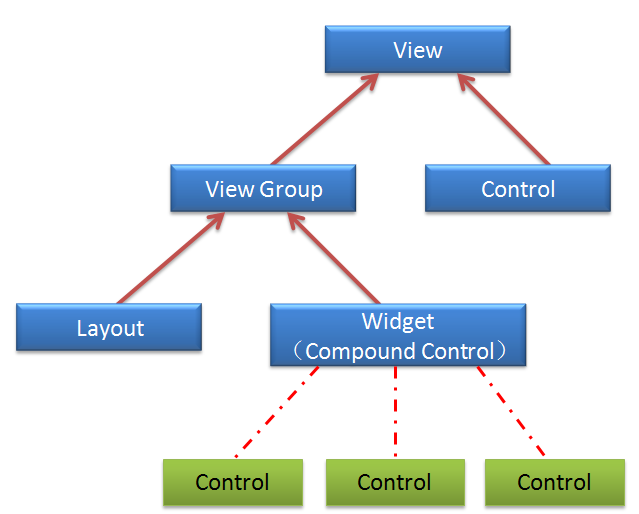
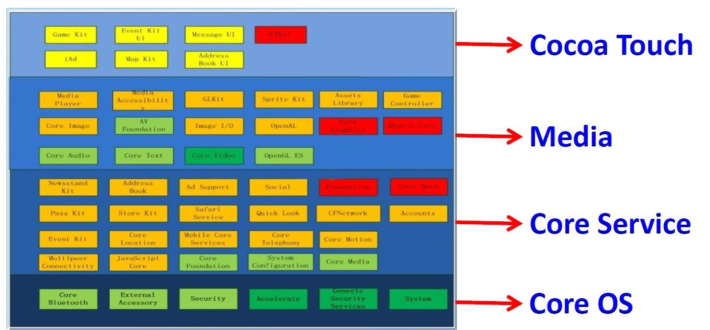

这是在学校上移动互联网技术的个人笔记。

之前有的笔记是以时间为章节的，如今看来这种设计实在是非常脑瘫，但是我懒得改了，原来的就那样吧。不过新的

 

### 目录

1. **<a href="#移动终端">移动终端</a>**
2. **<a href="#Android平台">Android平台</a>**
3. **<a href="#IOS平台">IOS平台</a>**

 

## <a id="移动终端">移动终端</a>

移动终端是

## <a id="Android平台">Android平台</a>

### 技术架构

### 开发环境

### 基本组件

Android APP由组件构成，组件之间的交互、通信通过Intent完成。

- Activity

  Android最核心的组件，表示应用程序的一个屏幕，其中的内容通常来自于View的派生类，但也可能不包含任何View。一个Android应用可以包含多个Activity，程序启动时呈现一个Activity，用于提示程序已经正常启动。Activity的布局可以通过导入XML文件设定。

  要创建一个Activity

  

  

  

- Service

  用于没有UI但需要长时间后台运行的应用。Service又分为本地Service和远程Service。

- Broadcast Recesiver

  接收通知信息

- Content Provider

  应用之间交互的接口

- View

  窗口组件，是Activity的重要组成，是Android UI的必备组件，而且任何Android的**可视化组件**都要从android.view.View类上继承。View组件

- Fragment

  将Activity碎片化的一个模板，是Activity的一个组成部分/行为，可以将多个Fragment组合到一个Activity，也可以在多个Activity中共享同一个Fragment。Fragment也具有UI的能力，事件处理的能力，也有自己的生命周期。虽然Fragment在许多功能上与Activity同级，但Fagment不能独立作为一个屏幕出现。

  //Fragment生命周期

  Fragment也有自己的布局文件。

             
图2.1 可视化组件
 

- Intent

  Intent用于在不同组件之间（实际上，就连系统事件对组件的通信也离不开Intent）传递信息。一般用来定义、描述某种动作的意图，描述某个将要执行的动作，并常常作为参数传递。使用Intent的常见场合包括启动Activity、Service、广播消息、显示网页、接听电话等。

  Intent的构成：

  - Action：要实施的动作，比如ACTION_VIEW。

  - Category：指定action执行环境（执行等级）。

  - Data：要操作的具体数据，一般由uri变量表示。

  - Type：显示地指定Intent的数据类型。一般数据类型会根据数据本身自行判定，但如果显示地设定该属性，就不会再额外判定其数据类型。

    *设置data时type会默认置为null，反之亦然。要同时设置二者，使用setDataAndType()*

  - Component：指定Intent的目标组件的类名。

  - Extras：附加信息的集合，可以传输更多的信息。

  Intent也分为显式/隐式使用。显式的Intent多用于内部组件间的消息传递，而隐式Intent多用于多个应用之间的交互。隐式Intent请求要传输给目标组件，需要匹配Action、Data及Category。如果这三要素有任何一个不同，则不会传递给对应的组件。

  

## <a id="IOS平台">IOS平台</a>

### IOS系统介绍

IOS是一个基于UNIX内核操作系统，但IOS是**微内核**的，只有进程调度、I/O管理之类的最基本功能由系统内核提供，像文件操作、图像管理、网络支持等都通过接口与微内核相连。

Cocoa Touch是IOS的运行时框架（实际上，Cocoa也是MAC的框架），不过更专注于屏幕触摸的接口和优化。

IOS的开发语言是Objective-C，只有手动内存回收。Objective-C是动态运行时的语言，是C语言的超集，将部分编译链接工作推迟到运行时，就像JVM那样。因此Objective-C也有一个类似的运行时：Objective-C Runtime。

#### IOS Framework

Framework

#### IOS开发框架

             
图3.1 IOS开发框架
 

- Cocoa Touch:

  开发IOS的关键框架。离用户最近的框架。