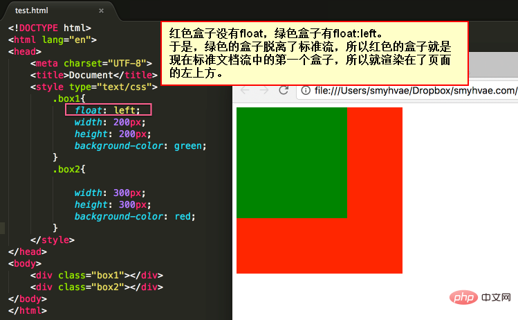
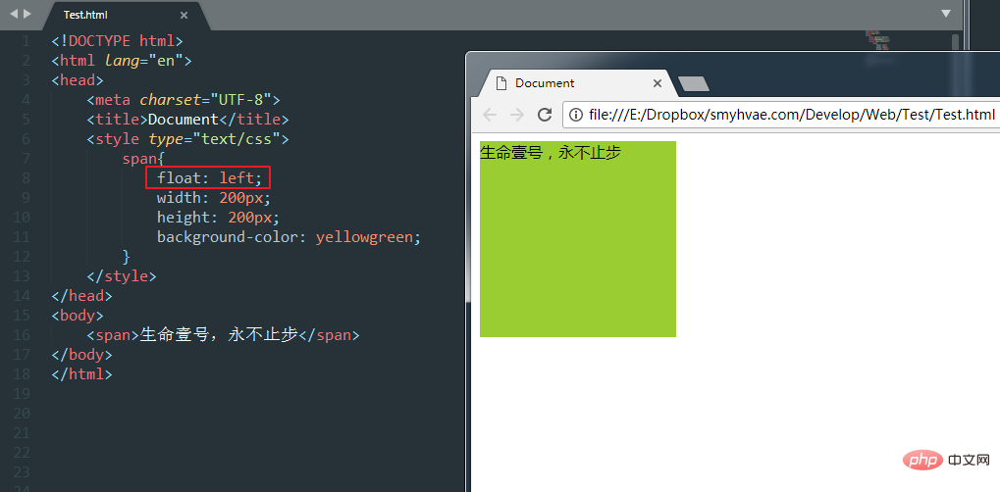
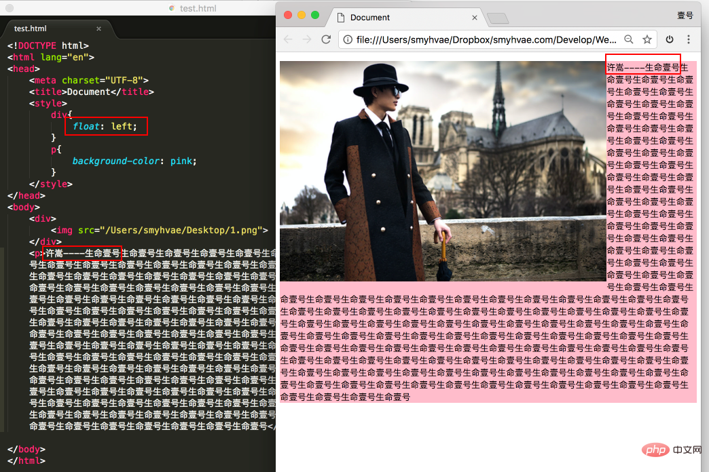
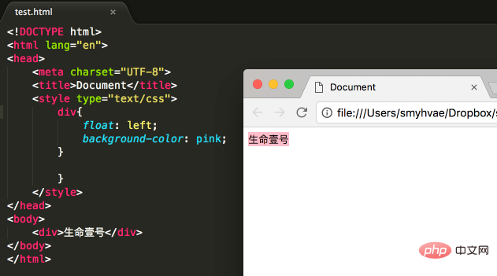

这是CSS的学习笔记。本笔记分为两部分内容：第一部分介绍CSS的用法，第二部分介绍CSS的设计理念和使用技巧。

*Last Update on 2021/09/07*

<br />

# 1. CSS用法

## 什么是CSS

Cascading Style Sheets，层叠样式表。Style定义了HTML元素显示的格式，通常存储在样式表中，外部样式表存储在**CSS文件**中。将样式Style抽离出HTML文件的外部，可以将内容与表现分离开来。这种思路大概也类似于MVC框架中把业务逻辑和视图分离的思想吧。多个样式表可以层叠为一个，这就是CSS的Cascading的来历。

>也有说法说，所谓”层叠“指的是多个CSS声明可以作用于同一标签，会按照优先级表现其属性。

## CSS基础语法

CSS的语法规则由两个部分组成：选择器，以及一条或多条声明。前者指明要对哪个HTML元素调整样式，后者由属性和值组成。属性是要调整的样式属性，值是对应属性的取值。每个属性-值对之后要加上分号。CSS声明用花括号`{}`括起来。

```css
selector
{
	property1:value1;
	property2:value2;
}
```

要添加注释，使用`/*`和`*/`将注释内容包含起来。注意，CSS不支持`//`注释。别跟C语言搞混了！

注意：有的属性的值存在单位，比如font-size属性。这样的属性的值其数字和单位之间**不得有空格**。

```CSS
h3
{
font-size: 25px;/* Yes */
font-size: 25 px/* No */
}
```

## 选择器的用法

首先介绍几类**基本**的选择器。

#### 元素选择器

也叫标签选择器。该选择器的效果是对特定种类的元素应用样式。元素选择器的格式很简单，即需要应用于其上的元素名称。

使用例：

```css
div {
    text-align: left;
}
```

上述声明将作用于所有div元素。

#### id选择器

选择具有特定id的元素，调整其样式。id选择器的格式是"#"加上对应该元素的id。

使用例：

```css
#ass {
	text-align: center;
    font-size: 10px;
}
```

上述声明将调整id为ass的元素的属性。

>坑：HTML 4中id不能以数字开头，而HTML 5中移除了这一条对id内容的限制。然而出于兼容性考虑，id最好还是不要设置为数字开头。

#### 类选择器

选择所有带有特定class属性的元素，调整其样式。类选择器的格式是"."加上类名。

使用例：

```css
.silly_class {
    color: red;
}
```

上述声明将作用于所有带`class = "silly_class"`属性的元素。

#### 通用选择器

使用`*`来匹配任何标签，调整所有标签的样式。通用选择器的效率很低（页面上的标签越多，越低），而且有些IE版本不支持。

使用例：

```css
*{
    margin-left:0px;
    margin-top:0px;
}
```

将作用于所有标签。

然后介绍几类高级的选择器：

#### 后代选择器

格式为`A B`。这样的选择器，表示所有属于A所指元素的子节点的B元素。注意，这里不要求A和B紧挨着。

使用例：

```css
.my_div span{
	color: red;
}
```

将作用于所有`class = ".my_div"`的元素内的span标签。

注：后代选择器可以组合使用，例如 A B C D表示位于A中的B中的C中的D标签。

##### 拓展：子元素选择器

如果想选择那些紧挨于A之内的B（换言之，A是B的父节点），可以写成`A>B`。这种选择器称为子元素选择器。使用子元素选择器时，可以在`>`两边引入空白符，不会造成歧义。

##### 拓展：相邻兄弟选择器

如果想选择紧挨在A之后的兄弟标签B（它们拥有相同的父元素），则可写成`A+B`。这将选择出紧挨在A之后出现的B，且A、B具有共同的父元素。如果A、B不相邻，即使是具有相同父标签的元素，也不会作用于其上。类似于子元素选择器，可以在`+`两边引入空白符而不造成歧义。

###### 再拓展：兄弟选择器

相邻兄弟选择器的要求是很严格的，要求必须是B是A的直接后继兄弟才能匹配。使用形如`A~B`的格式会选择跟在A后面匹配的所有兄弟元素。

#### 交集选择器

格式为`AB`。注意这里是不带空格的，带空格的话要考虑是不是识别成后代选择器。

交集选择器的效果是选择那些`A`和`B`都满足的标签。交集选择器可以连续交。

使用例：

```css
div.my_div{
    color: red;
}
```

将作用于所有`class = "my_div"`的div标签。类似地，也可以使用`A#id`的形式，但是由于id具有唯一性，已经足够标识元素了，所以往往没必要这么做。交集选择器更多的用法还是组合标签选择器和类选择器。

#### 并集选择器

格式为`A,B`。并集选择器可以连续并使用。并集选择器的效果想必不用说你也知道了，作用于任何满足其中之一的元素。

使用例：

```css
h2,div,.my_span{
    color: grey;
}
```

上述声明将作用于所有h2标签、div标签和`class="my_span"`的标签。

#### 属性选择器

格式为`A[attr]`。属性选择器在CSS2引入，效果是对具有属性attr的那些A的标签，应用其样式。也可设置A为空，这样讲对任意的具有attr属性的html元素应用样式。

使用例：

```css
.cls[title]{
	color:red;
}
```

上述声明将作用于那些`class = "cls"`且具有title属性的标签。可以将多个属性组合使用，表示选择那些同时具有多个属性的标签。格式为`A[attr1][attr2][attr3]`。

##### 拓展：属性筛选选择器

要想进一步筛选具有特定属性，且属性为特定值的元素，可以使用此类选择器，格式为`A[attr="value"]`。这样只会匹配具有attr属性且属性值为value的元素A。

要想比较灵活地根据属性值筛选元素，就要在属性值附近使用正则表达式。以下介绍了几种属性选择器的用法：

- `[attr~="value"]`:这种格式可以筛选出属性值包含value字段的那些元素。注意，这里的包含指的是属性值中**用空格分割**的数个单词，而其中有一个和value完全一致，而不是简单地正则匹配！
- `[attr*="value"]`:这种格式正是需要与上一个格式精确区别开的：只要属性值包含value字段（或者说存在子串与value一致），即可匹配。
- `[attr|="value"]`:这种格式筛选出具有属性名为attr且属性值以“value”或“value-"（即value + 连字符U+002D）为前缀的那些元素。与"^="类似，但多了对连字符的适配。
- `[attr^="value"]`:这种格式筛选出以attr命名的属性，且属性值以"value"开头的元素。与上一个区分开来，主要差别在于连字符。
- `[attr$="value"]`:这种格式筛选出以attr命名的属性，且属性值以"value"结尾的元素。提示：”^"代表开头匹配，”$“代表结尾匹配，这一点与正则表达式相同。

额外的”参数“：

* `[attr op value i]`:在属性选择器的最后添加一个空格隔开的i或I，表示匹配属性值时忽略大小写（ASCII范围内的字符都支持）。
* `[attr op value s]`:在属性选择器的最后添加一个空格隔开的s或S，表示匹配属性值时区分大小写（ASCII范围内的字符都支持）。不过，这个功能尚未得到普遍性的支持。不过也没关系，因为默认对属性的比较是考虑了ASCII字符的大小写的。

#### 伪类选择器

伪类选择器较为复杂。伪类选择器为元素定义了状态，可以使得元素在满足特定状态时才应用样式。”伪类“指的是CSS为html元素内置的一些特性，可以修饰**html元素的状态**。

伪类选择器对浏览器有较高的要求。如果对页面的兼容性有要求，就要考虑使用其他选择器了！

##### 动态伪类选择器

格式为`A:<伪类>`。其中，伪类link、visited**只适用于锚点**标签`<a>`。link表示元素尚未被访问，visited表示元素已被访问。

伪类active、hover和focus的用途更为广泛。active表示匹配的元素被激活时的状态，例如点击锚点（按住但未松开）；hover表示当鼠标指针悬停在匹配的元素上时的状态；focus表示光标聚焦于匹配的标签时的状态（例如聚焦于输入框）。

需要注意这几个伪类选择器存在优先级顺序。要防止某些标签被完全覆盖，需要按照如下顺序在css文件中撰写规则：

1. link
2. visited
3. hover
4. active

##### UI元素状态伪类选择器

这一类选择器可以修饰UI元素被选中、被激活的状态。格式同上，伪类checked用来匹配选中的单选按钮/复选按钮；伪类enabled用来匹配处于启用状态的元素（主要用于表单form元素），disabled类似，只是匹配处于禁用状态的元素。

>:thinking: IE6-8不兼容这三个伪类选择器！

##### 结构伪类选择器

结构伪类选择器修饰元素的状态，不过是根据目标元素在文档中的结构，也就是位置。

常用的结构伪类选择器：

* E:fisrt-child ：作为父元素的第一个子元素的元素E。与E:nth-child(1)等同。
* E:last-child ：作为父元素的最后一个子元素的元素E。与E:nth-last-child(1)等同。
* E:root：选择匹配元素E所在文档的根元素。在HTML文档中，根元素始终是html，此时该选择器与html类型选择器匹配的内容相同。
* E F:nth-child(n)：选择父元素E的第n个子元素F。其中括号内的n可以是整数（1，2，3...）、关键字（even，odd）、可以是公式（2n+1，注意此时n将从0开始逐次增加，应用于公式，计算得到的位置序号）。
* E F:nth-last-child(n)：选择父元素E的倒数第n个子元素F。此选择器与E:nth-child(n)选择器计算顺序刚好相反，但使用方法都是一样的，其中：nth-last-child(1)始终匹配最后一个元素，与last-child等同。
* E:nth-of-type(n) ：选择父元素内具有指定类型的第n个E元素。也就是说，只筛选那些E元素，将他们按位置标号并匹配。
* E:nth-last-of-type(n)：选择父元素内具有指定类型的倒数第n个E元素。
* E:first-of-type：选择父元素内具有指定类型的第一个E元素，与E:nth-of-type(1)等同。
* E:last-of-type ：选择父元素内具有指定类型的最后一个E元素，与E:nth-last-of-type(1)等同。
* E:only-child ：选择父元素只包含一个子元素，且该子元素匹配E元素。
* E:only-of-type：选择父元素只包含一个同类型子元素，且该子元素匹配E元素。
* E:empty： 选择没有子元素的元素，而且该元素也不包含任何文本节点。

对于像nth-child这样的伪类选择器，首先先找到当前元素的所有兄弟元素（与nth-of-type做区分，后者只会选择这些兄弟元素中满足目标类型的标签），按照位置先后顺序从1开始编号，然后再根据括号内的内容来匹配元素。例如E:nth-child(2n+1)会匹配作为父元素的**第奇数个子元素**且是E标签的元素。

>助记：结构伪类选择器主要分为两大类：nth-child 和 nth-of-type，他们的用法大同小异，记住他们的差异即可；除此之外，还有root选择根元素、only-child/only-of-type选择父元素中唯一的子元素，以及empty选择内部空荡荡的标签。

##### 否定伪类选择器

格式为`A:not(B)`，效果是匹配那些不满足B的A中元素。可以理解为集合的差运算。

使用例：

```css
input:not([type="submit"]){
    border:2px solid red;
}
```

上述规则将作用于所有type不为submit的input元素。

#### 伪元素

与伪类类似，伪元素的效果是对被选择元素的某**特定部分**调整样式。格式为`A::pseudo-element`。

切记：**伪元素并不能匹配任何真实存在的html元素**。

以下列出常用的伪元素：

- `::first-line`：可用于块级元素，为其第一行应用样式。在这样的一个选择器中，只有一部分和字体和背景有关的属性可以使用，例如font、font-style、font-family，background-color，word-spacing，text-shadow、text-transform等。
- `::first-letter`：可用于块级元素，选中其第一行的第一个字母，并且要求文字所处的行之前没有其他内容！

>按照规范，使用伪类时，使用一个冒号(:)，而使用伪元素时使用双冒号(::)，以区分二者。然而由于早期W3C规范（CSS 2.0）未对此作特别区分，目前大多数浏览器同时支持单冒号和双冒号来表示伪元素。不过，既然我记在这里，那当然还是想告诉读者：按照规范来比较好。
>
>除非项目强烈要求兼容老版本浏览器！

## 样式表的使用

将Style应用于html文件的方法有三种：

- 外部样式表

  在HTML页面的`<head>`标签中增加一个`<link>`单标签链接到样式表文件。如果某个样式要应用于多个页面，使用这个方法非常合适。只需要修改一个CSS文件，就可以同时将样式的变化应用于多个页面。上述的引入方式称为链接式，也可以写成`<style type="text/css">@import url("css文件路径");</style>`，这种方式称为导入式。

- 内部样式表

  在`<head>`标签中的`<style>`标签里写css的内容。

- 行内/内联样式表

  在标签内部增加style属性，其值为css语法的属性声明。这样的样式只会作用于该标签。

内联样式总是会覆盖外部样式表的任何样式，具有最高优先级！

## 属性继承和优先级计算

优先级，或者按照官方的说法，特殊性(specificity)，决定当样式发生冲突时的选择策略。默认情况下，html元素会从其祖先元素处继承某些样式/CSS规则，然而直接作用于元素的CSS规则会覆盖掉已经继承的规则。

>有的样式是**不会**被后代默认继承的，比如width、margins、padding、borders等。


还可以在CSS规则中为样式传入一个通用属性值。通用属性值有：

- inherit: 指定该属性与父元素一致，这也是大多数属性在不加显式的样式规则时的状态。
- initial: 设置属性为**浏览器默认样式**，如果浏览器默认样式中未设置其样式，且该属性默认是继承父标签的（或者说，**自然继承的**），则相当于设置为inherit。
- unset: 将属性重置为自然值。如果属性是自然继承的，则相当于inherit，否则相当于initial。
- revert: （较少浏览器支持）

如果某个CSS规则存在语法错误，则该CSS规则会被彻底忽略。

一个元素可能有多个匹配的样式。这时，具体应用哪一个样式，就要考虑他们的不同优先级。优先级是通过计算匹配的选择器中的每种选择器类型的权重来决定。如果多个声明具有相同优先级，**最后的声明**将会应用到元素上，否则就选择优先级较高的一个。

> 注意这里讨论的"覆盖"仅针对冲突的属性。如果有些属性没有冲突，则该规则的关于此属性的约束仍有效。

一般来说，优先级按照如下顺序递增：

1. 标签选择器
2. 类选择器
3. ID选择器

MDN给出的优先级的更精确的计算方式如下：

首先明确一点，**一个选择器的优先级**可以视为四个部分相加，以下将优先级记为一个四元组，其中从左到右权重由高到低，简记为千、百、十、个位（尽管实际上并不是真像十进制那样可以进位！）。如果高位较大，则该选择器优先级较高，高位相同才向下继续比较，类似于字符串比较。

优先级计算规则：

- 如果某个规则是内联的（也就是说，通过html标签的style属性声明），则千位+1。实际上千位也没有其他增加的方法。
- 选择器中包含ID选择器，则百位+1。
- 选择器中包含类选择器/属性选择器/伪类选择器，则十位+1。
- 选择器中包含元素/伪元素选择器，则个位+1。

注：通配符`*`、关系运算符`+, >, ~, ||`和**否定伪类**`:not()`对优先级**无影响**，但在`:not()`内声明的选择器会影响优先级。


除了一个例外：`!important`。


# 2. 网页设计技巧

本部分主要是在掌握了基本语法的基础上，学习设计样式的技巧。

## 一切皆盒子

设计CSS布局时，可以将html元素视为一个个嵌套的盒子。实际上，CSS布局就是基于盒子模型的，每个**占据页面空间的块**都具有如下属性：

- padding: 内边距，指盒子框与内容间的距离。

- border: 边框，紧接着将内边距和外边距分隔的线，也是盒子模型的框边界。

- margin: 外边距，盒子框与其他元素的距离。

  >margin实际上是一个简写属性，具体的属性包括margin-top/right/bottom/left，而margin可以接受多种输入：
  >
  >当margin属性只有1个值时，将同时应用于所有方向，如margin: 1em；
  >
  >当margin属性有2个值时，第一个值将应用于上下外边距，第二个值将应用于左右外边距，如margin: 5% auto；
  >
  >当margin属性有3个值时，第一个值将应用于上外边距，第二个值将应用于左右外边距，第三个值将应用于下外边距，如margin: 1em auto 2em；
  >
  >当margin属性有4个值时，4个值将按照顺时针顺序，分别作用域上/右/下/左外边距，如margin: 2px 1em 0 auto；
  >
  >此外，值得一提的是margin可接受的属性值的内容：
  >
  >length: 即固定值的边距，一般带单位，如1px，2em。长度为0时可以不带单位。
  >
  >percentage: 相对于父级块的宽度的百分比值，其计算结果作为外边距。
  >
  >auto: 让浏览器自己选择一个合适的外边距，常常可用来使元素居中。

- content area: 修饰内容区域的大小，实际上不存在这样一个属性，不过width、min-width、max-width等都是修饰内容区域尺寸的属性。

.png)

<center>        <br>    <div style="color:orange; border-bottom: 1px solid #d9d9d9;    display: inline-block;    color: #999;    padding: 2px;">块级元素的布局</div> </center>

## 元素的浮动布局

浮动布局是CSS布局中很常用的技巧，可以简化布局的操作，让元素脱离标准的CSS布局控制。

浮动布局可通过为选择器内增加float属性设置，float属性可以取值left/right/none。一个浮动元素（float取值不为none），无论之前是行内元素还是块级元素，一旦浮动，将会生成一个块级框。

设置浮动属性可以使元素向左/右移动，知道它的外边界碰到父元素的内边界或是其他浮动元素的外边界为止。

#### 浮动元素的性质

###### 脱离标准布局控制



<center>        <br>    <div style="color:orange; border-bottom: 1px solid #d9d9d9;    display: inline-block;    color: #999;    padding: 2px;">浮动元素脱离标准控制</div> </center>

正常情况下，div作为块级元素，会上下排列。但由于box1浮动，不受标准布局控制，因此在标准布局中只有一个box2，box2就位于左上方。而box1会一直向左，直到遇到了父元素的内边界。不仅如此，正如上文中所言，浮动元素一定会具有一个块级框。例如：



<center>        <br>    <div style="color:orange; border-bottom: 1px solid #d9d9d9;    display: inline-block;    color: #999;    padding: 2px;">浮动元素的块级框</div> </center>

span本来是行级元素，不能设置宽、高，但一旦浮动起来，就可以设置宽、高和背景颜色了！

###### 浮动元素的字围效果

浮动元素可能位于非浮动元素之上，尽管如此，浮动元素不会将非浮动元素中的文字遮挡住。



<center>        <br>    <div style="color:orange; border-bottom: 1px solid #d9d9d9;    display: inline-block;    color: #999;    padding: 2px;">浮动元素的字围效果</div> </center>

###### 浮动元素的收缩

一个浮动的元素若不设置width属性，则将自动收缩为内容的宽度（尽管该元素可能原本是块级元素！）。



<center>        <br>    <div style="color:orange; border-bottom: 1px solid #d9d9d9;    display: inline-block;    color: #999;    padding: 2px;">浮动元素的收缩</div> </center>

###### 浮动元素的贴靠

浮动元素会贴靠到该方向上的边界或是其他浮动元素的边界，只要空间允许，它们可以一直贴着堆放，直到一整行填满，然后换到下一行。


<center>        <br>    <div style="color:orange; border-bottom: 1px solid #d9d9d9;    display: inline-block;    color: #999;    padding: 2px;">浮动元素的贴靠</div> </center>

#### 清除浮动

可以为浮动元素/非浮动元素的样式指定clear属性，来向下移动以清除之前的浮动，这将使其移动到在它之前的浮动元素的下方。clear的可取值包括none/left/right/both。

clear应用于非浮动元素时，将非浮动块的边框移动到所有相关的浮动元素外边框边界的下方，而且**这个非浮动块的垂直外边距会被折叠**。应用于浮动元素时，垂直外边距将不会被折叠。

## 关于文件命名的格式

许多计算机、服务器对大小写敏感的，这一点无须多言了。由于有些系统会将包含空格的文件名视为两个文件，有的服务器会将文件名中的空格替换为`%20`，故最好文件名中不要带空格。

要分隔单词，习惯于编程语言的人可能会使用下划线，但在网页开发中，为文件命名时，这不是一个好的习惯。搜索引擎（比如Google）将连字符当作单词的分隔符，但下划线并不是。

总而言之，为文件/文件夹命名时，避免使用空格和下划线，使用连字符`-`来分割单词，并注意大小写敏感。

## 定义规则的技巧

为了最大程度避免CSS的重复，可以活用不同优先级规则的继承关系。例如，如果想要为不同的h2标题定义CSS规则，可以先定义一个标签选择器，其中定义一些共性的属性，这个规则的优先级较低；然后为每个需要特化的标题增加class属性，在CSS文件中，使用类选择器来特化不同类标题的样式（注意这时只要把从标签选择器继承而来的规则进行修改即可）。

这不就类似于面向对象编程语言对类和继承的概念抽象吗？

