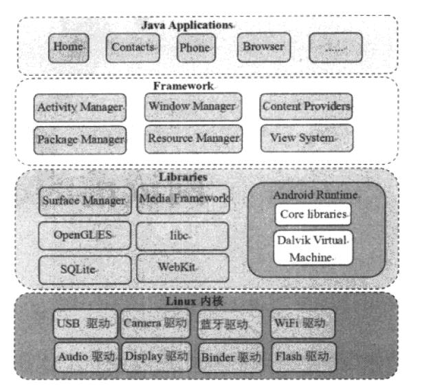
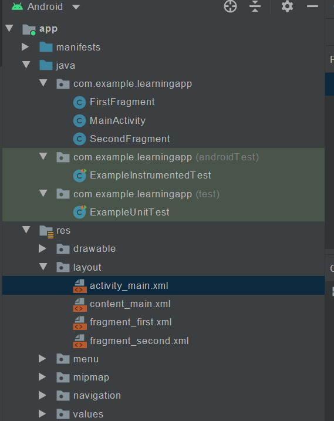
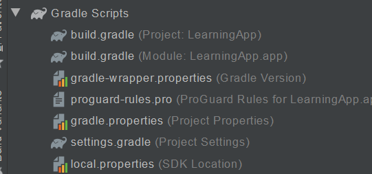

这是安卓系统的学习笔记。

1. **<a href="#Android基础">Android基础</a>**
2. **<a href="#使用AndroidStudio开发应用">使用AndroidStudio开发应用</a>**
3. **<a href="#Kotlin">Kotlin</a>**

## <a id="Android基础">Android基础</a>

要编写适用于Android的应用，可以使用Kotlin、Java或C++。Android SDK将代码、资源文件等编译成APK格式，包含一个Android应用的全部内容，Android设备通过其安装应用。

以下内容来自google的android developer官方文档：

> - Android 操作系统是一种多用户 Linux 系统，其中的**每个应用都是一个不同的用户**；
> - 默认情况下，系统会为每个应用分配一个唯一的 Linux 用户 ID（该 ID 仅由系统使用，应用并不知晓）。系统会为应用中的所有文件设置权限，使得只有分配给该应用的用户 ID 才能访问这些文件；
> - 每个进程都拥有自己的虚拟机 (VM)，因此**应用代码独立于其他应用**而运行。
> - 默认情况下，每个应用都在其自己的 Linux 进程内运行。Android 系统会在需要执行任何应用组件时启动该进程，然后当不再需要该进程或系统必须为其他应用恢复内存时，其便会关闭该进程。

Android系统采用最小权限原则：默认情况下每个应用只能访问其工作所需的组件，只能拥有其需要的最小许可等级，对于其他组件则无法访问，这保证了应用环境的安全。但是应用可以使用一些途径与其他应用共享数据：

- 为两个应用共享同一个Linux用户ID，这样二者可以访问彼此的文件。还可以安排拥有相同用户ID的应用在同一Linux进程中运行并共享同一VM（但这样的应用必须使用相同的证书进行签名）。此法可以节省系统资源。

- 应用请求访问设备数据（联系人、短信、存储、相机等），也就是我们经常会在使用应用时，突然弹出的那玩意儿：

  <center>        <br>    <div style="color:orange; border-bottom: 1px solid #d9d9d9;    display: inline-block;    color: #999;    padding: 2px;">请求位置</div> </center>
  
  

### 应用组件

Android应用的基本构建组件。**每个组件都是一个入口点**，系统/用户可以通过该入口点进入应用。有些组件之间也存在依赖。

共有4种不同的组件类型。

#### Activity

Acitivity是与用户交互的入口，表示拥有界面的单个屏幕。例如，电子邮件应用可能有一个显示新电子邮件列表的Activity、一个用于撰写电子邮件的 Activity 以及一个用于阅读电子邮件的 Activity。尽管这些 Activity 通过协作在电子邮件应用中形成一种紧密结合的用户体验，但每个 Activity 都独立于其他 Activity 而存在。

要使用Activity，创建Activity的子类即可。

#### Service

服务是一个通用入口点，用于因各种原因使应用在后台保持运行状态。Service是一种在后台运行的组件，用于执行长时间运行的操作，或者为远程的进程执行作业，Service与界面不太相关。例如当用户使用其他应用时，Service可能用于后台播放音乐，或者从网络获取数据。

像Activity这样的组件可以启动Service，使之运行，或者**绑定**到该Service。Service可大致分为已启动服务和绑定服务两类。已启动服务会告知系统使之运行至工作完毕，已启动服务甚至也可分为2种，像音乐播放器这样的用户可以直接感知的服务，应用会像用户发送通知，表明其希望成为前台，从而告诉系统此消息。如果系统不尽力维持其运行，该进程消失会让用户有明显的感知（举例来说，打开网易云之后，通知栏上会显示它的状态）；而大多数已启动服务是不被用户所感知到的，这就允许系统更加自由地管理这些进程。如果系统需要贮存处理用户更关注的内容，其可能会终止某些服务，然后在某些时候重启服务。

另一种服务是绑定服务，绑定的服务表明已有其他应用希望使用该服务，这相当于为另一个进程提供API的服务，因此系统会了解到进程之间的依赖关系。例如，如果A进程绑定到进程B中的服务，系统便知道为了保证A的正常运行，也需要使B进入运行状态。

#### BroadReciever


#### ContentProvider


### Android系统架构

Android的系统架构可大致分为4层：

<center>        <br>    <div style="color:orange; border-bottom: 1px solid #d9d9d9;    display: inline-block;    color: #999;    padding: 2px;">Android 系统架构</div> </center>



从下往上依次是：

- Linux内核层：包含了Linux内核和一些驱动模块。
- 类库层：提供Android运行时库、动态库、Dalvik虚拟机等。这一层大部分是C/C++的，所以也可以视为Native层。
- 应用程序框架层：大部分由Java语言编写，是Android平台上Java程序的基石。
- 应用程序层：包含Android自带的核心应用程序，比如日历、浏览器...所有与用户直接交互的应用程序都属于这一层。开发者编写的应用程序也处于这一层。

### 图形用户界面

Android的GUI由多个视图View和视图组VIewGroup构建而成。View包括通用的UI窗体小组件，如Button、Textfield等，ViewGroup则是用来定义子视图布局的不可见的container，如网格部件grid、垂直列表部件vertical list。要在布局文件中设计布局，可以使用Android提供了一系列对应于View/ViewGroup子类的XML标签，方便我们用XML创建UI。

>值得一提的是，使用XML布局文件，可以为系统指明，在不同类型的设备上使用不同布局，例如小屏幕使用一个布局，大屏幕使用一个布局。

## <a id="使用AndroidStudio开发应用">使用AndroidStudio开发应用</a>

AndroidStudio也是Jet Brains系的IDE，熟悉IDEA的话很快就会习惯。

### 项目目录

下面介绍一下项目目录中的重要内容。

在project窗口顶部的下拉列表里选择Android视图，可以看到源文件的包结构，以及资源文件的包结构。

<center>        <br>    <div style="color:orange; border-bottom: 1px solid #d9d9d9;    display: inline-block;    color: #999;    padding: 2px;">Android Studio 工程目录</div> </center>



在app/Manifests目录下找到AndroidManifest.xml文件，它描述了项目的基本特征，并列出了组成应用的各个组件。

在项目结构目录底端还有Gradle脚本：

<center>        <br>    <div style="color:orange; border-bottom: 1px solid #d9d9d9;    display: inline-block;    color: #999;    padding: 2px;">Gradle目录</div> </center>



Gradle用来自动化地编译运行Android工程，一个project有一个build.gradle文件，而且工程的每个模块还有自己的build.gradle文件，通常存储一些编译依赖设置：

```groovy
plugins {
    id 'com.android.application'
}

android {
    compileSdkVersion 30
    buildToolsVersion "30.0.2"

    defaultConfig {
        applicationId "com.example.learningapp"
        minSdkVersion 26
        targetSdkVersion 30
        versionCode 1
        versionName "1.0"

        testInstrumentationRunner "androidx.test.runner.AndroidJUnitRunner"
    }

    buildTypes {
        release {
            minifyEnabled false
            proguardFiles getDefaultProguardFile('proguard-android-optimize.txt'), 'proguard-rules.pro'
        }
    }
    compileOptions {
        sourceCompatibility JavaVersion.VERSION_1_8
        targetCompatibility JavaVersion.VERSION_1_8
    }
}

dependencies {

    implementation 'androidx.appcompat:appcompat:1.2.0'
    implementation 'com.google.android.material:material:1.2.1'
    implementation 'androidx.constraintlayout:constraintlayout:2.0.2'
    implementation 'androidx.navigation:navigation-fragment:2.2.2'
    implementation 'androidx.navigation:navigation-ui:2.2.2'
    testImplementation 'junit:junit:4.+'
    androidTestImplementation 'androidx.test.ext:junit:1.1.2'
    androidTestImplementation 'androidx.test.espresso:espresso-core:3.3.0'
}
```

以模块的build.gradle为例（主project的build.gradle是用来添加适用于所有子工程/模块的配置的)：

注意看，android

- compiledSdkVersion 是我们的应用将要编译的目标Android版本。
- applicationId 创建新项目时指定的包名。
- minSdkVersion 创建项目时指定的最低SDK版本，是新建应用支持的最低SDK版本。
- targetSdkVersion 表示你测试过你的应用支持的最高Android版本(同样用API level表示).当Android发布最新版本后，我们应该在最新版本的Android测试自己的应用同时更新target sdk到Android最新版本，以便充分利用Android新版本的特性。

Gradle的使用教程见<a href="#Gradle">这里</a>。

res目录下的资源结构分为：

- drawable：存放各种densities图像的文件夹，还有应用运行时的图标文件。
- layout：存放界面布局文件。
- menu：存放应用里定义菜单项的文件。
- values：存放其他xml资源文件，比如string、color定义。

### <a id="Gradle">Gradle</a>

Gradle是Android非常非常主流的构建工具。

在Gradle中，存在着一系列Gradle的执行单元，称为Task。可以通过

```groovy
task myTask{
	println "wtf"
}
```

task关键字来定义。注意，这样定义的task会在配置阶段执行，执行任何一个task，该代码都会执行。如果希望编写特定task时才会执行的代码，可以通过task.doFirst、task.doLast来执行，分别表示当task执行时最开始的操作和最后的操作。

```groovy
// 定义并配置myTask
task myTask {
    println "config myTask"
}

myTask.doLast {
    println "after execute myTask"
}

myTask.doFirst {
    println "before execute myTask"
}
//output
config myTask
:app:myTask
before execute myTask
after execute myTask
```

其中doLast还有等价的操作leftShift，leftShift还可缩写为<<，因此以下三种实现是相同的：

```groovy
myTask.doLast {
    println "after execute myTask"
}

myTask.leftShift {
    println "after execute myTask"
}

myTask << {
    println "after execute myTask"
}
```


#### Groovy

Groovy的官方API文档：http://www.groovy-lang.org/api.html

Groovy是一门JVM语言，最终目的是编译成中间文件.class，然后在JVM上运行，功能强大，支持Java语言的特性。

在Groovy中，可以通过关键字def声明变量和方法。

```groovy
def a = 1;
def bb = "motherfucker";
def wtf(){
	println("whats ur problem?");
	return 1;
}
```

然而，语句后的分号是可省略的，变量的类型/方法的返回值类型也可以省略，方法调用时的括号也是可以省略的（参数列表外面的括号可省），甚至return 关键字也是可省的。

Groovy允许动态推断类型，但注意，Groovy仍然是强类型的，不匹配类型会报错。Groovy的注释规则与java一致。

Groovy中的数据类型：

1. Java基本数据类型
2. Java中的对象（Gradle中对象的默认修饰符为public，注意！）
3. Closure，闭包
4. 加强的集合类型（List/Map等）
5. 加强的IO类型（File、Stream等）
6. Class类型（单独列出，因为Groovy中，Class类型可以省略.class)

可以显示声明类型，也可以用def声明，表明希望Groovy进行类型推断。

Groovy中值得一提的是闭包类型，类似于C中的函数指针，是一种特殊的数据类型。要声明一个闭包，使用

```groovy
{parameters ->
	code
}
```

闭包可以有返回值和参数。

```groovy
def closure = { int a, String b ->
   println "a=${a}, b=${b}, I am a closure!"
}
 
// 这里省略了闭包的参数类型
def test = { a, b ->
   println "a=${a}, b=${b}, I am a closure!"
}

closure(100, 200)
test.call(100, 200)
def c = ryg(100,200)
println c
```

可以像使用函数那般使用闭包。

如果闭包不指定参数，则默认会有一个隐含的参数“it”。如果调用时传入了一个参数，那么it会被赋值为该参数的值。

```groovy
def test = {
   println "find ${it}, I am a closure!"
}
test(100)
 
outputs:
find 100, I am a closure! 
```

另外值得一提的是List/Map。

```groovy
def emptyList = [] 
def test = [100, "hello", true]
test[1] = "world"
println test[0]
println test[1]
test << 200
println test.size

outputs:
100
world
4
```

看起来简直就像python！Groovy List重载了左移运算符，表示向List中添加新元素到末尾。

Map操作就更离谱了：

```groovy
def emptyMap = [:]
def test = ["id":1, "name":"asshole", "isMale":true]
test["id"] = 2
test.id = 900
println test.id
println test.isMale
 
outputs:
900
true
```

可以像index那样使用Map，可以像成员变量那样使用Map！

强化的IO也很值得关注。

在Groovy中，一个类如果有属性，则会默认添加一个关联其的Getter和Setter。

```groovy
class Book {
   private String name
   String getName() { return name }
   void setName(String name) { this.name = name }
}
 
class Book {
   String name
}
```

技巧：

Groovy中可以使用with操作符，来方便地对同一个对象进行操作。

```groovy
Book bk = new Book()
bk.id = 1
bk.name = "android art"
bk.press = "china press"
 
//可以简写为：
Book bk = new Book() 
bk.with {
   id = 1
   name = "android art"
   press = "china press"
}
```

Groovy中，允许像C那样，将null和非0数直接视为布尔假值，比Java灵活。

特殊的三元运算符：在java中常常要判断一个变量是否非空，如果非空才能赋值给另一个变量，否则赋值给其一个缺省值。Groovy针对这种情况进行了特化：

```groovy
def result = name != null ? name : "Unknown"
 
// 省略了name
def result = name ?: "Unknown"
```

特殊的非空判断：类似地，要判断一个变量是否非null，在Groovy中可以使用?。

```groovy
if (order != null) {
   if (order.getCustomer() != null) {
       if (order.getCustomer().getAddress() != null) {
       System.out.println(order.getCustomer().getAddress());
       }
   }
}
 
//可以简写为：
println order?.customer?.address
```

特殊的判断相等：

Groovy中重载==运算符，==直接表示Java的equals方法。如果要比较两个对象是否对应同一个内存空间，使用.is()。

```groovy
Object a = new Object()
Object b = a.clone()
 
assert a == b
assert !a.is(b)
```


## <a id="Kotlin">Kotlin</a>

