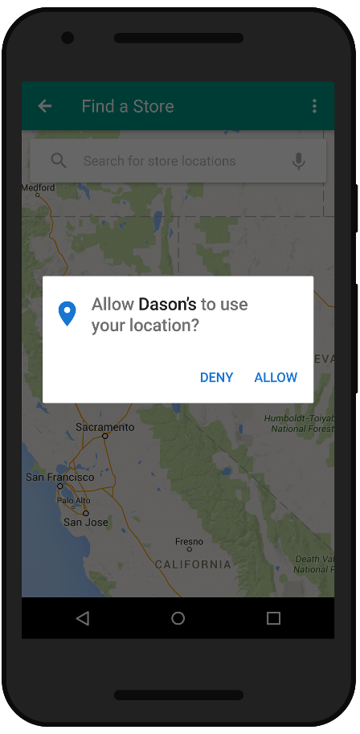

1. **<a href="#Android基础">Android基础</a>**
2. **<a href="#使用AndroidStudio开发应用">使用AndroidStudio开发应用</a>**
3. **<a href="#Kotlin">Kotlin</a>**

## <a id="Android基础">Android基础</a>

以下内容来自google的android developer官方文档：

> - Android 操作系统是一种多用户 Linux 系统，其中的**每个应用都是一个不同的用户**；
> - 默认情况下，系统会为每个应用分配一个唯一的 Linux 用户 ID（该 ID 仅由系统使用，应用并不知晓）。系统会为应用中的所有文件设置权限，使得只有分配给该应用的用户 ID 才能访问这些文件；
> - 每个进程都拥有自己的虚拟机 (VM)，因此**应用代码独立于其他应用**而运行。
> - 默认情况下，每个应用都在其自己的 Linux 进程内运行。Android 系统会在需要执行任何应用组件时启动该进程，然后当不再需要该进程或系统必须为其他应用恢复内存时，其便会关闭该进程。

Android系统采用最小权限原则：默认情况下每个应用只能访问其工作所需的组件，只能拥有其需要的最小许可等级，对于其他组件则无法访问，这保证了应用环境的安全。但是应用可以使用一些途径与其他应用共享数据：

- 为两个应用共享同一个Linux用户ID，这样二者可以访问彼此的文件。还可以安排拥有相同用户ID的应用在同一Linux进程中运行并共享同一VM（但这样的应用必须使用相同的证书进行签名）。此法可以节省系统资源。

- 应用请求访问设备数据（联系人、短信、存储、相机等），也就是我们经常会在使用应用时，突然弹出的那玩意儿：

  

## <a id="使用AndroidStudio开发应用">使用AndroidStudio开发应用</a>

AndroidStudio也是Jet Brains系的IDE，熟悉IDEA的话很快就会习惯。

### 项目目录

下面介绍一下项目目录中的重要内容。

在project窗口顶部的下拉列表里选择Android视图，

## <a id="Kotlin">Kotlin</a>

