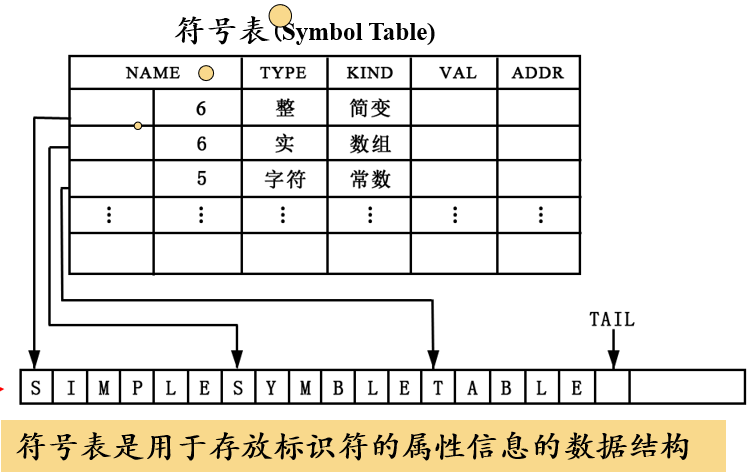

这是编译系统的学习笔记。

# 紧急：讨论题1

编译的过程也可以看作是一种翻译的过程，只不过翻译的源语言是高级语言，目标语言是机器语言/汇编语言。

编译的过程需要进行词法分析、语法分析和语义分析，对应于人工翻译的对源语言句子的分析过程，都会得到语言无关的中间代码（对应着人工翻译中的语义），然后根据中间产物生成目标语言（对应于人工翻译中根据语义的造句）。

1. **<a href="#1">计算机程序设计语言</a>**
	
	<a href="#1.1">1.1 编译系统的结构</a>
	
	<a href="#1.2">1.2 词法分析概述</a>
	
	<a href="#1.3">1.3 语法分析概述</a>	
	
	<a href="#1.4">1.4 语义分析概述</a>
	
	<a href="#1.5">1.5 中间代码生成以及编译器后端</a>
	
	<a href="#1.6">1.6 T型图</a>
	
2. **<a href="#2">程序设计语言及文法</a>**
	
	<a href="#2.1">2.1 基础概念</a>
	
	<a href="#2.2">2.2 技巧：推导和规约</a>
	
	<a href="#2.3">2.3 文法分类</a>
	
3. **<a href="#3">词法分析</a>**
	
	<a href="#3.1">3.1 基础概念</a>
	
	<a href="#3.2">3.2 正则定义</a>
	
	<a href="#3.3">3.3 有穷自动机</a>
	
4. **<a href="#4">语法分析</a>**

	<a href="#4.1">4.1 自顶向下分析</a>
	
	<a href="#4.2">4.2 文法转换</a>
	
	<a href="#4.3">4.3 LL(1)文法</a>

## <a id='1'>1. 计算机程序设计语言</a>

计算机程序设计语言的三个层次：

1. 机器语言：可以被计算机直接理解，但难以被人理解和记忆。
2. 汇编语言：在机器语言的基础上引入助记符，相对机器语言更直观，但依赖于特定机器。
3. 高级语言：以类似自然语言/数学定义的形式，更接近人类思维。

将汇编语言程序转变成机器语言的过程称为汇编，**将高级语言程序转变成汇编语言/机器语言的过程称为编译。**此处前者称为源语言，后者称为目标语言。

             
图1.1 编译程序的过程
 

预处理的职能在于将不同源程序聚合在一起，并解析宏定义，而所谓可重定位（Relocatable）指的是程序在内存中存放的起始位置不固定。链接器负责将多个可重定位的机器代码文件和库文件连接到一起，解决了外部的内存地址问题。

### <a id = '1.1'>1.1 编译系统的结构</a>

编译系统做的，实际上是将高级语言翻译成抽象层度较低的语言这一任务。以语言翻译为例，把源语言翻译成一种目标语言有几个关键步骤：

1. 对源语言句子进行**词法分析(Lexical Analysis)**，确定词性（例如名词、动词、介词...）；
2. 在知道词性的基础上，对源语言句子进行**语法分析(Syntax Analysis)**，划分句子的成分（识别各类短语，比如名词短语、动宾短语...）；
3. 在划分成分的基础上，对源语言句子进行**语义分析(Semantic Analysis)**，获得句子的语义（分析出各个短语在句子中的成分，例如某个代词做主语，某个名词短语做宾语，某个介词短语做状语...）。

             
图1.2 编译器的结构
 

编译器的前4个阶段称为前端，只与源语言相关，后两个阶段则只与目标语言相关，称为后端。中间的机器无关代码生成过程与2者都不直接相关。具体的实现中，可在语法分析基础上直接进行语义分析，还可将分析结果直接表示成中间代码，因此语法分析、语义分析和生成中间代码的过程常常合而为一。

### <a id="1.2">1.2 词法分析概述</a>

词法分析的任务从左向右，逐行扫描源程序的内容，识别出各个单词，确定单词的类型，并将识别出的单元转化为统一的机内表示——词法单元(token)。

token是一个二元组，由**种别码**和**属性值**构成。

种别码表示token的类型。在程序设计语言中，词类大体上分为以下五类：

             
图1.3 单词类型和种别码
 

对于每种特定的程序设计语言，关键字集合是事先确定的，因此为每种关键字设定一个种别码；而标识符不能事先确定，所有的标识符都归为同一个种别码，通过token的第二个元素：属性值来区分具体的类型，因为属性值存放着token的具体字面值。

常量类似于标识符，也是开放的、无法枚举的集合，但**不同类型的常量的构成方式不同**，故而每种类型的常量分配一个种别码同样用token的属性值来存放字面值，以区分不同常量。

运算符和界限符与关键字类似，因此可以分配成一词一码。也可以把运算符划分成不同类型，不同类型下再根据属性值划分，不过都差不多就是了。

### <a id="1.3">1.3 语法分析概述</a>

语法分析的任务是：从词法分析器输出的token序列中识别出各类短语，构造语法分析树**（parse tree）**。

             
图1.4 语法分析示例
 

### <a id="1.4">1.4 语义分析概述</a>

程序设计语言中的语句主要分为声明语句/可执行语句。

语义分析的任务是：收集标识符的属性信息——种属Kind（简单变量or复杂变量or过程？）、类型Type（int？char？int *？）、存储位置和占用长度、值、作用域、参数和返回值信息（对于过程而言）等。

这些标识符的属性信息会被存放到**符号表（Symbol Table）**中。具体实现中，符号表往往带有一个字符串表来存放所有标识符的名称属性，因此Name部分往往实现为一个字符串表中的起始位置和一个长度值，这样就能在字符串表中索引到名称。

             
图1.5 符号表
 

语义分析的另一个任务是语义检查，检查语义的错误并作出响应。例如重复的变量声明、未经声明就使用、运算分量不匹配等。

### <a id="1.5">1.5 中间代码生成以及编译器后端</a>

源程序的中间表示可以有多种形式，例如三地址码（类似于汇编语言的指令序列，每个指令至多由三个操作数）和语法结构树（Syntax Tree）（注：语法树和语法分析树不是一样的东西）。

             
图1.6 三地址指令示例
 

值得注意的部分：

①之所以可以使用变量名/常量等（即源程序中的标识符）作为地址，是因为他们的地址都在符号表存好了。

②条件跳转指令只有x和y满足relop时才会跳转到对应地址。

③param x表示将x设为参数。

④过程调用的操作中，p为过程的地址，n为参数的个数。

⑤过程返回语句表示返回到对应地址。

⑥数组操作中，x表示数组的基地址，i表示**偏移地址**，而不是下标！

三地址指令的表示也有几种形式：

1. 四元式：(op, y, z, x)。注意，第一个元素为操作符，第二个、第三个元素分别为源操作数，第四个元素对应目标操作数。因此(op,y, z, x)相当于x = y op z。类似地，(op, y, _, x)表示 x = op y，(=, y,  _, x)表示x = y。
2. 三元式
3. 间接三元式

### <a id="1.6">1.6 T型图</a>

可以使用T型图来表示编译器。

             
图1.7 T型图
 

如图所示，P表示该编译器，T型图的顶部表示编译器的功能，其中S为源语言程序，T为目标语言程序。I表示编译器的底层实现语言。

## <a id="2">2. 程序设计语言及文法</a>

### <a id="2.1">2.1 基本概念</a>

字母表$\Sigma$表示一个**有穷**符号集合。这里的符号可以是字母、数字、标点符号...等等。以下给出一些字母表上的运算：

1. 乘积：$\Sigma_1\Sigma_2 = \{ab\|a\in\Sigma_1, b\in\Sigma_2\}$
2. 幂：$$ \begin{cases} \begin{aligned}\Sigma^0 &= \{\epsilon\}\\ \Sigma^n &= \Sigma^{n-1}\Sigma, n\ge1\end{aligned} \end{cases}$$也即长度为n的符号串的集合。
3. 正闭包：$\Sigma^+ = \Sigma \cup \Sigma^2 \cup \Sigma^3 \cdots$也即长度为正数的符号串之集合。
4. 克林闭包：$\Sigma^\star = \Sigma^0 \cup \Sigma \cup \Sigma^2 \cup \Sigma^3 \cdots$

假设$\Sigma$是一个字母表，对于$\forall x \in \Sigma^\star$，x称为$\Sigma$上的一个串。串的长度记作$\|x\|$，表示s中符号的个数。串上支持的运算如下（以下示例中x，y，z，s均为串）：

1. 连接：$xy$表示将y附加到x之后形成的新串。注：空串$\epsilon$是任意串对于连接运算的单位元。如果x = yz，则称y是x的前缀，z是x的后缀。
2. 幂：把串上的连接运算看作一种乘积，则幂运算可以看作累积的连接。$$ \begin{cases}\begin{aligned}s^0 &= \epsilon \\ s^n &= s^{n-1}s, n\ge 1 \end{aligned} \end{cases} $$

语言是一系列特定**句子**的集合，而**文法**表示一种语言的句子的构成规则。文法的形式化定义如下：

$G = (V_T,V_N,P,S)$表示一个文法G，其中$V_T$表示终结符集合，是文法所定义的基本符号，有时也称为token。顾名思义，终结符是不能再衍生的，是句型拓展的终结点。$V_N$表示文法的非终结符集合，也称为语法成分/语法变量。例如$V_N$可能包含<句子>、<名词短语>...非终结符是文法推导的关键。

$P$表示产生式集合，描述了将终结符/非终结符组合成串的方法。一般形式为$\alpha\rightarrow \beta$，读作“alpha定义为beta”。其中**$\alpha \in (V_T \cup V_N)^+$且$\alpha$中至少包含一个非终结符**，策划归纳为产生式的左部/头。$\beta \in (V_T \cup V_N)^\star$称为产生式的右部/体。如果一系列产生式有相同的左部，则可以将他们的右部写在一起，用“\|”分割，这时这些右部又叫做候选式。

$S$表示开始符号。开始符号是文法推导的起点，是非终结符集合的元素之一，是涵盖范围最大的语法成分。

**注意，一般场合下采用如下的符号规定：**

1. 使用排在开头的小写英文字母表示**终结符**，例如a, b, c，运算符、标点、数字和加粗的字符串（如**id**）也视为终结符。
2. 使用字母表排在前面的大写英文字母表示**非终结符**，例如A, B, C。除此之外，通常用大写字母S表示开始符号，使用小谢斜体的名词表示特定的非终结符，如*expr*，以及代表程序构造的大写字母（如E、T、F）
3. 使用字母表排在后面的大写字母表示**文法符号**（既可以表示终结符，又可以表示非终结符），例如X, Y, Z。
4. 使用字母表排在后面的小写字母表示**终结符号串**，例如x, y, z。
5. 使用小写希腊字母表示**文法符号串**，例如$\alpha$。
6. 除非特别说明，否则第一个产生式的头即为开始符号。

#### <a id="2.2">2.2 技巧：推导和规约</a>

推导Derivations是利用给定文法的产生式，用产生式的右部替换左部。例如如果$\alpha \rightarrow \beta \in P$，$\gamma\alpha\delta$就可以写成$\gamma\beta\delta$，也称作前者可以直接推导出后者。也可记作$\gamma\alpha\beta\implies\gamma\beta\delta$。

如果$\alpha_0$可以经过n步推导得到$\alpha_n$，则可记为$\alpha_0\implies^n\alpha_n$。注意$\alpha\implies^0\alpha$，$\implies^+$表示经过正数步推导，$\implies^\star$表示经过若干步推导。如果一个符号串可以由文法的开始符号推导而得到，则证明该符号串满足此文法。

根据推导替换的非终结符不同，推导还可分为最左推导（每一步替换最左边的非终结符）和最右推导（与之对应）。

而规约Redution则与推导相反，使用产生式的左部来尝试替换右部，如果最后可以归约到文法的开始符号，则证明该符号串满足此文法。

推导和规约从生成和识别两个角度来判别一个句子是否属于某个文法的范畴。

如果$ S\implies^\star \alpha $，且$ \alpha \in (V_T \cup V_N)^\star $，则认为$ \alpha $是G的一个**句型**。注意句型可以包括非终结字符，也可以包括终结字符，甚至可以是空串。

如果$ S\implies^\star w $，且$ w \in {V_T}^\star $，则称w是G的一个**句子**。句子是不包含非终结符的句型。

由文法G的开始符号推导出的所有句子的集合称为文法G生成的**语言**。记作L(G)。

语言支持的运算如下(L、M都表示语言）：

1. 并：$L\cup M = \{s\|\in L 或s\in M\}$
2. 连接：$LM = \{st\|s\in L 且 t \in M\}$
3. 幂：$$ \begin{aligned}L^0 &= \{\epsilon\}\\ L^n &= L^{n-1}L, n\ge1\end{aligned} $$
4. 正闭包：$L^+ = \bigcup_{i=1}^\infty L^i$
5. Kleene闭包：$L^\star = \bigcup_{i=0}^\infty L^i$

#### <a id="2.3">2.3 文法分类</a>

Chomsky将文法分为四类：

1. 0型文法：无限制文法。此文法只要求生成式的左部至少有一个非终结符即可。非常宽泛。
2. 1型文法：上下文相关文法。此文法要求生成式左部的长度小于等于右部的长度。也可以认为1型文法的所有产生式都满足$\alpha A \beta \rightarrow \alpha\gamma\beta$，其中$\alpha, \beta \in (V_N \cup V_T)^\star$而$\gamma \in (V_N \cup V_T)^+$。注意1型文法不包含ε产生式。
3. 2型文法：上下文无关文法（CFG）。**上下文无关文法**要求产生式的左部必须是非终结符集合中的元素。
4. 3型文法：正则文法。正则文法分为左线性文法和右线性文法。其中左线性文法的产生式规则为$A\rightarrow B$或$A\rightarrow Bw$，右线性文法与之相反。由3型文法生成的语言称为**正则语言**。

四种文法关系是随着文法等级提升，逐级限制，底层文法涵盖上层文法，即$0型\subset 1型 \subset 2型 \subset 3型$。

#### 语法分析树

对于CFG，可以根据推导，展开其分析树。根节点为文法的开始符号，每个内部节点都代表着存在一个产生式的左部为该节点，右部从左到右构成了该节点的子节点。

分析树呃叶节点既可以是非终结符，也可以是终结符。从左到右排列叶节点得到的符号串称为该树的yield（产出）或者frontier（边缘）。

分析树的推导的图形化表示，每一步推导得到的句型都可以构造出以之为产出的分析子树。给定一个句型，其分析树的**每一颗子树的frontier**称为该句型的一个短语。如果这颗子树还恰好高度为2，则称为直接短语。

另外，如果一个文法可以为某个句型生成多个分析树，则该文法是二义的。

## <a id="3">3. 词法分析</a>

### <a id="3.1">3.1 正则表达式</a>

正则表达式Regular Expression是一种用于**描述正则语言的更紧凑的表示方法**。正则变道时可以由较小的正则表达式按照规则递归地构建。每个正则表达式r定义了一个语言，记为L(r)。正则表达式的要点如下：

空串ε也是一个RE。L(ε) = {ε}。

如果a是字母表中的一个字符，a也是一个RE，L(a) = {a}。

如果r和s都是RE，则r\|s 也是一个RE，L(r\|s) = L(r)∪L(s)。类似地，rs也是一个RE，L(rs) = L(r)L(s)。

$r^\star$也是一个RE，$L(r^\star) = (L(r))^\star$。

(r)也是一个RE，$L((r)) = L(r)$。

**注意，上述运算的优先级顺序为* > 连接运算 > \|。**

**可以用RE定义的语言叫做正则语言/正则集合**。<a href="#正则文法">由此也可知</a>，对于任何正则文法G，存在定义同一语言的正则表达式r，反之亦然。

RE满足的一些代数定律：

1. 或运算的交换律：$r\|s = s \| r$
2. 或运算的结合律：$r\|(s\|t) =  (r\|s)\|t$
3. 连接运算的结合律：$r(st) = (rs)t$
4. 连接运算对或运算满足分配律：$r(s\|t) = rs\|rt$
5. ε是连接运算的单位元：$\epsilon r = r\epsilon = r$
6. Kleene闭包中包含ε：$r^\star = (r\|\epsilon)^\star$
7. 闭包运算的幂等性：$(r^\star)^\star = r^\star$

### <a id="3.2">3.2 正则定义</a>

为方便起见可以为已有的正则表达式命名，方便后续引用。正则定义是具有如下形式的定义序列：

$$
\begin{aligned}
d_1 &\rightarrow r_1 \\
d_2 &\rightarrow r_2 \\
d_3 &\rightarrow r_3 \\
&\cdots\\
d_n &\rightarrow r_n
\end{aligned}
$$

其中每个$d_i$都是新符号，不是字母表$\Sigma$中的，而且各不相同。而每个$r_i$是以$\Sigma\cup\{d_1,d_2\cdots d_{i-1}\}$为新字母表的正则表达式。此所谓后续的正则定义可以使用先前已有的定义。例如C语言中使用正则定义表示标识符合法范围的正则表达式：

$$
\begin{aligned}
&digit \rightarrow 0|1|2|\cdots|9\\
&letter\_ \rightarrow A|B|\cdots|Z|a|b|\cdots|z|\_ \\
&id \rightarrow letter\_(letter\_|digit)^\star
\end{aligned}
$$

### <a id="3.3">3.3 有穷自动机</a>

有穷自动机Finite Automata，具有一系列离散的输入输出和有穷数目的内部状态。能够根据当前所处的状态和面临的输入信息决定系统的后继行为，并且系统处理了输入后内部状态也会发生改变。

             
图3.1 FA模型
 

一个经典的FA结构如图所示。输入带上存放着输入符号串，读头从左向右移动，逐个读取输入符号，不能往返移动。控制器根据当前状态和当前输入符号做出响应操作，转入下一状态。

可以使用转换图Transition Graph表示FA的结构。转换图中的结点表示状态，边表示在结点之间存在可行的状态转移，边上的字符表示接收的输入。一个转换图只能有一个初始状态（用start箭头标记），但可以有多个终止状态（终止状态外部额外有一层圈），转换图的示例可见后文的DFA和NFA。

一个FA也对应着一种语言。称给定输入串x，如果该FA存在一个对应于串x输入，从初始状态到某个终止状态的**转换序列**，则称串x被该FA**接收**；而一个FA所接收的所有串构成的集合就称为该FA定义/接收的语言，记作L(M)。

**FA和RE是等价的**。这是说，给定FA，可以构造出一个RE，它们表示相同的语言，反之亦然。前文中有提到过RE和正则文法在语言表达上是等价的，因此
$$
FA \iff RE \iff 正则文法
$$

##### 最长字串匹配原则

如果出现了输入串的多个前缀与FA的一个或多个模式匹配的情况（实际上，这很常见），优先选择最长的前缀的匹配方案。也正是因此，到达某个终止状态后，只要输入带还有符号，FA就会继续前进，以寻找尽可能长的匹配。

#### DFA、NFA和ε-NFA

确定的有穷自动机DFA，形式化定义为$M = (S, \Sigma, \delta, s_0, F)$，其中S表示DFA的有穷状态集合，$\Sigma$表示输入字符集（ε不算在内），$\delta$是一个从$S\times\Sigma$映射到$S$的转换函数（注：~~既然身为函数，就代表无论自变量如何取，函数值总是存在的，这意味着对于DFA的任意一个状态，不存在接收输入而不知道下一状态是什么的情况~~经过一番学习发现，有些地方给出的DFA，确实存在对于某些状态下的某些输入，不存在下一状态的情况，推测是直接把这种情况当作不接受。）。$\delta(s,a)$表示从s状态出发，沿着标记为a的边所能达到的下一个状态。$s_0$表示开始状态，F表示终止状态集合。

             
图3.2 DFA模型
 

可以将$\delta$的所有可能取值化成转换表。转换表和转换图一样可以表示DFA。

*DFA的最小化：*可以将DFA化简到一个最简单的状态。首先，剔除多余状态（对于任何输入串都无法从开始状态抵达到的状态）、死状态（一旦抵达该状态，不可能从它抵达到终结状态）。然后设法区分等价状态（两个状态等价，当且仅当从该状态出发能导出（接受）的所有符号串的集合完全一致），使得DFA中最后不存在两个相互等价的状态。互不等价的状态也叫**可区分的**。判断两个状态是否可分的技巧：

1. 终结状态和非终结状态一定是可区分的。
2. 如果存在某个输入符号a使得$\delta(s_1, a)与\delta(s_2,a)不为等价状态$，则$s_1和s_2$也是可区分的状态。

非确定的有穷自动机NFA，形式化定义为$M = (S, \Sigma, \delta, s_0, F)$，与普通DFA唯一的区别在于$\delta$。在NFA中，$\delta$是从$S\times\Sigma$映射到$2^S$的转换函数，表示的含义是在状态s下接收输入a所能到达的状态集合。这也是NFA”非确定性“的所在：即使当前状态和输入确定了，下一状态却仍是非确定的，可能是该集合中的某一个状态。

             
图3.3 NFA模型
 

注意，NFA照比图3.2少了很多边。观察转换表不难发现，很多情况下转换函数的结果是空集。这意味着NFA可能存在无法前进的情况。

ε-NFA是一种特殊的NFA。在NFA的基础上，修改$\delta$的定义，$\delta$变为从$S\times(\Sigma\cup\{\epsilon\})$映射到$2^S$的函数，换言之，允许增加一些ε边，使得ε-NFA可能做到不读取有效输入字符串自发地在某些状态之间调整。

**状态q的ε闭包**记作ECLOSE(q)或E(q)，是指从q状态开始，经过一条或多条ε边可以抵达的状态的集合，注意$q\in E(q)$。也可以说，对于$\forall p \in E(q)$，如果存在一条ε边从p出发抵达状态r，则说r也属于E(q)。有了闭包的帮助，可以把ε-NFA的状态转移函数$\delta$拓展成适用于字符串的$\delta^{'}$：

1. 归纳的基础是$\delta^{'}(q, \epsilon) = EClose(q)$。
2. 对于任意的$x \in \Sigma$，$设R = \cup_{p \in EClose(q)}\delta(p, x), 则\delta^{'}(q, x) = \cup_{r\in R}EClose(r)$。
3. 类似地，对于一个$\Sigma$上的字符串w = ax（此处假设x为一个单独字符，a为一个可空的字符串），$设R = \cup_{p \in \delta^{'}(q, a)}\delta(p, x),则\delta^{'}(q, w) = \cup_{r\in R}EClose(r)$。

其实第二点可以不要，只是为了方便理解写出来。总结一下就是对于任意一个字符串（空串、单字符串也可以），把字符串拆成除最后一个字符和最后一个字符两部分，对前者归纳地使用$\delta^{'}$（也可以理解为对前者一顿搜索ε闭包，然后用基础的$\delta$将得到的集合中元素一一处理，并到新集合中，最后再对新集合找ε闭包）。

##### DFA和NFA和ε-NFA的等价性

对于任何DFA，存在一个特定的NFA，它们接收/定义了相同的语言；反之亦然。因此DFA和NFA在定义语言的层面上讲具有等价性。类似地NFA和ε-NFA也具有等价性。

#### 从正则表达式到DFA的转换

从给定的RE直接转换乘DFA略有困难，一般先将RE转换成NFA，再构造DFA。

从RE构造NFA的技巧：

1. 字母表中每个字符也是一个RE，可以画出一个简单的只有起始和终止状态的NFA。
2. 出现两个RE连接的情况，只需将两个RE各自的NFA首尾相连即可。
3. 出现两个RE或运算的情况，将两个RE各自的NFA”并联“起来即可。
4. 出现Kleene闭包的情况，将RE首尾循环连接起来即可。
5. 空串也可以构造出一个ε-NFA，只有两个状态，从开始状态到结束状态有一条ε边。

从NFA构造DFA的技巧：

若原NFA形式化表示为：$M = (S, \Sigma, \delta, s_0, F)$构造一个新的DFA，这个DFA的状态集合为$2^S$，字符集合不变，初始状态为$\{s_0\}$，终结状态集合为$\{P\|P \subseteq 2^S 且 P \cap F \neq \emptyset\}$，而转换关系$\delta^{'}$变为从$2^S\times\Sigma$映射到$2^S$的集合，满足$\delta^{'}(set,a) = \{s\|s\in S 且 \exists x \in set 使得 \delta(x, a) = s\}(或写成\cup_{s \in S}\delta(s, a))$。注：最后常常会得到一些状态，它们无法从开始状态经由任何输入而抵达，可以直接略去。

如果之前构造出的是ε-NFA也没关系。从ε-NFA转换到NFA很容易，借助于上文中ε闭包的定义即可。若原ε-NFA形式化表示为：$M = (S, \Sigma, \delta, s_0, F)$构造一个新的NFA，这个NFA的状态集合为$S$，字符集合为$\Sigma$，初始状态为$s_0$，终止状态集合为$\{q\|EClose(q) \cap F \neq \emptyset\}$，状态转移函数为

$$
\delta^{'}(q, x) = 
\begin{cases}
\begin{aligned}
&\emptyset,if\space x = \epsilon \\
&\cup_{q^{'} \in EClose(q)}\delta(q^{'}, x), otherwise
\end{aligned}
\end{cases}
$$
从NFA(ε-NFA)构造DFA的程序实现中，常用的一个是**子集构造法**。

1. 初始化$S_D$集合，其中只有一个元素，是$EClose(s_0)$。设其为开始状态，并且为其设置标志位为“未标记”。
2. 只要$S_D$集合中还有未标记的元素T，就进行如下操作：
   1. 给T打上标记。
   2. 对于每个可能的输入符号a，计算$move(T,a)$。其表示对于T中的每个状态，通过NFA中的状态转移函数和输入a可以抵达的状态的集合。
   3. 计算$U = EClose(move(T,a))$。如果U没有在$S_D$中出现过，就将其加入到$S_D$中，并且设置标志位为“未标记”；否则，加入转换关系$\delta_D(T, a) = U$。
3. $S_D$中所有与NFA(ε-NFA)中$F_N$相交非空的元素都算在$F_D$终结状态中。

注意，每次计算move(T, a)时，T已经确定是一个ε闭包。$S_D$的状态集合一定都是原NFA的闭包。

## <a id="4">4. 语法分析</a>

语法分析的关键是按给定语法构造语法分析树。如果输入串的各个单词恰好从左至右对应于分析树的叶节点，则该串是符合该语法分析树的一个句子。语法分析可大致分为两类：自顶向下的分析和自底向上的分析，它们分别对应推导和规约。

### <a id="4.1">4.1 自顶向下的分析</a>

从分析树的根节点向底部叶节点方向构造分析树。自顶向下分析可以看作从文法的开始符号S**推导**出词串的过程。推导又可分为最左/最右推导，表示推导过程中，总是优先将句型的最左/右边的非终结符取出来替换。

最左、最右推导符号记作$\Rightarrow_{lm}$和$\Rightarrow_{rm}$，并且称由开始符号经最左/最右推导而出的句型为最左句型/最右句型。最左推导是最右规约的逆过程（反之亦然）。由于最底向上的分析中多用最左规约，故也称其为规范规约，相应地最右推导也称为规范推导。

每颗分析树对应的最左推导和最右推导都是唯一的。

自顶向下的语法分析采用最左推导。语法分析器从左至右分析输入，根据读取到的下一个终结符决定最左非终结符的候选式。这句话的意思是：如果最左推导在生成式集合中没有多个候选可能，那就好办，直接推导下去；如果有多个，则进行终结符匹配来优先选择候选式。

#### 递归下降分析

是自顶向下语法分析的通用形式，由一组过程组成，每个过程对应着一个非终结符。对于一个非终结符A，其对应的过程基本形式如下：

1. 选择一个A的产生式$A\rightarrow X_1 X_2 \cdots X_n$。
2. 对于每个$X_i$，进行如下的操作：
   1. 如果$X_i$是非终结符，则调用那个$X_i$对应的过程；
   2. 否则如果$X_i$是当前读入的终结符号，则读入下一个输入符号；
   3. 其他的情况，视为发生了错误，此时要回溯到选择其他产生式。（回溯的存在说明该非终结符有多个候选式具有相同的前缀）

如果S对应的过程体恰好扫描了整个输入串，则成功完成了语法分析。这种需要回溯的分析器称为不确定分析器，由于回溯的存在，导致效率较低。如果可以提前预测出正确的产生式，则不需要回溯，称为**预测分析**。预测分析是递归下降分析的一个特例，通过在输入中向前看固定个数的符号来帮助选择正确的产生式。有的文法可以构造出向前看k个输入符号的预测分析器，也称为LL(k)文法类。预测分析是一种确定分析器。

### <a id="4.2">4.2 文法转换</a>

 递归下降分析可能出现问题。例如，如果出现**直接左递归**形式的产生式(形如$A\rightarrow A\alpha$)或者$A\Rightarrow^+A\alpha$(A为非终结符)，那么这个文法称为左递归的。一个左递归的文法可能使得递归下降分析器现如无限循环！

可以**消除直接左递归**。对于形如$A\rightarrow A\alpha\|\beta$的产生式，($\alpha\neq\epsilon, \beta \space not \space starts\space with \space A$)，实际上A产生的是一个β开头，后接0或多个α的串($\beta\alpha^\star$)。为此可以新增非终结符A'，使得
$$
A\rightarrow \beta A'\\A' \rightarrow \alpha A'|\epsilon
$$
实际上就是把左递归换成了右递归。上式可以扩展成一般形式：
$$
对于形如\\
A\rightarrow A\alpha_1|A\alpha_2|\cdots|A\alpha_n|\beta_1|\beta_2|\cdots|\beta_m
\\的生成式(其中\alpha_i\neq\epsilon,\beta_j不以A开头)\\
可以转化成如下的形式以消除直接左递归：
A\rightarrow \beta_1A'|\beta_2A'|\cdots|\beta_mA'\\
A' = \alpha_1A'|\alpha_2A'|\cdots|\alpha_nA'|\epsilon
$$
消除左递归带来的代价是引进了新的非终结符和ε产生式。对于间接左递归，常用的解决办法是将被间接左递归的非终结符带入到导致间接左递归的那一条产生式中，该产生式将演变成一条全新的直接左递归。

消除左递归的算法分为如下几步（输入必须是不含循环推导，也即形如$A\Rightarrow^+A$的推导，以及ε产生式的文法G）：

1. 按某个顺序将非终结符排序，分别记作$A_1,A_2\cdots A_n$。

2. 对于每个非终结符$A_i$:

   1. 对于排在那个非终结符之前的每个非终结符(from 1 to i - 1)$A_j$，将每个形如$A_i\rightarrow A_j\gamma$的产生式用$A_j$的全部产生式替换。如果$A_j\rightarrow\delta_1\|\delta_2\|\cdots\|\delta_k$，那么最后将得到$Ai \rightarrow\delta_1\gamma\|\delta_2\gamma\|\cdots\|\delta_k\gamma$这样的生成式。
   2. 消除$A_i$产生式的直接左递归。
   
   
   
### <a id="4.3">4.3 LL(1)文法</a>

LL(1)文法指的是向前看k个输入符的预测分析法。

预测分析法的工作流程：

从文法开始符号出发，每一步推导过程中根据当前句型的最左非终结符A和输入符号a，选择正确的A-产生式。为了保证分析的正确性，选出的候选式必须是唯一的。

#### S_文法

指简单的确定型文法。S\_文法要求每个产生式的右部都**以终结符开始**，而且**同一非终结符的各个候选式的首终结符均不同**。从定义中可以看出S\_文法不包含空产生式。

对于预测分析法，空产生式的使用也是有说法的，并不总是能起效。

             
图4.1 S_文法中如果包含空产生式的情况
 

如图4.1所示，对于给定的文法，输入adae的解析过程中，当推导到adBCD时，将B用空串替代是可以推导成功的，但对于输入adee，推导到adBCD时将B用空串替代，结果是无法解释。分析adee无法继续推导的原因，不难发现，如果将B视为空串，则产生式中右部包含非终结符B的情况只有B紧跟C。而使用空串替代B的原因是当前输入符号不能被解析，所以此时的非终结符必定不是b、d，则如果当前符号a无法被C-产生式继续推导下去，就会发生问题。C-产生式的右部首终结符又只可能是a、c，因此对于e，该文法无法接收。

总结：如果当前某个非终结符A与当前输入符a不匹配时，若存在$ A \rightarrow \epsilon$，则可以通过检查a是否可以出现在A之后，来决定是否适用空产生式。如果文法中并没有$A \rightarrow \epsilon$，则直接报错即可。

#### 后继符号集

**可能在某个句型中紧跟在非终结符A后边出现的终结符的集合**，记为$FOLLOW(A)$。

$$
FOLLOW(A) = \{a\|S \Rightarrow^\star \alpha Aa \beta, a \in V_t, \alpha,\beta \in(V_T \cup V_N)^\star\}
$$
为了便于描述，引入新的符号`$`，表示结束符。如果A是某个句型的最右符号，则将结束符加入$FOLLOW(A)$。

以图4.1的文法为例，$FOLLOW(B) = \{ a, c\}$。引入$FOLLOW$的概念后，可以把空产生式看作一个首终结符为$FOLLOW$集合中任一元素的候选式。

产生式$A \Rightarrow \beta$的可选集指的是**可以选用该产生式进行推导式对应的输入符号的集合**，记为$SELECT(A \Rightarrow \beta)$。

如果产生式右部第一个符号为终结符a，那么$SELECT(A \Rightarrow a\beta) = \{a\}$。

如果产生式的右部是空串，那么$SELECT(A \Rightarrow \epsilon) = FOLLOW(A)$。

在以上的定义基础上，可以定义q_文法。

#### q_文法

每个产生式的右部要么是空串，要么是以终结符开始；在此基础上，具有相同左部的产生式有不相交的可选集（SELECT）。

q\_文法相比S\_文法适用范围更广，但依旧限制较多，因为不允许右部以非终结符开头。

#### 串首终结符

串首终结符指在输入串中排在最左的第一个且是终结符的那些符号。

给定一个**文法符号串α**，α的串首终结符集$FIRST(\alpha)$定义为可以从α推导出的所有串首终结符构成的集合。注意：如果$\alpha \Rightarrow^\star \epsilon$，那么ε也视为在$FIRST(\alpha)$中（实际上，$\alpha \Rightarrow^\star、ε$意味着α中的所有文法符号都是非终结符，且它们都有空产生式）。由此得到的关系：

如果$\epsilon \in FIRST(\alpha)$，那么$SELECT(A\rightarrow\alpha) = FIRST(\alpha)$。

如果$\epsilon \notin FIRST(\alpha)$，那么$SELECT(A\rightarrow\alpha) = (FIRST(\alpha) - \{\emptyset\})\cup FOLLOW(A)$。

用朴素的语言描述就是：如果α无论如何变不成空串，那么α最后必将存在终结符。既然如此，$A\rightarrow \alpha$可以接收的输入就是α的串首终结符集合。如果α有可能变成空串，那么在$FIRST(\alpha)-\{\epsilon\}$的基础上（别忘了，空串可不是输入符号集的元素！），还要考虑把α推导成空串的可能，这种情况下$A \rightarrow \alpha$所能接收的输入符号就要把$FOLLOW(A)$考虑在内了。

小结以下：

- $FOLLOW(A)$是相对非终结符A而言，可以接在A之后的终结符；
- $SELECT(A \rightarrow \alpha)$是相对产生式而言，考虑产生式可以接收怎样的终结符作为输入；
- $FIRST(\alpha)$是相对句型/文法符号串而言，考虑这个句型/文法符号串可能推导出的串首终结符。

#### LL(1)文法

第一个L表示从左向右扫描输入，第二个L表示产生最左推导。1表示每一步只需要向前看一个输入符号来决定语法分析的动作。

一个LL(1)的文法G要求对于G的任意两个具有相同左部的产生式$A\rightarrow \alpha\|\beta$，满足以下条件：

- 不存在终结符a，使得α和β都能够推导出以a开头的串。
- α和β**至多有一个**能推导出ε。（如若不然，他们的SELECT集都是FOLLOW(A)，就会相交了）
- 如果$\beta \Rightarrow ^\star \epsilon$，则$FIRST(\alpha)\cap FOLLOW(A) = \emptyset$；同理对α亦是如此。（这一条也是为了防止可选集互不相交）

中心思想：同一非终结符的各个产生式的可选集互不相交。这使得可以为LL(1)文法构造预测分析器。

#### 计算FIRST集和FOLLOW集

FIRST集也可以相较于单一文法符号来看。此时，FIRST集的意义是**可以从文法符号X推导出的串首终结符的集合**。

如果X是终结符，那还有什么好说的呢？FIRST(X) = {X}即可。如果X是非终结符，那么FIRST(X)与X的产生式关系密切。$X \Rightarrow ^\star \epsilon$则$\epsilon \in FIRST(X)$。一个以终结符为最左符号的产生式右部，可以直接帮助确定一个FIRST(X)的元素（那个最左终结符即是）。如果产生式的右部是非终结符打头的，则将那个非终结符的FIRST集中元素加入到FIRST(X)即可。算法描述如下：

不断进行以下操作直到没有新的终结符或ε可以加入到任何FIRST集中为止：

1. 如果X是终结符，那么$FIRST(X) = X$。
2. 如果X是非终结符，且存在以X为左部的产生式形如$X\rightarrow Y_1\cdots Y_k(k \ge 1)$，如果对于某个i，a在$FIRST(Y_i)$中且$\epsilon$在所有的$FIRST(Y_1),\cdots FIRST(Y_{i-1})$中都有出现（也即$Y_1\cdots Y_{i-1} \Rightarrow ^\star\epsilon$，则把a加入到FIRST(X)中。如果对于所有的$j = 1,2,\cdots k$，都有ε在$FIRST(Y_j)$中，则将ε也加入到$FIRST(X)$中。
3. 如果$X\rightarrow\epsilon$，将ε加入到$FIRST(X)$中。

计算出每个符号的FIRST集之后，一个文法符号串$X = X_1X_2\cdots X_n$的FIRST集合也可以得出来了：首先向$FIRST(X)$中加入$FIRST(X_1)$中所有的非ε符号，如果ε在$FIRST(X_1)$中，则向$FIRST(X_2)$中加入所有非ε符号，如果在此基础上ε在$FIRST(X_2)$中也有出现，则加入$FIRST(X_3)$的所有非ε符号...以此类推。如果ε出现在每个文法符号的FIRST集中，则将$\epsilon$也加入到$FIRST(X)$中。

FOLLOW(A)集指**可能**在某个句型中紧跟在非终结符A后面的**终结符**的集合。一个非终结符的FOLLOW集取决于当A出现在某条句型中时，紧跟着A的文法符号的FIRST集。为了方便，当A是某个句型的最右符号时，将结束符`$`加入A的FOLLOW集。（注意：文法的开始符号也是一个句型。因此开始符号的FOLLOW集中必有`$`符号）

FOLLOW集的算法如下：

不断进行以下操作，直到没有新的终结符或是ε加入到任何FOLLOW集合中为止：

1. 将`$`放入FOLLOW(S)中。S是开始符号，`$`是输入右端的结束标记。
2. 如果存在一个产生式形如$A \rightarrow \alpha B \beta$，则将$FIRST(\beta)$中所有**非空符号**加入到$FOLLOW(B)$中。
3. 如果存在一个产生式形如$A \rightarrow \alpha B$或对于某条形如$A \rightarrow \alpha B \beta$的产生式，$FIRST(\beta)$中有ε，那么将FOLLOW(A)中的所有符号加入到FOLLOW(B)中。

FOLLOW集的算法在某种程度上与FIRST集的计算有相似之处（我是指它们都需要重复多次直到不会引入新符号，以解决各个FOLLOW集合之间的相互依赖关系）。

有了FIRST集和FOLLOW集，SELECT集也可以计算出来了。

计算出SELECT集，然后可以判断一个文法到底是不是LL(1)的。如果是，就可以画出它的预测分析表——横、纵轴一个对应产生式左部的非终结符，一个对应该产生式接收的输入符号。表格的每一个元素内是一个可以唯一确定的产生式（当然，也可能没有）。

             
图4.2 预测分析表
 

