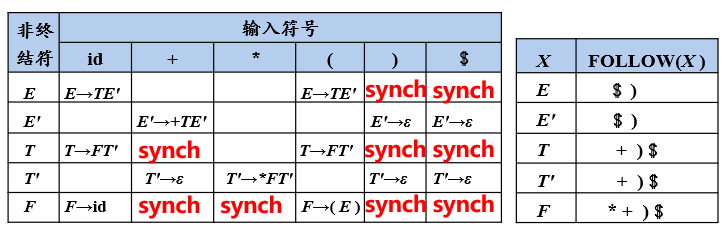

这是哈工大编译系统的学习笔记。编译系统这个课好啊，好就好在MOOC真他妈的好看。

参考教材是大名鼎鼎的龙书。

这篇博客属于学习笔记，因此内容较多，可有选择地浏览。

1. **<a href="#1">计算机程序设计语言</a>**
	
	<a href="#1.1">1.1 编译系统的结构</a>
	
	<a href="#1.2">1.2 词法分析概述</a>
	
	<a href="#1.3">1.3 语法分析概述</a>	
	
	<a href="#1.4">1.4 语义分析概述</a>
	
	<a href="#1.5">1.5 中间代码生成以及编译器后端</a>
	
	<a href="#1.6">1.6 T型图</a>
	
2. **<a href="#2">程序设计语言及文法</a>**
	
	<a href="#2.1">2.1 基础概念</a>
	
	<a href="#2.2">2.2 技巧：推导和规约</a>
	
	<a href="#2.3">2.3 文法分类</a>
	
3. **<a href="#3">词法分析</a>**
	
	<a href="#3.1">3.1 基础概念</a>
	
	<a href="#3.2">3.2 正则定义</a>
	
	<a href="#3.3">3.3 有穷自动机</a>
	
4. **<a href="#4">语法分析</a>**

	<a href="#4.1">4.1 自顶向下分析</a>
	
	<a href="#4.2">4.2 文法转换</a>
	
	<a href="#4.3">4.3 LL(1)文法</a>
	
	<a href="#4.4">4.4 预测分析法</a>
	
	<a href="#4.5">4.5 自底向上分析</a>
	
	<a href="#4.6">4.6 LR分析法</a>
	
	<a href="#4.7">4.7 SLR分析</a>
	
	<a href="#4.8">4.8 LR(1)分析</a>
	
	<a href="#4.9">4.9 LALR分析</a>
	
5. **<a href="#5">语法制导翻译</a>**

	<a href="#5.1">5.1 SDD</a>
	
	<a href="#5.2">5.2 SDT</a>
	
	<a href="#5.3">5.3 中间代码生成</a>
	
6. **<a href="#6">运行存储分配</a>**

	<a href="#6.1">6.1 静态存储分配</a>
	
	<a href="#6.2">6.2 栈式存储分配</a>
	
	<a href="#6.3">6.3 符号表</a>
	
7. **<a href="#7">代码优化</a>**

	<a href="#7.1">7.1 流图</a>
	
	<a href="#7.2">7.2 SDT</a>
	
	<a href="#7.3">6.3 中间代码生成</a>

8. **<a href="#8">代码移动</a>**

	<a href="#8.1">8.1 流图</a>
	
	<a href="#8.2">8.2 SDT</a>
	
	
## <a id='1'>1. 计算机程序设计语言</a>

计算机程序设计语言的三个层次：

1. 机器语言：可以被计算机直接理解，但难以被人理解和记忆。
2. 汇编语言：在机器语言的基础上引入助记符，相对机器语言更直观，但依赖于特定机器。
3. 高级语言：以类似自然语言/数学定义的形式，更接近人类思维。

将汇编语言程序转变成机器语言的过程称为汇编，**将高级语言程序转变成汇编语言/机器语言的过程称为编译。**此处前者称为源语言，后者称为目标语言。

             
图1.1 编译程序的过程
 

预处理的职能在于将不同源程序聚合在一起，并解析宏定义，而所谓可重定位（Relocatable）指的是程序在内存中存放的起始位置不固定。链接器负责将多个可重定位的机器代码文件和库文件连接到一起，解决了外部的内存地址问题。

### <a id = '1.1'>1.1 编译系统的结构</a>

编译系统做的，实际上是将高级语言翻译成抽象层度较低的语言这一任务。以语言翻译为例，把源语言翻译成一种目标语言有几个关键步骤：

1. 对源语言句子进行**词法分析(Lexical Analysis)**，确定词性（例如名词、动词、介词...）；
2. 在知道词性的基础上，对源语言句子进行**语法分析(Syntax Analysis)**，划分句子的成分（识别各类短语，比如名词短语、动宾短语...）；
3. 在划分成分的基础上，对源语言句子进行**语义分析(Semantic Analysis)**，获得句子的语义（分析出各个短语在句子中的成分，例如某个代词做主语，某个名词短语做宾语，某个介词短语做状语...）。

             
图1.2 编译器的结构
 

编译器的前4个阶段称为前端，只与源语言相关，后两个阶段则只与目标语言相关，称为后端。中间的机器无关代码生成过程与2者都不直接相关。具体的实现中，可在语法分析基础上直接进行语义分析，还可将分析结果直接表示成中间代码，因此语法分析、语义分析和生成中间代码的过程常常合而为一。

### <a id="1.2">1.2 词法分析概述</a>

词法分析的任务从左向右，逐行扫描源程序的内容，识别出各个单词，确定单词的类型，并将识别出的单元转化为统一的机内表示——词法单元(token)。

token是一个二元组，由**种别码**和**属性值**构成。

种别码表示token的类型。在程序设计语言中，词类大体上分为以下五类：

             
图1.3 单词类型和种别码
 

对于每种特定的程序设计语言，关键字集合是事先确定的，因此为每种关键字设定一个种别码；而标识符不能事先确定，所有的标识符都归为同一个种别码，通过token的第二个元素：属性值来区分具体的类型，因为属性值存放着token的具体字面值。

常量类似于标识符，也是开放的、无法枚举的集合，但**不同类型的常量的构成方式不同**，故而每种类型的常量分配一个种别码同样用token的属性值来存放字面值，以区分不同常量。

运算符和界限符与关键字类似，因此可以分配成一词一码。也可以把运算符划分成不同类型，不同类型下再根据属性值划分，不过都差不多就是了。

### <a id="1.3">1.3 语法分析概述</a>

语法分析的任务是：从词法分析器输出的token序列中识别出各类短语，构造语法分析树**（parse tree）**。

             
图1.4 语法分析示例
 

### <a id="1.4">1.4 语义分析概述</a>

程序设计语言中的语句主要分为声明语句/可执行语句。

语义分析的任务是：收集标识符的属性信息——种属Kind（简单变量or复杂变量or过程？）、类型Type（int？char？int *？）、存储位置和占用长度、值、作用域、参数和返回值信息（对于过程而言）等。

这些标识符的属性信息会被存放到**符号表（Symbol Table）**中。具体实现中，符号表往往带有一个字符串表来存放所有标识符的名称属性，因此Name部分往往实现为一个字符串表中的起始位置和一个长度值，这样就能在字符串表中索引到名称。

             
图1.5 符号表
 

语义分析的另一个任务是语义检查，检查语义的错误并作出响应。例如重复的变量声明、未经声明就使用、运算分量不匹配等。

### <a id="1.5">1.5 中间代码生成以及编译器后端</a>

源程序的中间表示可以有多种形式，例如三地址码（类似于汇编语言的指令序列，每个指令至多由三个操作数）和语法结构树（Syntax Tree）（注：语法树和语法分析树不是一样的东西）。

             
图1.6 三地址指令示例
 

值得注意的部分：

①之所以可以使用变量名/常量等（即源程序中的标识符）作为地址，是因为他们的地址都在符号表存好了。

②条件跳转指令只有x和y满足relop时才会跳转到对应地址。

③param x表示将x设为参数。

④过程调用的操作中，p为过程的地址，n为参数的个数。

⑤过程返回语句表示返回到对应地址。

⑥数组操作中，x表示数组的基地址，i表示**偏移地址**，而不是下标！

三地址指令的表示也有几种形式：

1. 四元式：(op, y, z, x)。注意，第一个元素为操作符，第二个、第三个元素分别为源操作数，第四个元素对应目标操作数。因此(op,y, z, x)相当于x = y op z。类似地，(op, y, _, x)表示 x = op y，(=, y,  _, x)表示x = y。
2. 三元式
3. 间接三元式

### <a id="1.6">1.6 T型图</a>

可以使用T型图来表示编译器。

             
图1.7 T型图
 

如图所示，P表示该编译器，T型图的顶部表示编译器的功能，其中S为源语言程序，T为目标语言程序。I表示编译器的底层实现语言。

## <a id="2">2. 程序设计语言及文法</a>

### <a id="2.1">2.1 基本概念</a>

字母表$\Sigma$表示一个**有穷**符号集合。这里的符号可以是字母、数字、标点符号...等等。以下给出一些字母表上的运算：

1. 乘积：$\Sigma_1\Sigma_2 = \{ab\|a\in\Sigma_1, b\in\Sigma_2\}$
2. 幂：$$ \begin{cases} \begin{aligned}\Sigma^0 &= \{\epsilon\}\\ \Sigma^n &= \Sigma^{n-1}\Sigma, n\ge1\end{aligned} \end{cases}$$也即长度为n的符号串的集合。
3. 正闭包：$\Sigma^+ = \Sigma \cup \Sigma^2 \cup \Sigma^3 \cdots$也即长度为正数的符号串之集合。
4. 克林闭包：$\Sigma^\star = \Sigma^0 \cup \Sigma \cup \Sigma^2 \cup \Sigma^3 \cdots$

假设$\Sigma$是一个字母表，对于$\forall x \in \Sigma^\star$，x称为$\Sigma$上的一个串。串的长度记作$\|x\|$，表示s中符号的个数。串上支持的运算如下（以下示例中x，y，z，s均为串）：

1. 连接：$xy$表示将y附加到x之后形成的新串。注：空串$\epsilon$是任意串对于连接运算的单位元。如果x = yz，则称y是x的前缀，z是x的后缀。
2. 幂：把串上的连接运算看作一种乘积，则幂运算可以看作累积的连接。$$ \begin{cases}\begin{aligned}s^0 &= \epsilon \\ s^n &= s^{n-1}s, n\ge 1 \end{aligned} \end{cases} $$

语言是一系列特定**句子**的集合，而**文法**表示一种语言的句子的构成规则。文法的形式化定义如下：

$G = (V_T,V_N,P,S)$表示一个文法G，其中$V_T$表示终结符集合，是文法所定义的基本符号，有时也称为token。顾名思义，终结符是不能再衍生的，是句型拓展的终结点。$V_N$表示文法的非终结符集合，也称为语法成分/语法变量。例如$V_N$可能包含<句子>、<名词短语>...非终结符是文法推导的关键。

$P$表示产生式集合，描述了将终结符/非终结符组合成串的方法。一般形式为$\alpha\rightarrow \beta$，读作“alpha定义为beta”。其中**$\alpha \in (V_T \cup V_N)^+$且$\alpha$中至少包含一个非终结符**，策划归纳为产生式的左部/头。$\beta \in (V_T \cup V_N)^\star$称为产生式的右部/体。如果一系列产生式有相同的左部，则可以将他们的右部写在一起，用“\|”分割，这时这些右部又叫做候选式。

$S$表示开始符号。开始符号是文法推导的起点，是非终结符集合的元素之一，是涵盖范围最大的语法成分。

**注意，一般场合下采用如下的符号规定：**

1. 使用排在开头的小写英文字母表示**终结符**，例如a, b, c，运算符、标点、数字和加粗的字符串（如**id**）也视为终结符。
2. 使用字母表排在前面的大写英文字母表示**非终结符**，例如A, B, C。除此之外，通常用大写字母S表示开始符号，使用小谢斜体的名词表示特定的非终结符，如*expr*，以及代表程序构造的大写字母（如E、T、F）
3. 使用字母表排在后面的大写字母表示**文法符号**（既可以表示终结符，又可以表示非终结符），例如X, Y, Z。
4. 使用字母表排在后面的小写字母表示**终结符号串**，例如x, y, z。
5. 使用小写希腊字母表示**文法符号串**，例如$\alpha$。
6. 除非特别说明，否则第一个产生式的头即为开始符号。

#### <a id="2.2">2.2 技巧：推导和规约</a>

推导Derivations是利用给定文法的产生式，用产生式的右部替换左部。例如如果$\alpha \rightarrow \beta \in P$，$\gamma\alpha\delta$就可以写成$\gamma\beta\delta$，也称作前者可以直接推导出后者。也可记作$\gamma\alpha\beta\implies\gamma\beta\delta$。

如果$\alpha_0$可以经过n步推导得到$\alpha_n$，则可记为$\alpha_0\implies^n\alpha_n$。注意$\alpha\implies^0\alpha$，$\implies^+$表示经过正数步推导，$\implies^\star$表示经过若干步推导。如果一个符号串可以由文法的开始符号推导而得到，则证明该符号串满足此文法。

根据推导替换的非终结符不同，推导还可分为最左推导（每一步替换最左边的非终结符）和最右推导（与之对应）。

而规约Redution则与推导相反，使用产生式的左部来尝试替换右部，如果最后可以归约到文法的开始符号，则证明该符号串满足此文法。

推导和规约从生成和识别两个角度来判别一个句子是否属于某个文法的范畴。

如果$ S\implies^\star \alpha $，且$ \alpha \in (V_T \cup V_N)^\star $，则认为$ \alpha $是G的一个**句型**。注意句型可以包括非终结字符，也可以包括终结字符，甚至可以是空串。

如果$ S\implies^\star w $，且$ w \in {V_T}^\star $，则称w是G的一个**句子**。句子是不包含非终结符的句型。

由文法G的开始符号推导出的所有句子的集合称为文法G生成的**语言**。记作L(G)。

语言支持的运算如下(L、M都表示语言）：

1. 并：$L\cup M = \{s\|\in L 或s\in M\}$
2. 连接：$LM = \{st\|s\in L 且 t \in M\}$
3. 幂：$$ \begin{aligned}L^0 &= \{\epsilon\}\\ L^n &= L^{n-1}L, n\ge1\end{aligned} $$
4. 正闭包：$L^+ = \bigcup_{i=1}^\infty L^i$
5. Kleene闭包：$L^\star = \bigcup_{i=0}^\infty L^i$

#### <a id="2.3">2.3 文法分类</a>

Chomsky将文法分为四类：

1. 0型文法：无限制文法。此文法只要求生成式的左部至少有一个非终结符即可。非常宽泛。
2. 1型文法：上下文相关文法。此文法要求生成式左部的长度小于等于右部的长度。也可以认为1型文法的所有产生式都满足$\alpha A \beta \rightarrow \alpha\gamma\beta$，其中$\alpha, \beta \in (V_N \cup V_T)^\star$而$\gamma \in (V_N \cup V_T)^+$。注意**1型文法不包含ε产生式**。
3. 2型文法：上下文无关文法（CFG）。**上下文无关文法**要求产生式的左部必须是非终结符集合中的元素。
4. 3型文法：正则文法。正则文法分为左线性文法和右线性文法。其中左线性文法的产生式规则为$A\rightarrow B$或$A\rightarrow Bw$，右线性文法与之相反。由3型文法生成的语言称为**正则语言**。

四种文法关系是随着文法等级提升，逐级限制，底层文法涵盖上层文法，即$0型\supset 1型 \supset 2型 \supset 3型$。

#### 语法分析树

对于CFG，可以根据推导，展开其分析树。根节点为文法的开始符号，每个内部节点都代表着存在一个产生式的左部为该节点，右部从左到右构成了该节点的子节点。

分析树的叶节点既可以是非终结符，也可以是终结符。从左到右排列叶节点得到的符号串称为该树的yield（产出）或者frontier（边缘）。

分析树的推导的图形化表示，每一步推导得到的句型都可以构造出以之为产出的分析子树。给定一个句型，其分析树的**每一颗子树的frontier**称为该句型的一个短语。如果这颗子树还恰好高度为2，则称为直接短语。

另外，如果一个文法可以为某个句型生成多个分析树，则该文法是二义的。

## <a id="3">3. 词法分析</a>

### <a id="3.1">3.1 正则表达式</a>

正则表达式Regular Expression是一种用于**描述正则语言的更紧凑的表示方法**。正则表达式可以由较小的正则表达式按照规则递归地构建。每个正则表达式r定义了一个语言，记为L(r)。正则表达式的要点如下：

空串ε也是一个RE。L(ε) = {ε}。

如果a是字母表中的一个字符，a也是一个RE，L(a) = {a}。

如果r和s都是RE，则r\|s 也是一个RE，L(r\|s) = L(r)∪L(s)。类似地，rs也是一个RE，L(rs) = L(r)L(s)。

$r^\star$也是一个RE，$L(r^\star) = (L(r))^\star$。

(r)也是一个RE，$L((r)) = L(r)$。

**注意，上述运算的优先级顺序为* > 连接运算 > \|。**

**可以用RE定义的语言叫做正则语言/正则集合**。由正则文法的定义可知，对于任何正则文法G，存在定义同一语言的正则表达式r，反之亦然。

RE满足的一些代数定律：

1. 或运算的交换律：$r\|s = s \| r$
2. 或运算的结合律：$r\|(s\|t) =  (r\|s)\|t$
3. 连接运算的结合律：$r(st) = (rs)t$
4. 连接运算对或运算满足分配律：$r(s\|t) = rs\|rt$
5. ε是连接运算的单位元：$\epsilon r = r\epsilon = r$
6. Kleene闭包中包含ε：$r^\star = (r\|\epsilon)^\star$
7. 闭包运算的幂等性：$(r^\star)^\star = r^\star$

### <a id="3.2">3.2 正则定义</a>

为方便起见可以为已有的正则表达式命名，方便后续引用。正则定义是具有如下形式的定义序列：

$$
\begin{aligned}
d_1 &\rightarrow r_1 \\
d_2 &\rightarrow r_2 \\
d_3 &\rightarrow r_3 \\
&\cdots\\
d_n &\rightarrow r_n
\end{aligned}
$$

其中每个$d_i$都是新符号，不是字母表$\Sigma$中的，而且各不相同。而每个$r_i$是以$\Sigma\cup\{d_1,d_2\cdots d_{i-1}\}$为新字母表的正则表达式。此所谓后续的正则定义可以使用先前已有的定义。例如C语言中使用正则定义表示标识符合法范围的正则表达式：

$$
\begin{aligned}
&digit \rightarrow 0|1|2|\cdots|9\\
&letter\_ \rightarrow A|B|\cdots|Z|a|b|\cdots|z|\_ \\
&id \rightarrow letter\_(letter\_|digit)^\star
\end{aligned}
$$

### <a id="3.3">3.3 有穷自动机</a>

有穷自动机Finite Automata，具有一系列离散的输入输出和有穷数目的内部状态。能够根据当前所处的状态和面临的输入信息决定系统的后继行为，并且系统处理了输入后内部状态也会发生改变。

             
图3.1 FA模型
 

一个经典的FA结构如图所示。输入带上存放着输入符号串，读头从左向右移动，逐个读取输入符号，不能往返移动。控制器根据当前状态和当前输入符号做出响应操作，转入下一状态。

可以使用转换图Transition Graph表示FA的结构。转换图中的结点表示状态，边表示在结点之间存在可行的状态转移，边上的字符表示接收的输入。一个转换图只能有一个初始状态（用start箭头标记），但可以有多个终止状态（终止状态外部额外有一层圈），转换图的示例可见后文的DFA和NFA。

一个FA也对应着一种语言。称给定输入串x，如果该FA存在一个对应于串x输入，从初始状态到某个终止状态的**转换序列**，则称串x被该FA**接收**；而一个FA所接收的所有串构成的集合就称为该FA定义/接收的语言，记作L(M)。

**FA和RE是等价的**。这是说，给定FA，可以构造出一个RE，它们表示相同的语言，反之亦然。前文中有提到过RE和正则文法在语言表达上是等价的，因此
$$
FA \iff RE \iff 正则文法
$$

##### 最长字串匹配原则

如果出现了输入串的多个前缀与FA的一个或多个模式匹配的情况（实际上，这很常见），优先选择最长的前缀的匹配方案。也正是因此，到达某个终止状态后，只要输入带还有符号，FA就会继续前进，以寻找尽可能长的匹配。

#### DFA、NFA和ε-NFA

确定的有穷自动机DFA，形式化定义为$M = (S, \Sigma, \delta, s_0, F)$，其中S表示DFA的有穷状态集合，$\Sigma$表示输入字符集（ε不算在内），$\delta$是一个从$S\times\Sigma$映射到$S$的转换函数（注：~~既然身为函数，就代表无论自变量如何取，函数值总是存在的，这意味着对于DFA的任意一个状态，不存在接收输入而不知道下一状态是什么的情况~~经过一番学习发现，有些地方给出的DFA，确实存在对于某些状态下的某些输入，不存在下一状态的情况，推测是直接把这种情况当作不接受）。$\delta(s,a)$表示从s状态出发，沿着标记为a的边所能达到的下一个状态。$s_0$表示开始状态，F表示终止状态集合。

             
图3.2 DFA模型
 

可以将$\delta$的所有可能取值化成转换表。转换表和转换图一样可以表示DFA。

*DFA的最小化：*可以将DFA化简到一个最简单的状态。首先，剔除多余状态（对于任何输入串都无法从开始状态抵达到的状态）、死状态（一旦抵达该状态，不可能从它抵达到终结状态）。然后设法区分等价状态（两个状态等价，当且仅当从该状态出发能导出（接受）的所有符号串的集合完全一致），使得DFA中最后不存在两个相互等价的状态。互不等价的状态也叫**可区分的**。判断两个状态是否可分的技巧：

1. 终结状态和非终结状态一定是可区分的。
2. 如果存在某个输入符号a使得$\delta(s_1, a)与\delta(s_2,a)不为等价状态$，则$s_1和s_2$也是可区分的状态。

非确定的有穷自动机NFA，形式化定义为$M = (S, \Sigma, \delta, s_0, F)$，与普通DFA唯一的区别在于$\delta$。在NFA中，$\delta$是从$S\times\Sigma$映射到$2^S$的转换函数，表示的含义是在状态s下接收输入a所能到达的状态集合。这也是NFA”非确定性“的所在：即使当前状态和输入确定了，下一状态却仍是非确定的，可能是该集合中的某一个状态。

             
图3.3 NFA模型
 

注意，NFA照比图3.2少了很多边。观察转换表不难发现，很多情况下转换函数的结果是空集。这意味着NFA可能存在无法前进的情况。

ε-NFA是一种特殊的NFA。在NFA的基础上，修改$\delta$的定义，$\delta$变为从$S\times(\Sigma\cup\{\epsilon\})$映射到$2^S$的函数，换言之，允许增加一些ε边，使得ε-NFA可能做到不读取有效输入字符串自发地在某些状态之间调整。

**状态q的ε闭包**记作ECLOSE(q)或E(q)，是指从q状态开始，经过一条或多条ε边可以抵达的状态的集合，注意$q\in E(q)$。也可以说，对于$\forall p \in E(q)$，如果存在一条ε边从p出发抵达状态r，则说r也属于E(q)。有了闭包的帮助，可以把ε-NFA的状态转移函数$\delta$拓展成适用于字符串的$\delta^{'}$：

1. 归纳的基础是$\delta^{'}(q, \epsilon) = EClose(q)$。
2. 对于任意的$x \in \Sigma$，$设R = \cup_{p \in EClose(q)}\delta(p, x), 则\delta^{'}(q, x) = \cup_{r\in R}EClose(r)$。
3. 类似地，对于一个$\Sigma$上的字符串w = ax（此处假设x为一个单独字符，a为一个可空的字符串），$设R = \cup_{p \in \delta^{'}(q, a)}\delta(p, x),则\delta^{'}(q, w) = \cup_{r\in R}EClose(r)$。

其实第二点可以不要，只是为了方便理解写出来。总结一下就是对于任意一个字符串（空串、单字符串也可以），把字符串拆成除最后一个字符和最后一个字符两部分，对前者归纳地使用$\delta^{'}$（也可以理解为对前者一顿搜索ε闭包，然后用基础的$\delta$将得到的集合中元素一一处理，并到新集合中，最后再对新集合找ε闭包）。

##### DFA和NFA和ε-NFA的等价性

对于任何DFA，存在一个特定的NFA，它们接收/定义了相同的语言；反之亦然。因此DFA和NFA在定义语言的层面上讲具有等价性。类似地NFA和ε-NFA也具有等价性。

#### 从正则表达式到DFA的转换

从给定的RE直接转换成DFA略有困难，一般先将RE转换成NFA，再构造DFA。

从RE构造NFA的技巧：

1. 字母表中每个字符也是一个RE，可以画出一个简单的只有起始和终止状态的NFA。
2. 出现两个RE连接的情况，只需将两个RE各自的NFA首尾相连即可。
3. 出现两个RE或运算的情况，将两个RE各自的NFA”并联“起来即可。
4. 出现Kleene闭包的情况，将RE首尾循环连接起来即可。
5. 空串也可以构造出一个ε-NFA，只有两个状态，从开始状态到结束状态有一条ε边。

从NFA构造DFA的技巧：

若原NFA形式化表示为：$M = (S, \Sigma, \delta, s_0, F)$构造一个新的DFA，这个DFA的状态集合为$2^S$，字符集合不变，初始状态为$\{s_0\}$，终结状态集合为$\{P\|P \subseteq 2^S 且 P \cap F \neq \emptyset\}$，而转换关系$\delta^{'}$变为从$2^S\times\Sigma$映射到$2^S$的集合，满足$\delta^{'}(set,a) = \{s\|s\in S 且 \exists x \in set 使得 \delta(x, a) = s\}(或写成\cup_{s \in set}\delta(s, a))$。注：最后常常会得到一些状态，它们无法从开始状态经由任何输入而抵达，可以直接略去。

如果之前构造出的是ε-NFA也没关系。从ε-NFA转换到NFA很容易，借助于上文中ε闭包的定义即可。若原ε-NFA形式化表示为：$M = (S, \Sigma, \delta, s_0, F)$构造一个新的NFA，这个NFA的状态集合为$S$，字符集合为$\Sigma$，初始状态为$s_0$，终止状态集合为$\{q\|EClose(q) \cap F \neq \emptyset\}$，状态转移函数为

$$
\delta^{'}(q, x) = 
\begin{cases}
\begin{aligned}
&\emptyset,if\space x = \epsilon \\
&\cup_{q^{'} \in EClose(q)}\delta(q^{'}, x), otherwise
\end{aligned}
\end{cases}
$$
从NFA(ε-NFA)构造DFA的程序实现中，常用的一个是**子集构造法**。

1. 初始化$S_D$集合，其中只有一个元素，是$EClose(s_0)$。设其为开始状态，并且为其设置标志位为“未标记”。
2. 只要$S_D$集合中还有未标记的元素T，就进行如下操作：
   1. 给T打上标记。
   2. 对于每个可能的输入符号a，计算$move(T,a)$。其表示对于T中的每个状态，通过NFA中的状态转移函数和输入a可以抵达的状态的集合。
   3. 计算$U = EClose(move(T,a))$。如果U没有在$S_D$中出现过，就将其加入到$S_D$中，并且设置标志位为“未标记”；否则，加入转换关系$\delta_D(T, a) = U$。
3. $S_D$中所有与NFA(ε-NFA)中$F_N$相交非空的元素都算在$F_D$终结状态中。

注意，每次计算move(T, a)时，T已经确定是一个ε闭包。$S_D$的状态集合一定都是原NFA的闭包。

## <a id="4">4. 语法分析</a>

语法分析的关键是按给定语法构造语法分析树。如果输入串的各个单词恰好从左至右对应于分析树的叶节点，则该串是符合该语法分析树的一个句子。语法分析可大致分为两类：自顶向下的分析和自底向上的分析，它们分别对应推导和规约。

### <a id="4.1">4.1 自顶向下的分析</a>

从分析树的根节点向底部叶节点方向构造分析树。自顶向下分析可以看作从文法的开始符号S**推导**出词串的过程。推导又可分为最左/最右推导，表示推导过程中，总是优先将句型的最左/右边的非终结符取出来替换。

最左、最右推导符号记作$\Rightarrow_{lm}$和$\Rightarrow_{rm}$，并且称由开始符号经最左/最右推导而出的句型为最左句型/最右句型。最左推导是最右规约的逆过程（反之亦然）。由于最底向上的分析中多用最左规约，故也称其为规范规约，相应地最右推导也称为规范推导。

每颗分析树对应的最左推导和最右推导都是唯一的。

自顶向下的语法分析采用最左推导。语法分析器从左至右分析输入，根据读取到的下一个终结符决定最左非终结符的候选式。这句话的意思是：如果最左推导在生成式集合中没有多个候选可能，那就好办，直接推导下去；如果有多个，则进行终结符匹配来优先选择候选式。

#### 递归下降分析

是**自顶向下语法分析的通用形式**，由一组过程组成，每个过程对应着一个非终结符。对于一个非终结符A，其对应的过程基本形式如下：

1. 选择一个A的产生式$A\rightarrow X_1 X_2 \cdots X_n$。
2. 对于每个$X_i$，进行如下的操作（实际上，是最左推导）：
   1. 如果$X_i$是非终结符，则调用那个$X_i$对应的过程；
   2. 否则如果$X_i$是当前读入的终结符号，则读入下一个输入符号；
   3. 其他的情况，视为发生了错误，此时要回溯到选择其他产生式。（回溯的存在说明该非终结符有多个候选式具有相同的前缀）

如果S对应的过程体恰好扫描了整个输入串，则成功完成了语法分析。这种需要回溯的分析器称为**不确定分析器**，由于回溯的存在，导致效率较低。如果可以提前预测出正确的产生式，则不需要回溯，称为**预测分析**。预测分析是递归下降分析的一个特例，通过在输入中向前看固定个数的符号来帮助选择正确的产生式。有的文法可以构造出向前看k个输入符号的预测分析器，也称为LL(k)文法类。预测分析是一种确定分析器。

### <a id="4.2">4.2 文法转换</a>

 递归下降分析可能出现问题。例如，如果出现**直接左递归**形式的产生式(形如$A\rightarrow A\alpha$)或者$A\Rightarrow^+A\alpha$(A为非终结符)，那么这个文法称为左递归的。一个左递归的文法可能使得递归下降分析器陷入无限循环！

可以**消除直接左递归**。对于形如$A\rightarrow A\alpha\|\beta$的产生式，($\alpha\neq\epsilon, \beta \space not \space starts\space with \space A$)，实际上A产生的是一个β开头，后接0或多个α的串($\beta\alpha^\star$)。为此可以新增非终结符A'，使得
$$
A\rightarrow \beta A'\\A' \rightarrow \alpha A'|\epsilon
$$
实际上就是把左递归换成了右递归。上式可以扩展成一般形式：
$$
对于形如\\
A\rightarrow A\alpha_1|A\alpha_2|\cdots|A\alpha_n|\beta_1|\beta_2|\cdots|\beta_m
\\的生成式(其中\alpha_i\neq\epsilon,\beta_j不以A开头)\\
可以转化成如下的形式以消除直接左递归：
A\rightarrow \beta_1A'|\beta_2A'|\cdots|\beta_mA'\\
A' = \alpha_1A'|\alpha_2A'|\cdots|\alpha_nA'|\epsilon
$$
消除左递归带来的代价是引进了新的非终结符和ε产生式。对于间接左递归，常用的解决办法是将被间接左递归的非终结符带入到导致间接左递归的那一条产生式中，该产生式将演变成一条全新的直接左递归。

消除左递归的算法分为如下几步（输入必须是不含循环推导，也即形如$A\Rightarrow^+A$的推导，以及ε产生式的文法G）：

1. 按某个顺序将非终结符排序，分别记作$A_1,A_2\cdots A_n$。

2. 对于每个非终结符$A_i$:

   1. 对于排在那个非终结符之前的每个非终结符(from 1 to i - 1)$A_j$，将每个形如$A_i\rightarrow A_j\gamma$的产生式用$A_j$的全部产生式替换。如果$A_j\rightarrow\delta_1\|\delta_2\|\cdots\|\delta_k$，那么最后将得到$Ai \rightarrow\delta_1\gamma\|\delta_2\gamma\|\cdots\|\delta_k\gamma$这样的生成式。
   2. 消除$A_i$产生式的直接左递归。

除了消除左递归，还应消除左公因子，即具有公共前缀的同一非终结符的产生式右部。将除了公共前缀的部分提取成新的非终结符，让非终结符生成那些被替代的部分，就可以简单地消除左公因子。

### <a id="4.3">4.3 LL(1)文法</a>

LL(1)文法指的是向前看k个输入符的预测分析法。

预测分析法的工作流程：

从文法开始符号出发，每一步推导过程中根据当前句型的最左非终结符A和输入符号a，选择正确的A-产生式。为了保证分析的正确性，选出的候选式必须是唯一的。

#### S_文法

指简单的确定型文法。S\_文法要求每个产生式的右部都**以终结符开始**，而且**同一非终结符的各个候选式的首终结符均不同**。从定义中可以看出S\_文法不包含空产生式。

对于预测分析法，空产生式的使用也是有说法的，并不总是能起效。

             
图4.1 S_文法中如果包含空产生式的情况
 

如图4.1所示，对于给定的文法，输入adae的解析过程中，当推导到adBCD时，将B用空串替代是可以推导成功的，但对于输入adee，推导到adBCD时将B用空串替代，结果是无法解释。分析adee无法继续推导的原因，不难发现，如果将B视为空串，则产生式中右部包含非终结符B的情况只有B紧跟C。而使用空串替代B的原因是当前输入符号不能被解析，所以此时的非终结符必定不是b、d，则如果当前符号a无法被C-产生式继续推导下去，就会发生问题。C-产生式的右部首终结符又只可能是a、c，因此对于e，该文法无法接收。

总结：如果当前某个非终结符A与当前输入符a不匹配时，若存在$ A \rightarrow \epsilon$，则可以通过检查a是否可以出现在A之后，来决定是否适用空产生式。如果文法中并没有$A \rightarrow \epsilon$，则直接报错即可。

#### 后继符号集

**可能在某个句型中紧跟在非终结符A后边出现的终结符的集合**，记为$FOLLOW(A)$。

$$
FOLLOW(A) = \{a\|S \Rightarrow^\star \alpha Aa \beta, a \in V_t, \alpha,\beta \in(V_T \cup V_N)^\star\}
$$
为了便于描述，引入新的符号`$`，表示结束符。如果A是某个句型的最右符号，则将结束符加入$FOLLOW(A)$。

以图4.1的文法为例，$FOLLOW(B) = \{ a, c\}$。引入$FOLLOW$的概念后，可以把空产生式看作一个首终结符为$FOLLOW$集合中任一元素的候选式。

#### 可选集

产生式$A \Rightarrow \beta$的可选集指的是**可以选用该产生式进行推导式对应的输入符号的集合**，记为$SELECT(A \Rightarrow \beta)$。

如果产生式右部第一个符号为终结符a，那么$SELECT(A \Rightarrow a\beta) = \{a\}$。

如果产生式的右部是空串，那么$SELECT(A \Rightarrow \epsilon) = FOLLOW(A)$。

在以上的定义基础上，可以定义q_文法。

#### q_文法

每个产生式的右部要么是空串，要么是以终结符开始；在此基础上，具有相同左部的产生式有不相交的可选集（SELECT）。

q\_文法相比S\_文法适用范围更广，但依旧限制较多，因为不允许右部以非终结符开头。

#### 串首终结符

串首终结符指在输入串中可能排在最左的第一个且是终结符的那些符号。

给定一个**文法符号串α**，α的串首终结符集$FIRST(\alpha)$定义为可以从α推导出的所有串首终结符构成的集合。注意：如果$\alpha \Rightarrow^\star \epsilon$，那么ε也视为在$FIRST(\alpha)$中（实际上，$\alpha \Rightarrow^\star ε$意味着α中的所有文法符号都是非终结符，且它们都有空产生式）。由此得到的关系：

如果$\epsilon \notin FIRST(\alpha)$，那么$SELECT(A\rightarrow\alpha) = FIRST(\alpha)$。

如果$\epsilon \in FIRST(\alpha)$，那么$SELECT(A\rightarrow\alpha) = (FIRST(\alpha) - \{\epsilon\})\cup FOLLOW(A)$。

用朴素的语言描述就是：如果α无论如何变不成空串，那么α最后必将存在终结符。既然如此，$A\rightarrow \alpha$可以接收的输入就是α的串首终结符集合。如果α有可能变成空串，那么在$FIRST(\alpha)-\{\epsilon\}$的基础上（别忘了，空串可不是输入符号集的元素！），还要考虑把α推导成空串的可能，这种情况下$A \rightarrow \alpha$所能接收的输入符号就要把$FOLLOW(A)$考虑在内了。

小结一下：

- $FOLLOW(A)$是相对非终结符A而言，可以接在A之后的终结符；
- $SELECT(A \rightarrow \alpha)$是相对产生式而言，考虑产生式可以接收怎样的终结符作为输入；
- $FIRST(\alpha)$是相对句型/文法符号串而言，考虑这个句型/文法符号串可能推导出的串首终结符。

#### LL(1)文法

第一个L表示从左向右扫描输入，第二个L表示产生最左推导。1表示每一步只需要向前看一个输入符号来决定语法分析的动作。

一个LL(1)的文法G要求对于G的任意两个具有相同左部的产生式$A\rightarrow \alpha\|\beta$，满足以下条件：

- 不存在终结符a，使得α和β都能够推导出以a开头的串。
- α和β**至多有一个**能推导出ε。（如若不然，他们的SELECT集都是FOLLOW(A)，就会相交了）
- 如果$\beta \Rightarrow ^\star \epsilon$，则$FIRST(\alpha)\cap FOLLOW(A) = \emptyset$；同理对α亦是如此。（这一条也是为了防止可选集互不相交）

中心思想：**同一非终结符的各个产生式的可选集互不相交**。这使得可以为LL(1)文法构造预测分析器。

#### 计算FIRST集和FOLLOW集

FIRST集也可以相较于单一文法符号来看。此时，FIRST集的意义是**可以从文法符号X推导出的串首终结符的集合**。

如果X是终结符，那还有什么好说的呢？FIRST(X) = {X}即可。如果X是非终结符，那么FIRST(X)与X的产生式关系密切。$X \Rightarrow ^\star \epsilon$则$\epsilon \in FIRST(X)$。一个以终结符为最左符号的产生式右部，可以直接帮助确定一个FIRST(X)的元素（那个最左终结符即是）。如果产生式的右部是非终结符打头的，则将那个非终结符的FIRST集中元素加入到FIRST(X)即可。算法描述如下：

不断进行以下操作直到没有新的终结符或ε可以加入到任何FIRST集中为止：

1. 如果X是终结符，那么$FIRST(X) = X$。
2. 如果X是非终结符，且存在以X为左部的产生式形如$X\rightarrow Y_1\cdots Y_k(k \ge 1)$，如果对于某个i，a在$FIRST(Y_i)$中且$\epsilon$在所有的$FIRST(Y_1),\cdots FIRST(Y_{i-1})$中都有出现（也即$Y_1\cdots Y_{i-1} \Rightarrow ^\star\epsilon$，则把a加入到FIRST(X)中。如果对于所有的$j = 1,2,\cdots k$，都有ε在$FIRST(Y_j)$中，则将ε也加入到$FIRST(X)$中。
3. 如果$X\rightarrow\epsilon$，将ε加入到$FIRST(X)$中。

计算出每个符号的FIRST集之后，一个文法符号串$X = X_1X_2\cdots X_n$的FIRST集合也可以得出来了：首先向$FIRST(X)$中加入$FIRST(X_1)$中所有的非ε符号，如果ε在$FIRST(X_1)$中，则向$FIRST(X_2)$中加入所有非ε符号，如果在此基础上ε在$FIRST(X_2)$中也有出现，则加入$FIRST(X_3)$的所有非ε符号...以此类推。如果ε出现在每个文法符号的FIRST集中，则将$\epsilon$也加入到$FIRST(X)$中。

FOLLOW(A)集指**可能**在某个句型中紧跟在非终结符A后面的**终结符**的集合。一个非终结符的FOLLOW集取决于当A出现在某条句型中时，紧跟着A的文法符号的FIRST集。为了方便，当A是某个句型的最右符号时，将结束符`$`加入A的FOLLOW集。（注意：文法的开始符号也是一个句型。因此开始符号的FOLLOW集中必有`$`符号）

FOLLOW集的算法如下：

不断进行以下操作，直到没有新的终结符或是ε加入到任何FOLLOW集合中为止：

1. 将`$`放入FOLLOW(S)中。S是开始符号，`$`是输入右端的结束标记。
2. 如果存在一个产生式形如$A \rightarrow \alpha B \beta$，则将$FIRST(\beta)$中所有**非空符号**加入到$FOLLOW(B)$中。
3. 如果存在一个产生式形如$A \rightarrow \alpha B$或对于某条形如$A \rightarrow \alpha B \beta$的产生式，$FIRST(\beta)$中有ε，那么将FOLLOW(A)中的所有符号加入到FOLLOW(B)中。

FOLLOW集的算法在某种程度上与FIRST集的计算有相似之处（指它们都需要重复多次直到不会引入新符号，以解决各个FOLLOW集合之间的相互依赖关系）。

有了FIRST集和FOLLOW集，SELECT集也可以计算出来了。

计算出SELECT集，然后可以判断一个文法到底是不是LL(1)的。如果是，就可以画出它的预测分析表——横、纵轴一个对应产生式左部的非终结符，一个对应该产生式接收的输入符号。表格的每一个元素内是一个可以唯一确定的产生式（当然，也可能没有）。

             
图4.2 预测分析表
 

### <a id="4.4">4.4 预测分析法</a>

#### 递归的预测分析法

指在递归下降分析中，编写每个非终结符对应的过程时，根据预测分析表进行产生式的选择。

             
图4.3 递归的预测分析法示例
 

#### 非递归的预测分析法

不需要为每个非终结符编写递归下降过程，而是根据预测分析表构造一个自动机（下推自动机），因此也叫表驱动的预测分析。

基本程序实现形式如下：

*输入：一个串w和文法G的分析表M*

*输出：如果w在L(G)中，输出w的最左推导，否则给出错误提示。*

1. 初始化栈，让G的开始符号位于栈顶，`$`符位于栈底。输入缓冲区是w`$`，输入指针指向w的第一个符号。
2. 读入栈顶符号X，只要$X \neq $`$`，进行如下循环体操作：
   1. 如果X 与 输入指针所指向的符号相同，则出栈并让输入指针前移，继续循环；
   2. 否则，如果X是一个终结符，则报错；
   3. 否则，如果分析表中不存在M[X，a]的一项，则报错；
   4. 否则，输出分析表中对应M[X, a]的产生式，出栈，并将分析表中的文法符号串入栈（注意，最左的文法符号应该在 栈顶，也就是按产生式右部从右到左的顺序入栈），然后继续循环；
3. 程序正常退出。

             
图4.4 非递归的预测分析法示例
 

#### 递归与非递归的预测分析比较

- 程序规模：递归法的程序规模较大（每个非终结符都有过程），但不需载入分析表；而非递归法主程序规模小，尽管需要载入分析表，但分析表一般也没有多大。
- 直观性：递归法理解起来比后者更直观。
- 效率：递归法效率较低，而非递归法的分析时间与待分析程序的大小呈线性关系。
- 自动生成：递归法难以自动生成，但非递归的方法容易自动生成。

#### 非递归预测分析中的错误处理

观察非递归预测分析的流程，不难发现只有两种错误情况：其一是栈顶元素是终结符且不与当前输入匹配，其二是栈顶元素是非终结符但分析表中并无对应项。

错误恢复的方式采用**恐慌模式**。即出现错误时，忽略输入中的一部分符号，直到输入中出现由设计者选定的**同步词法单元**集合中的某个词法单元。

恐慌模式恢复的效果取决同步集合的选取。例如，可以把FOLLOW(A)中的终结符放入非终结符A的同步记号集合，这样一旦A的分析出了问题，将尝试跳过A的分析而转到下一个位置，这个位置就是FOLLOW(A)中出现过的终结符。如果终结符在栈顶而不能匹配，可以简单地弹出此终结符。

             
图4.5 恐慌模式错误恢复：同步词法单元
 

### <a id="4.5">4.5 自底向上分析</a>

自顶向下分析采用最左推导，而自底向上分析采用最左规约（反向构造最右推导）的形式。自底向上分析的通用框架是移入-规约分析。其中，移入操作指的是将输入符号入栈，规约指的是将栈顶的连续数个符号与某个产生式的右部对应，替换成对应左部。

             
图4.6 移入-规约分析示例
 

移入-规约分析的工作过程为：每一次从左到右扫描的过程中不断将输入符号移入栈的顶端，直到可以对栈顶的一个文法符号串进行规约为止，然后将其规约为对应产生式的左部。不断地重复上述操作直到检测到语法错误，或者栈顶为开始符号且输入缓冲区为空时（即接收）为止。因此，移入-规约分析器可采取的动作有四种：

- 移入：将下一个输入符号移到栈顶。
- 规约：被规约的符号串的右端必然处于栈顶。由分析器在栈中确定此串的左端，并决定用哪个非终结符替换这个串。
- 接收：宣布语法分析过程成功完成。
- 报错：发现语法错误，并调用错误恢复程序。

最左规约的每一步得到的符号串（栈内符号串与剩余输入的拼接）都是规范句型。称**句型的最左直接短语**为**句柄**。（直接短语指分析树中那些高度为2的子树的边缘组成的符号串）。

移入-规约分析的过程中，句柄的选择很重要，它直接影响了分析树的构成。正确地选择句柄就是自底向上分析的关键问题。

### <a id="4.6">4.6 LR分析法</a>

#### LR文法

指的是最大的、可以构造出相应移入-规约语法分析器的文法类。L指对输入进行从左到右的扫描，R指反向构造出一个最右推导序列。

称需要向前查看k个输入符号的LR分析为LR(k)分析。省略(k)时表示k=1。

>老师课堂上指出，LL(1)文法一定是LR文法，但反过来却不成立。详细的证明可以参考龙书。
>
>LR文法直观的定义是，只要存在这样一个从左到右扫描的移入-规约分析器，总是能在某文法的最右句型的句柄出现在栈顶时识别出这个句柄，那么这个文法就是LR的。

#### LR分析法

为了正确识别句柄，将句柄的识别过程划分为不同状态。通过在产生式右部的不同位置插入"·"，表示一个产生式被规约的状态。例如：

$$
以 S \rightarrow bBB这一产生式为例：\\
S \rightarrow \cdot bBB\\
S \rightarrow b \cdot BB\\
S \rightarrow bB \cdot B \\
S \rightarrow bBB\cdot
$$
其中，"·"出现在右部开头，表示**移进状态**，出现在右部符号中间表示**待规约状态**，出现在右部末尾表示**规约状态**。可以认为"·"的位置表示期待下一个符号的输入。LR分析器基于这些状态构造自动机，进行句柄的识别。

             
图4.7 LR分析器结构
 

一个LR分析器的结构如图4.7所示。主控程序根据输入符号、动作表和转移表来进行状态的转移和压栈操作，生成对应的产生式序列。

             
图4.8 LR分析器：ACTION表和GOTO表
 

ACTION表的作用在于根据输入的终结符和当前状态来决定的操作。ACTION表中，形如"sn"的指令的效果是将状态n移入状态栈，形如"rn"的指令的效果是用n号产生式进行规约操作（不只是符号栈，状态栈也会相应地出栈），形如"acc"的指令表示接收符号串。GOTO表中的每一列对应文法中的非终结符，每一项表示在某一状态遇到非终结符后进入的后继状态。

栈中默认初始化`$`符号和状态符号0。

LR分析器的工作过程如下：

1. 初始化状态栈$s_0$和符号栈`$`。
2. 一般情况下，状态栈中形如$s_0s_1s_2\cdots s_m$，而对应的符号栈为`$`$X_1X_2\cdots X_m$，输入符号缓冲区为$a_ia_{i+1}\cdots a_n $`$`。注意到这时状态栈和符号栈是等长的。此时：
   1. 如果ACTION[$s_m, a_i$]  = sx，则将状态x和$a_i$分别压栈。
   2. 如果ACTION[$s_m, a_i$] = rx，则表示使用第x个产生式A进行规约。若A形如$A \rightarrow X_{m-(k-1)}\cdots X_m$（注意到右部有k个文法符号），则规约后状态栈和符号栈分别形如$s_0s_1s_2\cdots s_{m-k}$和`$`$X_1X_2\cdots X_{m-k}A$。注意，此时符号栈长度比状态栈大1。在这种情况下，如果GOTO[$s_{m-k},A$]=y，那么便将状态y移入。注意，此时状态栈和符号栈变为等长，又变回了“一般状态”。
   3. 如果ACTION[$s_m, a_i$]=acc，则分析成功。

实际的程序实现中，可以并不维护实际的符号栈，而借助于规约操作输出规约的过程。因为符号栈的数目变化与状态栈有关系，即一旦发生规约操作后，就把GOTO[状态栈顶，规约的产生式左部]入栈即可。

#### LR(0)分析

称右部某位置标记有"·"的产生式为相应文法的一个**LR(0)项目**。一个实际存在的产生式对应的项目个数为右部符号数+1。项目描述了句柄识别的状态。与移进状态对应的，称为移进项目；与待规约状态对应的，称为待约项目；与规约状态对应的称为规约项目。

注：产生式$A \rightarrow \epsilon$只产生一个项目$A \rightarrow \cdot$。

如果G是一个以S为开始符号的文法，则G的**增广文法**定义为在G中加入新开始符号$S'$和新产生式$S'\rightarrow S$。增广文法的目的在于使得文法开始符号仅出现在一个产生式的左边，这样分析器只有一个接收状态。

             
图4.9 产生式对应项目示例
 

同属于一个产生式的项目，但圆点的位置只往后移动了一个符号，则称较后者是较前者的后继项目，即$A \rightarrow \alpha \cdot X \beta$的后继项目为$A \rightarrow \alpha X \cdot\beta$。图4.9中每个产生式的项目集合中，从下到上分别是其后继项目。

注意，项目之间可能有等价关系。如果一个项目的圆点后跟非终结符，则该非终结符的产生式中的**移进项目**便与该项目等价，因为它们实际上“期待”相同的符号。将彼此等价的项目组成**项目集**，称为项目集闭包，每个项目集闭包对应着自动机的一个状态。

             
图4.10 LR(0)自动机示例
 

#### 构造LR(0)分析表

项目集闭包的形式化定义：

$$
CLOSURE(I) = I \cup \{B\rightarrow \cdot \gamma \| A \rightarrow \alpha \cdot B \beta \in CLOSURE(I), B \rightarrow \gamma \in P\}
$$
其中I为某个项目。用朴素的语言描述，就是对于项目中圆点后跟非终结符的情况，将那些非终结符的所有移进项目加入闭包。（当然项目本身也属于自己的闭包！）

程序实现的过程很简单，简单描述下就是初始化闭包包含I，不断循环将闭包中每个项目都按照上述语言描述的那样操作，如果那些项目不在闭包中就加入之，直到某一次循环没有任何新的项目被加入到闭包为止。

GOTO函数返回项目集I对应于文法符号X的后继项目集闭包。注意，这里的GOTO函数是**针对自动机而言的状态转移函数**，而不是分析表中的GOTO函数！X是文法符号！形式化定义如下：

$$
GOTO(I,X) = CLOSURE(\{A \rightarrow \alpha X \cdot \beta \| A \rightarrow \alpha \cdot X \beta \in I\})
$$
程序实现的过程比上一个还简单。首先初始化一个空集，对于I中的每个项目，将其后继项目加入集合中，然后计算该集合的闭包即可。

有了上述操作，即可构造LR(0)自动机的状态集族。形式化定义如下：

$$
C = \{I_0\} \cup \{I \| \exists J \in C, X \in V_N \cup V_T, I = GOTO(J, X)\}
$$
其中$I_0$表示初始项目($S' \rightarrow S$)的项目集闭包。程序实现的过程如下:

初始化项目集族包含$I_0$，不断循环集族中每个集合I，对于每个文法符号X，如果GOTO(I, X)非空，且不在C中，加入之，直到某一次循环没有任何新的集被加入到集族中为止。

构造分析表的过程如下：

根据项目集族，构造状态，令$I_i对应状态i$。状态i的分析表行按如下规则构造：

1. 如果$A \rightarrow \alpha \cdot a\beta \in I_i$，且$GOTO(I_i, a) = I_j$，则$ACTION[i,a] = sj$。
2. 如果$A \rightarrow \alpha \cdot B\beta \in I_i$，且$GOTO(I_i, B) = I_j$，则$GOTO[i,B] = j$。
3. 如果$A \rightarrow \alpha \cdot \in I_i$，且$A \neq S'$，则$\forall a \in V_T \cup \{$`$`$\}, ACTION[i,a] = rj$，其中j为产生式$A\rightarrow \alpha$的编号。
4. 如果$S' \rightarrow S\cdot \in I_i$，$ACTION[i,$`$` $] = acc$。
5. 没有定义的所有位置都设为err。

最后，可以得到一个LR(0)自动机的形式化定义：

$$
M = (C, V_N\cup V_T,GOTO, I_0,F)
$$
其中只有F需要额外提一下。$I_0=CLOSURE(\{S' \rightarrow \cdot S\})$，而$F=\{CLOSURE(\{S' \rightarrow S \cdot\})\}$。

#### LR(0)分析表的冲突

考虑一种情况：一个项目集中包含了一个规约项目，还有一个待约项目，且其圆点后跟一个终结符。根据分析表的构造过程，容易知道这两种项目遇到终结符的处理不同。如果是一个普通的规约项目，可能会希望进行rn操作(即规约)，然而对于一个普通的待约项目，可能会希望继续移进。这就导致了冲突！这种冲突称为**移进/规约冲突**。除了这种冲突，还有可能有**规约/规约冲突**，即一个项目集包含多个普通规约项目，导致不知道该采用那个生成式来进行规约。

如果一个给定的LR(0)分析表中没有动作冲突，则称给定的文法为LR(0)文法。CFG不总是LR(0)文法！

### <a id="4.7">4.7 SLR分析</a>

SLR分析的基本思想是，对于一个项目集（其中包含圆点后接终结符的待移项目和规约项目，其产生式左部分别记为$A_i$、$B_j$，原点后接终结符的那些项目的终结符之集合为$\{a_1,a_2,\cdots a_m\}$），若满足$\{a_1,a_2,\cdots a_m\}$与$FOLLOW(B_1),FOLLOW(B_2),\cdots FOLLOW(B_n)$两两不相交，则项目集I上的冲突可以按以下原则解决：

假设a是下一个输入符号，则：

- 若$a \in \{a_1,a_2,\cdots a_m\}$，则移进a
- 若$a \in FOLLOW(B_i)$，则用产生式$B_i \rightarrow \gamma_i$规约。
- 此外的情况，则报错。

实际上SLR分析法是通过向前判断一位输入符号来决定操作的，故应称之为SLR(1)分析，但是由于k=1时可以省略，故直接叫作SLR分析法。

SLR的分析表与LR(0)分析表不同的地方在于，后者只要项目集里有非终结符的规约项目，则对应状态的所有ACTION都是规约操作（rn），而前者只在那些在FOLLOW(A)中出现的终结符上有规约。也正因为此，同一状态的不同ACTION中，还可能出现不同的规约动作，因为它们对应的FOLLOW集合不同！

             
图4.11 SLR分析表示例
 

SLR分析表的构造算法与LR(0)基本一致，唯一区别在于**对于左部为非终结符的那些规约项目**，根据不同的FOLLOW集来划分规约。即如果$A \rightarrow \alpha \cdot \in I_i$，且$A \neq S'$，则$\forall a \in FOLLOW(A)$,$ ACTION[i,a] = rj$，其中j为产生式$A\rightarrow \alpha$的编号。

然而SLR分析仍不能解决同一个终结符带来的移入/规约冲突。

### <a id="4.8">4.8 LR(1)分析</a>

SLR之所以不够全面，是因为SLR分析只是考虑了下一个输入符号b是否属于与规约项目相关联的FOLLOW集，但其属于FOLLOW集只是规约的一个必要条件，而非充分条件。

实际分析句型的过程中，一个非终结符的后继符号，并不总是FOLLOW集合中的那些元素，而是根据其出现的位置不同而决定，当然，绝对不会超过FOLLOW集合的范围，只是它的一个子集。

             
图4.12 不同位置对后继符集合的影响
 

为此LR(1)分析考虑实际分析中非终结符的后继符集合。为此，提出一种新的项目：

将形式为$A \rightarrow \alpha \cdot \beta ,a$的项目称为LR(1)项目，其中a是一个终结符（此时将`$`视为一个特殊的终结符），其表示在当前状态下A后面必须紧跟终结符a。a称为该项的**展望符**。

LR(1)中的1指的是项目的第二个分量的长度（展望符）。如果$\beta$非空，展望符是不起作用的。但一个形式$A\rightarrow \alpha \cdot, a$的项只有在下一个输入符为a时才可以进行规约，这样的a的集合通常是FOLLOW(A)的真子集。

LR(1)项目也是有等价项目的。考虑形如$A \rightarrow \alpha \cdot B \beta, a$的产生式，它应当与$B \rightarrow \cdot \gamma ,b$等价，其中$b \in FIRST(\beta a)$。这是说，B的展望符号应该与β的FIRST集合相同，但如果$\epsilon \in FIRST(\beta)$，则a也可以是B移进项目的展望符。β可空时，b=a叫继承的后继符，否则叫自生的后继符。

如果除了展望符以外，两个LR(1)项目集相同，则称这两个项目集是同心的。

LR(1)的项目集闭包定义为:

$$
CLOSURE(I)  =\{I\} \cup\{[B \rightarrow \cdot \gamma, b]\| [A \rightarrow \alpha \cdot B \beta, a] \in CLOSURE(I), B\rightarrow \gamma \in P, b \in FIRST(\beta a)\}
$$
因此，计算LR(1)项目集闭包的过程也要改动，对于每个产生式，还要对于每个FIRST(βa)中的符号，加入对应的项目。类似地，GOTO函数的计算也调整为将对应的后继项保留展望符地加入到J中，再计算闭包。构造集族的算法变化不大，只是要初始化的项目集变为$CLOSURE(\{[S' \rightarrow \cdot S, $`$`$]\})$.

LR(1)分析表的构造算法，与LR(0)的分析表构造算法的区别在于，只有ACTION的终结符对应于项目的展望符，才可以进行规约。

### <a id="4.9">4.9 LALR分析</a>

LR(1)分析法中存在很多同心的项目集，这使得状态数激增，必须考虑减少状态的办法。如果**两个同心项目集之间没有动作冲突**，就可以将他们合并而不影响分析结果。

LALR分析(lookahead-LR)的思想就是寻找同心的LR(1)项目集，将他们合并为一个项目集，根据合并后得到的项集族构造语法分析表。如果表中没有冲突，就称给定的文法为LALR(1)文法。

注：合并同心项目集的过程，可能导致规约/规约冲突，但不会导致移进/规约冲突。因为所谓合并，实际上是合并展望符集合的过程，而移进操作要求项目是一个非规约项目，这时展望符对分析没有影响。LALR可能会做多余的规约，但绝不会做错误的移进操作。

就算可以无冲突地合并同心项，合并操作也会导致一个副作用，就是推迟错误的发现。

LALR(1)的特点是，具有LR(1)可解决冲突的优点，同时大小与LR(0)/SLR差不多相当。LALR的分析能力略逊于LR(1)，因为会导致延迟发现错误，但怎么说也是强于LR(0)/SLR的。

#### 小结

LR(0)分析之所以不太行，主要是因为在一个句型的分析过程中，句柄是重要的。而LR(0)分析只是考虑当前的输入是否满足规约的需要，**却不考虑当前规约是否为当前的句型所需要**。在特定句型中起作用，才有意义！

各种LR分析表的构造方法的不同主要在于对规约项目的处理方案上。LR(0)是对所有的终结符，都起规约作用；SLR(1)（Simple LR(1))只对FOLLOW集中那些符号起作用，但还不够明确；LR(1)只考虑句型中可能出现在其之后的符号，实际上是根据后继符集合的不同，将LR(0)状态分裂成不同的LR(1)状态，划分地更加细致了。

### <a id="4.10">4.10 二义性文法的LR分析</a>

**任何二义性文法都不是LR文法**，因为会导致分析表中出现冲突。然而二义性文法更直接，更简短。完全可以在二义性文法中使用LR分析，只要确保可以手动解决冲突即可。

然而仍然需要谨慎使用LR分析二义性文法，必须确保严格控制其流程，稍有不慎就会引入错误。

### <a id="4.11">4.11 LR分析的错误处理</a>

LR分析器查询分析表并发现一个报错条目时，就检测到了一个错误。错误的恢复策略主要有：

- 恐慌模式：从栈顶向下扫描，直到发现某个状态$s_i$有一个对应于某个非终结符A的GOTO目标，可以视为由这个A推导出的串中包含错误。然后，丢弃0个或多个符号，直到发现一个可能合法出现在A之后的符号a位置，然后将$s_{i+1} = GOTO(s_i, A)$压入栈中继续分析。(即，放弃对A的识别，假装已经分析完了A，并把输入缓冲区里那些可能属于A的部分都扔掉)

  
	
  
             
图4.13 恐慌模式恢复示例
 

  
- 短语层次：检查分析表中的每一个报错条目并根据语言的使用方法来决定程序员最有可能犯何种错误导致该语法错误，然后构造出对应的恢复过程。

## <a id='5'>5. 语法制导翻译</a>

编译阶段中，语义分析的结果常常表现成中间代码的形式，因而将语义分析和中间代码生成这两个阶段合称为**语义翻译**阶段。如果将语法分析与语义翻译一同实现，则称为**语法制导翻译**（SDT，Syntax-Directed Translation)。SDT使用CFG来引导对语言的翻译，是一种面向文法的技术。

语法制导翻译的基本思想在于，通过为文法符号设置**语义属性**来表达语法成分对应的语义信息。语义属性的计算，要借助于文法符号所在产生式相关联的**语义规则**。有时语义规则并不用来修改语义属性，而呈现出一种过程调用的形式，称这类语义规则为**副作用**。

**语法制导定义**（SDD）是对CFG的推广。SDD将每个文法符号和一个语义属性集相关联，每个产生式和一组语义规则相关联。例如，用$X.a$表示属性a在语法分析树的一个标号为X的节点上的值。

             
图5.1 SDD示例
 

注意：观察图5.1中的第四个产生式。其实$L、L_1$都代表着同一个符号，只是位置不同，为了在语义规则中做区分而加上了下标。

**语法制导翻译方案**（SDT）指的是在产生式的右部嵌入了程序片段的CFG，称那些程序片段为语义动作（一般放在花括号内）。

             
图5.2 SDT示例
 

SDT的意义在于，它定义了一个语义动作执行的时机，指明了语义规则的计算顺序，也就是语义动作在产生式中的位置。SDT可以看作是一种具体的SDD实现方案！

### <a id="5.1">5.1 SDD</a>

SDD中为文法符号增加的属性有两种：综合属性和继承属性。称每个节点都带有属性值的分析树为注释分析树。**一个没有副作用的SDD也称为属性文法**，属性文法的规则仅通过其他属性值和常量来定义一个属性值。

#### 综合属性

分析树结点N上的非终结符A的综合属性只能通过N本身的属性和N的子结点的属性来定义。

终结符可以具有综合属性，一般终结符的综合属性就是由词法分析器提供的词法值，SDD中没有计算终结符属性值的语义规则。

#### 继承属性

分析树结点N上的非终结符A的继承属性只能通过N本身、N的父结点和兄弟结点的属性值来定义。

终结符不能具有继承属性。

#### 求值顺序

语义规则决定了属性之间的依赖关系。对分析树节点的一个属性求值之前必须先求出该属性依赖的所有属性值。为此，定义依赖图：一个描述了分析树结点属性间依赖关系的有向图，如果依赖图中属性X.a的值依赖于属性Y.b的值，则有一条从Y.b指向X.a的边。

             
图5.3 依赖图示例
 

习惯上，在依赖图中将继承属性放在结点的左侧，综合属性放在结点的右侧，这样更容易区分。注意L虽然并没有综合属性，但仍有一些边指向L右侧的空白，这实际上对应了那些副作用语义规则（把它们看成了L的一个“虚”综合属性）。

有了依赖图，就可以通过求依赖图的拓扑序列来确定一个可行的属性求值顺序了。

对于只具有综合属性的SDD，可以按照任意的自底向上的顺序计算它们的值；而对于同时有继承属性和综合属性的SDD，不能保证一定存在可行的求值顺序来对各个结点上的属性求值。这是因为一旦依赖图中出现了环，就得不到拓扑序列了！

给定一个SDD，难以判断是否存在某颗语法分析树使得SDD的属性间存在循环依赖，但是存在一个SDD的子类可以保证对每颗语法分析树都存在一个求值顺序，因为其不允许产生带环的依赖图：

- S-属性定义:S-SDD，指仅有综合属性的SDD。可以按照语法分析树的自底向上顺序计算属性值，因此S-SDD可以借助自底向上的语法分析实现。
- L-属性定义:L-SDD，其中L表示Left，指在一个产生式所关联的各属性之间，依赖图的边可以从左到右但不能从右到左。换言之，只可以依赖于左兄弟结点。正式定义如下：一个SDD是L-SDD，当且仅当它的每个属性要么是综合属性，要么是仅依赖于其**父结点的继承属性**或**左兄弟结点的属性**或**本身节点的属性（但要求当前所属结点的全部属性不构成环路）**的**继承属性**。注意到，继承属性不能依赖于父节点的综合属性（可能会导致环路），而且S-SDD一定符合L-SDD的定义。

### <a id="5.2">5.2 SDT</a>

SDT是SDD的具体实施方案。若基本文法可以使用LR分析，且SDD是S-SDD，或者基本文法可以使用LL分析且SDD是L-SDD，这两种情况下都可以在语法分析过程中实现SDT。

> 基本文法可以使用LL分析技术的L-SDD可在经过修改后在LR语法分析中实现。基本文法可以使用LL分析技术的S-SDD也可经过改造后借由LR分析过程中实现。

#### S-SDD转化为SDT

很简单：只要将每个语义动作放在产生式的最后即可！这意味着，只有产生式的所有符号都分析出来之后，才可以执行相应的语义动作。

如果其基本文法可以使用LR分析，则可借助语法分析实现SDT。为了在LR分析的同时进行语义分析，需要扩展LR分析栈，使得一个状态对应一个符号的同时，一个符号还对应一个综合属性域。如果一个文法符号需要对应多个属性，则要么扩展栈记录的大小，或者改为存储属性的指针。

             
图5.4 SDT实现：扩展的LR分析栈
 

语义动作中抽象的定义式需要改写成可以具体执行的栈操作。例如，考虑这样的一个产生式$A\rightarrow XYZ\{A.a = F(X.x, Y.y, Z.z\}$，则当要规约这个产生式时，X(以及它的属性值，下同)位于栈顶下两个位置stack[top-2]，Y位于stack[top-1]，Z位于栈顶stack[top]。要规约该产生式，X、Y、Z会出栈，A入栈，因此stack[top-2]将会放置A。为此，将计算结果放在那个位置的综合属性中，然后修改符号和栈指针即可（状态栈的操作不在这里的考量范围内）。
$$
\begin{aligned}
&stack[top-2].symbol =A\\
&stack[top-2].val = f( stack[top-2].val, stack[top-1].val, stack[top].val )\\
&top =top-2;
\end{aligned}
$$

#### L-SDD转换为SDT

将L-SDD转换为SDT的规则如下：

- 将计算某个非终结符号A的继承属性的动作插入到产生式右部紧靠在A的本次出现之前的位置上（即A左侧）。
- 将计算一个产生式左部符号的综合属性的动作放置在产生式右部的最右端。

#### 非递归预测分析中进行翻译

>注意，非递归预测分析中，将产生式右部压栈时，是从右到左入栈，也就是最左侧符号会出现在栈顶。

类似于使用LR分析实现S-SDD的SDT，使用非递归预测分析进行翻译的过程，也需要扩展语法分析栈。由于继承属性和综合属性计算的时机不同，将他们存在不同的位置：继承属性存在栈记录里符号本身对应的属性中（这使得语义动作计算出的继承属性结果可以方便地移动到非终结符的栈记录中），而综合属性的存储借助于新的符号Asyn的引入（存储在其的属性域中）。除此以外，还引入了动作记录action，存放指向将被执行的语义动作代码的指针。

             
图5.5 SDT实现：非递归预测分析扩展分析栈
 

引入action记录后，可以用动作符号$a_i$来代替语义动作片段放置在产生式右部代指语义动作。$a_i$使得语义动作也可以入栈，$a_i$的属性就对应了相应的语义动作。每次将产生式右部入栈时，遇到非终结符T，则先将Tsyn入栈，再将T入栈；对于终结符和动作符号，都可以直接入栈。注意入栈时，相应的属性也要跟随入栈结点写入栈记录。

在进行非递归预测分析的过程中，遇到符号出栈的情况（出栈非终结符会导入产生式右部入栈，出栈终结符会导致输入移动，出栈语义符号会执行语句，出栈综合属性符号什么特殊的都不做），需要考虑其属性值的移动。如果那个属性值在接下来的动作中有使用，就需要将那个位置的动作符号的栈记录中的属性域赋值为所需的属性。具体如何移动取决于语义规则的设计。

综合记录出栈时，要将综合属性值复制给后面特定的语义动作，非终结符出栈时若有继承属性，也是如此。

             
图5.6 SDT实现：非递归预测分析 可执行代码示例
 

从示例中也可看出，扩展后的预测分析栈的每一个记录都对应着一段执行代码。

#### 递归的预测分析中进行翻译

递归的预测分析中，每个非终结符对应于一个过程。为了在递归的预测分析中实现L-SDD的SDT，改造非终结符对应的过程：

- 新增参数列表，其中包含该终结符的所有继承属性。
- 过程具有返回值，返回的是该终结符的综合属性值。
- 由于非终结符对应的产生式中嵌入了语义动作，故在过程中需要保存语义动作可能使用到的变量，即对出现按在产生式右部的每个文法符号的每个属性都设置一个局部变量。

>为什么继承属性作为过程的参数，综合属性作为过程的返回值呢？我个人的理解是，递归下降分析是自顶向下的，因此分析一个符号时，位于其在语法分析树位置之上的符号的属性是已知的，所以继承属性是可以得到的，而综合属性却要在该符号的子结点都分析完成后才能得到。

实际的过程中，调用过程时需要将符号对应的继承属性传入，并使用局部变量接收返回的综合属性。当按顺序分析遇到语义动作时，将代码复制到过程的对应位置中，并把对属性的引用改为对相应变量的引用。

             
图5.7 SDT实现：递归预测分析 扩展过程
 

#### L-SDD的自底向上翻译

给定一个以LL文法为基础文法的L-SDD，可以修改此文法使得可以用LR语法分析计算这个新文法之上的SDD，即以LL文法为基础的L-SDD可以改造成可用LR文法实现的自底向上翻译。

具体的改造方法为：对于内嵌于产生式右部的语义动作（注意，在产生式尾部的动作不用改动），新增一个**标记非终结符**来替换其在产生式中的位置，并新增该标记非终结符的一个产生式：其产生空串，产生式右部新增语义动作，完成与被替换的语义动作等价的功能。

             
图5.8 L-SDD的自底向上实现示例
 

实际上标记非终结符使用的属性一定可以通过栈来获取。以图5.8为例，不难发现当规约N的产生式时，使用到了其父亲的继承属性$T'inh$和左兄弟的属性$F.val$，而前者由M计算而来，并应当紧挨着$T'$出现，将$*FNT_1'$规约成$T'$之后$T'$位于N的位置向下两个记录，故$T'inh$位于N的位置向下三个记录；后者存放在N的栈记录的向下一个记录中。

而标记非终结符所替代的语义动作是内嵌于产生式右部的，也即用来计算非终结符的继承属性的，故标记非终结符实际上用来承载其在原产生式右部的后继符号的继承属性，因此可将栈中标记非终结符的属性域标记为对应的继承属性，以方便理解。

### <a id="5.3">5.3 中间代码生成</a>

 本节的内容主要是关于各类语句的翻译。

#### 声明语句的翻译

###### 类型表达式

基本类型是类型表达式，比如int、char、boolean等。类型表达式允许命名（防止有些类型表达式过长！），命名后类型名仍是类型表达式。可以通过将**类型构造符**作用于类型表达式，构成新的类型表达式，例如：

- 数组构造符array: array(I, T)是一个类型表达式，(其中I是一个整数，T是类型表达式，下同)表示一个包含I个元素，其中每个元素都是T类型的数组。例如$array(2, array(3, int))$就是对`int[2][3]`的表达。
- 指针构造符pointer: pointer(T)是一个类型表达式，它表示一个T类型元素的指针。
- 笛卡尔乘积构造符$\times$:$T_1\times T_2$是一个类型表达式，表示二者的笛卡尔积。
- 函数构造符$\rightarrow$:$T_1 \times T_2\times \cdots \times T_n \rightarrow R$是一个类型表达式，表示一个函数。
- 记录构造符record: $record((N_1\times T_1)\times (N_2\times T_2)\times \cdots \times(N_n\times T_n))$表示一个类型表达式，**注意：**这里的$N_i$表示标识符！记录用来表达类似结构体声明的语句。

             
图5.9 类型表达式翻译示例
 

###### 声明语句

一条声明语句的语义分析主要任务是**收集标识符对应的类型信息，并为每个名字分配一个相对地址**。从类型表达式中可以推断出该类型在运行时刻所需的存储单元数量，这也称为类型的宽度。借助于宽度，就可以为每个名字分配一个相对地址！

标识符的类型和相对地址信息保存在对应的符号表记录中。

             
图5.9 声明语句翻译示例
 

其中offset和t, w是程序中的局部变量。offset保存的是下一个可用的相对地址，t,w用于在分析一个类型表达式时，将数组中元素类型的属性保存（如果不是数组，那么会被直接使用）。

#### 简单赋值语句的翻译

赋值语句的基本任务是生成对表达式求值的三地址码。

#### 数组引用的翻译

数组引用的翻译主要分两部分：一部分是数组引用的取值，一部分是数组引用的赋值。

#### 控制流语句的翻译

控制流语句主要包含分支语句（if-else、switch等），循环语句（while，for等）。

分支语句的翻译关键在于根据布尔表达式的结果，翻译成跳转到对应指令序列的跳转指令。

#### 布尔表达式的翻译

#TODO

#### 过程调用语句的翻译

分析到过程调用语句时，一个关键问题是过程参数的传递。可以使用一个队列q存放传入参数时使用的各个表达式。规约过程调用语句时，将队列中的参数取出，生成对应的传参的三地址码。

#### 回填

回填Backpatching是指生成一个跳转指令时，先不确定其跳转的目标指令编号，而是将其放入一个由跳转指令组成的列表中。每个这样的列表中的所有跳转指令都具有相同的目标标号，当能够确定该列表对应的目标标号时，再将这些指令的目标地址回填。

回填过程，引入如下几个工具函数：

- makelist(i):创建一个只包含i的列表，i是跳转指令的标号。返回指向新创建的列表的指针。
- merge(p1, p2):将p1、p2指向的列表合并，返回指向合并后的列表的指针。p1、p2都是指向列表的指针！
- backpatch(p, i):将i作为目标标号插入到p所指定的列表中的各指令。

###### 布尔表达式的回填

可为B新增两个**综合属性**：

- B.truelist:指向一个包含跳转指令的列表，这些指令的目标标号与B为真时控制流应该转向的目标指令位置相同。
- B.falselist:与上面类似，只是目标指令的标号对应B为假时控制流应该转向的指令标号。

规约布尔表达式时，先不填写跳转的目标地址，而是为B为真、B为假的跳转指令分别makelist，存入其属性中。对于一般的布尔表达式，例如关系运算、取非、括号，true、false等，这些都好办，直接在需要的地方makelist即可。值得一提的是逻辑与和逻辑或的操作：

             
图5.10 逻辑或 回填
 

因为B1.truelist与B2.truelist的目标标号是一致的，故这里涉及到merge的操作。此外，由于B1.falselist的目标标号是B2的第一条指令，因此需要在分析B2前将下一条指令的地址获取到，这样就可以回填给B_1.falselist了！由于这个时机在分析过程之中，因此需要引入标记非终结符，在其的空产生式中执行语义动作。

类似地，逻辑与也涉及到merge操作和B2的第一条指令的获取，同样需要引入标记非终结符，只是回填的目标是B1.truelist！

布尔表达式语句的分析过程中，很多指令的标号还尚未回填。它们往往会在其他的分析过程中被回填，比如下面就要讲到的控制流语句。

###### 控制流语句的回填

为S增加一个**综合属性**S.nextlist:其指向一个包含跳转指令的列表，对应的目标标号就是S之后的代码对应的指令标号。

以分支语句为例：

             
图5.11 分支语句 回填
 

需要获取S1、S2的第一条指令标号，用于回填B.truelist和B.falselist，对应M1、M2的引入。此外，S1.nextlist和S2.nextlist都应该与S.nextlist一致，它们需要合并，而且S1分析完成之后，需要手动生成一个goto跳转语句，跳转到那个位置（因为S1本身是不带有跳转的！），为此又引入了标记非终结符N。他们的nextlist都与S.nextlist一致！

循环语句的回填如下：

             
图5.12 循环语句 回填
 

由于需要记录每次循环时循环条件判断的指令标号，因此又需要在B之前新增一个标记非终结符。为了回填B.truelist,在S1之前又需要一个标记非终结符。

             
图5.13 多条语句 回填
 

面对多条语句时，则相对简单，只需要将S2.nextlist赋值给S.nextlist，并在需要的时候记录S2的起始指令标号即可！

对于一般的赋值语句，由于不需要记录其next属性，可以指定nextlist为null。

## <a id='6'>6. 运行存储分配</a>

编译器工作过程中，需要为程序中出现的一些数据对象分配运行时的存储空间。有些数据对象的大小可以在编译时刻确定，因此可以在**编译时刻**为它们分配存储空间，这称作**静态存储分配**。如果不能在编译时确定数据对象的大小，就要进行**动态存储分配**，在**运行时**分配数据对象的存储空间。

因此，一个程序的运行时的内存划分如下：

             
图6.1 运行时内存划分
 

使用过程（函数、方法等）作为用户自定义动作单元的语言，常常以过程为单位分配存储空间，过程体的每次执行称为该过程的一个活动，每次执行过程，便分配一块连续存储区，用来管理过程一次执行所需的信息，该存储区便称为**活动记录**。

             
图6.2 活动记录
 

### <a id="6.1">6.1 静态存储分配</a>

静态存储分配中，每个过程使用固定的地址空间。

适合于静态存储分配的语言必须满足如下条件：

- 数组上下界必须是常数
- 不允许过程递归调用
- 不允许动态地建立数据实体

#### 顺序分配法

             
图6.3 顺序分配法
 

顺序分配法的效果如图6.3所示，其中图左侧表示过程间的调用关系和它们需要的存储空间大小。

顺序分配法按照过程出现的先后顺序逐段分配存储空间，各过程的活动记录占用**互不相交**的存储空间。

#### 层次分配法

实际上，观察图6.3可知，某些过程之间不存在调用关系，如2和3，以及4、5和6。它们的活动记录完全可以占用同一块存储空间。使无相互调用关系的并列过程尽量共享存储空间的分配方法称为层次分配法。由于在调用关系中，相互间无调用关系的过程主要位于同一层，故称为层次分配法。

             
图6.4 层次分配法
 

从调用关系底层到高层，逐渐分配存储空间。它们一定是可以共享活动记录的。向上拓展存储分配时，只需要观察其可能调用的过程的分配状况，就可以决定存储分配。例如，假设已经分配了最底层的4,5,6号过程的存储空间，分析过程2的存储空间时，由于过程2只可能调用4、6，而过程4、6占用的存储空间最大也只到16，故可以从17开始为之分配！过程2不会调用过程5，故过程5的存储空间不会影响过程2的存储分配。

### <a id="6.2">6.2 栈式存储分配</a>

当一个过程被调用时，该过程的活动记录被压入栈，结束时，该活动记录被弹出栈。

栈式存储分配的好处在于，允许时段不交叠的多个过程调用之间共享空间，也允许了递归调用。

###### 活动树

用来描述程序运行期间控制进入、离开各个活动的情况的树。树中的每个节点对应于一个活动，根节点是启动程序执行的main过程的活动，一个表示过程p的节点的子节点对应于被过程p调用的各个过程的活动，并按照它们被p调用的顺序自左向右排列。

**一个子节点必须在其右兄弟节点的活动开始前结束！**

             
图6.5 活动树
 

注意到每个**活跃的**活动都在控制栈中有一个活动记录，活动树的根的活动记录位于栈底，程序控制焦点所在的活动记录位于栈顶。控制栈中全部活动记录的序列对应于在活动树中到达当前控制所在的活动节点的路径（图6.5 红色线）。

###### 活动记录的设计

为了让传给被调用者的参数能够尽可能靠近调用者的活动记录，一般将参数、返回值等放置在活动记录的开始位置。而固定长度的项，比如控制链、访问链等放在中间，早期不知道大小的项则放在活动记录尾部。top-sp栈顶指针寄存器指向局部变量区域的起始位置，而非实际的栈顶，这样访问局部数据时该地址就可以作为基地址。

#### 调用序列和返回序列

过程调用、返回都需要执行一些代码来管理活动记录栈，保存/恢复机器状态等。

调用序列指实现过程调用的代码段，为一个活动记录在栈中分配空间，并在此记录的字段中填写信息。

调用序列的主要操作：

- 计算实际参数的值。
- 将**返回地址**放到被调用者的活动记录中的“机器状态”字段中，将**原来的top-sp**放在**控制链**区域中，然后**增加top-sp的值**，使其指向被调用者的局部数据开始的位置。（注意区分返回地址与返回值，前者是恢复状态是使用的，故在机器状态字段中，后者是与参数放在一块儿的！）
- 被调用者在其活动记录中保存寄存器值等状态信息
- 被调用者初始化其局部数据并开始执行

原则上，调用序列的后两个动作视为被调用者的工作！

返回序列是过程返回时执行的代码段，主要任务是恢复机器状态，使得调用过程能在调用结束之后继续执行。

返回序列的主要操作：

- 将返回值放到与参数相邻的位置。
- 使用机器状态字段的信息，**恢复原top-sp**和其他寄存器，并跳转到返回地址（应当由调用者给出，保存在机器状态字段）。
- 虽然top-sp已经恢复，但调用者仍可以推断出返回值存放的位置（紧挨着传入参数的下一个数据），并使用之。

###### 变长数据的存储分配

对于过程的**局部**对象，若其大小不能编译时刻确定，仍可以设法将他们分配在栈上（而不是通常情况——堆上），这样不用特地为他们进行垃圾回收。使用栈访问变长数据的最好例子就是数组：

             
图6.6 变长数据的存储分配
 

注意数组的内容并不算做活动记录的内容。活动记录内只保存了数组的指针，尽管他们都在栈上！

另外，使用栈为数据对象分配空间的前提是，该数据对象局部于该过程，该过程返回后，该对象应变为不可访问。

#### 非局部数据的访问

过程中可以使用自身定义的局部数据，也可以使用过程外定义的非局部数据。对于支持过程嵌套声明的语言，除了可以访问局部数据，还能访问全局数据，以及外围过程定义的数据。对于不支持过程嵌套声明的语言（如C），除了局部数据，就只能访问全局数据了！

根据过程彼此嵌套定义的关系，可以定义过程的嵌套深度。在一个过程内部定义的过程的嵌套深度是其外围过程的嵌套深度 + 1。

只要过程b的声明嵌套在过程a的声明中，过程b就可以访问过程a中声明的对象，b的任何活动记录的访问链都指向最近的a的记录！在相互嵌套的活动记录间保存一个访问链（实际上是指针），使得内嵌的过程可以访问外层过程中声明的数据对象。

             
图6.7 访问链 示例
 

建立访问链的指令属于调用序列的一部分。假设嵌套深度为$n_x$的过程x调用嵌套深度为$n_y$的过程y：

- 若$n_x < n_y$，则y一定是直接定义于x的，$n_y = n_x + 1$。y的访问链直接指向x的活动记录即可，如图中s调用q。
- 若$n_x = n_y$，则被调用者y的访问链与调用者x的是一样的，可以直接复制过去，如图中q调用q。
- 若$n_x < n_y$，则是内层过程调用外层。x必定嵌套定义于某个过程z中，z**直接定义**了y。因此，只需从x的活动记录开始，沿着访问链经过$n_x - n_y + 1$步，即可找到离栈顶最近的z的活动记录，y的访问链应指向该活动记录，如图中p调用e。

**嵌套深度可以在编译时刻确定。**

这样通过访问链访问非局部数据的效率有时很低，尤其是在经常访问外层过程名时。一个改进的方法是维护一个display表，该表是一个指针的数组，在任何时刻，display[i]均指向运行栈中最新建立的嵌套深度为i的过程的活动记录。

需要访问某个嵌套深度为i的非局部符号x时，只需要沿着指针display[i]找到x所属的过程的活动记录，再根据偏移量即可获取x。

当一个嵌套深度为i过程p被调用时，如果当前display[i]指向的不是其对应的活动记录，则需要更新display[i]，但在那之前，需要把display[i]的旧值取出，保存在p的活动记录里。这样做是为了当过程p返回时，能够恢复至调用p之前的display表的状态。

### <a id="6.3">6.3 符号表</a>

通常为每个作用域（过程？）建立一个独立的符号表。实际上，这个符号表的作用对应于活动记录。

             
图6.8 符号表 示例
 

符号表中一般要记录符号名、符号的类型、种属（简单变量、数组、函数等），地址等。为了防止由于不同种属尺寸不同而导致的，符号表的空间浪费，常常引入扩展属性指针，对于那些有需要的种属，在扩展属性指针中指出需要的属性，例如数组可以在种属域中简单地声明“数组”种属，然后再扩展属性指针中指向数组的各维长度。

构造访问链的过程常常依赖于符号表，因为要判断被调用过程与调用过程之间的关系，而符号表中存储了当前过程中定义的内嵌过程的信息。

建立符号表的过程中，主要有两种情况：其一是一般的声明语句，例如声明某个标识符的变量，只要在当前层符号表加入记录就好；其二是嵌套的过程声明。由于接下来的分析是该过程内的符号，因此需要区分，暂时挂起对当前符号表的分析，进入更深层次。这种结构不是和栈非常匹配吗？

## <a id='7'>7. 代码优化</a>

使程序运行更快，占用空间更少的优化过程。

###### 基本块

指满足如下条件的**最大**的连续三地址指令序列：

- 控制流只能从基本块的起始指令进入基本块，也就是没有跳转到基本块中间或末尾的指令。
- 除了基本块的最后一个指令，控制流在离开基本块之前不会跳转或停机。也就是说基本块的执行是原子的。

要进行代码优化的关键一步就是要将三地址指令序列划分成数个基本块！

划分基本块的算法：

1. 确定指令序列中哪些指令是首指令（某个基本块的第一个指令）。
   - 输入指令序列的第一条指令是首指令。
   - 任意一个跳转指令的目标指令是一个首指令。
   - 紧跟在一个跳转指令之后的指令是一个首指令。
2. 每个首指令对应的基本块包括了从它开始直到下一个首指令（不包含那条指令）或是指令末尾间的所有指令！

有了基本块，就可以掌握流图的知识了。

### <a id="7.1">7.1 流图</a>

流图的节点是一些基本块。基本块A、B之间存在一条边，当且仅当B的第一个指令**可能**紧跟在A的最后一条指令之后执行！称A是B的前驱，B是A的后继。

如果有一个从A的结尾跳转到B的开头的跳转语句，那么A、B间有一条这样的边；或者，如果按原来的三地址指令顺序，B在A之后且A的结尾**不存在无条件跳转语句**，那么A、B间有一条这样的边。

             
图7.1 流图 示例
 

#### 代码优化方法

按照优化目标划分，可分为机器无关（针对中间代码）和机器相关（针对目标代码）的优化；按照优化范围划分，可分为局部代码优化（在单个基本块范围内优化）和全局代码优化（面向多个基本块的优化）。

以下主要讨论机器无关的代码优化。

###### 删除公共子表达式

如果表达式x op y先前计算过，且从上次计算到现在，x op y涉及到的变量的值没有改变，那么新出现的 x op y就是公共子表达式。根据“上次计算”的考量范围，又可以细分成局部公共子表达式和全局公共子表达式。

###### 删除无用代码

常用的公共子表达式消除算法和一些其他的优化算法会引入复制语句。将复制语句x = y之后的对x的引用，尽可能地替换成y（不引起错误的前提下），就称为**复制传播**。复制传播给删除无用代码带来了机会。

所谓**无用代码**指计算结果永远也不会被使用的代码。

###### 常量合并

若在编译时刻推导出一个表达式的值是常量，则可以使用那个常量的值来代替这个表达式。

###### 代码移动

将循环中那些无论执行多少次都得到相同结果的表达式（循环不变计算）移到循环之前，提前求值。

>这里的“循环不变计算”是相对于某个循环的。如果存在多重嵌套的循环，则有可能对于某个内存循环存在一个循环不变计算，但在外层循环中其值发生了改变。

###### 强度削弱

使用代价低的操作代替代价高的操作，例如用加法代替乘法、用乘法代替除法等。

如果一个变量x，存在一个常数c（无论正负），使得每次x被赋值时它的值总增加c，那么x就称为**归纳变量**。循环中某些和循环量相关的变量就很有可能是归纳变量，可以用加/减法来替换其赋值的操作（循环中的强度削弱！）。如果在循环中，有一组归纳变量的**步调一致**，还可以考虑删除某些用不到的归纳变量。

###### 基本块优化

许多局部优化技术首先将一个基本块转换成一个无环有向图（DAG）。

将基本块转换为一个DAG，需要遵循以下规则：

- 基本块的每个语句s都对应一个内部节点N，N的标号是s中的运算符。
- 有一个定值变量表被关联到N，其中存储的是由语句s在此基本块内最晚对之进行定值的那些变量。
- N的子节点是基本块中**在语句s之前**，最后一个对s所使用的运算分量做定值的语句对应的节点。如果在s之前尚未有这样的节点，则用代表该运算分量初始值的叶节点作为子节点。为做区别，在这样的叶节点的定值变量表中，为变量名加上下标0。（常数一定是叶节点！）
- 为一条新的语句构造内节点N时，如果x被语句s所定值，而x在之前的某个节点M的定值变量表中有所出现，则从M的定值变量表中删除之！
- 对于形如x = y + z的指令，如果已经有一个节点表示y + z，则不用再增加新的节点，而是给已经存在的节点的定值变量表中增加一个变量x。这个过程实际上相当于判断出了公共子表达式！

             
图7.2 将基本块转化为DAG
 

从一个DAG上不断删除没有附加活跃变量的根节点（没有父节点的节点），直到没有可删除的为止，这个过程可以**删除无用代码**。这里的“活跃变量”指的是其值可能会在以后被使用的变量。

             
图7.3 从DAG中删除无用代码
 

如图7.3所示，假设a、b是活跃变量，c、e不是，则第一次检查，会将e对应的节点删除。然后，b、c的定值节点都是新的根节点，再次判断，将c对应的节点移除。

有一点需要注意：前文提到过，生成DAG的过程中，会将公共子表达式的定值结果做合并。但是有一种情况下，根据子表达式的符号表示来简单地合并是有失偏颇的，那就是数组元素的赋值和访问。考虑以下的情况：

             
图7.4 数组元素访问指令的DAG表示
 

指令如图7.4上方所示，考虑到j如果等于i的情况，a[i]所代表的值可能被更改，x、z的值可能是不同的，因此不能将这里出现的两次a[i]简单地合并公共子表达式！

为解决这个问题，对于数组元素的访问，可以简单地按值卡的的规则创建节点，但对于**数组元素的赋值**，创建改为创建一个运算符为"[]="的节点，其有三个子节点，分别表示数组、下标和要赋值的变量名。这个节点不设置定值变量表！创建此节点的同时，“杀死”所有已经建立的值依赖于数组的节点，所谓“杀死”是指不允许再使之新增任何定值变量。

根据构造好的DAG，可以获得一些信息：

- 可以确定哪些变量的值在该基本块中赋值之前被引用过，即DAG中创建了叶节点的那些变量。
- 可以确定哪些语句计算的值可以在基本块外被引用，即那些在语句对应的内节点的定值变量表中出现的变量。

从已经优化过的DAG，重新构造基本块的操作如下：

对每个具有若干定值变量的节点，构造一个三地址语句来计算其中某个变量的值。（总是倾向于将计算结果赋给一个在基本块出口活跃的变量，如果没有全局活跃信息，则必须为每个变量都赋值。这里所指的变量不包括编译器自动生成的临时变量！如果节点有多个活跃的定值变量，就不得不引入复制语句！如果普通节点上的变量都不是全局活跃的，但是又不是根节点，那么只需要保留一个就可以！）

### <a id="7.2">7.2 数据流分析</a>

大部分全局优化都是借助于数据流分析实现的，将每个程序点和一个数据流的值关联起来。

#### 语句的数据流模式

对于语句s，用IN[s]表示语句s之前的数据流值，OUT[s]表示语句s之后的数据流值。用$f_s$表示一个语句s的传递函数，其表示**一个赋值语句s之前和之后的数据流值之间的关系**。

当信息沿执行路径前向传播时，$OUT[s] = f_s(IN[s])$，称为前向数据流问题。信息沿执行路径逆向传播时，$IN[s] = f_s(OUT[s])$，称为后向数据流问题。

若基本块B由语句$s_1,s_2,\cdots s_n$组成，则$IN[s_{i+1}] = OUT[s_i]$，且紧靠基本块之前的数据流值$IN[B] = IN[s_1]$，紧随基本块B之后的数据流值$OUT[B] = OUT[s_n]$，类似地也用$f_B$来表示一个基本块的传递函数。

因此，在前向数据流问题中，有

$$
\begin{aligned}
&\ \ \ \ \ OUT[B] \\
&= OUT[s_n]\\
&= f_{s_n}(IN[s_n])\\
&= f_{s_n}(OUT[s_{n-1}])\\
&= f_{s_n}\cdot f_{s_{n-1}}(IN[s_{n-1}])\\
&\cdots \\
&= f_{s_n}\cdot f_{s_{n-1}}\cdots f_{s_2} \cdot f_{s_1}(IN[B])\\
\end{aligned}
$$

故在前向数据流问题中，$f_B = f_{s_n} \cdot f_{s_{n - 1}} \cdots f_2 \cdot f_1$。类似地，在后向数据流问题中，$f_B = f_{s_1} \cdot f_{s_2}\cdots f_{s_{n-1}} \cdot f_{s_n}$。

#### 到达定值分析

所谓变量x的“定值”是指可能将一个值赋给x的语句。如果**存在**一条从紧跟在x的定值d后面的点到达某一程序点p的路径，且在此路径上d没有被其他的变量x的定值d'“杀死”（或者说，覆盖？），则称定值d到达程序点p。

因此，如果某个变量x的一个定值d到达点p，点p处使用的值就**可能**是由d最终赋予的。

             
图7.5 到达定值分析
 

图7.5是一个到达定值分析的示例，该分析引入了两个空的基本块，用来表示程序的开始和结束。注意，判断一个定值能否到达某个程序点时，只要**存在**一条不修改定值的变量的路径，该定值就是到达该程序点的。

到达定值分析可用于：

- 循环不变计算的检测：如果循环中含有赋值x = y + z，且y、z的所有可能的定值都在循环外面（或者，是常数），那么y + z就是循环不变计算。
- 常量合并：如果对变量x的某次使用只有一个定值可以到达，且该定值把一个常量赋给x，那么可以将x替换为该常量！
- 判定变量在某个程序点上是否未经定值就被引用。

一条定值语句生成了一个对某个变量的定值的同时，杀死了程序中其他对该变量的定值。因此可以定义到达定值分析传递函数$f_d(x) = gen_d \cup (x - kill_d)$，其中$gen_d$表示由语句d生成的定值的集合，$kill_d$表示由语句杀死的定值的集合。在此问题中，**数据流的值就表示程序运行到某一时间点时的定值集合！**

类似地，一个基本块的生成-杀死传递函数可以写成$f_B(x) = gen_B \cup (x - kill_B)$，其中

$$
kill_B = kill_1 \cup kill_2 \cup \cdots \cup kill_n \\
gen_B = gen_n \cup(gen_{n - 1} - kill_n)\cup(gen_{n-2} - kill_n - kill_{n - 1})\cdots \\
\cup (gen_1 - kill_2 - kill_3 - \cdots -kill_{n - 1})\\
其中，gen_i 和 kill_i 分别表示第i条语句的gen集合和kill集合。
$$

             
图7.6 基本块的gen和kill集合
 

###### 到达定值的数据流方程

$$
OUT[ENTRY] = \emptyset \\
OUT[B] = f_B(IN[B]) (B \neq ENTRY) \\
f_B(x) = gen_B \cup (x - kill_B) \\
因此，OUT[B] = gen_B \cup (IN[B] - kill_B)\\
而IN[B] = \cup_P OUT[P] (B \neq ENTRY, P为B的前驱块)
$$

计算到达定值的迭代算法如下(输入的流图，假设其中每个基本块B的gen和kill都已经计算完成)：

1. 初始化所有块的OUT为空（包括ENTRY和EXIT）。
2. 重复如下操作，直到任何块的OUT都不发生变化：
   1. 对于除了ENTRY的每个基本块（包括EXIT），计算**所有B的前驱块的OUT**，赋值给IN[B]。
   2. 计算$OUT[B]  = gen_B \cup (IN[B] - kill_B)$。

###### 引用定值链

Use-Definition Chain，简称ud链，存储到达变量的每次引用的所有可能的定值。如果块B中，变量a的引用前有a的定值，这个过程无疑会杀死块B中之前的定值。因此，只有a的最后一次定值会出现在该引用的ud链中；否则，a的这次引用的ud链就是IN[B]中a的定值的集合。

#### 活跃变量分析

若在流图中沿着从程序点p开始的某条路径会引用变量x在p处的值（也就是说，后面一旦有新的x的定值，这个值就不算了！），则称变量x在点p是活跃的，否则称x在点p不活跃。

             
图7.7 活跃变量分析
 

活跃变量信息的用途有：

- 删除无用的赋值：若x在点p的定值在其基本块内所有后继程序点都不被引用，且x在基本块出口之后是不活跃的，那么x在点p的定值是无用的。
- 为基本块分配寄存器：若所有寄存器都被占用时，又要申请一个寄存器，就可以考虑使用已经存放了无用值的寄存器，因为这个值已经没有必要保留了。

活跃变量的传递函数是一个**逆向数据流的**的传递函数。因为只有变量在之后的位置被引用了，才能确认其的活跃！因此在这个问题中，有$IN[B] = f_B(OUT[B])$。
$$
f_B(x)  =use_B \cup(x-def_B)
$$
其中，$use_B$表示在块B中引用，但在引用前在B中未被定值的变量集合（首次出现为引用的变量），$def_B$表示在基本块B中定值但在定值前在B中没有被引用的变量集合（首次出现为定值的变量）。在此问题中，**数据流的值就表示运行到此处时的活跃变量集合！**

###### 活跃变量的数据流方程

$$
IN[EXIT] = \emptyset \\
IN[B] = f_B(OUT[B]) (B \neq EXIT) \\
f_B(x) = use_B \cup (x - def_B) \\
由以上可得IN[B] = use_B \cup (OUT[B] - def_B) \\
而OUT[B] = \cup_SIN[S],(B \neq EXIT,S是B的后继块)
$$

计算活跃变量的迭代算法如下：

1. 初始化所有块的IN为空，包括ENTRY和EXIT。
2. 重复如下操作，直到某次循环中任何块的IN值都不发生变化：
   1. 对于除了EXIT之外的每个基本块，$OUT[B] = \cup_SIN[S],(B \neq EXIT,S是B的后继块)$
   2. $IN[B] = use_B \cup (OUT[B] - def_B)$。

###### 定值引用链

类似于ud链，不过这个是du链，其存储变量的每个定值所能够到达的引用的集合。如果变量x在B中的定值d之后，有x的另一个定值d‘，则d和d’之间的所有引用构成d的du链；否则，B中x的定值后再无x的新的定值，则B中d之后x的所有引用和OUT[B]中x的所有引用构成d的du链！

#### 可用表达式分析

如果从流图的**首节点**到达程序点p的每条路径都对表达式x op y进行计算，并且从最后一个这样的计算到点p间没有再次对x或y做定值，那么表达式x op y在点p是可用的。

>直观地讲，就是说在点p，x op y的值已经事先计算过，无需重新计算。

可用表达式信息的用途有：

- 消除全局公共子表达式
- 进行复制传播(这也就是当可用表达式为一条简单的复制语句时的情况，且从最后一条复制语句x = y到点p之间再无对x或y的定值)

可用表达式问题是一个正向数据流问题。

若一个基本块B对x或者y进行了可能的定值且后续没有重新计算x op y，则称B杀死表达式 x op y，若B对x op y进行了计算且之后没有重新定值x或y则称B生成表达式 x op y。

$$
f_B(x) = e\_gen_B\cup (x - e\_kill_B)\\
$$
其中，$e\_gen_B$表示基本块B所生成的可用表达式的集合，$e\_kill_B$表示基本块B所杀死的U中的可用表达式的集合，U表示所有出现在程序中一或多条语句的右部的表达式的全集。

$e\_gen_B$的计算：初始化为空。顺序扫描基本块的每条形如z = x op y的语句，先把x op y加入$e\_gen_B$，再将所有和z相关的表达式从$e\_gen_B$中删除。注意，这个顺序不可颠倒，因为有可能z与x、y相同，颠倒顺序可能导致当前语句的右部本该删除而得到了保留！

$e\_kill_B$的计算：类似于上面，初始化为空，然后顺序扫描基本块的每条形如z = x op y的语句，从$e\_kill_B$中删除表达式x op y，把所有和z相关的表达式加入之！

在此问题中，数据流表示**运行到某一点时，可用的U中的表达式集合**。

###### 可用表达式的数据流方程

$$
OUT[ENTRY] = \emptyset \\
OUT[B] = f_B(IN[B]) (B \neq ENTRY) \\
f_B(x) = e\_gen_B \cup (x - e\_kill_B) \\
由以上可得OUT[B] = e\_gen_B \cup (IN[B] - e\_kill_B) \\
其中IN[B] = \cap_P OUT[P] (P是B的前驱，B\neq ENTRY)
$$

请格外注意：IN[B]是前驱节点的OUT流的交集！！！

#### 支配节点

若从流图的入口节点到节点n的每条路径都经过节点d，则称节点d支配节点n，即为d dom n。显然每个节点支配它自己。

常用支配节点树来表示节点间的支配关系，树中每个节点只支配它和它的后代节点。

称从入口节点到达节点n的所有路径上，最后一个支配节点称为节点n的直接支配节点（当然，不包括它自己！）。

在支配节点的数据流问题中，数据流表示的是在某一点处的支配节点集合。

###### 支配节点的数据流方程

$$
OUT[ENTRY] = \{ENTRY\} \\
OUT[B] = IN[B] \cup \{B\} ,B\neq ENTRY\\
其中IN[B] = \cap_POUT[P], B\neq ENTRY, P是B的前驱
$$
计算支配节点的迭代算法如下：

1. 初始化OUT[ENTRY] = {ENTRY}，OUT[B] = N(B不为ENTRY，且N表示流图节点的全集)
2. 对除了ENTRY之瓦鲽每个基本块B，重复如下操作直到任何节点的OUT值都不再改变：
   1. $IN[B] = \cap_POUT[P]$，其中P为B的前驱
   2. $OUT[B] = IN[B] \cup \{B\}$

             
图7.8 支配节点分析
 

若节点d支配节点n，且存在从节点n到d的有向边n→d，则称这条边为回边。

#### 自然循环

自然循环是满足如下特征的循环：

1. 有唯一入口节点，该入口节点也称为首节点。首节点一定会支配循环中的所有节点，否则就不是唯一入口。
2. 循环中至少有一条返回到首节点的路径，否则控制就不可能从循环中回到循环头，构不成循环。

给定一个回边n→d，则自然循环就是入口节点d以及所有可以不经过d而到达n的节点组成的部分。d为该循环的首节点。 

             
图7.9 自然循环识别
 

自然循环的一个重要性质是：除非两个自然循环的首节点相同，否则它们要么**互不相交**，要么**一个完全包含于另一个之中**。

不包含其他循环的循环称为最内循环。

#### 循环不变计算可以移动的条件

对于一条循环不变计算语句 s: x = y op z，可以外提的条件是：

1. s所在的基本块是循环所有**出口节点**的支配节点
2. 循环中没有其他语句对x赋值
3. 循环中对x的引用仅由s到达

## <a id='8'>8. 代码生成</a>

代码生成器的任务：

- 指令选择：选择适当的目标机指令来实现中间表示语句。
- 寄存器分配和指派：有效地利用寄存器。
- 指令排序：选择安排指令执行的顺序。

### <a id="8.1">8.1 简单的目标机模型</a>

####  主要指令

###### 加载

指令：LD dst, addr

表示将addr处的内容加载到dst中。常用的形式是LD r, x或LD r1, r2，其中r表示寄存器。

###### 保存

指令： ST x, r

表示将寄存器r中的内容保存到x地址处。

###### 运算

指令：OP dst, src1, src2

表示将OP运算作用于src1和src2中，将结果存于dst。

###### 无条件跳转

指令： BR L

表示控制跳转到L。

###### 条件跳转

指令： Bcond r, L

表示如果r中的值满足条件，则控制跳转到L。

#### 寻址模式

###### 变量名

例：LD R1， a

则R1 = contents(a)，其中a是一个变量（的地址）。

###### 偏移

例：LD R1, a(R2)

则R1 = contents(a + contents(R2))

在这里，a可以是变量（的地址），也可以是常数（整数）。

###### 间接寻址

例：LD R1, *R2

则R1 = contents(contents(R2))。间接寻址也可以基于变量名，或是偏移！

###### 常数寻址

例：LD R1, #100

则R1 = 100，表示将常数100移入寄存器。

### <a id="8.2">8.2 指令选择</a>

 