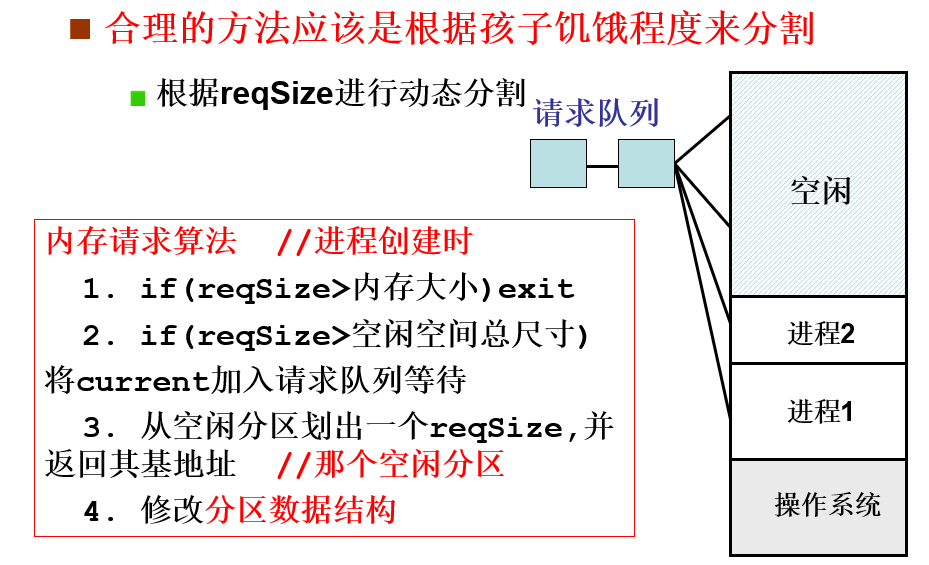
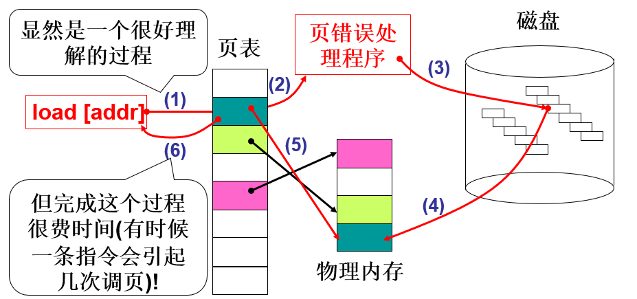
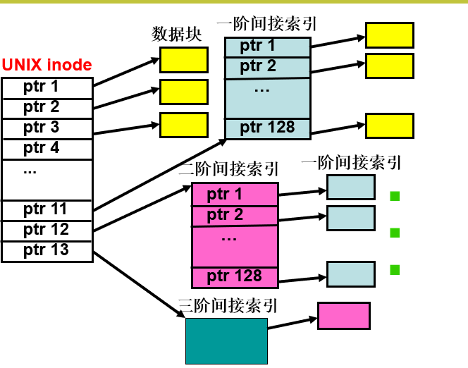

这是操作系统的学习笔记。由于课堂不允许发布课件，因此博客以个人总结为主，涉及到的图片资源不涉及课件内容，仅展示图片资源。[施工中]

1. **<a href="#1">操作系统概述</a>**
	
	<a href="#1.1">1.1 操作系统的目标和功能</a>
	
	<a href="#1.2">1.2 操作系统的发展</a>
	
	<a href="#1.3">1.3 语法分析概述</a>	
	
	<a href="#1.4">1.4 语义分析概述</a>
	
	<a href="#1.5">1.5 中间代码生成以及编译器后端</a>
	
	<a href="#1.6">1.6 T型图</a>
	
2. **<a href="#2">操作系统结构</a>**
	
	<a href="#2.1">2.1 操作系统提供的服务</a>
	
	<a href="#2.2">2.2 操作系统为用户和程序员提供的接口</a>
	
	<a href="#2.3">2.3 操作系统结构及其相互关系</a>
	
3. **<a href="#3">进程</a>**
	
	<a href="#3.1">3.1 基础概念</a>
	
	<a href="#3.2">3.2 正则定义</a>
	
	<a href="#3.3">3.3 文法分类</a>

4. **<a href="#4">线程</a>**
	
	<a href="#4.1">4.1 基础概念</a>
	
	<a href="#4.2">4.2 正则定义</a>
	
	<a href="#4.3">4.3 文法分类</a>
	
5. **<a href="#5">CPU调度</a>**
	
	<a href="#5.1">5.1 FCFS</a>
	
	<a href="#5.2">5.2 SJF</a>
	
	<a href="#5.3">5.3 SRJF</a>
	
	<a href="#5.3">5.3 Round Robin</a>
	
6. **<a href="#6">进程同步</a>**

	<a href="#6.1">6.1 基础概念</a>
	
	<a href="#6.2">6.2 基础概念</a>
	
	<a href="#6.1">6.1 基础概念</a>
	
7. **<a href="#7">死锁</a>**

	<a href="#7.1">7.1 基础概念</a>

8. **<a href="#8">内存管理</a>**

	<a href="#8.1">8.1 基础概念</a>
	
	<a href="#8.2">8.2 内存分配方案</a>

	<a href="#8.3">8.3 扩展：ELF文件的格式</a>

9. **<a href="#9">虚拟内存</a>**

	<a href="#9.1">9.1 </a>
	
10. **<a href="#10">IO设备管理</a>**

	<a href="#10.1">10.1 </a>
	
11. **<a href="#11">磁盘与文件</a>**
	
12. **<a href="#12">文件系统</a>**
## **<a id="1">1. 操作系统概述</a>**

操作系统的定义：计算机系统中的一个系统基础软件，它是这样一些程序模块的集合：它74们能有效地组织和管理计算机系统中的硬件及软件资源，合理地组织计算机工作流程，控制程序的执行，并向用户提供各种服务功能及相应接口，使用户能够灵活、方便和有效地使用计算机，使整个计算机系统能高效地运行。

操作系统在计算机系统中的地位是介于计算机硬件和应用软件和用户之间的中介。

             
图1.1 操作系统的地位
 

从用户的角度来看，OS是服务的提供者；从系统的角度来看，OS是**资源的管理者**和**程序的执行控制者**。OS分配诸如CPU、内存之类的资源给进程，并控制程序的执行，掌控进程间的交互；紧贴系统硬件之上，所有其他软件之下，给其他软件提供共同的运行环境。

### **<a id="1.1">1.1 操作系统的目标和功能</a>**

操作系统应达到的目标：

- 方便：让计算机易于使用。这也是OS产生的根本原因。
- 有效：OS以更合理的方式调度系统资源。
- 可扩展：一个合格的OS必须考虑系统的可扩展性，因为OS不可避免地要发生变化，例如新的需求、硬件升级、修复bug等。

操作系统的功能，三个基本的角度：

- 管理硬件（最根本的任务）。
- 管理应用（提供服务）。
- 调度任务，分配资源。

OS需要管理的硬件设备包括：

1. CPU（进程管理）：处理器的分配调度策略、分配操作、回收再分配等。
2. 内存（存储管理）：为进程分配、释放内存空间，隔离程序与数据，虚拟内存。
3. 外存（磁盘、文件管理等）：管理大容量存储设备；存储结构-文件系统格式；读、写、修改文件等；文件系统；磁盘调度。
4. IO（网络、外部设备）：抽象化设备，IO调度、驱动框架。

这些功能彼此依赖。

### **<a id="1.2">1.2 操作系统的发展</a>**

以下按时间顺序简要介绍操作系统的发展历史。

#### 手工操作

20世纪50年代左右，程序的执行需要手工输入机器码，通过卡片穿孔记录来存储程序。这一时期出现了汇编语言和汇编编译程序。

###### 脱机输入输出

随着计算机的发展，计算机的速度往往显著快于联机输入输出的速度（例如，操作员手工输入卡片），因此需要等待外部输入。为了提升效率，引入了一个外部的微型机，负责对外存（磁盘）做操作，将输入复制到磁盘，将磁盘上的内容输出到外部。而计算机本身只需要与磁盘交互。

#### 简单批处理系统

50年代中期，晶体管的出现使得批量生产计算机成为可能。厂商设计出管理程序（监督程序），像FORTRAN、ALGOL这样的高级语言也可以投入使用了。

计算机上的管理程序能够从磁带上自动识别一个作业，处理后再取下一个作业，这就是**批处理**。只能串行执行作业的便是单道批处理系统。

#### 多道批处理系统

标志着现代意义上的OS出现。随着主存、辅存的容量增大，可以同时装入多个程序到主存。同时出现代替CPU管理IO设备的**DMA**通道，使得CPU操作和IO操作并行成为可能。典型的多道批处理系统有FMS(FORTRAN Monitor System)和IBMSYS。

所谓多道是指系统中可以同时驻留多个作业。不同作业共享内存并对CPU产生复用，当一个作业因某些原因暂停运行时，可切换到另一个作业上运行。这难道不就像现代的计算机的进程调度吗？

在多道批处理系统之前，OS处理任务都是具有固定顺序的，多道批处理系统的出现使得任务的执行顺序变得不确定。

#### 分时系统

随着多终端计算机的出现，人机交互的需求越来越多，OS必须将能够快速响应用户操作这一需求纳入考量。

与多道批处理OS的区别主要在于：

- CPU在任务间的切换设定了固定的时间。（时间片）
- 允许存储器调度，即当任务过多主存放不下时，可以将任务写回磁盘，需要时读回。（内存调页）

世界上第一个分时OS：1961年由MIT开发的CTSS。

#### UNIX

UNIX是20世纪60年代由贝尔实验室设计出的操作系统，是现代操作系统的代表。融合了多道、分时、调页的优点，并做了一些优化。

#### DOS、Windows

大众化的OS。

#### Linux

被视为新版的UNIX，自由版权的OS。

### **<a id="1.3">1.3 现代OS的特性</a>**

#### 并发性

宏观上，OS内有多个任务在一段时间内都正在运行；微观上，多个任务以交替的方式执行，且不可预知，这样的OS具有并发性。

#### 共享性

系统中的资源可供内存中多个并发执行的进程/线程共同使用。由于资源的性质不同，共享资源的方式也不同。有的资源同一时间只能有一个任务占用，称为独占资源（临界资源），对独占资源（临界资源）的访问是互斥共享；相应地，允许在一段时间内多个任务同时访问资源的情况，称为同时共享。

#### 虚拟性

通过某种技术让某个物理实体变为若干个逻辑上的对应产物，称为虚拟。OS中虚拟性借助于时分复用和空分复用来实现。

#### 异步性

异步性指的是并发的进程以不可预测的速度向前推进，执行时间不确定。

## **<a id="2">2. 操作系统结构</a>**

### **<a id="2.1">2.1 操作系统提供的服务</a>**

OS提供的一般服务：

- 用户界面
- 程序执行
- IO操作
- 文件系统操作
- 通信（包括IPC、RPC等）
- 错误检测
- 资源分配
- 统计
- 保护与安全

### **<a id="2.2">2.2 操作系统为用户和程序员提供的接口</a>**

#### GUI

#### 系统调用

进程区分访问等级可划分为0~3级，其中Unix/Linux OS只使用0级和3级，数字越小，权限等级越高（0就代表着内核态）。由于CS:IP指向当前指令，故常常用CS的最低两位（也叫CPL）来表示访问等级。

处于内核态的代码，可以访问任何数据，而处于用户态的代码不能访问内核数据。

OS提供的由用户态转为核心态的方法。桌面操作系统一般只有软中断这一种方法，即中断陷阱指令int（嵌入式OS大部分不区分用户态和核心态，除了QNX/Neutrino）。

系统调用主要分为五大类：

1. 进程控制：创建、加载、执行、终止、唤醒、内存分配、释放...等等
2. 文件管理：创建、删除、打开、关闭、读、写、重定位...
3. 设备管理：请求、释放、读、写、重定位、获取属性...
4. 信息维护：读取/设置系统数据...
5. 通信：创建/断开通信连接、收发消息...

系统调用的处理过程：

1. 由用户进程发出陷入指令（int）
2. 进入**中断处理程序**（核心态）保护现场，将必要的寄存器压栈。OS也会进行一些保护现场的操作。
3. 根据调用的系统功能号，查系统调用的**入口地址表**获得那个系统功能的地址。
4. 进入该地址处理系统调用（核心态）。
5. 从系统调用返回，恢复现场，结束处理。

系统调用的参数传递，其规则由编译器决定。传参有三种方式：

1. 直接用寄存器传参，有数目限制；
2. 指定内存块。用寄存器指定地址和偏移。
3. 借助系统栈。（不是很常用，因为用户向系统栈压栈并不容易）

注：API比系统调用的概念更宽泛，是系统调用的封装，使用更方便，程序可移植性更好。

#### 系统程序

介于OS和用户应用程序之间的程序，主要提供支撑运行额环境。包括资源管理器、IDE、编译器、DBMS、浏览器、installer、PS、LS、KILL...等等。

### **<a id="2.3">2.3 操作系统结构及其相互关系</a>**

#### 操作系统结构

1. 简单结构：如DOS系统，整个OS几乎是单一整体。
2. 模块化：核心态有一个强大的核心内核，掌握进程管理、文件管理、设备管理等基本功能，还掌握其他模块加载和通信的接口，如Linux单内核结构。
3. 分层结构：整个OS分为若干层。从内到外，层层封装，i层只能用0~(i-1)层的函数或调用（更严格的分层要求只能使用i-1层函数调用），如UNIX OS。
4. 微内核：只把最基本的功能作为内核，比如最小的进程管理、进程通信等，而其他功能以系统程序或用户程序的形式出现。主要用于嵌入式操作系统，如Vxworks、Space OS、神舟 OS等。鸿蒙OS也自称是微内核（桌面操作系统、IOS、Android都是宏内核）。

             
图2.? 微内核的结构
 

5. 分布式系统：

## **<a id="3">3. 进程</a>**

进程的概念，与OS的发展密不可分。

1. 手工操作时期：一次装入并运行一个任务
2. 简单批处理：同时装入多个程序，串行地执行
3. 多道程序批处理：同时装入多个程序，并发执行，仅当等待IO时切换执行
4. 分时处理：同时装入多个程序，并发执行，当等待IO或是用尽时间片时就切换程序的执行

为了在不同的执行的程序之间切换，同时又保留他们执行时的资源和信息，就要引入进程的概念。

**进程**是一个正在执行的程序的实例，是可以分配给处理器执行的一个实体。进程的概念包含着任务的动态执行过程和状态。

### <a id="3.1">3.1 进程的特征</a>

1. 动态性：进程因创建而产生，因调度而执行。因得不到资源而暂停执行，因完成或撤销而消亡。进程是有生命周期的。
2. 并发性：多个进程可以并发执行，提高CPU利用率。
3. 独立性：进程是一个可独立运行的基本单位，也是资源分配、调度的基本单位。
4. 异步性：进程以各自独立的、**不可预知**的速度向前推进。
5. 交互性：进程运行过程中可能会与其他进程发生直接或间接的交互。

### <a id="3.2">3.2 进程的描述</a>

由于进程执行具有间断性，进程可能拥有多种状态。

             
图3.1 进程的7状态变化图
 

注：挂机状态表示在内存中占用的区域被换出到磁盘时的状态。挂起状态是虚拟存储管理的基础。

对于单个进程，OS需要对进程建立起一个“进程映像”来表达对进程的描述。进程映像包含：

- 一段可执行的程序（代码）
- 程序所需的相关数据（堆、栈、缓冲区等）
- 记录程序执行的上下文环境和运行时信息（PCB）

### <a id="3.3">3.3 PCB</a>

Process Control BLock，一个线性的数据结构，描述和记录进程的动态变化信息。系统创建一个进程，就是由系统为某个程序设置一个PCB。执行完成时回收其PCB，该进程便消亡了。

PCB是进程存在的唯一标志。通过PCB可以访问到进程的所有信息。PCB一般包括：

- 进程标识符（PID）
- 进程状态
- 进程队列指针（记录PCB链表中下一个PCB的地址）
- 程序地址范围（开始地址与结束地址，使用的地址空间）
- 优先级
- CPU现场保护区（记录让出CPU时的CPU现场信息，寄存器组）
- 通信信息（记录与其他进程的信息交换情况）
- 家族联系（父进程的PID）
- 占有资源清单（打开文件列表、所需资源、已分配资源清单）

### <a id="3.4">3.4 进程操作</a>

> 进程的挂起属于进程调度的范畴，不算进程操作。

进程操作都是基于原语的，也即执行期间不能分割的。

#### 进程创建

为被创建进程形成一个PCB，并填入相应的初值。

进程创建的步骤：

1. 向系统申请一个空PCB的结构。
2. 根据父进程所提供的参数将子进程PCB初始化。
3. 将PCB插入就绪队列。
4. 返回进程标识号。

典型的创建进程的系统调用：fork()

调用fork后创建的子进程和原来执行的是相同的程序（但往往走向不同分支），往往在子进程中要调用exec函数来执行另一个程序。exec调用的过程不创建新进程，只是“变身”执行程序。进程的PID不变。

#### 进程撤销

应当在进程完成任务后予以撤销，及时释放占用资源。

两种策略：撤销特定标识符的进程，或是撤销指定进程和其子孙进程。

进程撤销的步骤：

1. 从PCB集合中找到被撤销进程的PCB。
2. 若其处于运行状态，立即停止之，设置调度标志，一边进程撤销后将CPU分配给其他进程。
3. （对于第二种撤销策略）若被撤销进程有子孙进程，将该进程的子孙进程撤销。
4. 被撤销进程的资源，要么归还给父进程，要么归还给系统。
5. 撤销PCB。

典型的进程撤销的系统调用：exit()。

#### 进程阻塞与唤醒

阻塞原语的效果是修改进程的状态，从执行状态转变为阻塞状态。唤醒原语的作用与之恰好相反。

进程阻塞的步骤：

1. 中断处理机，保存线程。
2. 将该进程插入到等待特定事件的队列中。
3. 从就绪进程队列中，选择一个进程投入运行。

当该进程等待的事件发生时，阻塞进程将被唤醒，进入就绪态。

典型的进程阻塞系统调用：sleep()、wait()

典型的进程唤醒系统调用：wakeup()

注：一个进程转向阻塞态是由该进程自己调用阻塞原语完成的。而进程转向就绪态则是由于另一个进程/中断服务程序/OS调用了唤醒源语。

### <a id="3.5">3.5 进程调度</a>

OS为了管理、调度进程，常将具有相同属性的进程保存到进程队列中。进程队列往往以链表的形式实现，进程队列的元素时PCB（Linux中，是Task_struct）。

进程队列有几种分类方式：

- 按状态：就绪、阻塞、运行...
- 按等待的设备：磁盘、键盘...
- 按进程等待的事件：鼠标双击...
- 按进程等待的信号量、消息队列...

             
图3.2 进程队列的实现示例
 

按照调度的规则，调度程序也分为数种：

- 长期调度程序：从磁盘缓冲池中选择进程，常用于大规模分布式系统。
- 中期调度程序：在内外存之间交换进程。
- 短期调度程序：选择就绪态的进程为其分配CPU。

对于短期调度程序，常见的引发调度的4种场景：

1. 因等待某些事件主动让出CPU（比如IO）
2. 规定的时间片到了
3. 出现了更高优先级的进程
4. 进程自动终止退出

详细的单核CPU调度算法介绍可见下一节。

##### 多核CPU调度算法

###### 全局队列调度

OS维护一个全局的任务等待队列，每当有CPU空闲，OS从该全局队列中选取一个就绪态任务分配给此核心执行。优点是CPU核心利用率高！

###### 局部队列调度

OS为每个CPU内核维护一个局部的任务等待队列，当某个CPU空闲时，从该核心自己的任务等待队列中选取恰当的任务执行。优点是任务基本无需在多个CPU核心间切换，利于提高局部Cache命中率。

主流的多核CPU采用全局队列调度算法，结合处理器亲和度机制。

### <a id="3.6">3.6 IPC</a>

并发的进程可以是独立的，也可以相互协作！相互协作的核心就是进程间共享信息，即进程间通信。IPC指至少两个进程或线程间传送数据或信号的一些技术或方法。这些进程可以运行在不同计算机上！

IPC技术主要包括：

- 消息传递（直接的、间接的）
- 共享内存
- RPC

#### RPC

RPC指远程过程调用，允许进程调用另一个地址空间的过程。

RPC采用C/S模式。调用者（或者说，请求程序）就相当于客户机，服务提供者就是服务器。调用进程将有进程参数的调用信息发到服务进程，然后等待应答。服务器端，进程保持睡眠状态直到调用信息到达。一个调用信息到达后，服务器获得进程参数，计算结果，然后发送答复信息，最后客户端接收答复信息，然后调用继续执行。

一个RPC框架设计，需要考虑：

- 如何在服务端确定客户端要调用的函数，即维护一个共识性的ID->函数的映射表。
- 如何进行序列化/反序列化：传参、传结果的过程可能非常耗时。
- 选用何种网络协议：多数RPC框架选择TCP，有的选择HTTP。

#### LPC

与RPC相对的是LPC（用于本地多任务系统间的会话）。

###### 共享内存

             
图3.3 共享内存
 

###### 直接通信

需要明确通信的接收者和发送者。只需通过系统调用send 和 receive即可。

###### 间接通信

进程间通过邮箱/端口/对象来发送和接收消息。

#### Linux IPC 方法

共享内存、消息传递上文已给出，不多赘述。

- socket：不只可用于不同主机，也可用于同一主机！
- 管道：最古老的IPC机制，分为无名管道和有名管道。前者用于父子进程间的通信，后者用于运行于同一主机上任意两个进程间的通信。
- 消息队列：类似于命名管道，不过，管道以文件的形式组织何使用，而消息队列中处理的最小单元是消息。

#### Windows IPC 方法

             
图3.4 Windows IPC 方法
 

### <a id="3.7">3.7 进程的可执行映像</a>

             
图3.5 ELF文件格式
 

Linux系统中，可执行文件、动态库文件、目标文件、核心转储文件都是ELF格式的。不过，可执行文件没有section header table，目标文件没有program header table，而动态库二者都有！

>因为链接器在链接的时候需要section header table来查看目标文件各个 section 的信息，然后对各个目标文件进行链接，而加载器在加载可执行程序的时候需要program header table ,它需要根据这个表把相应的段加载到相应的虚拟内存（虚拟地址空间）中。

也因此，section header table用于链接视图。像.text、.data这类的都叫“section”，他们的相关信息存储在section header table中。

各个section存储的信息如下：

- bss:存储未初始化的全局数据，当程序运行时，默认初始化为0。
- comment:版本控制信息。
- data/data1:存储已初始化的全局变量等数据。
- debug：存储调试信息。
- dynamic：动态链接信息。
- hash（有时也称为.gnu.hash)：用于查询符号的散列表，在LinuxELF文件中查找符号名。
- line：描述源代码与机器码之间符号调试的行数信息。
- rodata/rodata1：只读数据区。
- shstrtab：节的名称字符串表。作用类似于strtab，不过存储的不是函数/变量名字的字符串，而是节名字的字符串。
- strtab：符号字符串表，会被symtab中引用，表示符号名！
- symtab：符号表。存放程序中定义和被引用的函数和变量等信息。每个目标文件都有符号表。
- text：存储程序代码。
- plt：过程链接表，包含动态链接器从共享库导入的函数所必需的信息。存于text段中！
- got.plt：got保存了全局偏移表，他和plt一起提供了对导入的共享库函数的访问入口，由动态链接器运行时修改。
- dynstr：动态符号字符串表。

program header table用于执行视图。文件载入内存执行时，以segment组织，每个segment对应ELF文件中program header table中的一个条目。所谓“代码段”、“数据段”指的就是segment，链接视图的不同section会组装到各个segment中，例如.data、.bss会组装到数据段中。

## **<a id="4">4. 线程</a>**

线程保留了进程并发的优点，又避免了进程切换和进程间通信的高代价。

             
图4.1 多线程进程模型
 

线程代表着进程中代码执行的一个序列，一个进程中至少存在一个线程，在其生命周期中，可以创建多个线程，它们代表着彼此独立的执行序列，但是也可以具有一些关联关系。

线程由**线程ID、程序计数器PC、寄存器组和栈**构成。线程之间可以共享它们所属进程的所有资源，还能节省上下文切换的代价。此外，部分线程阻塞，其他线程仍有机会执行。

注：嵌入式操作系统，如vxworks，其中大多没有线程的概念，取而代之的是“任务”，它的地位与线程基本相当，不过vxworks中只有单进程，故所有任务共享内存和资源。

### <a id="4.1">4.1 多线程模型</a>

线程有两种实现：用户线程和内核线程。注意，他们都是由用户程序创建的，只是用户线程虽受内核支持，却不需内核管理；内核线程由OS直接支持和管理。有的OS可以真正地以线程为调度单位，而有的则不支持。

#### 多对一模型

是一种用户线程模型。

             
图4.2 多对一线程模型
 

如图4.2所示。注意，这种模式下线程对内核是不可见的，内核只知道进程，一个进程中由线程库在用户空间管理着多个线程，任何时刻只有一个线程能访问内核，而且同一个进程的线程**不能**运行在不同的CPU上。一个线程执行了阻塞系统调用，会导致其所在的整个进程阻塞。

由于这种模式下内核不知道线程的存在，也就不需要额外的数据结构访问之，协调线程的工作交由用户级线程库完成。

#### 一对一模型

是内核线程模型。Windows和Linux都采用这种模型。

>虽然它们的线程模型都是一对一，但它们都是支持多进程、多线程的操作系统。

             
图4.3 一对一线程模型
 

在该模型中，线程是内核线程，线程对内核可见（但仍然由用户创建，并且**属于特定的进程**）。一个线程执行了阻塞的系统调用时，CPU可以切换到其他线程，并发能力更强了。不仅如此，内核能感知到线程，所以可以为线程分配CPU资源。一个进程的不同线程可能运行在不同的CPU上。

>Linux中实现该内核线程模型时，实际上是借助于一个“轻量级进程”与内核线程建立起一对一的关系。而进程与线程仍旧是一对多的。
>
>轻量级进程LWP与fork()函数创建的子进程不同，只调用clone()将父进程的部分资源复制到其中，复制的内容是可选的，没有被复制的内容可以通过指针共享给LWP。LWP与内核线程是一对一映射的。

内核中不仅需要维护进程表，还要维护线程表。进程表和线程表之间也有关联。

#### 多对多模型

是混合线程模型，即用户+内核线程模型。

             
图4.4 多对多线程模型
 

允许多个用户态线程与内核线程（实际上，是LWP）连接，他们之间是多对多的关系。

###### 几种线程模型的比较

             
图4.4 几种线程模型的比较
 

### <a id="4.2">4.2 协程</a>

一种轻量级的用户态线程，协程的调度不是抢占式的，而是非抢占式，即当前协程来控制是否要切换给其他协程执行。一般的协程框架都是一对多的，即一个线程作为一个容器承载多个协程。

协程模型的实现一般是借助于编译器的线程技术的。Go语言天生支持协程模型，其为了实现多对多的线程调度机制，引入了MPG调度机制。

## **<a id="5">5. CPU调度</a>**

>进程、线程都可以是CPU资源调度的单元，调度策略都是相似的，因此以下以进程调度为例。

指CPU分配计算资源的策略。一个良好的CPU调度策略应该满足：

- 提高CPU的利用率
- 提高系统吞吐量
- 减少进程的等待和周转时间
- 提高用户的响应满意度
- “公平、合理”地分配CPU

这些要求往往不能同时满足，因为它们相互冲突。

进程的执行过程时间段可以被划分为CPU执行区间和IO等待区间，它们分别对应计算类代码（比如图像处理）和IO访问类代码（比如访问磁盘，或者读取键盘输入）。CPU区间较长、较多的程序称为计算密集型/CPU约束型程序，IO区间较长、较多的程序称为IO约束型程序。

>实际应用中，CPU区间大部分是中短期的。

调度又可大致分为抢占式和非抢占式调度。抢占式调度对应规定的执行时间片耗尽和出现了更高优先级进程的情况，非抢占式调度对应因某些事件主动让出CPU和进程完成任务自动终止退出的情况。

### <a id="5.1">5.1 FCFS</a>

即先来先服务策略，调度的顺序就是任务到达就绪队列的顺序。FCFS是基于FIFO队列的，非抢占式的绝对“公平”的调度策略，其是最简单的，但未必是最合理的。

FCFS的特点：绝对公平、简单、非抢占式调度、不适合交互式。

### <a id="5.2">5.2 SJF</a>

即最短作业(任务？)优先策略。SJF优于FCFS的一点是，通过让执行时间最短的任务最先执行，能减少平均的任务等待时间。

             
图5.1 SJF示例
 

思路很简单：每次调度一个任务执行，所有其他等待的任务就需要等待这些时间。因此，时间长的任务如果在前被调度，会有更多的任务等待了该任务的执行时间。从总体角度考虑，SJF是最快的！

### <a id="5.3">5.3 SRJF</a>

即最短剩余时间优先策略。换言之，SRJF是SJF的一个可抢占版本。考虑到任务到达的时间有先后，可能某些任务的剩余时间更短！当新任务到达时，总是检查其执行所需的剩余CPU区间是否为所有待执行任务中剩余所需时间中最短的一个任务，如果是则抢占成功，立即执行之（上一个执行中的任务，其所需CPU区间减少已经执行的部分）。

             
图5.2 SRJF示例
 

通过引入抢占机制，SRJF的平R均等待时间更优于SJF了，它能确保任务在不同时间抵达时，也总能保证可以最先执行完成所需时间最短的任务。

#### CPU区间预测

在上述几种调度策略中，都假设任务所需的CPU区间是已知的，但实际上这是不可能的。为此必须引入对CPU区间的预测策略。

###### 指数平均法

是一种根据历史进行预测的方法。

$\tau_{n+1} = \alpha t_n + (1 - \alpha)\tau_n$

其中$\tau_{n+1}$是新预测值，而$t_n$是当前CPU区间。通常取α = 0.5。α = 0时，表示忽略近期，关注历史，α=1时，表示只跟当前状态有关。

#### 优先权调度

实际上，SJF、SRJF是优先权调度的一种特例。优先权调度是以某些指标设置任务的优先级，**每次调度优先级最高的任务**，只有高优先级的任务队列为空，才调度低优先级任务。在SJF中，优先级就是CPU区间长度的倒数！但是这可能会导致低优先级的任务完全得不到执行——即“饥饿”。

解决饥饿问题的一个方法是“老化”技术，即aging：任务的优先级会随等待时间增长而不断增高。

### <a id="5.4">5.4 Round Robin</a>

即“轮转”调度。可以说，FCFS是RR的一个特例，但FCFS并不适合做交互式的调度，而RR可以。

             
图5.3 RR示例
 

RR的调度是基于时间片的，所有任务轮着使用一个时间片的CPU资源。RR的平均等待时间并没有SJF、SRJF那么好，而且上下文的切换更频繁，但RR的优势在于可以**定时地响应**。

一般设定时间片为10-100ms，切换上下文的时间在0.1-1ms之间。时间片过长会导致响应时间变长，时间片过小会增加切换带来的代价，降低吞吐量（单位时间内可完成的任务数）。

### <a id="5.5">5.5 多级队列调度</a>

该调度混合了多种调度算法。按照一定规则建立多个进程队列，不同队列具有固定优先级，高优先级可以抢占。不同的队列可以给不同的时间片和采用不同的调度方法。

             
图5.4 多级队列调度
 

不过，这个调度法存在一些问题：首先，IO和CPU区间没法区分了，只有优先级；在者，低优先级任务存在饥饿现象。

#### 多级反馈队列

             
图5.5 多级反馈队列
 

可以视为一种更成熟的多级队列调度，因为该方法允许任务在队列之间移动！可根据占用CPUe时间的多少来移动队列，防止饥饿。这也是最通用的调度算法，多数OS都使用多级反馈队列（或其变体）。

### <a id="5.6">5.6 多核CPU调度</a>

###### CPU亲和性

affinity：进程/线程在指定CPU上尽量长地运行而不被迁移到其他处理器上，也叫CPU关联性。affinity使CPU的缓存命中率不至于由于频繁的切换CPU而降低 。亲和性也分为软硬两种，软亲和性是要求尽量长时间保持在指定CPU上，硬亲和性是利用内核API强行将进程/线程绑定到某些CPU上。

## **<a id="6">6. 进程同步</a>**

进程间的工作，除了要“并行”之外，有时还要相互等待协作。比如，有些工作只有在另一部分工作完成后才能开始（有没有想到顶点活动图AOV？）。

一旦涉及到相互协作，就涉及到数据共享。如果多个任务并发访问和操作同一数据且执行结果与访问发生的特定顺序有关，称为竞争条件。

### <a id="6.1">6.1 临界区问题</a>

称一次仅允许一个进程/线程访问的资源为**临界资源**，访问临界资源的代码片段称为临界区。如果多个进程/线程同时访问临界资源，就可能造成不一致的现象。

要解决临界区问题，其方案必须满足下面的条件：

1. 互斥的访问：一个进程/线程在临界区中执行，其他进程/线程则不能进入。
2. 空闲让出：临界资源空闲，而有一定数目的进程/线程想要进入临界区时，一定能使某个进程/线程进入临界区。
3. 有限等待：从进程/线程请求进入临界区开始，到允许进入的时间是有限的，不能无限等待。

### <a id="6.2">6.2 解决临界区问题的方案</a>

即如何进入和退出临界区，以达到任务互斥和同步的目的。

#### 一般软件方法

###### 轮换法

             
图6.1 轮换法
 

使用“turn”标记当前该临界区允许执行的进程/线程编号。不同的执行片段持有一个号码，就像值日一样，轮着进入临界区。一个片段执行完毕，退出临界区时，要把turn设置为下一个号码，这样下一个号码对应的进程/线程就可以进入临界区了。

**轮换法的问题：不满足空闲让出**。例如0号进程让出后，又想要进入临界区，而下一个进程还没有进入临界区，turn不会轮换到0，这就使得空闲的临界资源得不到充分利用。此外，使用软件方法实现的轮换并不是挂起进程/线程，而是不断循环判断，这会占用资源。

###### 标记法

             
图6.2 标记法
 

一个进程/线程要进入临界区时，留下一个标记表示自己要进入，然后判断是否没有其他进程/线程要进入临界区，如果是，则进入。离开临界区时，再将标记清除。

标记法的问题：如果在留下标记与判断有无其他进程/线程占用的操作之间，发生了进程/线程的上下文切换，则可能导致死循环！因此，不满足有限等待。

###### Peterson算法

可以视为轮换法和标记法的结合。

             
图6.3 Peterson算法
 

进入临界区之前，先标记当前任务希望进入临界区（设置对应flag位），并将共享的turn置为下一个任务的id。当两个任务同时要进入临界区时，只有一个turn的写入会生效。这样，就保证了不会发生死循环的同时，又能做到空闲让出！

该算法满足互斥进入和空闲让出，以及有限等待。然而，Peterson算法带来了新的问题：**优先级翻转**，即当一个高优先级的任务试图进入临界区时，一个低优先级任务已经进入临界区（且未退出），这将导致高优先级任务阻塞。一旦有一些其他较高优先级任务抢先于低等级任务执行，低等级任务得不到执行，无法退出临界区，则高优先级任务将一直被阻塞！

解决优先级翻转问题的方法：

1. 优先级天花板：一个低优先级任务进入临界区时，将其优先级提升至所有使用临界区的任务的最大值。（一说是设置为高于所有使用临界区的任务的优先级的值）
2. 优先级继承：一个低优先级阻塞了较高优先级任务时，将其优先级设置为与较高优先级任务一致。

除了会引入优先级翻转问题，Peterson算法只适合于两个进程/线程的情况。

###### 面包店算法

该算法适用于多个进程/线程的情况。

             
图6.4 面包店算法
 

每个任务持有一个编号。每次调度最小编号（且非0）的任务来执行（如果有相同的编号，则取id较小的那一个），执行后将其编号设置为0。当一个新的任务尝试访问临界区时，将当前编号的最大值+1赋值给此任务的编号！（choosing数组为真表示对应任务正在申请编号）。

中间的for循环会保证所有编号小于当前任务的任务都会先于当前任务进入临界区。面包店算法满足全部三条性质！

#### 关中断方法

如果执行临界区时，干脆不允许任务切换调度，那就再也不用担心互斥问题了！

             
图6.5 关中断法
 

>cli() 和 sti()方法可以用来暂时关闭中断和重启中断。

虽然关中断方法很简单，但是风险很高，稍有不慎就会导致巨大的危险。关中断方法现在多用于嵌入式程序。

#### 硬件指令原子化

如果对共享数据的修改是原子级的，那么就不用担心对临界资源的访问了！这需要硬件的支持。

#### 信号量

这个方法是最为常用的解决多任务并发访问临界区的互斥问题的方法，于1965年由Dijkstra提出（真厉害！）。

信号量的定义由一个数据结构和其上的两个基本操作组成。一个semaphore有一个int value表示资源个数，或者是等待资源进程的个数，还有一个queue表示等待在该信号量上的进程队列（一般是一个PCB的数组）。

两个操作分别是P（获取资源，或组织进程排队等待资源）、V（释放资源，唤醒等待的线程）

进行P操作时，如果value>0，说明资源有空闲，可以直接分配（value -= 1），否则将进程加入等待队列（同样，也要让value-=1，此时value的绝对值就表示阻塞的进程数），并阻塞之。

如果信号量的value只能取0，1，则这个信号量就是一个**互斥信号量**。

### <a id="6.3">6.3 进程同步</a>

**同步**是指多个进程按确定的协作顺序执行。

## **<a id="7">7. 死锁</a>**

死锁是指多个进程因循环等待资源而造成彼此均无法得到执行的现象。死锁可能带来非常严重的后果。

资源的互斥访问是死锁出现的**必要条件**。死锁的发生与调度的顺序有关，由于调度顺序是不确定的，所以死锁不一定总会发生。不确定的错误往往才是调试的难点。

为了更清晰地描述循环等待的情况，引入**资源分配图**：

             
图7.1 资源分配图
 

死锁的四个必要条件：

1. 互斥使用：至少有一个资源存在互斥的使用。
2. 不可抢占：资源只能由占有者**自愿**放弃。
3. 请求和保持：进程必须占有一个资源后，再去申请其他需要的资源。
4. 循环等待：在资源分配图中形成一个环路。

要处理死锁，可以做死锁预防、死锁避免、死锁检测+恢复。

#### 死锁预防

即破坏死锁的必要条件。互斥使用性一般与资源的固有特性有关，不能破坏；但有时可以破坏不可抢占性。可以使一个进程占有资源并申请另一个不能立即分配的资源时，已分配的资源可以被抢占（即持有而不能立即投入使用的资源可以被抢占）。

然而，有的资源也是有**不可破坏不可抢占性的**！只有像CPU、内存空间这样可以保存、恢复状态的资源可以破除不可抢占性，像打印机这样的资源，不能抢就是不能抢。

至于请求和保持性，可以考虑在进程执行前，一次性申请所有需要的资源，但这方案一方面从程序上难以实现（毕竟，不同分支需要的资源可能不同），另一方面会造成大量的资源浪费（申请而不使用）。

如果想要破除循环等待性，就要改变资源申请的顺序，让各个任务的资源申请都是同样的顺序。然而，这一方面增加了编程的难度，一方面又可能导致资源得不到充分利用。

预防死锁的各种方法都有代价，或是根本不可行，因此实际应用中较少使用。

#### 死锁避免

死锁避免的思想是，判断一次请求资源的过程是否会造成死锁，如果会，则拒绝此次请求。

**安全状态**指系统中所有的进程存在一个可完成的执行序列。安全状态的系统可以让所有的进程安全地（不产生死锁地）执行完毕。

###### 银行家算法

定义如下几个变量：

- Available：起始时，各种资源的可用总量。
- Work：当前各种资源可**用于分配**的数量，Work会随着分配资源的顺序变动而改变。
- Allocation：各个进程已分配的各种资源数量。
- Need：当前各个进程还需要分配的各种资源数量。
- Finish：标记各个进程是否执行完成。

算法过程：

             
图7.2 银行家算法
 

银行家算法可以用来判断系统是否处于安全状态。应用银行家算法于死锁避免，可以先假装分配给某个进程某些资源（增加allocation计数，减少Need计数），然后判断是否有安全状态，若无，则不能分配。

缺点：每次资源请求都调用银行家算法，效率降低；且进程进入系统时必须告知所需资源地最大数量。另外，可能有的资源虽然会使整体处于不安全状态，但很快就被释放，但仍不会被分配，因此资源利用率降低。

#### 死锁检测+恢复

只要可用资源足够就分配，发现问题再处理。可以定时检测，或是发现资源利用率低时检测（还是借助于银行家算法）。

要从死锁中恢复，需要选择进程终止并剥夺其资源。那之后，进程需回滚状态。

缺点在于仍需执行银行家算法，且恢复操作并不容易！

#### 死锁忽略

由于没有比较完美的解决方案，干脆完全不理死锁。

## **<a id="8">8. 内存管理</a>**

程序要想执行（变为进程），需要将可执行文件加载到内存中。程序编译过程得到的是逻辑地址，而不是实际的物理地址。为了解决进程的并发问题（防止进程之间的地址冲突），以及提高利用率，桌面型操作系统一般采用**运行时重定向**来进行地址的转换。

嵌入式操作系统则多采用编译时重定向，即编译成程序时，其地址已经确定了。因此，很多嵌入式OS甚至没有内存管理。

### <a id="8.1">8.1 重要概念</a>

###### 虚拟地址

指的是用户编写的程序中，将代码、数据分成若干段，每个代码、数据的地址由**段名（段地址）** + **段内的相对地址（offset）**组成，这样的地址就是虚拟地址。

###### 逻辑地址

指虚拟地址中的段内相对地址部分。按照此定义，逻辑地址是虚拟地址的部分，但有的说法认为不区分它们，认为它们是一个东西（逻辑地址）。

###### 物理地址

实际的物理内存中的存储地址。

###### 逻辑地址空间

指逻辑地址的集合。

###### 线性地址空间

CPU的地址总线可以访问的所有地址集合。逻辑地址空间一定是线性地址空间的子集。

###### 物理地址空间

实际存在的可访问的物理内存地址集合。

###### MMU

内存管理单元，负责将虚拟地址（逻辑地址）映射为物理地址，以及其他内存相关的存储器管理。

#### 小结

嵌入式OS中，虚拟地址 = 物理地址。桌面型OS中，虚拟地址 ≠ 物理地址。

### <a id="8.2">8.2 内存分配方案</a>

#### 连续内存分配

分配方案可分为固定分配和可变分配。其中，固定分配又可分为等长分配和变长分配。

###### 固定分配

             
图8.1 固定分配-等长分区
 

提前将内存等分成k个等长的分区，如果reqSize大于分区的大小，则不允许这样做，否则分配一个空闲的分区，这就是等长分区法。如果提前将内存分成k个**大小不同的分区**，则就是变长分区法。注意：这两种方法都是固定分配法，都是事先分配好空间，并且运行时不可变。

###### 可变分区

可变分区法是更为合理的连续内存分配方法。每次从空闲区域动态地划分出一个reqSize的空间，分配给进程。

由于之前申请的空间可能被释放，空闲区域也会有多个。

             
图8.2 可变分区
 

关于具体如何选择分区，有如下的几种分配策略：

- first-fit:按序查找的第一个符合要求的块就拿来分配。
- best-fit:查找最小的满足要求的分区。这个过程要搜索整个空闲分区表，较慢，而且会导致许多细小的空闲区域产生。
- worst-fit:查找最大的满足要求的分区。同样要搜索整个空闲分区表，较慢，但这样产生的新空闲分区大一些。

##### 碎片问题

上述的分配方案都会导致碎片问题，即在分配区域之间的较小块，那些得不到利用的空间。

###### 内部碎片

指那些被分配给进程使用，但并未被占用的空间。这样的内部碎片没有被使用，但也是绝不可能分配给其他进程的。例如，固定分区中那些多余分配的空间。

###### 外部碎片

随着进程不断加载、释放，对分区不断地分割，使得空闲分区中出现了许多很小的分区，这些空间不连续，由于太小，也无法分配！

###### 内存紧缩

碎片的产生难以避免，但可以消除。所谓内存紧缩，就是将空闲分区合并在一起。

内存紧缩的缺点是时间成本高。

#### 分段内存管理

程序的可重定向文件由多个Segment组成。这样的划分不仅可以根据不同的功能含义划分文件，还能为每个段独立编址。

程序员要定义某条指令（或数据）的位置，使用CS:IP（段号，段内偏移）来定位。

>PC指的是程序计数器，是计算机科学的概念。CS:IP是x86CPU的实际存在的寄存器，分别是段寄存器和指令指针寄存器，实际上起到了PC的作用。

进程维护一个段表，将段号映射为对应的物理地址基地址和偏移量（段的长度）。段与段之间的物理地址就可以是不连续的。段表一般不会太大，因为每个段的大小会比较充足，而按照功能划分的段一共也就那么几个。

然而，分段内存管理仍不能解决碎片问题（实际上，段内余留而未用的空间正是内部碎片！）

#### 分页内存管理

分页内存管理的思路是**按需供给**。将逻辑地址空间划分为等长的数“页”（一般为4K大小），物理地址空间也划分为等长的“帧”。程序的逻辑地址就变为页号 + 页内偏移的组合。程序执行的过程中，要访问的页号是固定的，但实际上映射于物理地址上的帧可能不同。这也使得内存分配可以是不连续的！

进程要维护一个页表，在PCB中给出页表指针。

             
图8.3 分页内存管理
 

>由于一般页的大小为4K，页内偏移用12位就可以表示，因此逻辑地址一般都是固定采用低12位作为页内偏移，高20位（以32位系统为例）作为页号。这也足见分页管理可以将内存划分的如此之细致！

             
图8.4 分页的地址翻译
 

而且，由于帧和页是一样大的，只需要将帧号（页框号）替换页号，直接就能得到物理地址，岂不美哉！

**不同于段表**，页表的大小可能会很大！因为分页内存管理就是用来解决碎片问题的，页的尺寸应该足够小（4K是比较小的），4G内存的话就可以映射出2^20个页，足足1M个页表条目，4MB大小。

查表的操作很频繁，为了查表快速，就要维护连续页号的页表，这样可以随机访问（就像数组！），否则，就要二分查找（页表一般是按照页号有序的）。

###### 多级页表

上述所说的页表实际上是**一级页表**，每个页表的大小都要占用4M的内存大小。然而， 很多进程并不这么复杂，可能只占用数个，甚至一个页！没有必要为这样的小的程序分配如此庞大的页表。为此，引入多级页表：

将页号的高数位再分，分作“页目录号”（一般每个页目录对应4M的内存，也即使用高10位做页目录号）。

用一个顶层的页表存储各页目录号对应的子页表，顶层页表常驻于内存，而没用到的逻辑地址就不用建立页表项。这样一定程度上保留了随机访问的能力，并节省了存储空间。

             
图8.5 多级页表的地址翻译
 

使用多级页表也是一个trade off：要么省空间，增加翻译的时间；要么翻译速度快而占用内存大。实际上，与直接访问一个地址相比，使用1级页表就已经使得翻译速度下降50%，使用2级页表速度下降为原来的$\frac 1 3$。要加速页表的翻译过程，可以考虑用硬件支持，即TLB(Translation Look-aside Buffer)。

TLB将页表的内容缓存到寄存器中。但是，寄存器的容量是很小的，TLB的内容必定不会太多。

             
图8.6 TLB的地址翻译
 

在TLB中存储的页表条目，可以借助于硬件支持，并行地查找，非常快速。然而一旦TLB中查不到页号，说明没有缓存，那么还要去读页表，还比直接读一级页表更慢了！

要从整体期望的角度来看TLB的表现，就不得不考虑TLB缓存命中的命中率。

$$
有效访问时间 = HitR(TLB + MA) + (1-HitR) \times (TLB + 2MA)\\
其中，HitR表示TLB缓存命中率，TLB表示查找TLB中缓存的时间，MA表示内存访问时间。
$$
命中率越高，自然是越好的！但TLB价格昂贵，TLB的大小通常在64-1024个页条目之间。即使只有64个条目，TLB的存在仍能总体上改善地址翻译效率，这是因为程序的地址访问存在局部性。

TLB未命中时，要考虑将查到的页表项载入TLB。进程切换时，页表也要考虑切换。

#### 段、页结合内存管理

让段面向用户，让页面向硬件。即通过虚拟地址CS:IP计算出的地址，仍需再经过页表映射。为加以区分，常称经过CS:IP映射出的地址为线性地址，再由线性地址得到物理地址。

             
图8.7 段页式内存管理
 

### <a id="8.3">8.3 ELF文件的格式</a>

ELF(Executable and Linking Format)指可执行和**可链接**格式，是Unix/Linux系统ABI规范的一种文件形式。Unix下的可执行二进制文件、目标代码文件、.so文件、coredump都属于ELF文件。

ELF文件的大致结构如下:

             
图8.8 ELF文件结构
 

## **<a id="9">9. 虚拟内存</a>**

虚拟内存相关的十六字方针：

**段页管理 部分加载 按需调页 换入换出**

虚拟内存必须考虑的问题：内存不够怎么办？

最终的结果是，每个进程都能使用CPU的线性地址空间！其可以远大于物理地址空间。

### <a id="9.1">9.1 按需调页</a>

对不在内存中的页，只有进程需要时，才会调入。

             
图9.1 按需调页：改进页表
 

改造页表，给页表增加一个有效/无效位。有效位为真表示这个页表对应的帧正在真实的物理内存中存放着，为假表示该帧存放在辅存中。

             
图9.2 Intel x86 CPU的分页硬件
 

- P：存在标志，用于按需调页
- A：已访问标志，用于LRU换出策略
- D：页面已修改标志（Dirty），可以判断是否需要换出（没被修改，不用换出，下次需要重新从磁盘加载即可）。
- R/W：读写权限标志。

###### 请求调页的过程

             
图9.3 请求调页
 

1. load[addr]，但addr没有映射到物理内存（addr对应的页表项的P位为0，引发缺页中断）
2. OS执行缺页中断处理程序
3. 缺页中断处理程序读取磁盘
4. 选择一个空闲页框
5. 修改页表
6. 重新执行指令

如果选择页框时，没有空闲页框，就要考虑换出（淘汰某些页框）。

### <a id="9.2">9.2 页面置换</a>

下面介绍一些需要换出时，页面置换的策略。

#### FIFO

队列的结构，每次淘汰最早调入的页面。

             
图9.4 FIFO页面置换
 

毫无疑问FIFO的置换方式不够合理（导致7次缺页），因为用D换A，会导致马上要使用的A又被换出，然后又恶性循环！

#### OPT（最优）

每次需要淘汰时，选择未来最远将使用的页淘汰。

             
图9.5 OPT页面置换
 

OPT的问题是，提前判断将来的执行序列，很难。

#### LRU

即Least Recently Used，最近最少使用。LRU的思想是用历史预测将来。

             
图9.5 LRU页面置换
 

LRU的效果看上去不错，而且相对容易实现。

###### LRU的实现方法1：计数器

为每个页维护一个时间戳！设置一个计数器，每次引用页时计数器+1，并将该值复制到相应页表项中。需要换出页时，就选择计数值最小的页！

             
图9.6 计数器法实现LRU
 

计数器法的代价较大。除了要维护全局时钟，每个页还需要一个额外的时间戳，而且每次换出页时，需要找到时间戳最小的那一个，这都使得代价较大。

###### LRU的实现方法2：页码栈

维护一个页码栈，栈的大小为有效帧数。每次使用一个页时，将哪个页号从栈中上升到栈顶。每当需要移除时，就从栈底移除一个页（最近使用最少的页）。

             
图9.7 页码栈法实现LRU
 

不过每次地址访问都修改栈的话， 代价仍然很大。

###### LRU的实现方法3：clock法

主流OS使用的实现方法。clock法是LRU的一个近似实现。

             
图9.8 clock法实现LRU
 

每个页拥有一个引用位，每次访问一个页时，将该位置为1；当需要选择淘汰页时，扫描页的引用位，如果是1，则清0，并继续向下一页扫描，如果是0则将其换出，并**记录其位置**，下次继续。这个过程就像是在循环列表中不断旋转。这种算法也叫SCR(Second Chance Replacement)。

clock算法还可以再改造。如果缺页不常发生，则所有的R都为1。每当需要换出时，将scan一圈，然后把某一页替换。相当于退化成了FIFO！这种情况发生的原因是记录了过长的历史信息。如果一段时间没有使用，就应该将主动清楚标志位。为此，引入另一个很快的扫描指针，负责清除标志位。

             
图9.9 clock法实现LRU：改进
 

清除标志位的指针的速度可以动态调整。

### <a id="9.3">9.3 其他问题</a>

#### 写时复制

创建子进程时，正常情况下，多个进程之间的内存空间是完全独立的。为了加快创建进程的速度，节省空间，可以引入写时复制机制：即子进程与父进程共享同样的地址空间，只在需要写某些页时，才临时为其增加一个新页！

由于同样的程序的代码段往往是一样的，只读的，所以完全没必要在内存中滞留多块。很多时候多开进程，但是不产生写入修改的，也完全可以采用写时复制。

#### 交换空间

换出的磁盘页需要存储到一个特定的位置。对于windows系统，是pagefile.sys文件（基于文件系统）。对于linux系统，是swap分区（生磁盘）。

外存可分为存放原始文件的文件区和存放交换页面的交换区。如果系统的交换区足够大，完全可以将所有需要的页面移入交换区，以提高运行速度（因为交换区的特殊性，访问交换区的速度较快）；如果系统缺少足够的交换区空间，则那些不会被修改的文件都直接从文件区调入，而换出这些页面时，不必将它们换出，只需将可能被修改的部分换出到交换区。

UNIX系统的调页方式更接近于“系统缺少足够交换区的空间”的情况，除此之外，进程请求的共享页面若已经被其他进程调入内存中，则无需再调入。实现进程间共享内存的方法很简单，把页表中存储的物理页框号指向那个已经载入主存的共享帧就好了！

#### 工作集

也叫驻留集，即给进程分配的**主存中物理内存空间**。工作集太小可能导致进程在主存中的帧数过少，即使程序的执行有局部性，仍然会产生大量的页换入换出。工作集太大又可能导致对缺页错误率没有太大影响，却浪费了不少物理存储空间，而且驻留于主存中的进程少，处理器的利用率也下降了。

工作集的分配方式分为两种：

- 固定分配：分配固定大小的工作集。
- 可变分配：按照缺页率动态调整工作集大小。更为广泛采用的分配方式。

一般将进程中，不为其他进程所共享的部分称为专用工作集，其是工作集的一个子集。

关于工作集，换出页面也分为两种策略：

- 局部置换：只能换出该进程自己的页面。
- 全局置换：可以换出其他进程的页面。

             
图9.10 两种置换策略
 

###### 颠簸

考虑局部置换的情况。前文中提到，工作集太大，导致活跃进程少，CPU利用率会较低（实际上，这也不符合按需调页的原则！）。那么工作集分配的小，CPU利用率就一定会高吗？

             
图9.11 颠簸现象
 

显然是错误的。正所谓物极必反，天下没有只要一直付出就能得到回报的好事。事实上当活跃进程数多到一定程度时，由于工作集太小，缺页错误频繁发生，导致进程不得不把大多数时间花在等待调页完成，这样CPU的利用率就低了，这一现象称为**颠簸**（thrashing）。为防止颠簸，就要为进程分配一个足够大的工作集。

###### Belady异常

有时候，增加工作集分配的帧数，页错误率反而增加，这称为Belady异常。这往往是因为采用的置换算法不太好！

             
图9.12 Belady异常
 

例如图中的FIFO算法，在特定序列下，增加工作集的大小，效果也并不好。

有一类的换页算法可以避免Belady异常：

             
图9.13 栈式算法
 

其中，m表示栈大小，r表示引用的页集合。像这样满足$M(m, r) \subseteq M(m+1, r)$的条件的算法称为栈式算法。

###### 实例：Linux进程的页面置换控制

Linux系统为每个进程设置一个参数swappiness，来控制进程页换出的优先级。swappiness的取值范围为0\~100，数值越高，在进程不活跃时，越容易被换出到swap分区。举例来说，如果物理内存足够大，完全可以设置swappiness为0，告诉操作系统应最大限度使用物理内存，然后才是swap空间。

## **<a id="10">10. IO设备管理</a>**

IO设备管理的基本问题：

接口规范、内存缓冲、高层抽象

OS进行设备管理的方法：

1. 直接操纵设备的运行，如通过直接程序控制、中断方式控制等。
2. 间接操纵，如通过DMA和通道方式。
3. 使用设备驱动程序，设备管理工作由设备专有的驱动程序来实现。OS只需要制订标准！

             
图10.1 IO系统的结构
 

>CPU如何向设备发送IO命令？对于采用独立编址的IO系统，需要使用一套独立的机器指令来发送命令，并结合特定寄存器使用，比如x86的in/out关键字，只能与DX、AX、AL寄存器结合使用；对于采用内存映像编址的IO系统，可以使用mov关键字，就像操作内存地址那样发送IO命令。

IO系统向设备控制器发送IO命令。

### <a id="10.1">10.1 IO控制方式</a>

#### 程序直接控制

需要不断循环查询IO操作是否完成。

             
图10.2 程序直接控制
 

这种方式常用于嵌入式操作系统，而且很浪费CPU资源。

#### 中断控制

CPU发送IO命令后，将CPU的状态字置为中断允许，将当前进程的状态变为阻塞，然后就可以去做其他工作。CPU和IO是可以并行的。

当IO设备完成操作时，IO控制器就将数据放在数据寄存器中，并向CPU发出中断信号，在中断服务程序中完成IO的后续操作，并将被IO阻塞的进程的状态变为就绪态。

             
图10.3 中断控制IO示例
 

#### 直接内存存取(DMA)

             
图10.4 DMA控制IO示例
 

DMA是一种有一定处理能力的简单设备。CPU可以向DMA发送命令，由DMA来完成一些简单的命令的批量执行，等DMA完成了任务可以通过中断通知CPU。同样的事情，如果简单地使用中断方式控制IO，在读取大量磁盘内容时效率较低！

#### 通道

通道具有简单的CPU功能，可编程，可管理多个设备的同时工作。

### <a id="10.2">10.2 IO缓冲技术</a>

IO的缓冲技术引入是为了解决CPU和外设处理速度不匹配的矛盾。IO缓冲的两种实现包括硬件缓冲（使用专门的硬件寄存器作为缓冲区）和软件缓冲（借助于OS管理，在内存中开辟一些存储单元作为缓冲区），**以下主要讨论软件缓冲**。

#### 单缓冲

在内存中开辟一个固定大小的区域作为缓冲区。外设与CPU交换数据时，先将数据交换到缓冲区，再由接收方从缓冲区取出。外设与CPU对缓冲区的操作是串行的。

#### 双缓冲

内存中设置两个大小相同的缓冲区，外设和CPU可以交替地使用这两个缓冲区，从而一定程度上实现并行交换数据。

#### 环形缓冲

linux系统中实现的软件缓冲方案。在内存中设置多个大小相同地缓冲区，并将它们链接起来，组织成环形链表。

             
图10.5 软件缓冲：环形缓冲
 

#### 缓冲池

由多个大小相同的缓冲区组成，池子中的缓冲区是公共资源，所有进程共享。缓冲池由系统管理，分配和回收。

#### SPOOLING

SPOOL是借助于IO缓冲技术而实现的，一种能将独享设备改造成（伪）共享设备的技术，例如打印机。SPOOL的原理是，将向某独享设备输出的数据暂时保存到内存缓冲区/磁盘文件中排队，然后逐个输出到外设上。实现这样的技术的系统称为SPOOL系统，也叫假脱机系统。SPOOL为串行的设备营造出一种可并发访问的假象。

## **<a id="11">11. 磁盘与文件</a>**

### <a id="11.1">11.1 磁盘的结构</a>

             
图11.1 磁盘结构示意图
 

>注：盘片一直在旋转。

扇区是磁盘的寻址单位、访问单位、数据单位。一个扇区能存储512字节的信息，一个磁道由多个这样的扇区组成。

磁盘IO操作的过程中，涉及到读、写操作时，读写的字节数并不一定总适合于扇区大小，因此无论是读还是写，都需要有一个缓存队列。缓存队列的存在实际上也解决了多个进程读写磁盘IO的问题，因为磁盘IO是不能并行操作的。

一次磁盘IO的操作基本上分为如下几步（以写为例）：

- 信息进入缓存队列，排队
- 控制器计算目标位置
- 磁头寻道（每次寻道的平均延迟约为10ms）
- 等待盘片旋转到目标位置(4~8ms)
- 实际的IO操作(约0.25ms)

其中，前两条的时间可以忽略，而旋转时间、IO传输时间几乎没法优化。

### <a id="11.2">11.2 磁盘调度</a>

由于队列中的磁盘访问请求可能有位于相同磁道的情况，因此通过调整IO顺序，可能降低平均的IO访问延迟。

#### FCFS

即严格按到达顺序提供服务。

             
图11.2 FCFS磁盘调度
 

显然，FCFS的调度不合理。来来回回的，很低效！

#### SSTF

即Shortest-seek-time First。

             
图11.3 SSTF磁盘调度
 

每次选取队列中距离当前位置最近的目标作为下一个寻址位置（思想类似于SJF？）。SSTF显著地降低了平均寻址时间，但SSTF存在饥饿问题。若不断地在某一小磁道区域发来IO请求，则SSTF将使得磁头不断在这些新来的请求中奔走，这可能导致某些较远的磁盘请求一直得不到响应！

#### SCAN

SCAN算法，也称电梯算法，基本上可以视为**中途不许回头的SSTF策略**。

             
图11.4 SCAN磁盘调度
 

即允许双向移动，但移动的中途不能回头。每次只在当前前进方向上寻找最近的磁道请求，如果到了一端的末尾，则转向。这样就避免了饥饿现象！不过，SCAN可能会导致某些请求等待的时间较长，只是因为它们不够幸运，落在了另一方向的考筋磁道两端的地方！

#### C-SCAN

指Circular-SCAN，与SCAN不同的是，C-SCAN只能在**一个方向上**响应请求。当扫描到磁道末尾时，不是直接转向，而是调整磁道到另一端，并按原方向重新扫描。这样做保证了位于磁道两端的请求不至于响应的太慢。而且，从磁道一端移动到另一端的速度是显著快于走一步停一步的速度的（不理解这一点的，回忆一下物理知识，一段匀加速直线运动的过程越久，其平均速度越快！）。

             
图11.5 C-SCAN磁盘调度
 

#### C-LOOK

C-LOOK算法是现在应用较广泛的，也是较为合理的磁盘调度算法。C-LOOK可以解释为C-SCAN + LOOK，即判断一下当前扫描方向上是否还有请求，如果没有，那么不用走到这一端末尾，可以直接回移（回移也没必要回到另一端头部，可以回到最远的请求磁道处）。这一点很好理解。

### <a id="11.3">11.3 磁盘编址</a>

一个出厂的磁盘需要做物理格式化，将磁性材料划分为多个扇区。**一个扇区包含扇区头、数据区域、扇区尾**。扇区头、尾中包含着扇区的编号、纠错码等磁盘控制器可以识别的信息。

一个扇区的位置通过盘面、磁道和扇区号三个坐标来确定。常用的扇区编址方案包括CHS(Cylinder, Head, Sector)和全局扇区编号，即线性编址LBA(Logical Block Addressing)。其中LBA是现在磁盘的常见寻址方式。

#### CHS

顾名思义，使用柱面编号、磁头编号和磁道内扇区号来定位一块扇区。

#### LBA

LBA本质与CHS相同，也是使用柱面、磁道和磁道内扇区号来确定位置，只是为了访问效率，把整个磁盘的多个盘面看成一个很大的“盘”，所有的全局扇区编号是连续分配的。这样就可以像使用数组一样随机访问扇区了！

早期磁盘的容量很小，每一条磁道都有相同的扇区数。后来产生了等密度结构硬盘，外圈磁道的扇区比内圈多，（不同磁道有不同的扇区数目）这样寻址方式就改成了线性寻址。LBA仍能与老师的CHS兼容，通过硬盘控制器内部的一个地址翻译器。

#### 硬盘布局

             
图11.6 硬盘布局
 

物理盘以扇区位单位进行编址，因此，硬盘可以视为连续的扇区构成的序列。整个硬盘的第一个扇区称为主引导记录MBR，存放引导可执行代码和硬盘基本分区表（主分区），其中至多包含4个基本分区的信息。

每次基本分区的第一个扇区同样保留，作为引导扇区。这样的分区可以节序分区，无限进行下去（只要空间足够！）。

### <a id="11.4">11.4 交换分区与生磁盘</a>

进行页面的换出时，有些页必须换出到磁盘上。为了提升效率，往往不将换出的页映射成文件，而是直接映射到扇区！这样的一块预留的、不用来存文件，直接用扇区号寻址的磁盘空间，称为生磁盘（raw disk）。

交换分区不存文件，所以交换分区不需要做文件系统。

### <a id="11.5">11.5 文件系统</a>

引入文件的概念，实际上是为了将杂乱的字节信息进行更好的归拢、管理，建立起字节流与扇区的集合之间的映射关系。直接使用磁盘扇区对用户的使用也是非常的麻烦！

OS为了增加操作灵活性，在扇区之上又引入了盘块的抽象概念，盘块表示一系列连续的扇区。文件就建立了字符流到盘块集合间的映射关系。

文件的存储实现也分为几种：

#### 连续分配物理盘块

             
图11.7 连续分配物理盘块
 

即所有文件都分配到连续的盘块中。为了记录文件的位置，就需要记录起始盘块的编号和文件所占用的盘块个数，这些信息保存在FCB（文件描述信息节点File Control Block）中。这种分配策略比较简单、快速，但就像对内存页的管理那样，这无疑是有许多缺点的，比如会引入大量磁盘碎片、文件扩大受限等。

#### 链式分配物理盘块

             
图11.8 链式分配物理盘块
 

无需多言：即在每个盘块中存储下一个盘块的编号。FCB中只需存储文件的起始盘块号即可。链式分配的优点是能更好地利用空间，文件长度增减容易，缺点是顺序访问一个文件的内容的速度较慢！

#### 索引分配物理盘块

             
图11.?+2 索引分配物理盘块
 

索引分配是实际应用中较常使用的分配方案，在文件头信息中记录文件存储的盘块编号。

考虑到某些文件较大，一个盘块存储不下其索引，还可效仿多级页表的方式，引入多级索引。例如，UNIX的索引节点机制如下：

             
图11.?+3 UNIX索引分配物理盘块
 

## **<a id="12">12. 文件系统</a>**

文件系统能够提供对文件的操作的高效、安全的管理功能，将多个盘块抽象成文件集，方便访问。

文件系统中有很多文件，将所有文件放在一起，放到一个大集合中，显然不妥当。更为合理的方式是对文件进行划分，这就引入了树状目录的概念。

**目录也应是一个文件**，其内容是该目录中所有文件的文件头。

             
图12.1 树状目录
 

将同属于一个文件集合的文件内容放在一起不太合理，就像连续分配盘块那样。更合理的方式是将文件头（其中包含文件的信息）放在一起！

引入了树状目录，就出现了文件路径的解析问题。应当先根据路径获取目标文件的文件头，然后才能获取文件的内容。

为了提升解析的速度，目录中的文件头信息不能太多，因为文件头的尺寸也不小。一个可行的解决方法是，将文件头的内容连续地存放在磁盘上的某固定位置（就像数组！），而在目录文件的内容中存储指向文件头的指针（数组项的标号），而非文件头。

             
图12.2 树状目录解析（存储文件头指针）
 

注：根目录的文件头指针一般会在OS初始化时加载。

#### 分区的详细结构

             
图12.3 分区结构
 

分区空闲盘块也要组织起来。

组织方法1：使用位向量，每一位表示一个盘块是否空闲。此法可以快速分配连续盘块，但位向量会很大！

组织方法2：使用空闲链表。分配多个盘块的效率较低。

#### 磁盘缓存

由于磁盘IO相较于CPU实在太慢，因此常在内存中缓存磁盘上的部分（很少一部分，经常使用的）盘块到一个高速缓冲区。

#### 良好的文件系统

让某些目录文件的FCB常驻于内存，如根目录的FCB。为了快速地查找同一目录的文件头信息，分配时尽量让同意目录中的文件在一个柱面上。

文件头应该存储文件的关联权限。

良好的文件系统还应该提供容错（RAID5+，冗余容错）。

#### MINIX文件系统

             
图12.4 示例：MINIX文件系统
 

其中逻辑块位图存储数据区逻辑块的可用信息，i节点就是文件头节点。MINIX采用索引方式分配磁盘块。

#### FAT文件系统

             
图12.5 示例：FAT文件系统
 

采用链式分配磁盘块。FAT1记录文件系统整个卷的使用情况。每一簇（相当于盘块）对应FAT中的一项，包含簇地址号和使用标志信息。标志信息=0则表示未被占用，否则表示占用。每个簇链的尾部的标志信息如果取0xFFF/0xFFFF/0xFFFFFFFF则表示已到达最后一块。

FAT2是FAT1的备份。

             
图12.6 示例：FAT文件系统实现
 
