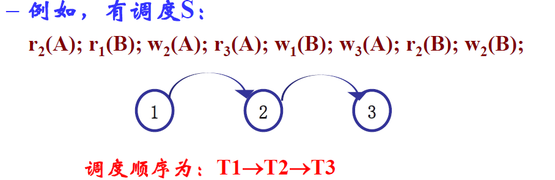

这是数据库系统的学习笔记。时刻提醒自己，笔记要简练！

内容较多，可选择性浏览。

[第四节施工中]

1. **<a href="#1">数据库系统概述</a>**

   <a href="#1.1">1.1 数据库的类型</a>

   <a href="#1.2">1.2 DBMS</a>

   <a href="#1.3">1.3 数据独立性</a>	

   <a href="#1.4">1.4 数据模型与数据库模式</a>

2. **<a href="#2">关系数据库-基础</a>**

   <a href="#2.1">2.1 关系数据结构</a>

   <a href="#2.2">2.2 完整性约束</a>

   <a href="#2.3">2.3 关系运算</a>

   <a href="#2.4">2.4 SQL查询语言</a>

3. **<a href="#3">数据库设计</a>**

   <a href="#3.1">3.1 概念数据库设计</a>

   <a href="#3.2">3.2 逻辑数据库设计</a>

   <a href="#3.3">3.3 物理设计</a>
   
4. **<a href="#4">数据库实现</a>**

   <a href="#4.1">4.1 概念数据库设计</a>

   <a href="#4.2">4.2 逻辑数据库设计</a>

   <a href="#4.3">4.3 物理设计</a>
   
5. **<a href="#5">查询处理与优化</a>**

   <a href="#5.1">5.1 关系代数操作算法</a>

   <a href="#5.2">5.2 逻辑数据库设计</a>

   <a href="#5.3">5.3 物理设计</a>
   
6. **<a href="#6">事务</a>**

   <a href="#6.1">6.1 概念数据库设计</a>

   <a href="#6.2">6.2 逻辑数据库设计</a>

   <a href="#6.3">6.3 物理设计</a>
   
   <a href="#6.4">6.4 并发控制协议</a>
   
   <a href="#6.5">6.5 日志与故障恢复</a>

## **<a id="1">数据库系统概述</a>**

数据库是指长期存储在**计算机内**，**有组织的**、**可共享的**数据的集合。数据库由若干不同的数据集合组成。

### **<a id="1.1">1.1 数据库的类型</a>**

按数据类型划分：

- 简单结构数据库：关系型数据库、时空数据库等
- 复杂结构数据库：图数据库等
- 半结构化数据：XML数据库等
- 非结构化数据：文本、图片等多媒体数据库

按数据存储方式划分：

- 单机数据库
- 分布式数据库
- 并行数据库
- 网络数据库

按存储的介质和时长划分：

- 外存数据库
- 内存数据库
- 流数据库

### **<a id="1.2">1.2 DBMS</a>**

指数据库管理系统。DBMS是管理数据库，支持应用的软件系统。DBMS负责定义、存储和维护数据，数据查询，确保数据一致、安全、完整，以及并发控制和事务处理。也可以说，DBMS = 数据库+一组管理软件。

#### 数据字典（MetaData）

是指描述DBMS中各种信息的数据。

### **<a id="1.3">1.3 数据独立性</a>**

#### 视图抽象

把现实世界的信息**按不同用户观点**抽象为多个逻辑数据结构，每个逻辑结构称为一个视图。视图描述了不同用户所关心的数据。

所有视图的集合形成了数据库的**外模式**。

#### 概念抽象

综合外模式中所有视图，把所有用户关心的现实世界实体抽象为一个逻辑概念，形成数据库整体逻辑结构。举例来说，以大学的学生信息管理系统为例，教务处可能关心学号、姓名、院系、学分等信息（视图角度），而宿管科可能关心学生的学号、姓名、性别、住址等信息（视图角度），其他的外模式用户可能关心其他的学生信息...概念抽象的过程就是将所有这些用户关心的信息整合到一起，形成一个关于学生的全方面的概念。

将外模式的视图抽象而得到的概念称为**概念模式**。

#### 物理抽象

对概念模式进行抽象，成为数据库存储的物理形式，确定如何在物理存储设备上存储数据库，即为物理抽象。概念模式经物理抽象产生的结果称为**内模式**。

光是文字不如图直观。看下图，一切都明了：

             
图1.1 数据抽象与三级模式
 

三级模式抽象分层有什么好处？最直观地，改动内层对外部是透明的，无需变动。数据库内模式发生改变时，外部的逻辑结构（概念模式）和应用程序可以不变，这称为**物理数据独立性**。比如，把存储方式由按行存储换成按列存储，对外层无任何影响。

类似地，概念模式发生变更时，数据库的外模式不变，应用程序也可以不变。例如根据需要，添加了概念模式的属性，外部的视图可以不发生变动。这称为**逻辑数据独立性**。

### **<a id="1.4">1.4 数据模型与数据库模式</a>**

#### 数据模型

指描述数据及数据之间关系、基本操作、满足的约束等的模型。一个数据模型应当具有的基本要素如下：

- 数据结构：描述对象的信息结构。
- 数据操作：再数据结构上可以进行的操作，比如查询、更新。
- 完整性约束：完整性规则的集合，规定了数据必须遵守的语义约束。

常用的数据模型如下：

- 实体关系（E-R）模型：用于视图抽象和外模式的定义。
- 面向对象（O-O）模型：用于视图抽象和外模式的定义，也用于概念抽象和概念模式（逻辑模式）的定义。
- 关系模型：用于概念抽象和逻辑模式定义。
- 对象关系(O-R)：用于概念抽象和逻辑模式定义。
- 层次和网络模型：用于概念抽象和逻辑模式定义。

#### 模式

用给定的数据模型刻画一组特定数据集合的逻辑结构与特征。模式是一个数据集合的结构定义，是数据间关系的抽象描述，与具体值并无关联。例如一个学生成绩数据集合的模式可能是这样的：(姓名，课程编号，成绩，学期)。

#### 实例

实例是模式在某一时刻的一个具体值，是数据集合在某一时刻的状态。

#### 小结

总结上述几者的关系：模型是刻画一种数据集合的组织关系和约束的东西，模式是数据集合在某种模型下的结构，实例是数据结构在某一时刻的瞬间状态。

## **<a id="2">关系数据库-基础</a>**

### **<a id="2.1">2.1 关系数据结构</a>**

#### 关系模型

关系模型是一种定义在集合代数基础上的模型。关系这种**数据结构**，可用来刻画现实世界的实体及实体间的各种联系。其中，每个实体对应一个元组，实体的特征对应于属性（元组的每个元素都属于其的一个属性）。

在关系模型的数据的逻辑结构中，一个实体对应二维表的一行，一个属性对应二维表的一列。

             
图2.1 关系模型中数据的逻辑结构
 

关系的数学定义如下：

$$
D_1 \times D_2 \times \cdots D_n 的子集称为在域D_1,D_2,\cdots,D_n上的关系，记作 \\
R(D_1,D_2,\cdots,D_n)。其中R表示关系名，n称为关系的\bold目或\bold度，R称为n元关系。
$$
关系中的不同列可以对应相同的域。为了加以区分，每个列起一个名字，这就称为**属性**。属性的取值必须是原子的，即属性值是不可分的数据项。行的顺序可以随便交换，列的次序也可以任意交换，但任意两个元组不能完全相同。

> 然而实际上许多关系型数据库产品没有遵循这一性质，例如Oracle。它们允许关系表中有两个完全相同的元组，除非定义了相应的约束条件。

#### 关系模式

关系模式是一个具体的关系的**描述**。

关系模式的形式化定义如下：

$$
关系模式具有形式R(U,D,I,F),其中\\
R是关系名，\\
U是R的属性集合\{A_1,A_2,\cdots,A_n\}\\
D是U中属性的域的集合\{D_1,D_2,\cdots,D_n\}\\
I是完整性约束集合，F是属性间的函数依赖关系。\\
一个关系模式可简记为R(U)，或是R(A_1,A_2,\cdots,A_n)。
$$
一个关系模式的例子：学生表Student(姓名，学生编号，年级，专业，系)。

一个**关系实例**表示一个关系在某一时刻的状态。关系是一个数据集合，关系模式描述关系的结构和语义约束。关系模式是稳定的，而关系是可能变化的。关系实例则是某一时刻的关系。

#### 常见关系类型

数据库中，常见的关系分为3种：

##### 基本关系

也叫基本表。是由用户定义的，在数据库中实际存在的关系。可以CRUD。

##### 中间结果关系

是对关系进行查询产生的中间结果，只会在数据库中临时存储（或永久存储，由系统建立）。中间结果关系只可查询，不可更新！

##### 视图关系

又叫视图、虚表。是用户根据自己的需要定义的关系。注意其之所以称为虚表，是因为该关系是定义在基本关系/视图上的，**只有模式，没有实例！**更没有对应的实际存储的数据。可查询，但是更新是受限的。

#### 关系数据库模式/实例

* 关系数据库模式：一组关系模式的集合$D_B={R_1, R_2, ..., R_n}$，其中，$R_i$是第i个关系模式。
* 关系数据库实例：关系数据库模式$D_B={R_1, R_2, ..., R_n}$对应的关系数据库实例是一组关系实例的集合$D_B = {I_1, I_2, ..., I_n}$，其中，$I_i$是$R_i$的关系实例

没什么好总结的，就是把关系模式/实例给摞在一起了呗。

### **<a id="2.2">2.2 完整性约束</a>**

#### 超码

称**关系模式**R(U)的属性集合K是超码，如果K中属性的值可以在R中唯一地标识一个元组。K一般是U的子集。

#### 候选码

称R(U)的属性集合$k \subseteq U$是**候选码**，如果k满足：

- k是R(U)的超码。(唯一性)
- k的任何真子集都不是R(U)的超码。(最小性)

一个关系模式可能具有多个候选键。

#### 主键

被数据库设计者选中的，用来在同一关系中区分不同元组的**候选键**。一般选择值从不/很少变化的。

一个关系模式只能有一个主键。

#### 外键

对于两个关系模式S(U')和R(U)，及属性集合X，$X \subseteq U' 且 X \subseteq U$，若X是S(U')的主键，则称**X是R(U)关于S(U‘)的外键**。

注意：外键不一定要与相应的主键同名。但一般情况下，外键与相应的主键往往取相同的名字，方便识别。外键的取值一般对应于主键的某个值。

#### 完整性约束

- 实体完整性约束：关系模式的主键不能取空值。
- 关联完整性约束：设X是关系模式$R(U)$关于关系模式$S(U')$的外键，如果x是$R(U)$的关系实例中一个元组的外键值，那么$S(U')$的实例中必定存在一个元组t，t在X上的取值为x。简而言之就是如果一个值作为外键的取值出现，其必在对应为主键的表中也有一个这样的取值出现。
- 语义完整性约束：指基于应用的约束。
- 函数依赖：不同属性之间存在函数式的关系。

### <a id="2.3">2.3 关系运算</a>

#### 基础关系运算

###### 选择

$\sigma_p(R) = \{t\| t\in R \and p(t)为真\}$是选择运算的一般形式，其效果是查找关系R中满足条件p的那些条目。

###### 投影

$\Pi_{A_1,A_2\cdots}(R)$表示关系R在属性$A_1,A_2\cdots$上的投影，效果是只保留对应属性列的结果，并去除重复。

###### 并

$R\cup S = \{t\|t\in R \or t \in S\}$是关系R和关系S的并（会删除重复的元组）。注意，这要求R和S是**相容的**，即他们的属性个数以及对应的属性的域必须相同。

###### 差

$R-S=\{t\|t\in R \and t \notin S\}$表示关系R与S的差，也是要求R和S相容。这都与集合的差运算相似。

###### 笛卡尔积

$R \times S = \{tq| t\in R\and q\in S\}$表示R和S的笛卡尔积，其效果是将其中任意两个元组的信息组合在一起。若R中有$n_1$个元组，S中有$n_2$个元组，则$R\times S$中有$n_1 \times n_2$个元组。

###### 重命名

$\rho_{S(A_1,A_2,\cdots,A_n)}(R)$表示将关系R重命名为S，且S的各个属性按从左到右的顺序分别命名为$A_1, A_2, \cdots, A_n$。如果只修改关系名，可以写成$\rho_S(R)$。

#### 附加关系运算

附加关系运算定义在基本运算上，可以简化操作。

###### 交

$R\cap S = \{t\| t\in R \and t\in S\}$表示关系R和S的交。他们必须是相容的。$R\cap S = R-(R-S)$。

###### θ连接

$R \mathop{\bowtie}\limits_\C S = \sigma_C(R\times S)$表示R和S的θ连接。其中C可以是逻辑表达式的组合。

同时，称逻辑表达式为相等判断的形式连接为等值连接。对于等值连接，还有特化（即后文的外连接）：左连接表示等值连接的基础上，将所有的左关系的元组加入到结果中，对于其中不存在的属性，则以空值替代；右连接类似。如果包含左、右关系中的全部元组，且不存在的属性均已空值替代，则称为全连接。

###### 自然连接

$R\bowtie S = \Pi_{U_R\cup U_S}(\sigma_{R.A_1 = S.A_1\and R.A_2 = S.A_2\cdots\and R.A_n = S.A_k}(R\times S))$称为R和S的自然连接，其中属性集合$\{A_1,A_2,\cdots,A_k\} = U_R \cup U_S$自然连接是一种特殊的等值连接，要求进行比较的属性必须是两个关系中同名的属性，并且连接的结果会将重复的冗余属性剔除。

###### 除法

$R \div S = \{t\|t \in \Pi_Z(R)\and \forall u \in S(tu \in R)\}$,其中$X = U(R) = (A_1,\cdots A_m,B_1\cdots B_n), Y = U(S) = (B_1\cdots B_n), Z = X - Y = (A_1\cdots A_m)$表示关系R对S做除法，tu是指元组t和u相连构成的新元组。除法代表的意义是，将R中那些**包含所有S中的元组成分**的元组的Z中属性提取出来。

除法还可以理解成$R\div S = \Pi_Z(R) - \Pi_Z((\Pi_Z(R) \times S) - R)$。

#### 扩展的关系代数操作

###### 广义投影

将算数运算表达式作为投影的一部分。即不只可以投影到存在的属性列，还可以投影到属性列构成的表达式上。例如$\Pi_{A_1, A_2 - 2021}E$。

###### 分组聚集

分组聚集允许将关系**分成几组**并分别在各组上进行计算。聚集的一般形式为$ _{A_1,A_2\cdots A_k}G_{F_1(B_1),F_2(B_2)\cdots F_m(B_m)}(E)$，其中$\{A_1,A_2\cdots A_k\}$是E的属性集合的子集，$F_i$表示分组聚集函数，$B_j$表示分组聚集属性。

###### 外连接

外连接在自然连接的基础上扩展了对缺失值的处理。外连接分为⟕(左外连接)、⟖（右外连接）、⟗（全外连接）。

###### 去重复

消除一个关系上的重复元组。

### **<a id="2.4">2.4 SQL查询语言</a>**

数据库语言大致分为两种使用方式：

- 交互式：通过终端设备直接向数据库系统输入数据库语言语句，请求服务。
- 嵌入式：程序员在某个宿主语言（比如C语言）的程序的任何地方使用数据库语言语句，请求服务。

#### SQL的主要九条语句

- 关于数据定义：CREATE，DROP，ALTER
- 关于数据操纵，又分为两类：
  - 查询：SELECT
  - 修改：INSERT，UPDATE，DELETE
- 数据控制：GRANT、REVOKE

##### 建立表

语法格式：CREATE TABLE <关系名> (<属性名><属性类型>[NOT NULL] ,.... <属性名><属性类型>[NOT NULL]， 完整性约束1，完整性约束2...)

效果是创建一个对应的表。列名后的NOT NULL是可选的。

##### 授权与收回

授权的语法格式：GRANT \<privilege list\> ON \<object\> TO \<user ID list\> [WITH GRANT OPTION]

授权的作用是向指定的用户授予在对应数据库对象上的一部分操作权限。例如`GRANT select ON R TO user`是指把关系R上的SELECT权限赋予用户user。

相应地，也就有收回权限：REVOKE \<previlege list\> ON \<object\> FROM \< user ID list\> [WITH REVOKE OPTION]

其作用是将用户在给定数据库对象上的操作权限撤销。

##### 查询

查询仅涉及一个表。

- 查询若干列：SELECT 列名 FROM 表名

使用Group by语句时，后还可加having语句，用来过滤符合条件的分组。

##### 数据插入

插入单个元组：

INSERT INTO<表名>[(<属性列1>,....)] VALUES (<常量1>,...)

注意到列名是可选的。如果有列名，那么后续的VALUES必须与列名的顺序对应。如果没有，则默认插入一条完整的元组（且属性列的顺序与表定义的顺序一致）。对于只制定了一部分列的情况，其余属性列会取空值。插入的值必须满足约束。

##### 更新数据

更新关系的过程也要满足约束，不只是实体完整性约束，还有关系完整性约束。更新数据的方式分为三种：

- 1.修改某个元组/2.多个元组的值：UPDATE 表名 SET 列名 = value WHERE cond(没有WHERE则作用与整个表)
- 3.带子查询的修改语句：UPDATE 表名 SET 列名 = value WHERE cond (子查询) 

有的DBMS在更改一个主键时，如果该主键是其他表中一个条目的外键内容，则不允许修改。有的DBMS则支持级联更新。

##### 数据删除

格式：DELETE DROM <表名> [WHERE <条件>]

可删除指定表中满足条件的条目。缺省条件表示删除表离的所有元组。类似于更新数据，数据删除也有三种方式。不多赘述！类似于更新数据，有的DBMS也支持级联删除。

##### 创建视图

语句格式：CREATE VIEW \<视图名\> [(<列名>,...)] AS 子查询 [WITH CHECK OPTION]

别忘了，视图是个虚表，本身不保存数据。视图也可以查询、删除等操作，实际上会转化为子查询结果上的操作。而且，视图可以对操作增加限制。

甚至可以将两个表的连接查询作为视图创建的子查询！

##### 删除视图

语句格式：DROP VIEW <视图名> [CASCADE]

如果制定了CASCADE选项，该视图和由他导出的所有视图一并删除。

#### 嵌入式SQL

SQL标准定义了一些可以在高级语言中使用的SQL语言。称那些高级语言，为宿主语言。为了识别嵌入式SQL，需要引入EXEC SQL语句，其格式为：

EXEC SQL <嵌入式SQL语句> END-EXEC

嵌入式SQL的具体语法依赖于宿主语言。

## <a id="3">3. 数据库设计</a>

             
图3.1 设计数据库的步骤
 

### <a id="3.1">3.1 概念数据库设计</a>

概念数据库设计的任务分为两方面，其一是设计概念数据库的模式，其二是根据需求分析阶段提出的操作任务，设计数据库事务。

#### 实体联系模型

即ER模型，可以表示成ER图。一般说来，实体联系模型就是概念数据库设计阶段的目标产物。

ER图中的三个主要构成元素是**实体、联系和属性**。

实体是ER模型的基本对象，是现实世界中存在的事物的抽象，例如人、汽车、学校、课程等。每个实体都具有一系列特征，称为实体的属性。实体属性的一组特定值确定了一个特定的实体。

             
图3.2 ER图:实体
 

而实体集则表示相同类型（具有相同的属性）的实体集合。

实体属性又有多种划分：

- 简单属性：不能划分为更小的部分的属性。
- 复合属性：可以划分为多个具有独立意义的子属性。
- 单值属性：同一个实体的该属性只能取一个值。
- 多值属性：某些情况下，实体的一些属性可能取多个值。
- 导出属性：可以从其他属性/其他实体导出的属性。

ER图中的码的关系与关系模式中对码的定义基本一致。主码可以用来唯一地确认一个实体，但有的现实世界实体难以找到主码来确认一个唯一实体，它们常常依赖于其他实体，例如一个父亲可能有多个孩子，不同的孩子之间很有可能重名，但一个父亲的孩子不会重名。这种情况下，孩子的存在适合被抽象为**弱实体**。弱实体是依赖于某个实体集（称为主实体集）的。弱实体集仅要求具有一个或多个属性，它们与主实体的主码相结合，形成相应弱实体集的“主码”。这样的弱实体集属性称为部分码。

联系表示不同实体之间的关联，例如“苟老师”和“专业核心课”就有“教授”关系。实体间相同类型的联系的集合就是联系集，例如教师与课程之间就存在联系集。一个联系集可能有多个实体集参与，参与同一联系的实体集的数目称为联系集的度。

联系集也是有属性的——联系集的属性起到一种描述的作用。

             
图3.3 ER图:联系集
 

实体之间的联系可以使用联系集，也可以使用实体属性来表示，稍后将具体介绍这一点。

称一个实体可以通过联系集能关联的实体的个数为**映射基数**，映射基数决定了实体之间的联系类型分为：一对一、一对多/多对一（都一样啦）、多对多三种类型。例如，一个公民和一个身份证号是一一映射关系，但其可能有多个亲生子女（一对多），而一个公民可能拥有多个国籍，一个国家也可能有多个公民（多对多）。

## <a id="3.2">3.2 逻辑数据库设计</a>

该阶段的任务是将上一阶段产生的概念数据库模式变化为合理的逻辑数据库模式。

#### 形成初始关系数据库模式

指从ER图直接转化而来的关系模式。为此，需掌握几种ER图中元素变换到关系模式的技巧。

###### 普通实体集

一个普通实体集E对应于一个关系S，其中包含所有E的简单属性和复合属性的简单子属性，E的主码就是S的主码。

###### 弱实体集

一个弱实体集W对应于一个关系R，其中包含所有W的简单属性和复合属性的简单子属性，还有W的主实体集的主码。在R中，用W的部分码和其主实体集的主码共同组成了W的主码。

###### 多值属性

一个实体集E中的多值属性A对应于一个关系T。如果A是简单属性，关系T中包含A属性和E的主键K，A和K构成了T的主键；如果A是复合属性，则关系T中包含A的简单子属性和E的主键K，其简单子属性和K构成T的主键。注意，**实体集E对应的关系中是没有多值属性的，多值属性都被转化为关系表**。

###### 联系

对于一般的二元联系：

- 一对一联系：可以在其中一个实体集的对应关系中增加另一个实体集主码属性（当然，联系集属性如果有，也需要加上）来表示此联系。也可建立一个单独的关系来表示此联系，其中保存两个实体集的主码和联系集的属性。
- 一对多联系：向对应“多”的那个实体集的对应关系中加入另一个实体集的主码属性，或建立一个单独的关系来表示此联系（类似于一对一联系的第二种方案）。
- 多对多联系：建立一个单独的关系来表示此联系，其主码由两个实体集的主码和联系集的属性组成。

对于多元联系，只能建立一个单独的关系，其主码由参与联系的所有实体集的主码组成。

###### 初始关系模式存在的问题？

初始关系模式只是将概念设计直观地转化了出来，但其未必是最合理的逻辑设计。属性间的函数依赖可能会引入一些问题：

- 冗余：重复的数据大量出现。例如，如果在学生的记录里保存专业，则会有大量相同专业字段出现。
- 插入：要插入的信息由于依赖关系而无法插入。如果将专业信息保存在学生记录中，要新开专业时，就必须插入一个学生的记录，但此时还没有招进学生。
- 更新：如果专业的名称有调整了，则所有学生条目都要修改专业属性，代价较大。
- 删除：要删除的信息由于依赖关系而无法删除。如果将专业信息保存在学生记录中，若要删除专业，则必须将学生信息删除，但可能并不想将过去该专业的学生信息全部删除！

#### 函数依赖

函数依赖的定义:

设R是一个关系模式，U是R的属性集合，X和Y是U的子集。对于R的任意实例r，r中任意两个元组t1和t2，如果t1[X]=t2[X]，则t1[Y]=t2[Y]，我们称X函数地确定Y，或Y函数依赖于X，记作X→Y。称X为此依赖的决定属性集。

也即：确定了X，则确定了Y。例如出生日期→年龄。函数依赖只能根据数据的语义来确定。若X→Y且Y不为X的子集，则X→Y为**非平凡函数依赖**。毕竟，X可以决定X的子集，这不是想当然的吗！一般情况下，都只是讨论非平凡函数依赖。

若X→Y，且对于任意的$Z\subsetneq X$，Z→Y不成立，则称Y**完全函数依赖**于X，否则称Y**部分函数依赖**于X。

若X→Y，Y→Z且Y→X不成立，则称Z**传递函数依赖**于X。

若对于关系R上的任何一个使函数依赖集合F成立的关系实例r，函数依赖X→Y都成立，则称F**逻辑地蕴含**X→Y。

#### 模式分解

###### Armstrong公理

是模式分解算法的理论基础，可以用来从一组给定的函数依赖中求得蕴含的函数依赖。

三条基本的推理规则：

- A1自反律：若$Y\subseteq X \subseteq U$，则X→Y为F所蕴含。（平凡的函数依赖）
- A2增广律：若X→Y为F所蕴含，且$X\subseteq U$，则XZ→YZ为F所蕴含。
- A3传递律：若X→Y和Y→Z为F所蕴含，则X→Z为F所蕴含。

三条导出的推理规则：

- 合并规则：若X→Y，X→Z，则X→YZ。该规则由A2和A3导出。
- 伪传递规则：若X→Y，WY→Z，则XW→Z，有XW→Z。该规则由A2和A3导出。
- 分解规则：若X→Y，$Z\subseteq Y$，则X→Z。该规则由A1和A3导出。

由上述的所有规则，可以导出一个引理：

$X\rightarrow A_1 A_2 \cdots A_k成立的充要条件是X\rightarrow A_i都成立(i=1,2,...k)$

###### 闭包

称一个关系模式R<U, F>中为F逻辑蕴含的所有函数依赖为F的闭包，即为$F^+$。注意，函数依赖的闭包指的是一系列为F所蕴含的**依赖**！

若F为属性集U上的一组函数依赖，$X\subseteq U$，$X_F^+ = \{A\|X \rightarrow A可由F根据Armstrong公理导出\}$，则称$X_F^+$为X**关于函数依赖集的闭包**。注意这是指一系列可以在F下由X决定的**属性**集合！

计算某属性集X关于U上函数依赖集F的闭包的算法：

1. 初始化，令$X_0 = X, i = 0$
2. 计算集合B，其中$B = \{A\|(\exists V)(\exists W)(V\rightarrow W \in F \and V\subseteq X_i \and A\in W\}$，也就是对$X_i$中的每个元素，依次检查函数依赖F，将依赖于$X_i$的属性加入B。
3. $X_{i+1} = B \bigcup X_i$
4. 如果$X_{i+1}与X_i$相同，则$X_i就是X_F^+$，算法终止；否则，i = i + 1，回到第二步。

计算属性集X关于函数依赖集F的闭包的算法，可以判断**一个属性集能否决定该关系的所有属性**，换言之，可以计算该属性集**是否为候选键**。

###### 快速求解候选键

有一些方法可以根据函数依赖来快速判断某些属性是否为候选键。对于给定的关系模式R和函数依赖集F，将属性分为4类：

- L类：仅出现在F的函数依赖左部的属性
- R类：仅出现在F的函数依赖右部的属性
- N类：在F的函数依赖左右均未出现过的属性
- LR类：在F的函数依赖左右均出现的属性

L类、N类属性必定为R的任一候选键的成员，R类属性必不在任何候选键中。如果一个由R的属性集U的全部N类和L类属性组成的属性集X关于F的闭包$X_F^+ = U$，那么X就是R的唯一候选键！

###### 极小函数依赖集

若函数依赖集F满足：

- F的任意函数依赖的右部仅有一个属性
- F中不存在这样的依赖X→A，使得F与F-{X→A}等价。（不存在可以推导出的多余依赖！）
- F中不存在这样的依赖X→A，X有真子集Z使得$F-\{X\rightarrow A\} \bigcup \{Z\rightarrow A\}$与F等价。（不存在部分函数依赖！）

则称F为极小函数依赖集（也叫最小依赖集、最小覆盖）。给定一个函数依赖集，其对应的极小函数依赖集不是唯一的。

计算一个给定的函数依赖集F的极小函数依赖集的算法：

- 逐一检查F中各函数依赖$X\rightarrow Y, 若Y = A_1A_2\cdots A_k, k \geq 2$，则用$\{X\rightarrow A_j\|j=1,2,\cdots,k\}$来取代$X\rightarrow Y$。

- 循环检查F中的每个依赖X→A，若$A \in X_{(G -X\rightarrow A)}^+$，则从F中去掉此函数依赖。
- 循环地取出F中各函数依赖X→A，$X = B_1B_2\cdots B_m$，逐一考察$B_i$，若$A\in(X-B_i)_F^+$，则用$X-B_i\rightarrow A$取代$X\rightarrow A$。

#### 关系模式的范式

范式是对关系模式的一种要求，可以衡量关系模式的好坏。各范式之间存在联系：

$1NF \supset 2NF \supset 3NF \supset BCNF \supset 4NF \supset 5NF$

因此，一个属于高级范式的关系模式R也属于低级范式的范畴。随着范式等级提升，对R的要求越加严格，对插入、删除异常、冗余和修改代价也越加有改善效果。

###### 1NF

若关系模式R的每个属性的**值域**都是**不可分**的简单数据项的集合，则称之为1NF。大部分情况下讨论的关系模式R都属于1NF。

###### 2NF

若关系模式R是1NF，且每个非键属性**完全函数依赖**于R的候选键，则R为2NF。

###### 3NF

若关系模式R是2NF，且每个非键属性都**不传递地依赖于**任何候选键，则称R为3NF。3NF中，不存在非键属性对候选键的部分、传递函数依赖。

###### BCNF

也称为扩展的第三范式。若关系模式R是1NF，且对于R的每个函数依赖X→Y，则X必为候选键，则R是BCNF。换言之，BCNF在3NF的基础上更进一步，即使是键属性也不允许存在对候选键的部分、传递函数依赖，**每个键属性都完全函数依赖于每个不包含它的候选键**，不存在任何属性完全函数依赖于非键的任何一组属性。

如果达到了BCNF，那么该关系模式在函数依赖层面上已经进行了足够的规范化，**彻底消除了插入异常和删除异常**。

如果一个关系的数据加载后，用户只能在其上做查询操作，不能做插入、删除和更新操作，称这样的关系为静态关系；经常被更新、插入和删除的关系称为动态关系。

静态关系需要达到1NF标准，动态关系则应该至少达到3NF标准。

#### 关系模式分解

关系模式分解是将把一个关系模式分解为几个子模式，使得这几个子模式具有指定的规范化形式，是一种将关系模式规范化的方法。

>并不是规范化程度越高，就一定越好。便于数据库操作的关系模式，可能失去了对现实世界实体的良好抽象能力。必须在反映现实世界的清晰程度和规范化程度之间做trade off。

为了介绍关系模式分解的操作，必须先介绍函数依赖的投影操作：

设R(U, F)是一个关系模式，$\rho =\{R_1(U_1, F_1), R_2(U_2,F_2)\cdots R_n(U_n,F_n)\}$是R的一个分解且不存在$U_i \subseteq U_j$，则F在$R_i$的属性集合$U_i$上的投影为:

$F_i = \{X\rightarrow Y \| X\rightarrow Y \in F^+, X, Y \subseteq U_i\}$

也就是说，被原函数依赖F逻辑蕴含的，且左部、右部都在$U_i$中的那些依赖之集合。

一个合格的关系模式分解需要满足：

- 无损连接性：分解之后的关系可以通过自然连接恢复为原来的关系，没有丢失信息。
- 函数依赖保持性：原函数依赖F中的依赖在分解后的关系的依赖投影中均有出现过。

要判断一个分解是否是具有无损连接性，可以通过chase检验法。

如果一个关系模式**恰被分解为两个子模式**，则可以通过一个简单的办法判断其是否具有无损连接性。

设ρ={R1, R2}是关系模式R的一个分解,U1、U2和U分别是R1、R2和R的属性集合,F是R的函数依赖集合。**ρ具有无损连接性的充分必要条件**是:U1∩U2→U1-U2∈F+或U1∩U2→U2-U1∈F+。

要判断一个分解是否具有函数依赖保持性，只需判断$F^+ = (\bigcup^K_{i=1} F_i)^+$是否成立（实际上，只需判断$F \subseteq (\bigcup^K_{i=1} F_i)^+$是否成立即可，因为右包含于左是显而易见的）。

###### 3NF分解算法

1. 计算F的最小函数依赖集，记作G。
2. 初始化ρ为空集合。
3. 对于G中的每个函数依赖X→A，将一个新的关系R(X, A)加入ρ中。
4. 如果ρ中的所有关系中均不包含R的候选码，则将一个由R的候选码组成的关系Rk加入ρ中。
5. 从ρ中去除冗余关系，返回得到的ρ。

该算法满足无损连接性和函数依赖保持性，ρ中的每个关系模式都是3NF。

###### BCNF分解算法

1. 初始化$\tau$为{R}。
2. 只要$\tau$中存在不满足BCNF的关系模式，重复如下操作：
   1. 选择$\tau$中的一个不满足BCNF的关系模式S。
   2. 选择S的违反BCNF要求的函数依赖X→Y。
   3. 用新的关系模式$S-Y$和$X\cup Y$代替$\tau$中的S。
3. 返回$\tau$。

该算法满足无损连接性，使得$\tau$中的所有关系模式都是BCNF的。

## <a id="4">4. 数据库实现</a>

### <a id="4.2">4.2 哈希方法</a>

指定关系上的某个（组）属性作为hash码，并定义一个其上的hash函数，利用计算结果来决定关系记录该存储于什么位置。

#### 简单hash

hash函数的值域就是桶号的集合，将文件划分到对应桶号的磁盘块上。当同一个桶内元素过多，可能导致桶溢出，此时则需解决冲突。

#### 动态hash

#### 可扩展hash

用hash函数的前d位表示桶的数目。d的值可以随着文件数目的增长动态增大。

#### 线性hash

使用hash函数的后i位表示桶号。需要插入时，若后i位组成的二进制数m < n（n表示实际存在的桶数），则编号为m的桶已存在，可以直接存入；否则说明m尚不存在，则将其存入 $m - 2^{i - 1}$，相当于把倒数第i位置为0的桶号。

### <a id="4.？">4.？ 索引</a>

索引文件的记录称为索引记录/索引项，其中包含两个域，一个是数据文件索引域的值，一个是记录所在的地址。

##### 按结构分类

###### 稀疏索引

每个存储块只设置一个索引项。

###### 稠密索引

**每个索引域的值都对应有一个索引项**，索引文件是有序的。

##### 按索引域的特点分类

###### 聚集索引

记录的物理存储顺序和在索引文件中的顺序一致，而索引文件又是有序的，这说明索引文件、数据文件都按索引域排序！聚集索引的索引项具有两个域，一个域存储索引域值，一个域存储指向**包含该索引值的所有连续磁盘块的第一块地址**（也就是说，这个地址指向的可能并不是对应索引域的记录，但只要按顺序往下搜索，在块内一定能找到这样的记录）。

聚集索引可以是稠密索引，也可以是稀疏索引。

聚集索引能显著降低搜索时间，而且比原数据文件小得多，但一个数据文件上的聚集索引只能有一个。

###### 主索引

索引域是主键，数据文件、索引文件都按照键值排序。主索引的索引项有两个域，第一个域存储**每个数据文件块的最小键值**，第二个域存储指向记录磁盘块的指针。

主索引必是稀疏索引。

###### 辅助索引（非聚集索引）

建立在数据文件的非排序域上的索引，不过，索引文件本身是有序的。每个索引项有两个域：第一个域存储索引域值，第二个域存储指向一个磁盘块地址的指针。（也有建立在键值上的辅助索引！）

根据情况不同，辅助索引可以是稀疏索引，也可以是稠密索引。

#### 多维索引

1. 网格文件索引
2. KD树
3. 四叉树
4. R树

#### 位图索引

如果关系R中有n个元组，则关系R上某个属性A的位图索引，是一个“长度为n的位向量”的集合，其中每一个位就对应一个元组。对于属性A的值域上的一个取值v，若某个元组的A属性值为v，则将v的位向量的对应该元组的位置为1。

             
图4.? 位图索引 示例
 

注意，位图索引中不包含对应元组的地址的指针，需要通过其他手段找到元组的位置。

## <a id="5">5. 查询处理与优化</a>

在DBMS上执行SQL查询语句时，实际上经过了如下的几个阶段处理：

1. 语法分析器：根据SQL语法生成语法分析树。
2. 翻译器：根据语法分析结果，转化为等价的关系代数表示，也称为逻辑查询树(Logical Query Tree)。
3. 优化器：根据数据库的物理结构，分析代价，决定执行具体处理的方案（比如，索引的使用）。得到的结果称为物理查询树(Physical Query Tree)。
4. 执行器：在数据库上执行具体命令。

## <a id="5.1">5.1 关系代数操作算法</a>

#### 选择操作算法

###### 线性搜索

顺序地读取被查询关系的每个元组，测试其是否满足条件，如果满足，作为结果输出。

###### 二元/插值搜索

要求关系按照查询条件涉及的属性排序，并且查询条件是等值比较。

###### 主索引/哈希搜索

#### 投影操作算法

没什么好说的，访问关系R的所有元组一次即可完成。

#### 连接操作算法

###### 循环嵌套连接

注：M表示缓存可以容纳的块的个数，$B_R、B_S$分别表示关系R、S的块数。假设$M \leq B_R, M \leq B_S, B_S \leq B_R$，则将S划分危$B_S/(M-2)$个子集。之所以划分为大小为M-2的子集，是因为缓存有一块要留给关系R，还有一块要用来保存连接结果。

             
图5.1 θ连接操作算法：循环嵌套连接
 

注意，选择较小的关系S作为外层循环，这样IO代价更小。因为$(B_S/(M-2))B_R $和$(B_R/(M-2))B_S$代价是一样的，外层循环越小越好。

>有些地方介绍循环嵌套连接时可能不会考虑缓存块的大小，假设R、S都是一次读取一块，则代价为$B_R + B_R B_S + B_\theta$。但思想都是一样的！

###### 排序合并连接

思想类似于归并排序。

如果关系R、S都在连接属性上排好了序，按顺序扫描它们，连接具有相同值的元组即可。理想条件下，IO代价为$B_R + B_S$。如果R、S没有在连接属性上排序，就先按照连接属性排好序，再应用上面的方法即可！此时，理想条件下的IO代价要加上他们各自的排序代价：$O(B_Rlog(B_R) + B_Slog(B_S)) + B_R + B_S$

###### Hash连接

分为两个阶段。

- 第一阶段，将两个关系用定义在连接属性上的Hash函数，将R、S的元组分别映射到对应的桶中。
- 第二阶段，对应相同桶号的元组可能是可以连接的，使用循环嵌套连接即可。

Hash-Join的磁盘块存取代价为$3(B_R + B_S)$。

### <a id="5.2">5.2 查询优化</a>

#### 代数定律

###### 交换律与结合律

笛卡尔积、自然连接、集合的交、并都满足交换律和结合律。

###### 选择运算：分解律

选择运算可以进行一定程度的分解。

$$
\sigma_{C_1 and C_2}(R) = \sigma_{C_1}(\sigma_{C_2}(R)) = \sigma_{C_2}(\sigma_{C_1}(R)) \\
\sigma_{C_1 or C_2}(R) = \sigma_{C_1}(R)\bigcup \sigma_{C_2}(R)
$$

###### 选择运算：对二元运算符的下推

连接、并等操作是有较大代价的，如果要在结果上做选择，不如先筛选条件，再计算结果，这样用于选择等操作的代价就小了！

例如：

$$
\sigma_C(R\cup S) = \sigma_C(R)\cup\sigma_C(S)
$$
其实，未必要在选择操作完成后再在结果上做运算，还可以在内存中一边选择，一边就做运算（称为pipeline）。

###### 投影运算：下推

类似地，投影也可以下推到其他操作符中。虽然投影操作不改变元组数，只改变元组长度，但有时投影下推后可能反而增加了元组的长度（广义投影，即可能引入新表达式）。

连接操作满足交换律和结合律。选择操作可以安全地下推到连接操作之下，投影操作需要考虑把连接属性包括进投影集合，再下推。

### <a id="5.3">5.3 代价估计</a>

一套逻辑计划可能对应多套物理实现方案，要决定具体采用哪一种方案，就要对它们的代价做评估。用$V(R, Y)$表示关系R在属性Y上的值域大小。

#### 连接运算代价估计

若$V(R,Y) \leq V(S,Y)$，则R中的每个元组t有$1/V(S,Y)$的概率与S中的某个元组连接，设S中有T(S)个元组，则与t连接的期望元组数为T(S)/V(S,Y)。由于R中有T(R)个元组，故$R\bowtie S$的结果大小估计为$T(R)T(S)/V(S,Y)$

对于一般的情况，分母取两个关系中属性Y值域较大的那个即可！注意，这种情况是假设值域中的每个取值等概率地出现。做题时，如果给出了一部分的详细的值域分布，对那部分就可以精确地计算了。

例如：

             
图5.? 连接代价分析示例
 

要计算连接操作的代价，可以参考上一节介绍选择算法时所列出的代价计算公式。

## <a id="6">6. 事务</a>

事务是数据库并发控制和恢复的基本单位。

### <a id="6.1">6.1 事务的特性</a>

即“ACID”。

- Atomicity：原子性，事务要么完全执行，要么完全不执行。
- Consistency：一致性，一致性要求事务的执行结果使数据库从一个一致性状态到另一个一致性状态，即数据库只包含成功事务提交的结果，数据被成功更新后，后续任何对数据的读操作都得到的是更新后的值。
- Isolation：隔离性，事务完全可能是并发执行的，隔离性要求事务之间的操作不会相互影响。
- Durability：持久性，一个事务一旦提交，其对数据库的影响是永久性存在的。

> 在新的计算环境下，事务的ACID常常很难全部满足，例如在分布式环境下。此时常常争取保证尽可能多的特性，例如在无法保证强一致性的情况下，可以争取保证弱一致性，即在某个数据更新后，虽然后续读取操作可能读取到更新前的值，但经过一个时间长度（不一致时间窗口）后，一定会读取到更新后的值。

一个事务的状态：

- 活动的：刚创建的事务处于此状态，事务还在执行，并且没有异常。
- 部分提交：刚执行完最后一条事务语句之后。
- 失败的：执行过程中，事务发生了异常。
- 中止的：发生异常的事务回滚到事务开始之前的状态，此时事务是中止状态。
- 提交的：成功提交的事务状态。

             
图6.1 事务读写
 

事务操作数据时，并不是直接从磁盘上读取到自己的局部缓冲区，而是从一个全局的公共缓冲区读取到自己的局部缓冲区(Read)，写操作(Write)也是类似。从公共缓冲区到磁盘块也需要读写操作(Input)，(Output)。

### <a id="6.2">6.2 事务并发执行带来的问题</a>

#### 丢失修改

甲、乙两个事务同时修改一个数据，它们先同时读取了数据，甲将修改后的数据写回数据库，然后乙也将其修改后的数据写回数据库，此时甲的修改会被覆盖，即丢失修改。

#### 不可重复读

甲事务读取数据后，乙事务在数据上执行更新操作，导致甲无法再现上一次读取的结果。

如果甲事务读取数据库的某些记录后，乙事务增加/删除了其中的某些记录，导致甲事务再次以相同条件读取时，结果不一致，这样的不可重复读也叫幻读。

#### 脏读

甲事务修改了某一数据，并将其写回磁盘，并被乙事务读取。但是，甲事务由于某种原因回滚，撤销了修改。此时乙事务读取的数据就是无意义的修改后的数据，与数据库的数据不一致，则称为脏读。

### <a id="6.3">6.3 可串行化调度</a>

如果一个调度S的动作组成，首先是一个事务的所有动作，然后是另一个事务，不存在事务的交叉混合，则称此调度为一个串行调度。串行调度可以保证一致性和隔离性，但系统资源利用率不高。为了提高利用率，就要提高并发性。

             
图6.2 串行调度与并发调度
 

要进行并发的调度，就必须考虑事务的正确执行能否得到保障。如果不论数据库状态如何，并发调度对数据库的影响总和某个串行调度相同，则称其是可串行化的。**可串行性**是确保并发事务正确调度的准则。

讨论事务并发调度的可串行性时，只有读、写操作是重要的。多个事务的调度序列可以表示成它们的读写操作序列。

若调度中的一对**连续**的动作，**交换它们的顺序**会导致至少一个**涉及的事务行为改变**，则称它们之间是冲突的。冲突的动作就是指它们的顺序不能发生改变！

无冲突实例：

- 两个相邻不同事务的读是不冲突的；
- 两个相邻不同事务对**不同数据元素**的读写（无论谁先谁后）是不冲突的。
- 两个相邻不同事务对**不同数据元素**的写是不冲突的。

冲突示例：

- 同一事务的相邻两个任何动作是冲突的，因为事务的执行顺序是由用户确定的，不可以更改！
- 不同事务对**同一数据库元素**的相邻两个写操作是冲突的。
- 不同事务对**同一数据库元素**的相邻两个读和写操作（读、写谁先谁后都是）也是冲突的。

小结：只要是不同事务相邻的对不同数据元素的操作，一定可以不冲突。

如果一个调度可以通过一系列相邻动作的非冲突交换可以转化成另一个调度，则称它们是**冲突等价**的。若其与一个串行调度冲突等价，则称其是**冲突可串行化的**。一个调度如果是冲突可串行化的，一定是可串行化的，也就一定满足ACID的性质。（充分条件，反之则未必。）

要判断一个调度是否为冲突可串行化，可以尝试将其转化成串行调度，但更直观的方法是**优先图**。

对于一个调度S，其中涉及T1，T2事务，若存在T1的动作A1和T2的动作A2，满足：

- S中，A1在A2之前；
- A1和A2涉及同一数据库元素；
- A1和A2至少有一个是写操作。

则称T1优先于T2，记作T1<T2。任何冲突等价于S的调度序列中，A1必须在A2之前。因此，若这些调度中有一个是串行调度，这个优先关系使得T1必然在T2之前。在有向图中，使用一个从T1指向T2的弧表示这种关系。

             
图6.3 优先图
 

若构造的优先图中存在环，则说明不存在这样的一个串行调度，调度S不是冲突可串行化的。

>即使一个调度S不是冲突可串行化的，其也可能是可串行化的。它的执行效果可能与某个串行调度的执行效果一致，尽管它无法无冲突地变化成那个样子。不能冲突串行化，不代表不存在一个执行效果上等价于S的串行调度！

### <a id="6.4">6.4 并发控制协议</a>

#### 锁

锁根据粒度，可划分为不同程度的锁。

按照性质划分，主要考虑两种锁：

- 共享锁(S)：一个事务得到了数据库元素Q上的共享锁，则其可以读Q，不可以写Q。
- 互斥锁(X)：一个事务得到了数据库元素Q上的互斥锁，就既可以读Q，也可以写Q。

只有S与S之间是相容的（可以在已被其他事务获取的情况下获取）。S与X、X与X之间都是不相容的。事务可通过LOCK-S(Q)申请Q上的共享锁，通过LOCK-X(Q)申请Q上的互斥锁，通过UNLOCK(Q)释放该事务持有的Q上的锁。事务对Q进行访问、存取操作前，必须先获取到对应的锁，在最后一次对其存取的操作之后，可以放弃它的锁。

然而，如果一个事务在对数据库元素的最后一次存取后**立刻**释放锁，无法保证调度的可串行性。这是因为这样的单纯的加锁释放锁规则只能保证单一数据库元素修改的原子性。

             
图6.4 普通锁协议的缺陷
 

如图6.4所示，如果T1、T2是串行调度的，T2打印的结果应该是一致的，然而图中的并发调度满足锁协议而不等价于串行调度。

###### 两阶段锁协议

为了解决普通锁协议无法保证可串行性的问题，引入该协议。该协议分为两个阶段：

- 加锁阶段：事务只可以申请锁，而不能释放锁。
- 解锁阶段：事务可以释放之前申请的锁，但不能再申请任何锁。

事务开始运行后便进入加锁阶段；事务第一次释放锁时，就进入解锁阶段。

**任何满足两阶段锁协议的调度都是冲突可串行的**。

两阶段锁协议可能导致死锁。为此，需要确保事务申请锁的顺序是一致的。

###### 数据库图协议

#### 时间戳

###### 时间戳协议

为每个事务事先分配一个固定的时间戳TS(Ti)。每当新事务进入系统，它将被分配到一个比所有已有时间戳更大的时间戳。时间戳就决定了事物的串行化顺序，即若TS(Ti) <TS(Tj)，则系统产生的调度序列必须**等价**于Ti出现在Tj之前的某个串行调度。

切记，时间戳是事务的一个标识。

系统为每个数据库元素关联两个时间戳：

- W-TS(Q):成功完成Write(Q)的事务的最大时间戳。
- R-TS(Q):成功完成Read(Q)的事务的最大时间戳。

即，每当有新的Write和Read操作时，更新上述的时间戳。

当一个事务Ti执行Read(Q)时，如果TS(Ti) < W-TS(Q)，则该事务要读取的数据已经被后续的事务覆盖。因此Read(Q)会被拒绝，事务Ti回滚。而如果TS(Ti)>W-TS(Q)，则允许执行Read(Q)，并且更新R-TS(Q)为max{R-TS(Q), TS(Ti)}。

当一个事务执行Write(Q)时，若TS(Ti) < R-TS(Q)，则该事务要写入的数据已经被后续的事务读取。因此，Write(Q)会被拒绝，事务Ti回滚。而如果TS(Ti) < W-TS(Q)，则该事务要进行的写入操作已经过时，该写入可以被忽略（而非回滚）。如果以上两条均不满足，则执行Write(Q)，并更新W-TS(Q)为TS(Ti)。

时间戳协议可以保证调度是冲突可串行的，而且**没有死锁**。

#### 死锁检测

绘制一个有向图G(V, E)，其中V中是系统中的事务，E中(Ti, Tj)标识事务Ti等待Tj释放其所需要的数据库元素，通过检测这个**事务等待图**有无环路，可以判断死锁。

根据死锁产生的频率和死锁事务的个数，决定死锁检测的时机。

### <a id="6.5">6.5 日志与故障恢复</a>

#### 故障种类

###### 介质故障（硬故障）

外存发生了故障。可能是磁盘损坏、瞬时强磁场干扰所致。要从介质故障中恢复，需要装入发生故障前保存的数据副本并重做成功执行的事务。对于特别严重的情况，要考虑使用RAID修复。

###### 系统故障（软故障）

造成系统停止运转的任何事件。系统故障一般不破坏数据库，但所有运行中的事务都会非正常终止，而且内存中的缓冲区里的信息会全部丢失。

造成系统故障的常见原因有特定的硬件错误（如CPU故障）、OS故障、系统断电等。

要从系统故障中恢复，需要Undo掉那些发生故障时正在执行的事务，将已经提交的事务Redo。

###### 事务故障

是由事务内部引发的故障，意味着事务没有达到预期的终点（COMMIT或显式的ROLLBACK）。要从事务故障中恢复，只能进行强行回滚。

#### 数据库恢复技术

###### 日志文件

记录数据库事务对数据库的更新操作情况。日志记录的内容一般分为几种格式：

- $<Start\ T_i>$：表示事务Ti已经开始。
- $<Commit\ T_i>$：表示事务Ti成功完成。
- $<Abort\ T_i>$：表示事务Ti未成功，被终止。
- $<Ti, X, V_{old}, V_{new}>$：表示事务Ti对数据库元素X执行了更新操作，若操作为插入，则Vold为空，若操作为删除，则Vnew为空。

注：日志记录一开始创建于主存中，特定的时机会写入到磁盘上。只有写入到磁盘上的日志记录，才能用来做故障恢复！为了保证数据库可恢复，必须保证：

任何事务T必须在日志记录Commit 已经写入永久存储后，才可以进入提交状态。

写入日志记录的次序必须严格按照并行事务执行的时间次序，而且必须**先写日志文件，后写数据库**，即将数据写入永久存储之前，必须将相关的日志文件先写入永久存储（这也叫Write-Ahead Logging：WAL）。

由于日志记录的大小通常远小于存储器的读写单位，因此在主存中设定一个**日志缓冲区**，日志记录先写到缓冲区中，当日志缓冲区满时，才将它们一并写入永久存储器。为保证事务原子性，任何事务T的日志记录中，**非COMMIT型记录必须在COMMIT记录前写入**。

以下介绍两种基于日志的数据库恢复技术。

###### 推迟更新

一种基于日志的数据库恢复技术，要求每个事务只有在提交之后才可以将数据的修改更新到数据库，且所有的更新记录写入永久存储前不允许提交事务！即操作顺序如下：

1. 写入更新操作的日志记录
2. 写入Commit的日志记录
3. 将数据修改写入永久存储(Output)

             
图6.5 推迟更新
 

注：只有Flush Log之后，日志文件才真正写入永久存储。

一旦遇到异常状况需要进行恢复,就扫描日志记录，将事务分成两类，一类是提交事务表（已经提交的，且磁盘上有COMMIT 记录的那些事务），一类是未提交事务（具有 START记录而无对应COMMIT记录的那些事务）。

恢复操作：对于已提交的事务T，执行Redo(T)；对于未提交的事务T'，执行Undo(T')。Redo操作指将日志记录的每个更新记录都重新执行一次对应的更新，Undo操作只需要从日志中删除T‘的信息即可！

###### 即时更新

允许事务直接更新数据库。活动状态的事务直接在数据库上实施的更新称为**非提交更新**。即时更新要求：

- 在一个事务的所有更新操作**对应**的日志记录写入永久存储之前，事务不能更新数据库。
- 在一个事物的所有更新操作对应的日志记录写入永久存储之前，事务不可以提交。

总而言之：更新相关的日志一定要先写入永久存储！

             
图6.6 即时更新
 

类似地，一旦需要恢复，也将日志记录中的事务分为提交事务和未提交事务。

恢复操作：对于已提交的事务T，Redo(T)；对于未提交的那些事务T’，需要执行Undo(T')：不仅仅需要删除事务相关的日志，还要将T‘对应的每个更新记录中的X的值改为Vold。

###### 关于恢复操作

如果系统故障发生后，每次都检查所有日志记录，会耗费大量时间，尽管实际上很多事务已经安全地写入了，不需要Redo。为此，系统执行期间定期地在日志记录中增加一个记录\<checkpoint L\>，其中L为建立检查点时，系统中活跃事务的集合。

checkpoint建立之**前**，会**将内存中的日志记录都写入永久存储，并将被修改的数据写入磁盘**，然后写入日志记录\<checkpoint\>。checkpoint建立过程中不允许事务执行任何更新，包括写日志记录、写缓冲区。这样的检查点称为静态检查点。

借助于静态检查点的恢复策略：

由后向前搜索日志文件，找到第一个检查点日志记录，将L中事务放入Undo-List。然后，从检查点开始正向扫描日志文件，直到日志文件结束。如果遇到新开始的事务，将其放入Undo-List，遇到提交的事务，将其从Undo-List移到Redo-List。然后，该Redo的Redo，该Undo的Undo，这就完事儿了！

由于检查点的执行过程可能很长，会影响到DBMS的并发运行效率，可以考虑使用**模糊检查点**，即允许在执行检查点期间更新。

模糊检查点分为两阶段：Start Checkpoint记录和EndCheckpoint记录。允许在Start之后，标记M个修改的缓冲区快，然后允许事务继续执行修改动作，只是仍要满足：

- 块输出到永久存储之前，相关的日志记录必须先写入。
- 不能修改正在输出到存储区的块。

在\<End checkpoint\>日志记录写入之前，会将M中所有修改过的缓冲区块输出到磁盘。

