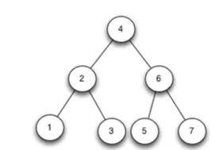

没事换着记点算法笔记玩玩，换换口味。博客的部分图片资源来自于网络!

# 序言

我们都知道Java的TreeMap是用红黑树实现的，HashMap在同一哈希桶里存入过多元素时链表也会调整为红黑树，红黑树真的很强大！本文就来了解一下红黑树。

# BST

红黑树的基础是BST(二叉查找树)。

BST的定义是，在二叉树的基础上，满足每个结点的左子树上的结点都比当前结点小（实际上，是不大于），右子树上的结点比当前结点大（实际上，是不小于）。就这么个事！

             
图1 BST
 

BST的一大关键应用在于查找。从根结点开始，每次查找，如果当前结点就是要查找的值，那么就找到了，否则如果比当前key小，则查找到左子树，反之查找到右子树。插入结点的操作类似于查找，一直比较，直到左子树/右子树为空，则插入到对应位置即可。

BST常用的遍历方式是中序遍历。由于BST的独特性质，使得中序遍历得到的结果是有序的。称中序遍历的结果中，排在某个结点之前一位的结点为前驱结点，排在某个结点之后一位的为后继结点。很显然，它们的key值大小也是满足类似关系的，前驱结点是当前结点左子树的最右结点（最大结点），后继结点是当前结点右子树的最左节点（最小结点）。

沿着左子树一路查找下去，就会找到最小值，沿着右子树一路查找下去，就会找到最大值。

从BST中删除结点的操作，本质是找前驱/后继结点来替代被删除的结点，因为不能破坏结点之间的大小关系，所以自然要选择离当前节点值最近的来替换它。至于叶节点，直接删除就好了。

### BST的缺点

插入顺序单调的话，红黑树实际上退化成了链表。

# B-BST

即平衡二叉树（Balanced BST）。平衡二叉树的插入和删除操作，伴随着结点的旋转，使得树的高度保持在logN。AVL树是B-BST的一种，保证任何结点的左右子树高度差不超过1。