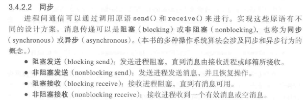
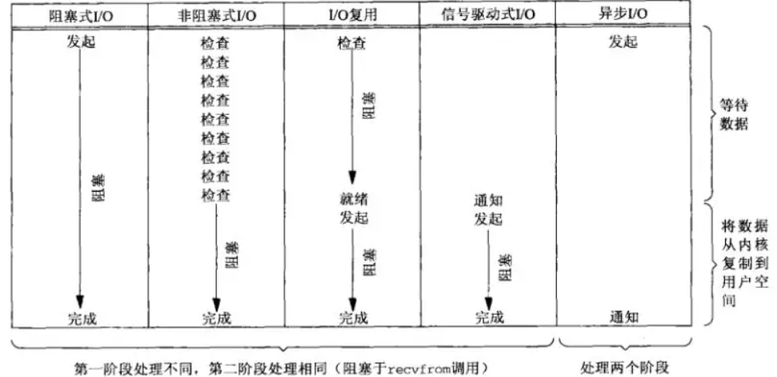

记录一下在网上学习到的，关于同步、异步、阻塞、非阻塞的观点。这方面的知识，真是越看越不敢下定论，各方观点百家争鸣！

## 前言

作者在学校接触了近三年的计算机领域知识，可是关于同步和阻塞、异步和非阻塞的区别，还真是说不出个所以然来！很多领域都涉及到这几个名词：操作系统中，进程、线程有阻塞的概念，有异步通信的概念，IO又分为阻塞和非阻塞；计算机网络中，又有多路复用的概念，应用在网络中的通信也会被阻塞；RPC、异步回调等机制也涉及了相关的概念...

**在我的头脑中**，对同步/阻塞概念的大致理解是这样的：流程执行到某一点时，因某些与CPU基本无关的操作占用时间而无法继续执行下去（例如网络通信时，从缓冲区读取字节），而导致CPU暂时不能继续执行该流程的状况，称为阻塞，这样的程序也就是同步的。<del>这不是完全没区别吗！</del>如果CPU无需暂停，仍能继续在此流程上继续执行任务，那么就是非阻塞的，相应的这样的程序也就是异步的。<del>还是没区别啊！</del>

操作系统中，进程存在阻塞的概念，主要是为了解决IO操作与CPU操作之间处理速度存在差距这一问题。一个进程一旦因为IO操作阻塞，CPU则没必要在这里干等着，可以切换到其他等待执行的进程处执行他们的代码。这样可以提升程序的并发性，不浪费CPU的资源。

## 同步、异步的概念

**维基百科中对同步的解释**是”*在一个系统中所发生的事件之间进行协调，在时间上出现一致性与统一化的现象*“。这让我想起之前在**知乎看到的一个说法**，认为”同步/异步是通信模型中的概念，专指是否存在一个全局的时钟统一两个系统的行为“，这两种观点倒是很相像！

而《操作系统概念》第九版如此解释同步异步、阻塞非阻塞的概念：

             
从进程通信的角度解释
 

也就是说，从IPC的角度来看，同步与阻塞、异步与非阻塞就是一回事。难怪经常感觉同步与阻塞这两个概念常常混用。

可是，从IO的角度来看，同步、阻塞和非阻塞应当是有所分别的。《Unix网络编程》中将IO模型就分为同步阻塞、同步非阻塞、IO多路复用、信号驱动IO和异步5种。

需要注意的是，Unix系统将IO操作分为两个阶段（对应于系统级调用recvfrom()）：

1. 等待数据准备完成（可能是从网络中获取/向网络中发送，可能是从磁盘上读取/写入磁盘...）
2. 将数据从内核空间复制到用户空间（或是相反，对应IO的输出操作）

讨论IO时，这里的”**同步**“指IO操作会由应用进程全程参与，”**异步**“指的是进程发起IO请求后会立刻返回，可以继续执行其他的代码，而只有在**彻底完成了**IO操作时内核才会通知发起IO的进程，在这段时间里，进程不再关心IO。这一点就跟非阻塞构成了区别！因为非阻塞IO模型按照定义，仍旧是同步的，也就是说仍需进程不断轮询！而异步的IO上一定是满足非阻塞特性的，也就没有在讨论阻塞与否了。

             
5种IO模型（以读为例）
 

5种IO模型的特点：

1. 阻塞IO：用户进程发起请求，然后自己就阻塞了，一直等到IO完成（横跨两个IO阶段）。这也是最简单的IO模型。
2. 非阻塞IO：之所以称为非阻塞，是因为用户进程进程IO请求后，可以立刻得到返回值，借此可以判断IO操作的**第一阶段**是否完成。如果没有完成，可以不断轮询检查，直到数据准备完成。进入IO第二阶段后，非阻塞IO模型也会阻塞，所以不要被名字骗了！
3. IO多路复用：以linux系统的select操作和poll操作为例，多路复用的关键优势是在可以一个线程内同时监视多个IO句柄。当检查（这个操作其实会阻塞进程， 直到某个数据来源变为可读）到有某个句柄有数据请求时，就在其上发起IO请求。IO多路复用与同步阻塞的IO的差别主要在于需要区分第一、第二阶段，因为数据准备好之后，进程必须要确定这些数据是由哪里发来的，然后再发起第二阶段请求。本质上，这种IO模型也是同步、阻塞的，但是其优势就在于**可以使用单独线程同时监视多个句柄**。另外，IO多路复用模型使用了Reactor的架构。
4. 信号驱动IO：借助于信号机制实现的IO。用户进程调用sigaction系统调用注册对某些IO事件的关注，然后可以立刻返回，故IO第一阶段是非阻塞的。等数据准备好之后，内核通知用户进程，然后用户进程调用recvfrom来**同步地**交换内核和用户空间的数据。
5. 异步IO：真正的异步IO必须做到：除了IO请求外，无需用户进程同步操作，**当用户进程被内核通知时，数据已经复制到了指定的缓冲区内，可直接使用**。异步IO模型要求操作系统提供大量支持，异步IO模型使用了事件驱动的Proactor的架构，向Asynchronous Operation Processor注册Proactor、Asynchronous Operation和对应的handler，而Asynchronous Operation Processor又向用户进程提供了一些异步的API可供调用。当异步的操作完成时，由Proactor来**回调**相应的handler。

#### 关于select、poll和epoll

他们都是Linux/UNIX系统下解决复用IO问题的技术。其中，select、poll是类似的，它们都是IO多路复用模型可使用的系统调用（poll只是去除了select对文件描述符数目的限制）。

select/poll的缺点：

1. 每当有数据准备完成，需要在注册的文件描述符中线性扫描。

2. 每次调用select、poll时都需要传入监听的句柄集的信息到内核，增加了开销。

3. 返回的只是已就绪（数据已准备完成的）的文件描述符个数，调用者还是需要遍历一次文件描述符集合，检查哪些已就绪，然后进行IO操作。

由于select、poll 的概念很早就有出现，所以使用select、poll的程序可移植性更强。

而epoll是Linux 2.6首次引入的API（也是Linux专属的API）。要使用epoll进行IO复用，需按照如下步骤：

1. 调用epoll_create创建一个epoll句柄。
2. 调用epoll_ctl向内核中指定的epoll句柄添加/修改/删除要监控的文件描述符。
3. 调用epoll_wait。

epoll API一方面调整了参数，使得无需每次调用IO请求都要传入大量的文件描述符集合，而是向内核注册、删除、修改文件描述符，这些文件描述符保存在内核中，无需每次调用都复制；另一方面，内核无需对文件描述符进行遍历，在内核层的实现是基于异步的事件驱动的架构（但对于用户进程，epoll_wait无疑是一个同步的调用过程！）。此外，epoll的调用只会返回IO事件已就绪的那些文件描述符。

一般认为，对于文件描述符集中大部分文件描述符都比较活跃的情况下，select/poll性能更优，而只有一部分文件描述符较活跃时，epoll性能更优。

#### 水平触发和边沿触发

水平触发（LT）和边沿触发（ET）这两个概念来自于脉冲信号系统中的触发方式。水平触发即某文件描述符可以非阻塞地执行IO操作时，触发通知；而边沿触发则是当文件描述符自上次检查以来，又有了新的IO操作可执行，则触发通知（就像系统的电平由0变为1的一瞬间！）。举例来说，select/poll就是水平触发的，而信号驱动IO模型是边缘触发的。epoll则允许设置LT或ET，默认为LT。

## 总结

从进程间通信的角度考虑，同步与阻塞、异步与非阻塞是同义词。从IO的角度考虑，阻塞、非阻塞、信号驱动、多路复用IO都是同步IO模型，只有异步IO模型才是真正的”异步“。同步IO模型中**之间**的区别主要在于**第一阶段**，第二阶段都一样，而这**第二阶段的处理**正是**区别同步IO与异步IO**的关键，所有同步IO模型在第二阶段都阻塞（即使是名字叫非阻塞IO！），只有异步IO模型不用在第二阶段阻塞。

以上这些就是我能找到的，目前最令我信服的关于同步、异步、阻塞和非阻塞的解释了。再怎么说这些都是出版的书籍上的知识，正确性应该还是有保障的吧！