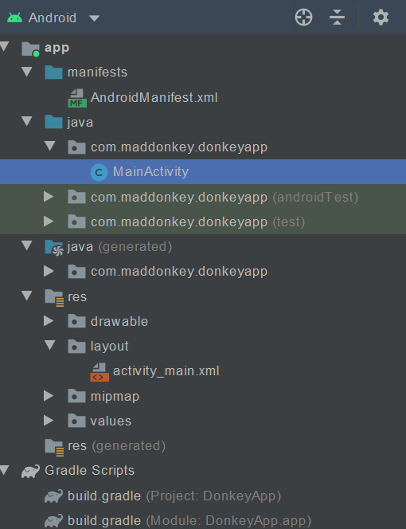
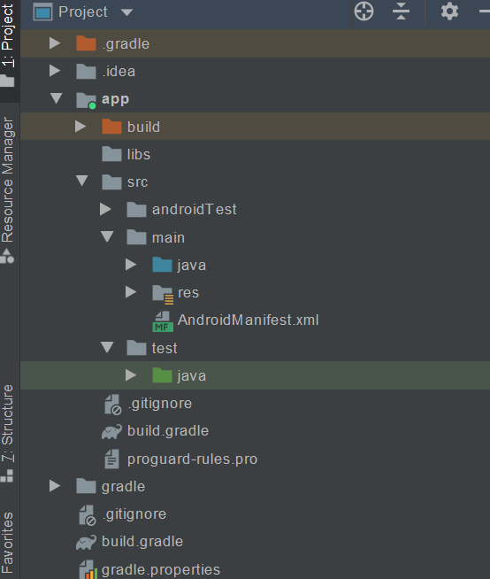

这是安卓个人学习笔记第三篇。力求每一篇讲清楚，讲明白，讲的不冗长。以Java为主要编程语言。

第三篇介绍使用Android Studio开发Android app的过程中，对项目结构的理解。内容来自 Mark L. Murphy先生的The Busy Coder’s Guide To Android Development (Final Version)。感谢他的无私分享！

# Android Studio Projects

在Android Studio上创建一个app项目，实际上是创建一个project。一个project是一个包含了所有源文件和其他文件（比如图片和布局）的目录，而IDE负责把项目目录中的内容归拢起来生成APK。以下以Android Studio为例，介绍如何用project进行开发工作。

## 创建新Project

就像其他的JetBrains全家桶那样，一般是通过欢迎页的新建按钮，以及工作窗口左上角的File→新建→新建项目按钮来创建项目。视版本不同，创建项目的过程大同小异，一般是选择一套设备和模板，然后定制Project名、包名以及项目在本地的存储路径。别忘了选择Java作为编程语言，还有设定运行的最低Android版本。这些选择都不是固定的，可以事后更改。

关于模板的选择，最好是先不要使用复杂的模板，因为光是了解那些预设的内容就会让人晕头转向。初学者建议从Empty Activity开始，这个模板有一个自带的简单Activity，以及基本的项目目录结构。

### 关于模拟器

由于ARM架构CPU类型的模拟器太慢，推荐使用运行在x86的CPU上的模拟器。为此，需要先在开发者的机器上安装一些东西——Linux用户需要安装 KVM，而Mac和Windows用户需要"Intel Hardware Accelerated Execution Manager”(又名HAXM)，且模拟器只在支持虚拟化技术的硬件上才能运行。

另外，IDE的编译、构建等工作、IDE本身，以及模拟器会非常的占用内存。最好确保内存大小大于8GB，再有一块SSD就再好不过了。否则，使用IDE开发安卓的过程将是一场噩梦！

要在Android Studio上使用模拟器，在打开的IDE窗口中，选择Tools→AVD Manager。在打开的窗口中，选择创建虚拟设备按钮，然后选择具体类型的硬件就行了。

## 复制和导入项目

要复制项目，只需复制那个项目的目录即可。没有什么特殊的metadata需要多关注的。

要导入项目，可以从欢迎页的import project导入，也可以使用IDE页面左上角的File→New→Import Project...去操作，选择要导入的项目的路径即可！

## IDE 视窗结构

以下介绍开发过程中会经常打交道的的各种IDE的工具和面板。

#### Project面板

默认靠在屏幕左侧上方的就是项目面板。使用该面板可以查看Android项目的内容。导入/创建一个项目后，默认显示的称为Android view：

             
图1 Android view
 

它有两个根：app和Gradle Script。它们只存在于Project view中，**不一定对应于真实存在的目录**。app下属的三个组分别是：

- manifests：里面包含Manifest清单文件(AndroidManifest.xml)，这是**整个App的全局描述和配置文件**。
- java：里面包含App的java源文件。java文件分布在三个Java包中，最上面的包中放置的是最终包含在App中的代码，第二个有“androidTest”标记的包放置与Android相关的测试代码，第三个有“test”标记的包中放置的是与Android无关的测试代码。
- res：资源文件目录。包括图片、布局定义文件等。不同类型的资源放在不同的组下。

Android Studio使用Gradle来管理Project，所以Android视图下还能看到Gradle Scripts。修改项目设置中的选项就会影响到它们。

点击左上角的Android下拉图标，可以切换到Project view。

             
图2 Project view
 

可以看到，在Project视图下，app文件夹显得相对独立，这是因为其代表着一个模块。多数情况下Android App只需要单个模块，不过也可以拥有多个模块。src文件夹下存在main、test、androidTest三个文件夹，其实他们就对应于Android视图下的java组下的三个包。除此之外还有很多view，它们给开发者以不同角度审视项目的视图。

总体而言，屏幕的左侧是项目结构，右侧是代码编辑区。

