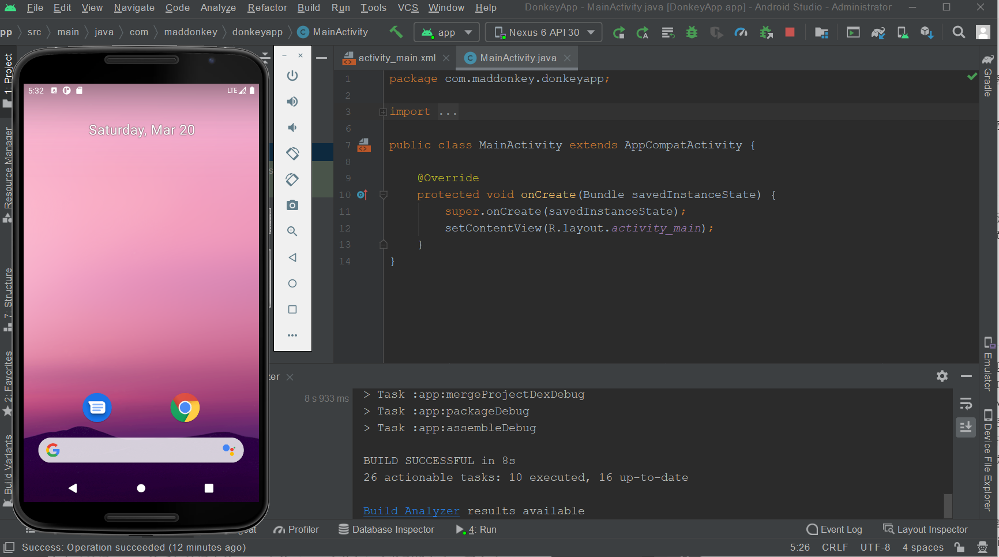
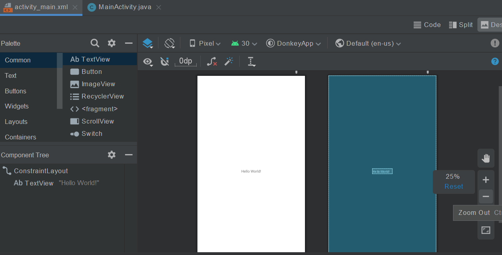
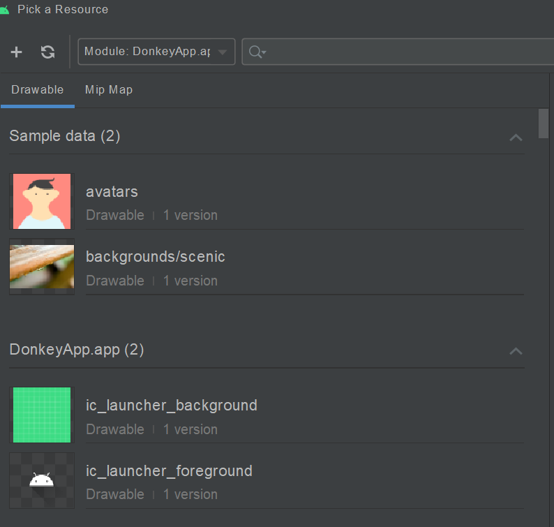
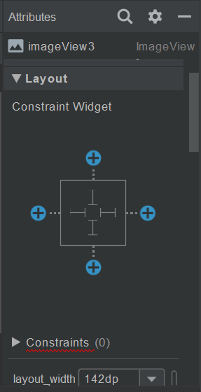
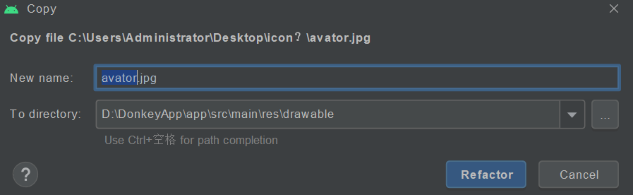
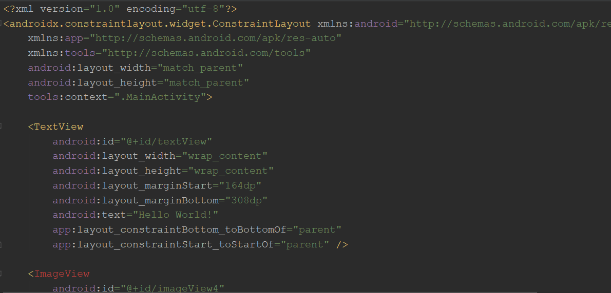

这是安卓个人学习笔记第四篇。力求每一篇讲清楚，讲明白，讲的不冗长。以Java为主要编程语言。

第四篇以一个简单的App的创建过程了解Android应用。部分内容来自牛搞先生的*Android 9编程通俗讲义*。

## 编译和运行App

在Android Studio上新创建一个Empty Activity模板的app项目后，先要使用Build工具将应用编译（Gradle负责）。编译完成后，可以尝试运行（最好是有一个Emulator！）。以运行在Emulator上的效果为例：

             
图1 运行在AVD的虚拟机上的App
 

看上去就和真的安卓手机无异，也有状态栏、home键等。可以直接用鼠标点击操作。

需要注意的是，现在虚拟机真的就像一台手机一样。以至于，就算点击侧边的关机键power off，也只是像轻按以下真的Android手机的power键一样，只是让他息屏。不信的话就再点一次，他立刻就亮起来了！可以通过长按（按住？）power键跳到重启界面，但是这称为warm boot，也即不断电的自动重启。可以点击Tools→AVD Manager中找到虚拟机设备，在可选Action中选择Cold Boot来强制断电重启，就像真的关机再重启动一样。

创建了一个简单的Project后，让我们简单看看一个Android App的各方各面。从最直观的地方开始！

## 简单的UI调整

Android讲究代码与UI设计分离。UI的样子，称为**布局**（Layout），定义在XML格式的资源文件中。App运行时，根据XML文件中的内容创建各种界面元素对象。这种布局文件也叫Layout资源。

打开刚创建好的项目，进入Android视图，可以看到res组下的layout文件夹现在只有一个activity_main.xml布局文件。这就是运行在模拟器上的那个App，刚刚运行时，你看到的界面的布局文件！双击它，进入UI设计器界面。

             
图2 Android UI设计：所见即所得
 

在窗口中可以通过拖动空间拜访他们的位置来设计App的页面。左侧面板，上部左右分别是控件类别和选中类别的控件列表，下部是所涉及的页面中的控件树关系。点击页面右上方的Design/Text（IDE版本4以上），可以在设计视图和源码视图中切换，可以方便地通过编码调整布局文件的细节。

右侧的预览窗口中，靠左的是页面预览图，靠右的是页面排版预览图，显示的各控件之间的摆放位置和它们之间的位置关系。

Layout设计中，控件类别有：

- Common：最常用的一些控件。
- Text：文本显示控件，以及文本输入控件。它们不能再容纳子控件。
- Button：各种按钮。
- widgets：桌面小部件，不太好分类的一群控件。它们都不能容纳子控件！
- Layouts：一些专门用于**排版**的控件，是**容器**，就是用来专门容纳子控件的。
- Containers：容器，同样是专门用于容纳子控件的控件，支持内容滚动，不能更改子控件的排列方式。
- Google：Google为Android提供的第三方控件。包括广告控件、Google地图控件等。
- Legacy：旧的控件，一般是有替代的产物的控件。
- Project：在项目中自定义的控件。

尝试添加一个ImageView控件（Common和Widgets中都能找到！），拖动到预览窗口上的一个位置，然后会弹出窗口要求选择图片资源：

             
图3 添加ImageView：选择图片资源
 

如果项目中有图片资源，这时就能选择其中的资源。也可以先选点自带的资源。

选完之后图片控件就出现在了预览窗口。默认情况下，该控件以图片的真实尺寸来决定控件尺寸。也可以反过来，设置成让图片适应控件尺寸。选中控件，点击右边的properties（新版称为attibutes）工具栏：

             
图4 添加ImageView：调整属性
 

注意到下方约束子菜单中，可以设定layout_width和layout_height。默认情况下，其值应该都是“wrap_content”，即包裹住内容。将其改为具体大小，则图片和控件的大小都得到了调整。dp是DIP，即device independent pixels，即设备独立像素，与设备的像素密度无关。

## 添加资源

添加ImageView的过程中，会要求选择图片资源。如何向Project引入自己的图片资源？下面就来尝试一下。

在本地计算机上选中一个图片文件，复制之，然后在IDE的Android视图中，res/drawable目录下的右键菜单中点击Paste。

             
图5 添加图像资源
 

复制资源的过程，会弹出一个dialog，可以在这里修改复制到这里的资源文件的名称，以及具体的复制目录。然后点击Refactor。此时，drawable目录下应该已经有刚刚复制的图片资源文件了！

>注意：图像资源文件一定要放到res/drawable目录下。高版本的Android（API24以上）对drawable文件夹做了细分，drawable-v24文件夹为高版本的Android系统提供图片资源。
>
>mipmap资源目录也是存放图像文件的，但它是存放贴图的。Android会根据存放的mipmap目录的不同，调整图片在屏幕上的实际显示大小。

此时，再回到布局设计界面，选中刚刚添加的ImageView，在属性窗口中向下翻，点击All Attributes，可以找到大量被折叠的属性。往下翻，找到“src Compat”属性，点击即可修改图片空间的资源了！

注意到，src Compat属性的值处开头有一个@字符，这表示这个字符串是一个**ID**。每个资源都有自己的ID。

>修改属性时可能会发现属性窗口中srcCompat有两个同名的资源，其中有一个带扳手。经过本人的使用体验，我认为带扳手的属性代表开发者设计视图中使用的资源文件ID，不带扳手的表示实际App中会使用srcCompat。网络上好像没有人提到过这件事，所以我也不太确定...

## Layout文件

现在切换到Code视图，查看下XML文件的内容。<del>(不会真有人连XML都看不懂吧？真别把我笑死)</del>

             
图6 Layout文件的内容示例
 

除了一般XML文件都要有的文档声明，注意到根标签的形式：它指出了这个布局文件的根布局是一个**ConstraintLayout**约束布局。（如果这个类是Android SDK的核心库中的类，可以把包省略只写类名）。

以TextView控件为例，查看其属性。注意到android命名空间下的`layout_width`和`layout_height`，这代表着一个控件的宽和高属性，是必须存在的。该属性取值为`wrap_content`，表示他们的宽和高取决于内容，刚好将其包裹起来。另一个例子是约束布局这个根标签——它的宽和高属性是`match_parent`，这代表他们的宽和高与父控件一致，然而根标签是最外层的控件，它的大小必须与Activity一致，即`match_parent`。

以tools为前缀的属性只在UI设计器中生效，在App运行时不会起作用。比如根标签的`tools:context`属性，就是告诉界面设计器此Layout文件与MainActivity这个类相关联。

`android:id`属性设置控件的ID。ID是控件的唯一标志，在**一个布局文件里**不能重复。

