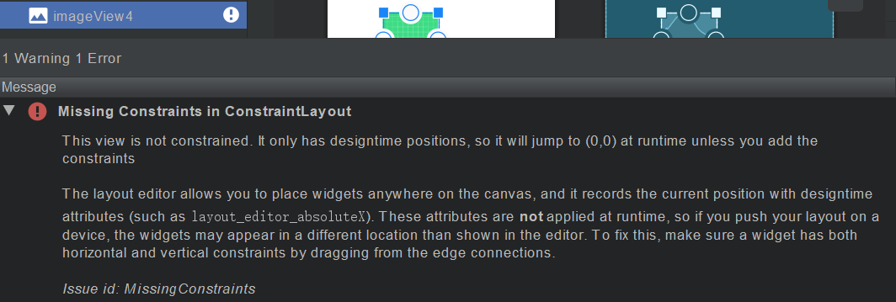
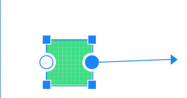
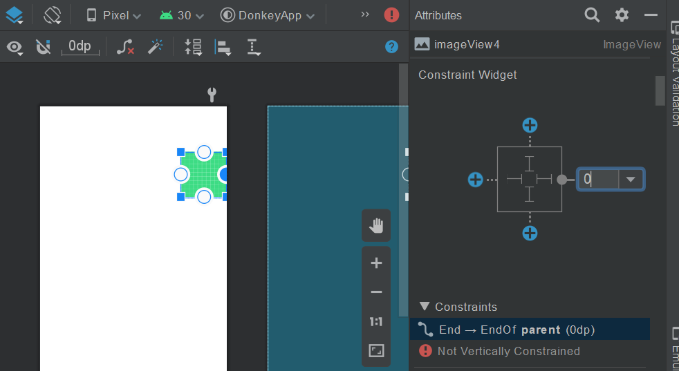
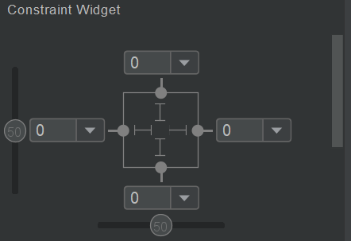
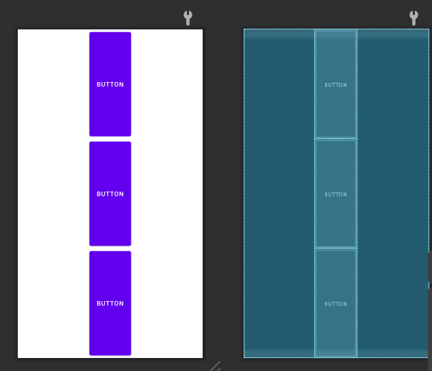

这是安卓个人学习笔记第五篇。力求每一篇讲清楚，讲明白，讲的不冗长。以Java为主要编程语言。

第五篇以介绍各种Layout格式为主。Layout的终极使命就是排版，即决定其子控件的位置布局。各种Layout的共同点在于，可以包含多个子控件。

大部分布局属性的效果可以凭语义猜出，所以不多赘述，只在必要时提一下。看不懂的话去学英语吧。

## ConstraintLayout

即约束布局。约束布局是最新的一种布局，但如今也是Android Studio模板Activity的默认布局，足以见得大家对其的推崇。约束布局既好用又强大，运行效率也不错。

约束约束，顾名思义，要通过为控件加约束条件的方式来排版。比如说可以设置控件的左边或右边与其他控件的左边或右边对齐，保持控件居左或居右，还可以保持上下对齐、横纵向居中等等。

不只是控件和控件之间的约束，也可以设置控件本身的约束，比如固定宽高比、宽固定为某个值等等。

回到上一章的项目中来。现在，删掉自带的已居中的TextView控件（可以从控件树中将其删除删除），此时，ImageView应该没有任何约束，此时运行App，图片应该会出现在左上角。

             
图1 ConstraintLayout：不加任何约束
 

其实，IDE中已经提示了没有正确使用约束布局：

             
ConstraintLayout：不加任何约束 IDE提示
 

大意是说这个控件没有约束，只有“设计时坐标”，运行时会跑到坐标（0，0）处。事实也确实如此，图片出现在了屏幕左上角。

要添加约束，鼠标移动到图片控件上，在控件边缘出现圆形图标时按住并拖动至边缘：

             
图3 ConstraintLayout：拖动控件施加约束
 

应该能感觉到操作非常的自由且丝滑，在鼠标靠近屏幕右侧的时候，控件的框架非常灵活地飞靠了过去。此时松手，则已经将图片控件的右边约束到约束布局的右边了！

             
ConstraintLayout：属性界面
 

这时查看属性界面，可以发现其中的约束Widget发生了变化，右侧有一根线连了出去，还有个数字。那根线就代表一个约束，而数字实际上是二者之间的间距，是该控件的`layout_marginRight`属性决定的。现在再运行App，应该能观察到控件靠右边缘了！

那么，要如何实现居中效果？只要将该控件的左边缘也添加类似地约束就行了。此时预览窗口的两条表示约束的线应该看起来像压缩的弹簧一样。这确实是一种直观的表现形式：两边的“受力”相同，则控件就被拉到居中了。

如果再个性化一点，也不是不可以！查看属性界面，此时约束图示那里应该有个横向的滑动栏：(图中的纵向也有是因为我自己加了上下的约束)

             
图5 ConstraintLayout：属性界面再调整
 

栏上的圆钮上有个数字。数字代表以0~100划分横向轴，控件左右的比例。举例来说，如果将圆钮滑动到25处，控件左右就应该是1：3的空间。

#### 固定宽高比

点击属性界面的约束Widget，正方形的左上角，会弹出ratio菜单。此时可以添加宽高比约束！注意：如果layout_width或layout_height中有一个为0dp，另一个不为0dp，宽高比才能起作用。如果都不为0dp，则宽高比不起作用。另一个不为0dp的属性可以调整，比如match_parent、warp_content。

## RelativeLayout

RelativeLayout是约束布局面世前的官方推荐。RelativeLayout 与约束布局类似，可以设置与其他控件之间的相对位置关系，但区别在于不是很适合使用鼠标拖动布局控件。

在约束布局中，要控制控件的位置，都是使用什么将start约束到其他控件的End啦，Top约束到其他控件的Top这种属性。在RelativeLayout中，负责控制控件位置的属性有`layout_alignParentxxx`，其中xxx表示Start、End之类的方向，可以让控件与之对齐。

>在新版IDE中使用Start/End来代替Left/Right，但现在仍将这两种方式都保留，可以通过设置这两种属性来保证在旧版本编译工具中也能正常编译。

要让控件居中，可以使用`layout_centerVertical`和`layout_centerHorizontal`，或者`layout_centerInParent`即可。

## FrameLayout

是最简单的Layout，也叫堆栈布局，顾名思义，后进的放在”上面“。此布局唯一负责的就是把放上去的控件堆叠到一起。

## LinearLayout

线性布局。其中控件依次序排列，线性布局区分横向、纵向两种。线性布局的有些操作与约束布局和相对布局都不太一样。以居中为例：

假设创建了一个纵向的线性布局，在其中放入了一些按钮。默认情况下它们肯定是横向充满屏幕。如果设置按钮们的`layout_width=wrap_content`，按钮大小虽然恢复，但全部靠左。想要让线性布局中的控件居中显示，可以将**LinearLayout**的gravity属性设置成`center_horizontal`(对于纵向布局，`center_vertical`没有意义)，或者去设置每个按钮的`layout_gravity`属性，其表示控件在父控件中的对齐方式，但注意，不是任何类型的父控件都支持！

要使控件在纵向上均匀分布（对于纵向的线性布局而言），可以设置控件的`layout_weight`属性，设置控件在LinearLayout中纵向空间所占比重。注意，要想让weight属性起作用，需要将控件的`layout_height`设为0dp（对于横向线性布局也类似）！

> 从这些例子不难看出，凡是涉及到两个属性有冲突，除非layout_width/height设为0dp，否则都已layout_width/height设置的值为准。只有它们为0dp，才代表着他们的值被其他机制所控制。

如果要均匀分布，就把每个子空间设置相同的weight。

             
图6 LinearLayout: 通过设置weight调整分布
 

如果要非均匀分布，就按你的期望，为控件们分配不同的权重就好了。注意，可以混合搭配weight和普通layout_height，来让一部分控件大小稳定的同时，其他控件按照weight分用剩下的空间。

## GridLayout

指网格布局。把显示区域分成数行数列，就像矩阵一样。将控件放到这种Layout中，需要设置`layout_row`和`layout_column`属性。如果要组合单元格，就要设置`layout_rowSpan`和`layout_columnSpan`属性，决定行、列跨几步。

## TableLayout

TableLayout一定程度上类似于GridLayout，但表格布局每行都是独立的，每一行可以有不同的列数。

TableLayout的每一行是一个单独的Layout：TableRow。要添加一行，先要添加一个TableRow，然后再向里面加元素。

