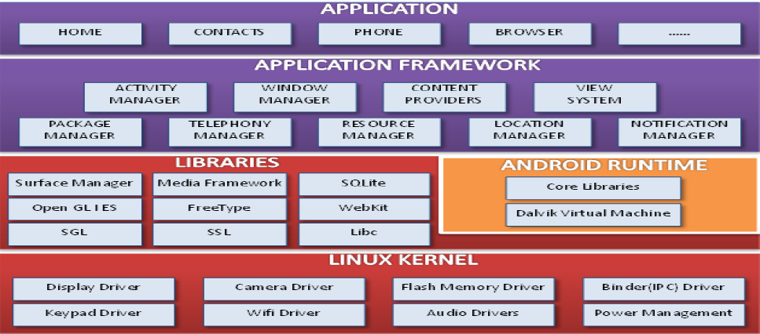

这是安卓个人学习笔记第零篇(?)。力求每一篇讲清楚，讲明白，讲的不冗长。以Java为主要编程语言。

在经过一段时间的学习后才了解到学习Android架构的重要性，因此排到第零篇！

## Android体系架构

             
图1 Android系统体系架构
 

从上到下依次介绍：

- 应用层：由运行在Dalvik VM/ART上的应用程序组成。例如浏览器、联系人、日历等。
- 框架层：由View、Notification Manager、Activity Manager等可由开发人员直接调用的API组成，主要由Java语言编写。
- 系统运行库层：提供对框架层的支持。该层包含C/C++的native库，多媒体库、OpenGL、SQLite、VM等。
- Linux内核层：进程管理、内存管理、网络IO等操作的管理。

## Android 基本组件

## 四大组件

Activity、Service、Content Provider和Broadcast Receiver在笔记01中都有介绍，这里主要记一下关于四大组件的值得注意的小细节。

#### 重要：不能通过new关键字实例化

四大组件都只能由Android系统创建，前提是系统能找到这四大组件的类定义。自定义的四大组件的类必须在Manifest文件中声明，系统才能找到其并声明之。

### 可视化组件：View

构成Android UI的必选组件，是Activity的重要组成部分。任何可视化组件都从`android.view.View`继承而来。View既可以从布局文件中读取，也可以从代码中创建。

总的来说，Android的视图分为三种（都是View的子类）：

- 布局：Layout
- 视图容器：View Container
- 视图类

其中，Layout和View Container都继承自`android.view.ViewGroup`，其是一个容器类，也是一个View的子类。

## 资源

#### 字符串资源

App中使用到的许多字符串都存放在资源文件中。