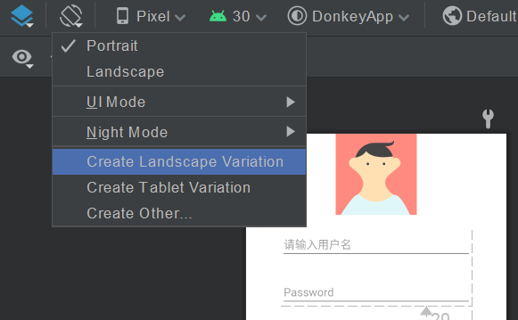

这是安卓个人学习笔记第六篇。力求每一篇讲清楚，讲明白，讲的不冗长。以Java为主要编程语言。

第六篇以记录各种Layout设计技巧为主。

## 内嵌模拟器

内嵌模拟器是真的好用！Android Studio 4.1引入的新窗口，可以将模拟器内嵌在IDE的面板中。终于不用来回切了！打开File→Settings→Tools→Emulator，勾选”Launch in a tool window“即可。

## 自定义常用属性

打开布局文件，转到design页面，点击右侧属性栏，再点击右上角的齿轮图标，勾选Favorite attributes，然后就可以愉快地添加自己常用的属性列表了！

## 固定宽高比

点击控件属性界面的约束Widget，正方形的左上角，会弹出ratio菜单。此时可以添加宽高比约束！注意：如果layout_width或layout_height中有一个为0dp，另一个不为0dp，宽高比才能起作用。如果都不为0dp，则宽高比不起作用。另一个不为0dp的属性可以调整，比如match_parent、warp_content。

## 禁用横屏

不想处理麻烦的屏幕翻转？可以到Manifest文件中，对应的Activity标签，添加一条属性：`android:screenOrientation="portrait"`即可强制页面只能竖向显示！

当然，最好还是考虑做个专门适用于横屏的页面。

             
图1 Landscape横屏布局
 

Android Studio 4.1版本的”创建横屏布局文件“按钮如图所示。点击后会创建一个同名的布局文件，放置在layout_land文件夹下，反正不用程序员操心了。

## ScrollView

如果屏幕空间显示不下了，可以借助此控件。ScrollView只能有一个子控件，但它会根据子控件的大小动态调整，达到滚动显示全子控件的效果。注意ScrollView是纵向滚动，要使用横向滚动，使用HorizontalScrollView控件。

使用ScrollView时注意，不要让ScrollView的宽和高使用`wrap_content`，因为本来ScrollView就会调整大小！只要让它`match_parent`就好了。

