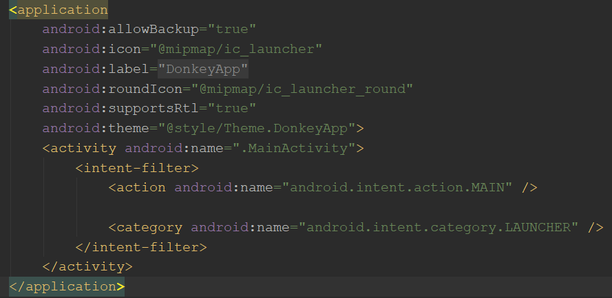
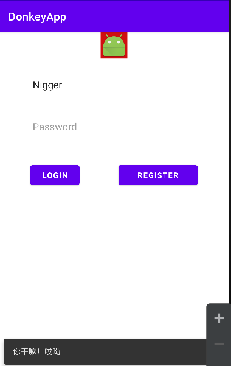

这是安卓个人学习笔记第七篇。力求每一篇讲清楚，讲明白，讲的不冗长。以Java为主要编程语言。

第七篇初探使用代码控制UI控件的操作。

## Activity

先前所操作的布局文件，其实在App运行时都是派生自View类。**无论是布局、控件，都是View的子类**。布局文件的根节点View控件依附于Activity，然而Activity却不是View。Activity才是真正地代表了App的一个界面，App启动时，先把布局文件中定义好的控件创建出来，交给Activity，然后将之渲染出来，才有了看到的样子。

而加载布局文件并不是App自动的行为——实际上，是由Activity来决定自己要用什么布局文件。通过在`onCreate()`函数体中调用`setContentView()`函数，将布局文件的资源ID传入，一个Activity指明了自己需要的Layout文件。该方法调用结束后，该布局的控件也就创建出来了！


## 类R

观察由IDE生成的Activity源文件，IDE自动加上了一个设置布局文件的语句，传入的参数是`R.layout.activity_main`。注意到资源文件前缀有一个`R`。R是一个类，是Gradle处理项目中的资源文件后生成的，开发者不能改动。

layout后面的常量名是资源文件的名称，由此也可只，资源文件不能以数字开头。

文件资源的引用方式一般为`R.资源类型.具体id`。比如引用资源中定义的字符串，可以是`R.string.silly`，引用图片，可以是`R.drawable.image`。而对于资源中的元素（比如layout中定义的控件），则通过`R.id.具体id`来引用，例如`R.id.buttonA`。

> 实际上资源id在程序中被转换成唯一的整形常量。自己动手写几个试试就明白了——IDE联想出来的资源id，旁边就带着实际表示该id的数值。

现在IDE自动创建的Activity类一般继承自AppCompatActivity，它当然也是继承自Activity的类，只是由于其对低版本Android兼容性较好，所以推荐为自定义的Activity的父类。


## 清单文件

打开Manifest文件，其中应该定义有自动生成的Activity的标签。



<center>        <br>    <div style="color:orange; border-bottom: 1px solid #d9d9d9;    display: inline-block;    color: #999;    padding: 2px;">图1 AndroidManifest.xml</div> </center>

android:name属性表示Activity的类名，实际上省略了包名(”."不能省略)。

## 代码中操作控件

要在代码中获取布局文件中声明的控件，借助于`findViewById()`方法，传入控件的ID。别忘了引用资源中的元素时，资源引用的格式是`R.id.具体id`！

该方法顾名思义，返回一个View对象。Android中的视图控件都符合Java关于Getter和Setter的命名规范，所以很容易在获取到控件后修改其属性。

>别忘了，获取控件要在布局文件加载之后！否则可是获取不到的！


## 响应事件

用户通过界面与App交互，用户的操作反映给控件。因此，要响应用户的操作，就要为控件绑定监听器Listener。

监听器是接口，而不同事件对应的接口也不同，最常用的响应点击事件的接口是`OnClickListener`。它们都是定义在View中的，还是函数式接口，也就是说可以用lambda表达式绑定点击事件。


## 为项目添加依赖

Android Studio使用Gradle来进行项目的构建、配置、依赖管理、发布等工作。要学习Gradle，请参考<a href="https://docs.gradle.org/current/userguide/userguide.html">官方文档</a>或<a href="https://www.w3cschool.cn/gradle_user_guide/">w3cschool的汉化文档</a>(已经是比较新的了)。最好也去学学Groovy，Gradle和Groovy结合学习，可以参考比比汗丽丽上的<a href="https://www.bilibili.com/video/BV1DE411Z7nt?from=search&seid=6881712928244685875">Gradle官方开发者的中文教程</a>，讲清了几个Gradle的细节，并且由于讲师是中文母语者，理解起来也是很容易。

简单来说，要使用Gradle导入依赖，借助于dependencies方法。类似于Maven对依赖有scope要求，dependencies中的依赖也有scope要素。注意，通过dependencies导入的是项目的依赖，如果是构建过程本身的依赖（毕竟Gradle是运行在JVM上的），要通过buildscript来导入。

以导入Snackbar为例：在build.gradle中的dependencies里加一条`implementation 'com.google.android.material:material:1.0.0'`

>题外话：Snackbar原本是android.support:design包下的类，由于总是把支持库加在android.support下有诸多不便，Android官方将大量android.support下的库迁移到其他地方，比如AndroidX。
>
>另外，高版本的Gradle对于依赖的scope管理，要求放弃compile关键字，改用api。至于implementation到是可以用。

然后就可以在Java代码中导入那个库了！要使用Snackbar，可以调用静态方法Snackar.make获取Snackbar对象。传入的参数，第一个是一个view，让Snackbar对象决定合适的控件对象，基于其进行显示。第二个参数是提示信息，第三个参数是持续时间。

```java
buttonLogin.setOnClickListener( v ->
        {
            Snackbar bar = Snackbar.make(v, "你干嘛！哎呦", 3000);
            bar.show();
        });
```

查看该类的定义，可以看到一些适用于时间参数的常量。比如`LENGTH_INDEFINITE`，查看注释可以知道如果传入的时间参数是这个，Snackbar永远不会自动关闭，除非另一个Snackbar出现或者被代码关闭。



<center>        <br>    <div style="color:orange; border-bottom: 1px solid #d9d9d9;    display: inline-block;    color: #999;    padding: 2px;">图2 持续时间无限的Snackbar</div> </center>