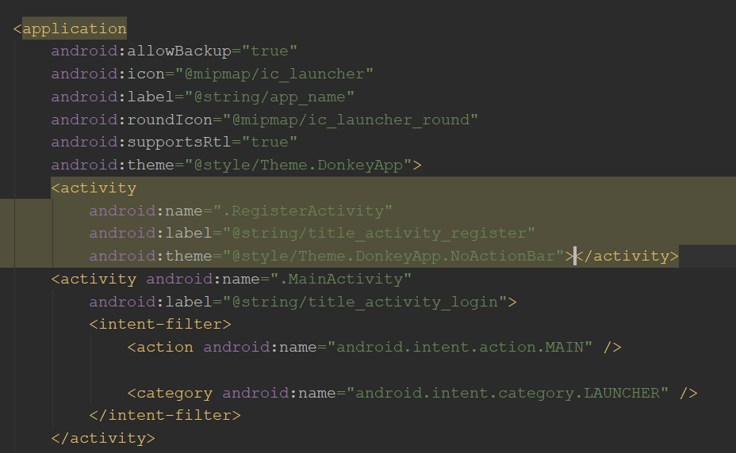

这是安卓个人学习笔记第八篇。力求每一篇讲清楚，讲明白，讲的不冗长。以Java为主要编程语言。

第八篇学习Acitivity之间的切换。

## Activity导航/切换

Acitivity之间的切换就是所谓的导航。进行导航操作前，先确保项目中有多个Activity，并且都在Manifest中声明。

要切换到新的Acitivity，就要创建那个Activity。然而程序员不能显示地构造Activity对象，只能借助于**Intent**携带请求构造Activity的信息，然后将Intent传给startActivity方法。

```java
//MainActivity.java

buttonRegister.setOnClickListener(v ->
        {
            Intent intent = new Intent(this, RegisterActivity.class);
            startActivity(intent);
        });
```

> 如果传入函数使用的是匿名内部类，需要注意，此时this默认会指向内部类对象。要改用外部类.this！

在这里，Intent的构造方法第一个参数要求是Context对象（Acitivity派生自Context），第二个参数是目标Activity的class对象。

要关闭当前的Acitivty，调用finish()即可。如果要在关闭时返回数据给启动自己的Activity，就要先调用`setResult()`。该方法的第一个参数一般是Android SDK定义的常量，用以标识Activity的执行状况。第二个参数是要传入的携带信息的Intent。要将结果传给调用者Activity，还要求其调用的方法不是`startActivity()`，而是`startActivityForResult()`，该方法不仅需要一个Intent对象，还需要传入一个请求码，以标志不同的Activity的返回。

然而无法确定被创建的Acitivity什么时候会返回。为了响应其的返回，在调用者Activity中，覆盖`onAcitivtyResult()`方法——该方法接收三个参数：请求码、结果码（就是调用finish时传入的状态码），以及Intent。

## 导航栏

应用的顶端一条是导航栏ActionBar。一般来说，Android App在导航栏上显示菜单页以及返回按钮。对于一般的EmptyActivity，IDE默认创建的模板，布局中是没有toolbar的，但是运行时仍然会显示一个导航栏，因为Activity默认有一个原生的ActionBar。官方现在更推荐使用自定义的控件来实现toolbar。如果要使用自己的toolbar，就要隐藏原生的ActionBar。

通过在Manifest文件中设定标签的theme属性，可以隐藏ActionBar。



<center>        <br>    <div style="color:orange; border-bottom: 1px solid #d9d9d9;    display: inline-block;    color: #999;    padding: 2px;">图1 Manifest中的Theme</div> </center>

注意，application标签也可以设置默认的theme，如果Activity不指定theme，就会采用application的theme。图中app默认的theme是带原生ActionBar的，而RegisterActivity使用的theme是不带ActonBar的。

```xml
<style name="Theme.DonkeyApp.NoActionBar">
        <item name="windowActionBar">false</item>
        <item name="windowNoTitle">true</item>
    </style>
```

对于使用原生ActionBar的Activity，只需要调用getSupportActionBar()即可获得ActionBar对象，然后可以对其进行操作。

> Activity的getActionBar()方法似乎也可以使用，但是要注意，由于默认Activity都派生自AppCompatActivity（来自androidx.appcopat.app包)，所以使用的ActionBar也有所不同。如果是普通的Activity，那就要使用getActionBar()方法了。

调用actionBar的`setDisplayHomeAsUpEnabled()`方法，传入true，标识显示返回键。注意，这时还只是一个按钮，没有绑定事件呢！可以通过覆盖`onOptionsItemSelected(MEnuItem)`方法，响应点击事件。注意，该方法实际上对任意的菜单选项都有效，所以需要在代码中判断item的id。例如：

```java
@Override
    public boolean onOptionsItemSelected(@NonNull MenuItem item)
    {
        int id = item.getItemId();
        switch (id)
        {
            case android.R.id.home:
            {
                Snackbar.make(buttonLogin, "F@CK OFF!\n Nigga!",
                        BaseTransientBottomBar.LENGTH_SHORT).show();
                break;
            }
            default:
                throw new IllegalStateException("Unexpected value: " + id);
        }
        return super.onOptionsItemSelected(item);
    }
```

注意，一定是要使用android.R.id.home！

## 额外内容：使用日志

Android.util下的Log类是Android内置的日志类，真是非常方便。新版Android Studio地步的Logcat窗口可以直接显示打印到输出流的日志。

用过其他日志系统的人都知道日志是怎么回事，所以只简单介绍Log类的一些方法：

- 静态方法Log.v(), Log.d(), Log.i(), Log.w(), Log.e(), Log.wtf()分别对应着从低到高的六个级别的日志输出(别尬黑，wtf是What a Terrible Failure)。注意他们的用法：传入两个参数，都是String类型，第一个参数称为tag，呈现到输出中就是冒号前的部分，第二个参数就是冒号后面的内容。


